DEPARTAMENTO DE INGENIERÍA QUÍMICA Y COMBUSTIBLES

{width="3.2715780839895015in"
height="3.2715780839895015in"}

01/12/1996

E.T.S.I de Minas (Madrid)

Enrique Pérez Herrero

```{=latex}
\newpage
\tableofcontents
\newpage
\listoffigures
\newpage
\listoftables
\newpage
```

# ABSTRACT[]{.indexref entry="ABSTRACT"} {-}

The objective of this project is to built computer tool, called
***Explocal***, in order to compute the main theoretical characteristics
of explosives.

The calculus method used holds the [UNE
31-002](http://books.google.es/books/about/UNE_31_002_94.html?id=Fd_3cQAACAAJ&redir_esc=y)
Spanish standard.

This computer application has been developed in language C++ and it runs
under the *Windows* 3.1 operative system on every PC .

***Explocal*** includes all characteristics of a modern commercial
computer application, as: executable module, data files, hypertext help
and installation code.

# SÍNTESIS DEL PROYECTO[]{.indexref entry="SÍNTESIS DEL PROYECTO."} {-}

El objetivo del presente proyecto es desarrollar una aplicación
informática comercial para poder obtener las principales características
teóricas de cualquier mezcla explosiva.

El método que se va a informatizar es un método que ha sido normalizado
por la Asociación Española de Normalización
([AENOR](http://www.aenor.es)) y se encuentra recogido en la norma UNE
31-002 \[1\].

El método se basa en un balance termoquímico a volumen constante, que
permite conseguir una primera aproximación a parámetros como: el calor
de explosión, la composición de los productos mayoritarios y la
temperatura de explosión. El resto de parámetros de detonación se
determinan mediante unas fórmulas empíricas aproximadas.

El método es un método simplificado y por lo tanto menos preciso que
otros métodos más complejos. Los cálculos sólo son aplicables a
detonaciones y no a deflagraciones.

La aplicación informática, denominada ***Explocal***, se incluye al
final del documento del proyecto; se trata de una primera versión,
aunque incluye todas las características de las aplicaciones
informáticas comerciales, como: módulo ejecutable, ayuda en hipertexto,
programa de instalación, acceso desde al administrador de programas,
manejo de múltiples documentos, empleo del portapapeles, etc.

La programación orientada a objetos es una de las filosofías de
programación más apropiada para trabajar en *Windows*.

El código que forma ***Explocal*** está escrito en C++ y emplea toda la
potencialidad de un lenguaje de programación orientada a objetos.

La aplicación ***Explocal*** funciona bajo entorno *Windows* 3.1 y es
completamente compatible con versiones superiores.

Para facilitar la tarea de la codificación de una aplicación informática
para *Windows* se emplea la biblioteca de clases *ObjectWindows Library
1.0*, que está incluida en la versión 3.1 del compilador de C++ de la
compañía [*Borland International*](http://www.borland.com/).

Con vistas a obtener un material informático del modo más racional
posible se van a seguir todas las fases que marca la metodología de la
Ingeniería del *software.*

Entre estas fases podemos destacar la fase de mantenimiento en la que se
realiza una discusión de las posibles mejoras de la aplicación y el modo
de conseguirlas.

El proyecto incluye, también, un estudio de los costes de desarrollo,
desgranado el conjunto en costes de personal y de material.

# OBJETIVOS Y ALCANCE DEL PROYECTO[]{.indexref entry="OBJETIVOS  Y  ALCANCE  DEL  PROYECTO."}

El objeto del presente proyecto es desarrollar una *aplicación
informática profesional* denominada ***Explocal***, que permita
facilitar y sistematizar el *cálculo de las principales características
teóricas de los explosivos.*

El método de cálculo empleado por la aplicación informática es el
recogido en la norma *UNE 31-002-94 "Cálculo de las principales
características teóricas de los explosivos*" \[1\]

La herramienta informática, además permitirá *comparar*, con una cierta
comodidad, el efecto que produce en los resultados, cualquier variación
en la composición de la mezcla explosiva.

Es de hacer notar que, aunque la aplicación informática esté destinada a
cualquier persona con conocimientos técnicos en la materia e interesado
en el tema, no se ha descuidado el interfaz de usuario, procurando que
la aplicación informática sea de fácil manejo y que la introducción de
datos sea lo más simple posible.

La informatización del método de cálculo, según la norma *UNE 31-002*
\[1\]*,* permitirá desarrollar una herramienta de cálculo, con que se
puedan obtener las características de cualquier mezcla explosiva, de una
forma rápida, ágil y eficaz. Esto es debido a que se conseguirá reducir
el tiempo necesario para efectuar el cálculo de forma manual, de
aproximadamente media hora, a décimas de segundo que es lo que se tarda
en llevarlo a cabo de forma automática.

## Características y limitaciones del método de cálculo descrito en la norma UNE 31-002-94[]{.indexref entry="Características  y  limitaciones  del  método de  cálculo  descrito  en  la  norma  UNE  31-002-94"}

En el proceso de detonación de una sustancia explosiva influyen un gran
número de parámetros.

Debido a la gran complejidad del fenómeno, cualquier enfoque teórico
admisible, implica la necesidad de establecer un gran número de
hipótesis de partida y simplificaciones. Estas simplificaciones
introducirán inevitablemente un sesgo en los resultados.

El método consiste, en esencia, en efectuar un estudio del *estado de
detonación ideal a volumen constante* (de una mezcla explosiva a partir
del estado normal) y aproximar el *estado de detonación CJ* mediante
unas *fórmulas empíricas.*

El análisis del estado de detonación a volumen constante proporcionará
una primera aproximación a una serie de parámetros termoquímicos como
pueden ser:

a\) La temperatura de explosión.

b\) El calor de explosión.

c\) La composición de los productos de explosión.

El resto de los parámetros de detonación: (presión, velocidad y densidad
de detonación), se aproximarán mediante unas *fórmulas empíricas* que
recreen el estado de detonación CJ.

El método de cálculo, aunque mucho menos exacto que otros métodos que
parten de un enfoque teórico mucho más genérico, es suficiente para
obtener una *primera estimación* de los parámetros de detonación de
cualquier mezcla explosiva.

Las principales **limitaciones** de los resultados obtenidos por el
método de cálculo UNE 31-002 \[1\], son las siguientes:

a\) Las *temperaturas de explosión* calculadas son excesivamente altas
en comparación con las obtenidas mediante códigos de detonación más
complejos.

b\) En las *detonaciones que se apartan del régimen ideal* de
detonación, el método sólo proporciona unos límites máximos de presión y
velocidad.

c\) La composición de los productos de detonación obtenida no tendrá en
consideración los componentes menores como pueden ser: el metano
(CH~4~), el amoniaco (NH~3~), el cianhídrico (CNH) y los óxidos de
nitrógeno entre otros.

Por lo que el método no es útil para cuantificar la toxicidad de los
humos producidos en la detonación, aunque sí determine el contenido
monóxido de carbono (CO).

d\) El método no es aplicable a deflagraciones, puesto que el método se
fundamenta en un análisis a volumen constante y no a presión constante y
tampoco se tienen en cuenta los efectos de difusión de materia y
transmisión del calor.

## Características y limitaciones de la aplicación informática comercial *Explocal*[]{.indexref entry="Características y  limitaciones  de  la  aplicación informática  comercial  Explocal."}

Una aplicación informática comercial se destaca del resto por un
conjunto de características, que cuando confluyen en un mismo producto,
proporcionan a este un toque de calidad profesional, siempre
beneficioso, y que a menudo se convierte en condición necesaria para
conseguir el éxito comercial de la aplicación, e incluso para permitir
la viabilidad de su distribución.

Para garantizar una aplicación informática de alta calidad y bajo coste
se debe emplear una metodología que aborde el diseño, la escritura y el
mantenimiento eficiente de los programas.

Esta metodología constituye la ***Ingeniería del software**.*

La *Ingeniería del software* implica una serie de fases generales en el
desarrollo de la aplicación informática (véase ***figura 4-1***) . Estas
fases incluyen unas reglas que evitan realizar elecciones caprichosas y
que constituyen lo que se denomina *disciplina de programación*.

El proyecto sigue todas las fases de la Ingeniería del software, en las
que se justifican todas las decisiones que se han tomado, hasta obtener una
primera versión ejecutable de la aplicación informática (conocida como
**versión Beta**), cuyo código y datos se incluyen, tanto en forma de
listado como en soporte electromagnético, en los anexos del proyecto.

La versión Beta incluida se puede ejecutar (bajo el entorno *Windows*)
en cualquiera de sus versiones más extendidas como son*: 3.1, 3.11 para
Trabajo en Grupo ó Windows 95*, puesto que todas las aplicaciones que
funcionan con la versión 3.1 de *Windows* son perfectamente compatibles
con versiones más modernas.

La aplicación informática es ejecutable, por lo tanto, en máquinas tipo
*PC y compatibles* que tengan instalada una versión de *Windows*
superior a la 3.1.

La *versión Beta* de la aplicación informática incluye, además, todos
los archivos necesarios para su funcionamiento, esto es:

- Archivos de datos: (\*.DAT)

- Programa de instalación.

- Datos de la instalación.

- Archivos ejemplo: (\*.XPL)

- Bibliotecas de enlace dinámico: (\*.DLL)

- Archivo de ayuda, en hipertexto: (\*.HLP)

- Datos de inicialización: (\*.INI)

El código ejecutable de la *versión Beta* está realizado en *lenguaje
C++,* y utiliza la jerarquía de clases para el interfaz de *Windows* de
la biblioteca ***Object Windows 1.0*** (OWL) incluida con la versión 3.1
del entorno integrado (IDE) del compilador de *Borland*.

La biblioteca *Object Windows* es una implementación de la *Programación
Orientada o Objetos (OOP)*, combinada con los procesos de programación
basada en eventos, (que constituyen la filosofía de la programación en
*Windows*), y ejemplifica lo bien que estas dos metodologías pueden
coexistir.

*Object Windows* proporciona una alternativa a la programación directa
en *Windows* y simplifica enormemente la tarea de crear una aplicación
informática para *Windows*.

**\**

# INTRODUCCIÓN A LA TEORÍA DE LA DETONACIÓN[]{.indexref entry="INTRODUCCIÓN  A  LA  TEORÍA  DE  LA  DETONACIÓN."}

## Definiciones[]{.indexref entry="Definiciones."}

**Balance de Oxígeno:** Cantidad de oxígeno que sobra o falta a una
mezcla explosiva para oxidar *completamente* todos los elementos
químicos que la componen, salvo el nitrógeno que se supone inerte,
expresada en tanto por ciento en peso. Es negativo (deficitario) si
falta y positivo (excedentario) si sobra.

**Calor de Explosión:** Máxima energía que se puede liberar en la
reacción de un explosivo. Se trata de la característica más importante
de un explosivo, puesto que representa la capacidad del explosivo para
generar choques e impartir movimiento al medio en el que está confinado,
es decir su poder energético.

**Coeficiente Adiabático:** Disminución de la presión, respecto a un
aumento de volumen manteniendo la entropía constante. En los gases
ideales es igual a la relación entre calores específicos.

**Densidad Inicial:** Densidad de la mezcla explosiva intacta, es decir,
antes de sufrir el proceso de explosión. Se denomina a veces densidad
del encartuchado (o del granel).

**Detonación:** Proceso de explosión en el cual se produce flujo de
productos de reacción, inducido por la propagación de la onda de
reacción de velocidad supersónica respecto al material intacto.

**Detonación Ideal:** Detonación con un frente de onda plano (diámetro
infinito), en el que la reacción se produce instantáneamente en el
frente de discontinuidad (entre reactivos y productos), y se mueve a
velocidad constante (de forma estacionaria).

**deflagración:** Proceso de explosión en el cual la onda de reacción se
propaga a una velocidad inferior a la del sonido en el material sin
reaccionar o intacto.

**Estado Chapman-Jouguet o Estado C-J:** Estado que alcanzan los
productos en una detonación en régimen estacionario, en el instante de
completarse la reacción.

**Explosivo:** Sustancia susceptible de sufrir una explosión.

**Explosión:** Proceso por el cual una sustancia se transforma
bruscamente en productos, en su mayor parte en estado gaseoso, con una
velocidad de transformación suficientemente alta, de forma que los
productos se encuentran a presiones y temperaturas elevadas.

**Presión de Detonación:** Presión en el estado C-J (Chapman -
Jouguet). Difiere de la presión a volumen constante.

**Temperatura de Explosión:** Temperatura que alcanzan los productos de
explosión considerando que la energía liberada (calor de explosión) se
invierte exclusivamente en calentar los productos de reacción.

**Velocidad de Detonación:** Velocidad de propagación de la onda de
detonación.

**Volumen de gases en condiciones normales:** Volumen que ocuparían los
productos gaseosos de la explosión (de 1 kg de explosivo) a una
temperatura de 273,15 K (0 ºC) y a una presión de 1,013 · 10 ^5^ Pa (1
atm).

**\**

## Detonación ideal[]{.indexref entry="Detonación  ideal."}

Para que se produzca la detonación de una sustancia deben concurrir, dos
fenómenos fundamentales: una *reacción exotérmica* y una *onda de
choque*.

Cuando el frente de la onda de choque alcanza a la sustancia explosiva,
produce una activación del explosivo (debido a una compresión) que
reacciona exotérmicamente y a gran velocidad, liberándose energía
suficiente para mantener la onda de choque.

La detonación es por lo tanto un proceso auto mantenido, que continúa
mientras no se haya agotado todo el explosivo.

Debido a que el proceso de detonación es un proceso de gran complejidad
es necesario despreciar los factores que influyen en él en menor medida,
aunque sin perderlos de vista.

La detonación ideal, se representa en la ***figura 2-1*** y supone que
el frente de detonación (de forma plana) se mueve hacia el explosivo
intacto a una velocidad constante **D**.

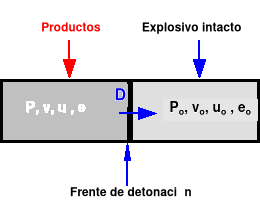{width="3.6145833333333335in" height="2.3125in"}

***Figura 2-1: Detonación ideal.***

```{=latex}
\addcontentsline{lof}{figure}{Figura 2-1: Detonación ideal.}
```

La onda de choque activa el explosivo intacto (que posee unas propiedades
de volumen específico **v~0~**, velocidad másica **u~0~**, energía
interna específica **e~0~** y presión **P~0~**) y se transforma en los
productos

(con propiedades **v**, **u**, **e**, **P**).

## Ecuaciones de Hugoniot - Rankine[]{.indexref entry="Ecuaciones  de Hugoniot - Rankine."}

Aunque originalmente fueron deducidas para *choques no reactivos* (es
decir: onda de choque pero sin reacción exotérmica) son perfectamente
aplicables a choques reactivos (y por lo tanto a detonaciones).

Las *ecuaciones de Hugoniot - Rankine* se basan en aplicar las
condiciones de conservación: de la masa (2-1), de la cantidad de
movimiento (2-2) y un balance de energía (2-3) a un dominio que englobe
al frente de detonación.

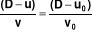 (2-1)

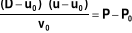 (2-2)

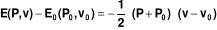 (2-3)

donde:

  ----------------------------------------------------------------------------
  **D**       Velocidad de detonación, en (m/s).
  ----------- ----------------------------------------------------------------
  **u~0~**    Velocidad inicial del explosivo, en (m/s), el caso típico es el
              de un explosivo inicialmente en reposo: **u~0~=0**.

  **u**       Velocidad de los productos de explosión.

  **v~0~**    Volumen específico inicial (o de encartuchado), en (m^3^/kg).

  **v**[^1]   Volumen específico de los productos de explosión, en (m^3^/kg).

  **P~0~**    Presión inicial, en (Pa) (como por ejemplo 1 atm)

  **P**       Presión de los productos de detonación, en (Pa).

  **E~0~**    Energía interna del explosivo intacto, en (J/kg), es una función
              de estado que, en general, depende de la presión y del volumen
              específico: **e~0~=e~0~ (P~0~,v~0~)**

  **E**       Energía interna de los productos de explosión, en (J/kg), es una
              función de estado que depende de la presión y del volumen
              específico y en la mayoría de los casos difiere de e~0~, puesto
              que la naturaleza de los productos difiere de los reactivos:
              **e=e (P,v)**

  **Q**       Calor de reacción (de explosión), en (J/kg) es la diferencia de
              energía de formación entre reactivos (explosivo) y producto. Si
              tomamos el estado **(P~0~,v~0~)**, como estado de referencia es
              la diferencia de energía interna entre reactivos y productos en
              dicho estado: **Q** = **e(P~0~,v~0~) - e~0~ (P~0~,v~0~)**
  ----------------------------------------------------------------------------

Para que el calor de reacción aparezca explícitamente en (2-3), sólo hay
que sumar y restar **e(P~0~,v~0~)** al primer término de (2-3), de este
modo sustituyendo el valor de **Q**, en función de la diferencia de
energías de formación entre explosivo y productos de detonación
(suponiendo, que el explosivo está en inicialmente en el estado normal
de referencia y en reposo), se tiene:

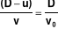 (2-4)

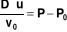 (2-5)

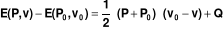 (2-6)

En (2-6), se puede observar, como a volumen constante (**v=v~0~**): El
calor de la reacción se invierte en aumentar la energía interna de los
productos.

Las ecuaciones de *Hugoniot - Rankine,* constituyen un sistema de tres
ecuaciones con cuatro incógnitas (si no contamos con la composición de
los productos de explosión).

El sistema tiene por lo tanto un grado de libertad.

## Curva de Hugoniot[]{.indexref entry="Curva  de  Hugoniot."}

Se denomina curva de *Hugoniot - Rankine* (o "*hugoniot*"), a cualquier
representación de una variable de detonación en función de otra.

En lo que sigue se va a emplear **hugoniots P-v** (presión - volumen
específico).

Si se observa la expresión (2-6), la **hugoniot P-v** debe tener forma
similar a una hipérbola (no es igual, porque el primer miembro no es
constante)

En un choque no reactivo: **Q = 0**, en el estado a volumen constante:
**v~0~ = v**,

(2-6) se reduce a:

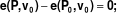  
(2-7)

Lo que significa que la curva pasa por el punto: **(P~0~,v~0~)**, es decir
el estado inicial es compatible con los posibles estados de choque.

En cambio en un *choque reactivo exotérmico* (como una detonación):
**Q\>0**,

y como la energía interna es una función creciente de **P**, se tiene
que:

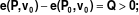  
(2-8)

Estas conclusiones se representan gráficamente en la ***figura 2-2***.

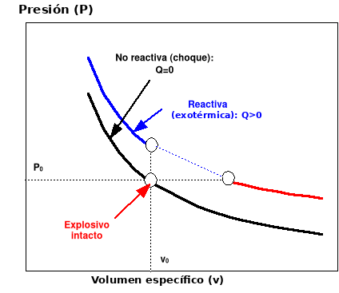{width="5.895833333333333in"
height="5.104166666666667in"}

***Figura 2-2: Hugoniot: Reactiva y No Reactiva.***

```{=latex}
\addcontentsline{lof}{figure}{Figura 2-2: Hugoniot: Reactiva y No Reactiva.}
```

## Recta de Rayleigh[]{.indexref entry="Recta  de  Rayleigh."}

Si se elimina la velocidad másica **u** de (2-4) y (2-5), se obtiene:

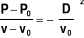; (2-9)

que se puede considerar como una haz de rectas, que pasa por el punto
**(P~0~,v~0~)**, y con una pendiente variable función del parámetro
**D**

(velocidad de reacción).

Estas rectas se denominan *rectas de Rayleigh.*

Como el segundo miembro de la expresión (2-9) es siempre negativo, se
deduce que es imposible los estados en los que **v\>v~0~** y además
**P\>P~0~**. Sólo son admisibles dos opciones (véase en la ***figura
2-3***):

a\) **v≤v~0~** y **P\>P~0~** (que corresponde a las detonaciones.)

b\) **v\>v~0~** y **P≤P~0~** (deflagraciones.)

En las ***figuras 2-2**, **2-3** y **2-4***, se puede ver como la
presencia del calor de explosión exotérmico: aleja la hugoniot del
estado inicial del explosivo, y además: divide la curva en dos ramas
diferentes, separadas por un tramo de estados incompatibles que está
limitado por los estados a volumen y presión constante.

Como se puede apreciar en la ***figura 2-3***, en general cada *recta de
Rayleigh* corta a la hugoniot en **dos puntos**.

Excepto cuando la *recta es tangente* a la *hugoniot*.

El estado de *detonación a volumen constante* implica una pendiente de
90 º, o lo que es lo mismo una *velocidad de detonación infinita*
(**D=∞**). Esta razón obliga a pensar que el estado a volumen constante
es un estado sin existencia real, aunque de gran interés teórico.

El estado de reacción a presión constante, por el contrario, es la
intersección de una recta de Rayleigh horizontal que implica una
velocidad de reacción nula: **D=0**.

En la rama de las deflagraciones las ondas de reacción poseen
propiedades cualitativas similares a las ondas de combustión ordinaria.
De hecho, las temperaturas de llama se calculan mediante un análisis a
presión constante.

Aunque para estudiar las ondas de deflagración, se debe tener en cuenta,
que: los *fenómenos de transmisión del calor* y de *difusión de materia*
no son despreciables, por lo que la rama de las deflagraciones de la
hugoniot, no constituye una buena aproximación de lo que acontece en
cualquier deflagración.

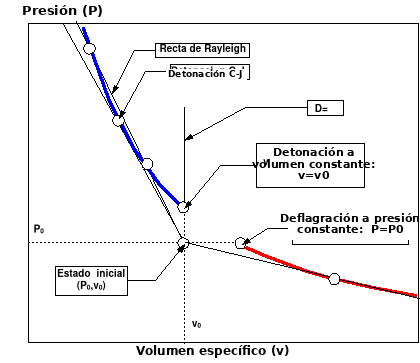{width="5.895833333333333in" height="5.09375in"}

***Figura 2-3: Hugoniot: Detonaciones y deflagraciones.***

```{=latex}
\addcontentsline{lof}{figure}{Figura 2-3: Hugoniot: Detonaciones y deflagraciones.}
```

***\***

## El estado de Chapman-Jouguet (CJ)[]{.indexref entry="El  estado  de  Chapman-Jouguet (CJ)."}

En la ***figura 2-3*** se comprueba como de todos los estados de
detonación posibles, existe uno en el que la velocidad de detonación es
mínima, denominado estado C-J. Precisamente corresponde al punto donde
una de las *rectas de Rayleigh* es tangente a la *hugoniot*.

Se puede comprobar de forma experimental como los explosivos, en régimen
próximo al ideal, poseen una velocidad de detonación única que
corresponde con la calculada por la condición de tangencia (denominada
*condición de Chapman-Jouguet*.)

Sin aportar una demostración teórica, debido a la brevedad de este
trabajo, se debe recalcar que: las detonaciones CJ son las únicas que
tienen posibilidad de propagarse de forma estacionaria.

El estado CJ de las detonaciones presenta las siguientes propiedades:

a\) La recta de Rayleigh y la hugoniot son tangentes:

(y la velocidad de detonación es mínima):

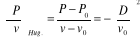 (2-10)

b\) La hugoniot es tangente a la isentrópica de los productos.

c\) El frente de detonación se aleja de los productos a una velocidad
**c** que coincide con la del sonido propagándose en los productos de
detonación; siendo:

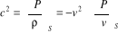

## Tipos de detonaciones y deflagraciones[]{.indexref entry="Tipos  de  detonaciones  y   deflagraciones."}

En la rama de las deflagraciones, de la condición de tangencia entre la
hugoniot y la *recta de Rayleigh* se deduce una velocidad de reacción
máxima.

Cada estado CJ divide a cada una de las ramas de la hugoniot en dos
tramos, por lo que en la hugoniot aparecerán: detonaciones fuertes,
detonación CJ, detonación débiles, estado a volumen constante, estados
incompatibles, deflagración a presión constante, deflagraciones débiles,
deflagración CJ y deflagraciones fuertes, como se puede apreciar en la

***figura 2-4***. En la **tabla 2-1**, aparecen algunas de sus
características.

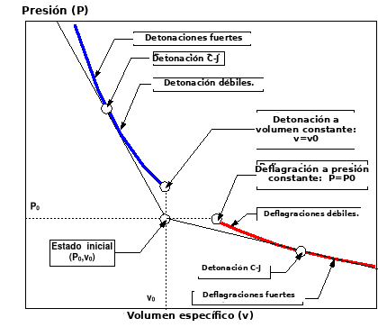{width="5.895833333333333in" height="5.09375in"}

***Figura 2-4: Hugoniot: Detonaciones y deflagraciones fuertes y
débiles.***

```{=latex}
\addcontentsline{lof}{figure}{Figura 2-4: Hugoniot: Detonaciones y deflagraciones fuertes y débiles.}
```

***Tabla 2-1: Tipos de detonaciones y deflagraciones.***

```{=latex}
\addcontentsline{lot}{table}{Tabla 2-1: Tipos de detonaciones y deflagraciones.}
```

+-----------------------------------------------------------+-----------------------------------------------------------+
| **Detonaciones.**                                         | **Deflagraciones.**                                       |
|                                                           |                                                           |
| **v≤v~0~**~,~ **P\>P~0~**                                 | **v\>v~0~**~,~ **P≤P~0~**                                 |
|                                                           |                                                           |
| **-**Son supersónicas respecto al explosivo inicial:      | **-**Son subsónicas respecto al explosivo inicial:        |
|                                                           |                                                           |
| **D\>c~0~**                                               | **D\<c~0~**                                               |
|                                                           |                                                           |
| \- La velocidad de los productos tiene el mismo sentido   | \- La velocidad de los productos tiene distinto sentido   |
| que el frente de ondas. **(u\>0)**                        | que el frente de ondas. **(u\<0)**                        |
|                                                           |                                                           |
| 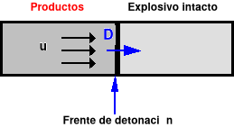{width="1.7291666666666667in"       | 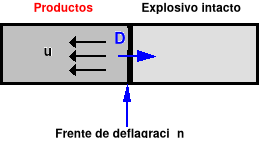{width="1.7291666666666667in"       |
| height="1.0208333333333333in"}                            | height="1.0208333333333333in"}                            |
+:=================:+:=================:+:=================:+:=================:+:=================:+:=================:+
| **Fuertes:**      | **CJ:**           | **Débiles:**      | **Fuertes:**      | **CJ:**           | **Débiles:**      |
|                   |                   |                   |                   |                   |                   |
| El frente de      | El frente de      | El frente de      |                   |                   |                   |
| detonación se     | detonación se     | detonación se     |                   |                   |                   |
| aleja de los      | aleja a la        | aleja de los      |                   |                   |                   |
| productos más     | velocidad del     | productos más     |                   |                   |                   |
| despacio que el   | sonido en ellos.  | rápido que el     |                   |                   |                   |
| sonido en ellos.  |                   | sonido en ellos.  |                   |                   |                   |
+-------------------+-------------------+-------------------+-------------------+-------------------+-------------------+
| **u+c\>D**        | **u+c=D**         | **u+c\<D**        | **u+c\<D**        | **u+c=D**         | **u+c\>D**        |
|                   |                   |                   |                   |                   |                   |
| **Subsónicas.**   | **Sónicas.**      | **Supersónicas.** | **Supersónicas**  | **Sónica**        | **Subsónica**     |
+-------------------+-------------------+-------------------+-------------------+-------------------+-------------------+

# DESCRIPCIÓN DEL MÉTODO DE CÁLCULO SIMPLIFICADO[]{.indexref entry="DESCRIPCIÓN  DEL  MÉTODO  DE  CÁLCULO  SIMPLIFICADO."}

## Generalidades[]{.indexref entry="Generalidades."}

El método de cálculo empleado que incorpora ***Explocal*** es el que ha
sido recogido por AENOR en la norma UNE 31-002 \[1\] y coincide con el
descrito por *Sanchidrián Blanco* \[2\].

La norma UNE 31-002 \[1\] establece un método simplificado de cálculo de
las principales características de los explosivos, como son:

- Balance de oxígeno.

- Calor de explosión.

- Temperatura de explosión.

- Presión de detonación.

- Velocidad de detonación.

- Composición de los productos de explosión mayoritarios.

- Volumen de gases en condiciones normales.

Como datos de partida de problema se considerarán: la composición de la
mezcla explosiva (expresada como porcentaje en peso de cada componente),
y la densidad inicial.

Debido a que se trata de un **método simplificado**, se asumen ciertas
hipótesis de partida que alejan los resultados del comportamiento real
de los explosivos. Por este motivo los resultados obtenidos por
aplicación de la norma UNE 31-002 \[1\] deben considerarse como una
**aproximación** a las características reales de funcionamiento de los
explosivos.

El método de cálculo presupone un régimen de *detonación ideal* por lo
que se desprecian los *fenómenos cinéticos* y los de *difusión térmica*.

Para calcular la composición de los productos de explosión y la
temperatura de explosión, el método considera el estado de detonación a
volumen constante como una aproximación al estado de detonación CJ.

A *volumen constante:* el volumen específico de explosión es igual al
inicial (**v=v~o~**~)~ y la ecuación de la energía (2-3) de la
detonación queda:

**E-E~o~=0** (3-1)

La expresión (3-1) es una *ecuación en temperatura* que se resolverá
suponiendo que la energía interna depende en exclusiva de la
temperatura, es decir, los productos de explosión se comportan como
*gases ideales*.

La energía interna total depende de la composición de los productos de
explosión. Con el objetivo de *reducir el número de incógnitas* se
considera que: cada elemento de la mezcla explosiva forma **un único
producto de explosión**, con las excepciones del carbono, el hidrógeno y
el oxígeno que forman: C (grafito), CO, CO~2~, H~2~ y H~2~O.

El resto de los parámetros de detonación se determinan mediante las
fórmulas empíricas de *Kamlet,M.J y Jacobs, S.J.* \[3\].

Los parámetros numéricos que incluyen las fórmulas, fueron ajustados
para mezclas explosivas de densidades comprendidas entre 1 g/cm^3^ y 2
g/cm^3^ formadas únicamente por C, H, O y N.

Cuanto mayor sea la proporción de otros elementos distintos de los
cuatro anteriores, menor será la precisión obtenida.

El método de cálculo se esquematiza, en la **figura 3-1**.

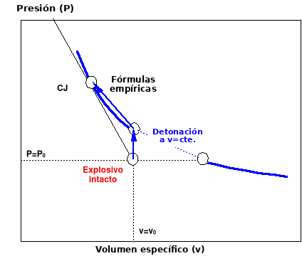{width="5.895833333333333in"
height="5.104166666666667in"}

***Figura 3-1: Hugoniot: Esquema del método de cálculo***

```{=latex}
\addcontentsline{lof}{figure}{Figura 3-1: Hugoniot: Esquema del método de cálculo}
```

***simplificado.***

## Desarrollo del cálculo

### Planteamiento de la fórmula del explosivo

A partir de la composición porcentual de las especies químicas (o
reactivos), que componen el explosivo, y que constituyen los datos del
problema planteado, se calcula la fórmula para un kilogramo de explosivo
del siguiente modo:

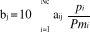, **j = 1,2,\..., Ne;** (3-2)

donde:

+------------+----------------------------------------------------------------+
| **b~j\ ~** | Átomos del elemento j en la fórmula de 1 kg de explosivo.      |
+============+================================================================+
| **Nc**     | Número de componentes de la mezcla explosiva.                  |
+------------+----------------------------------------------------------------+
| **a~ij~**  | Átomos del elemento j en la fórmula del componente i.          |
+------------+----------------------------------------------------------------+
| **p~i~**   | Porcentaje en peso del componente i. (%)                       |
+------------+----------------------------------------------------------------+
| **Pm~i~**  | Peso molecular del componente i en (g/mol),                    |
|            |                                                                |
|            | (se calcula a partir de las masas atómicas de la **tabla       |
|            | 3-1**)                                                         |
+------------+----------------------------------------------------------------+
| **Ne**     | Número de elementos químicos que forman la composición del     |
|            | explosivo.                                                     |
+------------+----------------------------------------------------------------+

### Cálculo de la energía de formación del explosivo

Se tomará como temperatura de referencia: **T~o~ = 298 K**.

La energía de formación del explosivo se determina a partir de las
energías de formación a 298 K de cada componente (véase UNE 31-002
\[1\]).

A diferencia de la norma UNE 31-002 \[1\], se considera que todas las
variables energéticas están expresadas en calorías, puesto que todas las
tablas termoquímicas están expresadas, generalmente, en calorías (o en
kilocalorías): **1 cal = 4,184 J**.

La energía de formación del explosivo se calcula mediante la fórmula:

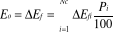 (3-3)

## Balance de oxígeno y productos de reacción

### Balance de oxígeno

Se calcula, expresado en porcentaje, mediante la expresión:

**BO = 100 · Pm\[O\] · ( O~E~ - O~N~ )/ Pm** (3-4)

donde:

+-------------+---------------------------------------------------------------+
| **BO**      | *Balance de oxígeno* en (%) = (g/100g).                       |
+=============+===============================================================+
| **Pm\[O\]** | *Peso molecular del oxígeno atómico*: 15,9994 g/mol           |
|             |                                                               |
|             | (véase **tabla 3-1**).                                        |
+-------------+---------------------------------------------------------------+
| **Pm**      | P*eso molecular del explosivo*, si el explosivo está          |
|             | expresado por su fórmula para 1 kg, en (g/mol). Pm =1 kg/mol  |
|             | = 1000 g/mol.                                                 |
+-------------+---------------------------------------------------------------+
| **O~E~**    | *Oxígeno existente* (o el oxígeno que contiene el explosivo). |
|             |                                                               |
|             | o los átomos de oxígeno que figuran en la fórmula de 1 kg de  |
|             | explosivo.                                                    |
+-------------+---------------------------------------------------------------+
| **O~N~**    | (*Oxígeno necesario* para oxidar los elementos del explosivo. |
+-------------+---------------------------------------------------------------+

Nota I: **O~E~** y **O~N~**~,~ se consideran en la norma UNE 31-002
\[1\] en g/mol, es decir ya incluyen el factor: 15,9994.

Para calcular el *oxígeno necesario*, se considera que los elementos se
oxidan para formar los productos que se indican en la **tabla 3-1**.

El *oxígeno necesario* es igual a la suma de los átomos de cada
elemento, multiplicado por el peso para el cálculo de balance de
oxígeno.

Como se puede apreciar en la ***tabla 3-1***, existen diferencias entre
los productos para el balance de oxígeno y los productos de explosión.

Los datos de las masas atómicas que incluye la norma UNE 31-002 \[1\],
en su *anexo A*, son menos precisos que los del Forum Atómico Español
\[4\], por lo que se ha preferido emplear estos últimos.

***\***

***Tabla 3-1***[^2]***: Datos para calcular el balance de oxígeno.***

```{=latex}
\addcontentsline{lot}{table}{Tabla 3-1: Datos para calcular el balance de oxígeno.}
```

+--------------+-------------+-------------+-------------+-----------------+
| **Elemento** | **Masa      | **Producto  | **Producto  | **Peso para el  |
|              | atómica**   | de          | para el     | cálculo del     |
| **asociado** |             | explosión** | cálculo del | oxígeno         |
|              | **(g/mol)** |             | B.O-**      | necesario,**    |
+:============:+:===========:+:===========:+:===========:+:===============:+
| Al           | 26,98154    | Al~2~O~3~   | Al~2~O~3~   | 3/2             |
+--------------+-------------+-------------+-------------+-----------------+
| B            | 10,811      | B~2~O~3~    | B~2~O~3~    | 3/2             |
+--------------+-------------+-------------+-------------+-----------------+
| Ba           | 137,327     | BaO         | BaO         | 1               |
+--------------+-------------+-------------+-------------+-----------------+
| Be           | 9,01218     | BeO         | BeO         | 1               |
+--------------+-------------+-------------+-------------+-----------------+
| Br           | 79,904      | BrH         | BrH         | -1/2            |
+--------------+-------------+-------------+-------------+-----------------+
| C            | 12,011      | CO~2~       | CO~2~       | 2               |
+--------------+-------------+-------------+-------------+-----------------+
| Ca           | 40,078      | CaO         | CaO         | 1               |
+--------------+-------------+-------------+-------------+-----------------+
| Cl           | 35,4527     | ClH         | ClH         | -1/2            |
+--------------+-------------+-------------+-------------+-----------------+
| Co           | 58,9332     | CoO         | Co~2~O~3~   | 3/2             |
+--------------+-------------+-------------+-------------+-----------------+
| Cu           | 63,546      | CuO         | CuO         | 1               |
+--------------+-------------+-------------+-------------+-----------------+
| F            | 18,9984     | FH          | FH          | -1/2            |
+--------------+-------------+-------------+-------------+-----------------+
| Fe           | 55,847      | FeO         | Fe~2~O~3~   | 3/2             |
+--------------+-------------+-------------+-------------+-----------------+
| H            | 1,00794     | H~2~O       | H~2~O       | 1/2             |
+--------------+-------------+-------------+-------------+-----------------+
| Hg           | 200,59      | Hg          | HgO         | 1               |
+--------------+-------------+-------------+-------------+-----------------+
| K            | 39,0983     | K~2~CO~3~   | K~2~O       | 1/2             |
+--------------+-------------+-------------+-------------+-----------------+
| Li           | 6,941       | Li~2~CO~3~  | Li~2~O      | 1/2             |
+--------------+-------------+-------------+-------------+-----------------+
| Mg           | 24,305      | MgO         | MgO         | 1               |
+--------------+-------------+-------------+-------------+-----------------+
| Mn           | 54,93805    | MnO         | MnO~2~      | 2               |
+--------------+-------------+-------------+-------------+-----------------+
| Mo           | 95,94       | MoO~3~      | MoO~3~      | 3               |
+--------------+-------------+-------------+-------------+-----------------+
| N            | 14,00674    | N~2~        | N~2~        | 0               |
+--------------+-------------+-------------+-------------+-----------------+
| Na           | 22,98977    | Na~2~CO~3~  | Na~2~O      | 1/2             |
+--------------+-------------+-------------+-------------+-----------------+
| Ni           | 58,69       | NiO         | Ni~2~O~3~   | 3/2             |
+--------------+-------------+-------------+-------------+-----------------+
| O            | 15,9994     | O~2~        | \--         | \--             |
+--------------+-------------+-------------+-------------+-----------------+
| P            | 30,97376    | PO          | P~2~O~5~    | 5/2             |
+--------------+-------------+-------------+-------------+-----------------+
| Pb           | 207,2       | PbO         | PbO~2~      | 2               |
+--------------+-------------+-------------+-------------+-----------------+
| S            | 32,066      | SO~2~       | SO~2~       | 2               |
+--------------+-------------+-------------+-------------+-----------------+
| Sb           | 121,75      | Sb~2~O~3~   | Sb~2~O~5~   | 5/2             |
+--------------+-------------+-------------+-------------+-----------------+
| Si           | 28,0855     | SiO~2~      | SiO~2~      | 2               |
|              |             | (Cuarzo)    |             |                 |
+--------------+-------------+-------------+-------------+-----------------+
| Ti           | 47,88       | TiO~2~      | TiO~2~      | 2               |
+--------------+-------------+-------------+-------------+-----------------+
| W            | 185,85      | WO~3~       | WO~3~       | 3               |
+--------------+-------------+-------------+-------------+-----------------+
| Zn           | 65,39       | ZnO         | ZnO         | 1               |
+--------------+-------------+-------------+-------------+-----------------+
| **Elemento** | **Masa      | **Producto  | **Producto  | **Peso para el  |
|              | atómica**   | de          | para el     | cálculo del     |
| **asociado** |             | explosión** | cálculo del | oxígeno         |
|              | **(g/mol)** |             | B.O-**      | necesario,**    |
+--------------+-------------+-------------+-------------+-----------------+
| Zr           | 91,224      | ZrO~2~      | ZrO~2~      | 2               |
+--------------+-------------+-------------+-------------+-----------------+
| \--          | \--         | C (Grafito) | \--         | \--             |
+--------------+-------------+-------------+-------------+-----------------+
| \--          | \--         | CO          | \--         | \--             |
+--------------+-------------+-------------+-------------+-----------------+
| \--          | \--         | H~2~        | \--         | \--             |
+--------------+-------------+-------------+-------------+-----------------+

**\**

### Productos de explosión

Con el único objetivo de simplificar el cálculo de la composición de los
productos de detonación, se limita el número total de estos.

Sólo se toman en consideración los productos de detonación mayoritarios
(véase **tabla 3-1** o **tabla 3-2**).

Se tienen en cuenta los siguientes productos, según el caso:

**a)** ***Balance de oxígeno positivo (o nulo):*** El explosivo es
excedentario en oxígeno: se forma un producto por cada elemento en la
composición de la mezcla.

Como: CO~2~, CO, H~2~O, O~2~ y N~2~ entre otros.

(Nótese la presencia de oxígeno libre O~2~).

**b)** ***Balance de oxígeno negativo***: se forma un producto por cada
elemento y además se pueden formar C, CO, y H~2~.

(No hay oxígeno libre, pero sí hidrógeno gas.)

Como se puede observar, los productos de explosión difieren, en general,
de los productos que se emplean para el cálculo del balance de oxígeno.
Esta circunstancia provoca una *inconsistencia* en la elección de los
productos de detonación, puesto que es posible que existan mezclas
explosivas con balance de oxígeno positivo en las que no se produzca
oxígeno libre (sean en realidad deficitarias para el método de cálculo )

Para solucionar este problema se podría cambiar la definición de balance
de oxígeno por otra en la que se considere que: "el balance de oxígeno
es la cantidad de oxígeno que sobra o falta para oxidar los elementos de
su composición hasta formar los productos de detonación que se forman en
mezclas excedentarias".

El programa ***Explocal*** considera dos definiciones distintas, puesto
que así se sigue la norma y además se soluciona la inconsistencia.

***Tabla 3-2: Datos de los productos de explosión***[^3]***.***

```{=latex}
\addcontentsline{lot}{table}{Tabla 3-2: Datos de los productos de explosión.}
```

+--------------+-------------+----------------+----------------+----------------+
| **Elemento** | **Masa      | **Producto de  | **∆Ef          | **Temperatura  |
|              | atómica**   | explosión**    | ^298\ ^**      | vaporización** |
| **asociado** |             |                |                |                |
|              | **(g/mol)** |                | **(kcal/mol)** | **(K)**        |
+:============:+============:+:==============:+===============:+:==============:+
| Al           | 26,98154    | **Al~2~O~3~**  | -396           | \> 6000        |
+--------------+-------------+----------------+----------------+----------------+
| B            | 10,811      | **B~2~O~3~**   | -302,8         | 2316           |
+--------------+-------------+----------------+----------------+----------------+
| Ba           | 137,327     | **BaO**        | -134,3         | \> 6000        |
+--------------+-------------+----------------+----------------+----------------+
| Be           | 9,01218     | **BeO**        | -142,8         | 4060           |
+--------------+-------------+----------------+----------------+----------------+
| Br           | 79,904      | **BrH**        | -9,01          | 206,15         |
+--------------+-------------+----------------+----------------+----------------+
| C            | 12,011      | **CO~2~**      | -94,05         | 194,65         |
+--------------+-------------+----------------+----------------+----------------+
| Ca           | 40,078      | **CaO**        | -115,49        | \> 6000        |
+--------------+-------------+----------------+----------------+----------------+
| Cl           | 35,4527     | **ClH**        | -22,06         | 188,25         |
+--------------+-------------+----------------+----------------+----------------+
| Co           | 58,9332     | **CoO**        | -56,57         | \> 6000        |
+--------------+-------------+----------------+----------------+----------------+
| Cu           | 63,546      | **CuO**        | -37,3          | \> 6000        |
+--------------+-------------+----------------+----------------+----------------+
| F            | 18,9984     | **FH**         | -65,44         | 292,69         |
+--------------+-------------+----------------+----------------+----------------+
| Fe           | 55,847      | **FeO**        | -64,72         | 3687           |
+--------------+-------------+----------------+----------------+----------------+
| H            | 1,00794     | **H~2~O**      | -57,5          | 373,15         |
+--------------+-------------+----------------+----------------+----------------+
| Hg           | 200,59      | **Hg**         | 0              | 629,73         |
+--------------+-------------+----------------+----------------+----------------+
| K            | 39,0983     | **K~2~CO~3~**  | -273,93        | \> 6000        |
+--------------+-------------+----------------+----------------+----------------+
| Li           | 6,941       | **Li~2~CO~3~** | -289,75        | \> 6000        |
+--------------+-------------+----------------+----------------+----------------+
| Mg           | 24,305      | **MgO**        | -143,4         | 3533           |
+--------------+-------------+----------------+----------------+----------------+
| Mn           | 54,93805    | **MnO**        | -91,77         | \> 6000        |
+--------------+-------------+----------------+----------------+----------------+
| Mo           | 95,94       | **MoO~3~**     | -177,2         | 1600           |
+--------------+-------------+----------------+----------------+----------------+
| N            | 14,00674    | **N~2~**       | 0              | 77,35          |
+--------------+-------------+----------------+----------------+----------------+
| Na           | 22,98977    | **Na~2~CO~3~** | -270,3         | \> 6000        |
+--------------+-------------+----------------+----------------+----------------+
| Ni           | 58,69       | **NiO**        | -57            | \> 6000        |
+--------------+-------------+----------------+----------------+----------------+
| **Elemento** | **Masa      | **Producto de  | **∆Ef 298**    | **Temperatura  |
|              | atómica**   | explosión**    |                | vaporización** |
| **asociado** |             |                | **(kcal/mol)** |                |
|              | **(g/mol)** |                |                | **(K)**        |
+--------------+-------------+----------------+----------------+----------------+
| O            | 15,9994     | **O~2~**       | 0              | 90,19          |
+--------------+-------------+----------------+----------------+----------------+
| P            | 30,97376    | **PO**         | -1,16          | 298,15         |
+--------------+-------------+----------------+----------------+----------------+
| Pb           | 207,2       | **PbO**        | -44,86         | \> 6000        |
+--------------+-------------+----------------+----------------+----------------+
| S            | 32,066      | **SO~2~**      | -70,95         | 263,15         |
+--------------+-------------+----------------+----------------+----------------+
| Sb           | 121,75      | **Sb~2~O~3~**  | -168,56        | \> 6000        |
+--------------+-------------+----------------+----------------+----------------+
| Si           | 28,0855     | **SiO~2~       | -217,1         | 2230           |
|              |             | (Cuarzo)**     |                |                |
+--------------+-------------+----------------+----------------+----------------+
| Ti           | 47,88       | **TiO~2~**     | -225,2         | 3023,15        |
+--------------+-------------+----------------+----------------+----------------+
| W            | 185,85      | **WO~3~**      | -200,57        | 2110           |
+--------------+-------------+----------------+----------------+----------------+
| Zn           | 65,39       | **ZnO**        | -82,94         | \> 6000        |
+--------------+-------------+----------------+----------------+----------------+
| Zr           | 91,224      | **ZrO~2~**     | -261,7         | 4548           |
+--------------+-------------+----------------+----------------+----------------+
| \--          | \--         | **C            | 0              | \> 6000        |
|              |             | (Grafito)**    |                |                |
+--------------+-------------+----------------+----------------+----------------+
| \--          | \--         | **CO**         | -26,76         | 81,65          |
+--------------+-------------+----------------+----------------+----------------+
| \--          | \--         | **H~2~**       | 0              | 20,35          |
+--------------+-------------+----------------+----------------+----------------+

## Calor y temperatura de explosión

### Composición de los productos

Coincidiendo con la clasificación por el balance de oxígeno se suponen
dos casos: (Siendo: **Np~,~** el número de productos formados en la
explosión y **Ne~,\ ~**el número de elementos distintos de la
mezcla**)**

***a) Balance de oxígeno positivo (o nulo):* (Np=Ne)**

El número de productos de explosión coincide con el número de elementos.
Estableciendo los balances estequiométricos de cada elemento se obtiene
un *sistema de ecuaciones lineales*, cuya resolución (inmediata en
muchos casos) proporciona la composición de los productos.

***b) Balance de oxígeno negativo:* (Np=Ne+2)**

Se tienen dos productos más que elementos ya que se producen C, CO, H~2~
pero no O~2~.

El sistema de ecuaciones se forma con los balances estequiométricos de
cada elemento junto con las dos ecuaciones de equilibrio siguientes:

**CO~2~ + H~2~ ⇔ CO + H~2~O ;** 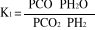**;** (3-5)

**CO~2~ + C ⇔ 2 CO;** 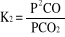**;** (3-6)

La constante **K~1~** es adimensional a diferencia de **K~2~** que tiene
dimensiones de presión. Si tenemos en cuenta que la presión es
proporcional a la cantidad de gas obtendremos:

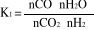**;** (3-7) 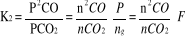**;** (3-8)

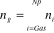 (3-9)

**F=** **P / n~g~ = ρ · n~g~·R·T≈ ρ~o~· n~g~·R·T ;** (3-10)

**K~2~' = K~2~ / F ;** (3-11)

donde:

+-----------+----------------------------------------------------------------+
| **P**     | Presión de detonación en (Pa).                                 |
+===========+================================================================+
| **n~g~**  | Cantidad de gases producida en la detonación en (mol/kg).      |
|           |                                                                |
|           | En la **tabla 3-2** se incluye la temperatura a la que los     |
|           | productos de explosión están en estado gaseoso. *(Tvapor)*     |
+-----------+----------------------------------------------------------------+
| **F**     | Factor de fugacidad de la constante de equilibrio en (Pa ·     |
|           | kg/mol).                                                       |
+-----------+----------------------------------------------------------------+
| **ρ~o~**  | Densidad inicial o de encartuchado en (kg/m^3^).               |
|           |                                                                |
|           | 1 g/cm^3^ = 1000 kg/m^3^                                       |
+-----------+----------------------------------------------------------------+
| **ρ**     | Densidad después de la transformación a volumen constante en   |
|           | (kg/m^3^)                                                      |
|           |                                                                |
|           | Si se desprecia al volumen ocupado por los productos           |
|           | condensados se puede considerar igual a la densidad inicial.   |
+-----------+----------------------------------------------------------------+
| **T**     | \(K\) Temperatura a la que se considera el equilibrio en (K).  |
|           | (incógnita).                                                   |
+-----------+----------------------------------------------------------------+
| **R**     | Constante de los gases: R=8,31441 (J·K^-1^·mol^-1^).           |
+-----------+----------------------------------------------------------------+
| **K~1~**  | Constante de equilibrio: ( - )                                 |
+-----------+----------------------------------------------------------------+
| **K~2~**  | Constante de equilibrio: (Pa)                                  |
+-----------+----------------------------------------------------------------+
| **K~2~'** | Constante de equilibrio independiente de la presión (kg/mol).  |
+-----------+----------------------------------------------------------------+

Los equilibrios químicos dependen fuertemente de la temperatura, como se
puede apreciar en la **tabla 3-3** y en las **figuras 3-2** y **3-3**,
dónde se incluyen los valores de ambas constantes: **K~1~** y **K~2~**
en un intervalo de temperaturas entre 298 K y 6000 K.

Con excepción de los elementos que aparecen en los equilibrios (3-5) y
(3-6) (es decir C, H y O), todos los demás elementos conducen a balances
estequiométricos que equivalen a ecuaciones lineales en una sola
variable de solución inmediata, con los que se determinaran los moles
de: carbonatos, haluros y óxidos, entre otros.

**\**

***Tabla 3-3: Constantes de equilibrio.***[^4]

```{=latex}
\addcontentsline{lot}{table}{Tabla 3-3: Constantes de equilibrio.}
```

+------------------+----------------------------+----------+---------------------------+----------+
|                  | UNE 31-002-94 \[1\]        |          | Meyer, R. \[7\]           |          |
|                  |                            |          |                           |          |
|                  | (ANEXO C, pág. 24)         |          |                           |          |
+:================:+:============:+:===========:+:========:+:============:+:==========:+:========:+
| **Temperatura    | **K~1~ ( -   | **K~2~ (Pa)**          | **K~1~ ( -   | **K~2~ (Pa)**         |
| (K)**            | )**          |                        | )**          |                       |
+------------------+--------------+------------------------+--------------+-----------------------+
| 298              | 9,5840E-06   | 3,8030E-19             | \-           | \-                    |
+------------------+--------------+------------------------+--------------+-----------------------+
| 300              | 1,0620E-05   | 5,8100E-19             | \-           | \-                    |
+------------------+--------------+------------------------+--------------+-----------------------+
| 400              | 6,4420E-04   | 1,4700E-11             | \-           | \-                    |
+------------------+--------------+------------------------+--------------+-----------------------+
| 500              | 7,2610E-03   | 4,0020E-07             | \-           | \-                    |
+------------------+--------------+------------------------+--------------+-----------------------+
| 600              | 3,5160E-02   | 3,5010E-04             | \-           | \-                    |
+------------------+--------------+------------------------+--------------+-----------------------+
| 700              | 0,1054       | 4,2870E-02             | \-           | \-                    |
+------------------+--------------+------------------------+--------------+-----------------------+
| 800              | 0,2361       | 1,5350E+00             | \-           | \-                    |
+------------------+--------------+------------------------+--------------+-----------------------+
| 900              | 0,4335       | 2,4160E+01             | \-           | \-                    |
+------------------+--------------+------------------------+--------------+-----------------------+
| ***1000***       | ***0,6934*** | ***2,1340E+02***       | ***0,6929*** | ***2,2160E+02***      |
+------------------+--------------+------------------------+--------------+-----------------------+
| 1100             | 1,0069       | 1,2470E+03             | \-           | \-                    |
+------------------+--------------+------------------------+--------------+-----------------------+
| 1200             | 1,3646       | 5,3350E+03             | 1,3632       | 5,5130E+03            |
+------------------+--------------+------------------------+--------------+-----------------------+
| 1300             | 1,7498       | 1,8000E+04             | \-           | \-                    |
+------------------+--------------+------------------------+--------------+-----------------------+
| 1400             | 2,1538       | 5,0370E+04             | 2,1548       | 5,3460E+04            |
+------------------+--------------+------------------------+--------------+-----------------------+
| 1500             | 2,5645       | 1,2140E+05             | 2,5667       | 1,3170E+05            |
+------------------+--------------+------------------------+--------------+-----------------------+
| 1600             | 2,9785       | 2,6010E+05             | 2,9802       | 2,8850E+05            |
+------------------+--------------+------------------------+--------------+-----------------------+
| 1700             | 3,3884       | 5,0450E+05             | 3,3835       | 5,7440E+05            |
+------------------+--------------+------------------------+--------------+-----------------------+
| 1800             | 3,7757       | 8,9950E+05             | 3,7803       | 1,0560E+06            |
+------------------+--------------+------------------------+--------------+-----------------------+
| 1900             | 4,1591       | 1,5020E+06             | 4,1615       | 1,8150E+06            |
+------------------+--------------+------------------------+--------------+-----------------------+
| ***2000***       | ***4,5290*** | ***2,3730E+06***       | ***4,5270*** | ***2,9480E+06***      |
+------------------+--------------+------------------------+--------------+-----------------------+
| 2100             | 4,8753       | 3,5570E+06             | 4,8760       | 4,5610E+06            |
+------------------+--------------+------------------------+--------------+-----------------------+
| 2200             | 5,2000       | 5,1040E+06             | 5,2046       | 6,7670E+06            |
+------------------+--------------+------------------------+--------------+-----------------------+
| 2300             | 5,5208       | 7,0890E+06             | 5,5154       | 9,6830E+06            |
+------------------+--------------+------------------------+--------------+-----------------------+
| 2400             | 5,8076       | 9,5080E+06             | 5,8070       | 1,3420E+07            |
+------------------+--------------+------------------------+--------------+-----------------------+
| 2500             | 6,0814       | 1,2400E+07             | 6,0851       | 1,8100E+07            |
+------------------+--------------+------------------------+--------------+-----------------------+
| 2600             | 6,3387       | 1,5790E+07             | 6,3413       | 2,3810E+07            |
+------------------+--------------+------------------------+--------------+-----------------------+
| 2700             | 6,5766       | 1,9680E+07             | 6,5819       | 3,0650E+07            |
+------------------+--------------+------------------------+--------------+-----------------------+
| 2800             | 6,8077       | 2,4110E+07             | 6,8075       | 3,8700E+07            |
+------------------+--------------+------------------------+--------------+-----------------------+
| 2900             | 7,0146       | 2,9030E+07             | 7,0147       | 4,8020E+07            |
+------------------+--------------+------------------------+--------------+-----------------------+
| ***3000***       | ***7,2111*** | ***3,4370E+07***       | ***7,2127*** | ***5,8680E+07***      |
+------------------+--------------+------------------------+--------------+-----------------------+
| 3100             | 7,3961       | 4,0170E+07             | 7,3932       | 7,0690E+07            |
+------------------+--------------+------------------------+--------------+-----------------------+
| 3200             | 7,5509       | 4,6360E+07             | 7,5607       | 8,4100E+07            |
+------------------+--------------+------------------------+--------------+-----------------------+
| 3300             | 7,7268       | 5,3060E+07             | 7,7143       | 9,8910E+07            |
+------------------+--------------+------------------------+--------------+-----------------------+
| 3400             | 7,8524       | 5,9680E+07             | 7,8607       | 1,1510E+08            |
+------------------+--------------+------------------------+--------------+-----------------------+
| 3500             | 7,9899       | 6,6870E+07             | 7,9910       | 1,3270E+08            |
+------------------+--------------+------------------------+--------------+-----------------------+
| 3600             | 8,1196       | 7,4300E+07             | 8,1144       | 1,5170E+08            |
+------------------+--------------+------------------------+--------------+-----------------------+
| 3700             | 8,2224       | 8,1860E+07             | 8,2266       | 1,7200E+08            |
+------------------+--------------+------------------------+--------------+-----------------------+
| 3800             | 8,3368       | 8,9640E+07             | 8,3310       | 1,9360E+08            |
+------------------+--------------+------------------------+--------------+-----------------------+
| 3900             | 8,4333       | 9,7550E+07             | 8,4258       | 2,1640E+08            |
+------------------+--------------+------------------------+--------------+-----------------------+
| ***4000***       | ***8,5114*** | ***1,0530E+08***       | ***8,5124*** | ***2,4060E+08***      |
+------------------+--------------+------------------------+--------------+-----------------------+
| 4100             | 8,6099       | 1,1340E+08             | 8,5926       | 2,6560E+08            |
+------------------+--------------+------------------------+--------------+-----------------------+
| 4200             | 8,6497       | 1,2080E+08             | 8,6634       | 2,9190E+08            |
+------------------+--------------+------------------------+--------------+-----------------------+
| 4300             | 8,7297       | 1,2910E+08             | 8,7296       | 3,1910E+08            |
+------------------+--------------+------------------------+--------------+-----------------------+
| 4400             | 8,7902       | 1,3670E+08             | 8,7900       | 3,4740E+08            |
+------------------+--------------+------------------------+--------------+-----------------------+
| 4500             | 8,8308       | 1,4420E+08             | 8,8442       | 3,7650E+08            |
+------------------+--------------+------------------------+--------------+-----------------------+
| 4600             | 8,9125       | 1,5220E+08             | 8,8888       | 4,0640E+08            |
+------------------+--------------+------------------------+--------------+-----------------------+
| 4700             | 8,9536       | 1,5970E+08             | 8,9304       | 4,3700E+08            |
+------------------+--------------+------------------------+--------------+-----------------------+
| 4800             | 8,9743       | 1,6670E+08             | 8,9698       | 4,6480E+08            |
+------------------+--------------+------------------------+--------------+-----------------------+
| 4900             | 8,9950       | 1,7340E+08             | 9,0001       | 5,0030E+08            |
+------------------+--------------+------------------------+--------------+-----------------------+
| ***5000***       | ***9,0365*** | ***1,8000E+08***       | ***9,0312*** | ***5,3290E+08***      |
+------------------+--------------+------------------------+--------------+-----------------------+
| 5100             | 9,0573       | 1,8690E+08             | 9,0524       | 5,6590E+08            |
+------------------+--------------+------------------------+--------------+-----------------------+
| 5200             | 9,0782       | 1,9330E+08             | 9,0736       | 5,9930E+08            |
+------------------+--------------+------------------------+--------------+-----------------------+
| 5300             | 9,0872       | 1,9910E+08             | 9,0872       | 6,3310E+08            |
+------------------+--------------+------------------------+--------------+-----------------------+
| 5400             | 9,0991       | 2,0510E+08             | \-           | \-                    |
+------------------+--------------+------------------------+--------------+-----------------------+
| 5500             | 9,1201       | 2,1080E+08             | \-           | \-                    |
+------------------+--------------+------------------------+--------------+-----------------------+
| 5600             | 9,1201       | 2,1580E+08             | \-           | \-                    |
+------------------+--------------+------------------------+--------------+-----------------------+
| 5700             | 9,1201       | 2,2150E+08             | \-           | \-                    |
+------------------+--------------+------------------------+--------------+-----------------------+
| 5800             | 9,1201       | 2,2640E+08             | \-           | \-                    |
+------------------+--------------+------------------------+--------------+-----------------------+
| 5900             | 9,1201       | 2,3040E+08             | \-           | \-                    |
+------------------+--------------+------------------------+--------------+-----------------------+
| ***6000***       | ***9,1411*** | ***2,3560E+08***       | ***-***      | ***-***               |
+------------------+--------------+------------------------+--------------+-----------------------+

*(Fin)*

Nota I: Las constantes de equilibrio tabuladas corresponden a las dos
reacciones siguientes:

CO~2~ + H~2~ ⇔ CO + H~2~O ; K~1~ = PCO · PH~2~O / PCO~2~ · PH~2~ CO~2~ +
C ⇔ 2 CO ; K~2~ = PCO^2^ / PCO~2~

Nota II: La constante K~1~ es adimensional a diferencia de K~2~ que
tiene

dimensiones de presión.

Nota III: El programa ***Explocal*** incorpora los datos de la norma UNE
31-002 \[1\] .

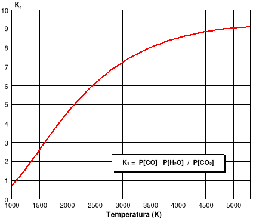{width="5.895833333333333in"
height="5.104166666666667in"}

***Figura 3-2: Constante de equilibrio K~1~.***

```{=latex}
\addcontentsline{lof}{figure}{Figura 3-2: Constante de equilibrio K1.}
```

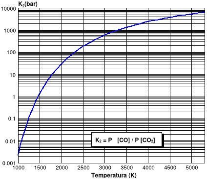{width="5.895833333333333in"
height="5.104166666666667in"}

Nota: 1 bar = 10 ^5^ Pa = 10 ^5^ N/m^2^

***Figura 3-3: Constante de equilibrio K~2~(bar)***

```{=latex}
\addcontentsline{lof}{figure}{Figura 3-3: Constante de equilibrio K2(bar)}
```

En adelante centraremos la atención en los balances de los elementos C,
H y O. Se obtienen las ecuaciones:

Carbono: **nCO~2~ + nCO + nC + nCarbonatos = b~C~ ;** (3-12)

Hidrógeno: **2·nH~2~O + 2·H~2~ + nHalógenos = b~H~** **;** (3-13)

Oxígeno: **2·nCO~2~ +nCO+nH~2~O+nÓxidos+3·nCarbonatos = b~O~ ;** (3-14)

Los valores de **b~C~**, **b~H~** y **b~O~** se toman de la fórmula de 1
kg de explosivo.

Sustituyendo los moles de carbonatos, haluros y óxidos en las ecuaciones
(3-12), (3-13) y (3-14), y pasando todo al segundo miembro, junto con
las ecuaciones (3-7) y (3-8), se tendrá un sistema de la forma:

*Sistema con formación de grafito*:

**nCO~2~ + nCO + nC = b~C~ - nCarbonatos = B~C~ ;** (3-15)

**nH~2~O + H~2~ = ( b~H~ -nHalógenos) / 2 = B~H~ ;** (3-16)

**2·nCO~2~ + nCO + nH~2~O = b~O~ - nÓxidos- 3·nCarbonatos = B~O~ ;**
(3-17)

**nCO·nH~2~O = K~1~· nCO~2~·nH~2~ ;** (3-18)

**n^2^CO = K~2~' · nCO~2~ ;** (3-19)

El sistema es de cinco ecuaciones con seis incógnitas (puesto que hay
que añadir la temperatura), y se resolverá junto con la ecuación del
balance de energía (3-1). El método de resolución que se empleará es
iterativo, teniendo a la temperatura como última incógnita sobre la que
itera.

La resolución del sistema formado por las ecuaciones de la (3-15) a la
(3-19), se efectúa resolviendo la ecuación de tercer grado (3-20) en
moles por kilo de monóxido de carbono (nCO) y calculando el resto de las
incógnitas (nCO~2,~ nC, nH~2~ y nH~2~O) mediante proceso de remonte.

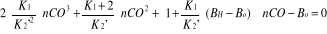 **;** (3-20)

El algoritmo de resolución de ecuaciones de tercer grado se representa
en la ***figura 3-4***. (Adaptado de *Tsipkin, G.G y Tsipkin, A.G*.
\[8\])

Si ninguna de las tres soluciones de la ecuación (3-20) produce un
resultado con significado físico (lo que implica que: todas las
incógnitas son positivas y además el contenido en cualquier elemento no
rebasa el inicial de la fórmula de un kilo de explosivo), se descarta la
posibilidad de que se forme grafito libre (C). En ese caso se trabaja
con el siguiente sistema:

*Sistema sin formación de grafito*:

nCO~2~ + nCO = B~C~ ; (3-21)

nH~2~O + H~2~ = B~H~ ; (3-22)

2·nCO~2~ + nCO + nH~2~O = B~O~ ; (3-23)

nCO·nH~2~O = K~1~· nCO~2~·nH~2~ ; (3-24)

nC=0 **;** (3-25)

Cuya solución puede obtenerse resolviendo la ecuación de segundo grado:

(3-26)

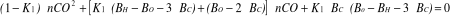

Una de cuyas raíces será compatible con la positividad de las
incógnitas.

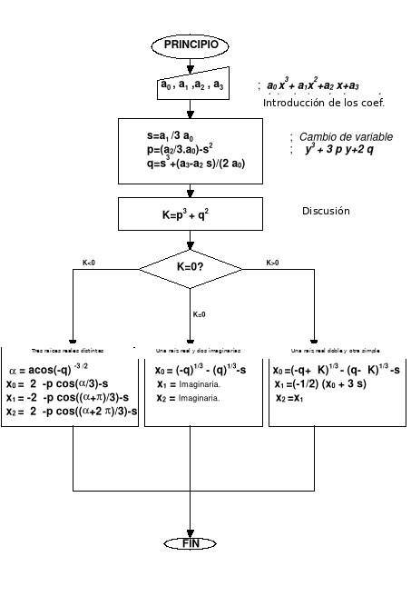{width="5.854166666666667in"
height="8.104166666666666in"}

***Figura 3-4: Algoritmo de resolución de la ecuación polinómica de
tercer grado.***

```{=latex}
\addcontentsline{lof}{figure}{Figura 3-4: Algoritmo de resolución de la ecuación polinómica de tercer grado.}
```

**\**

### Balance de energía

La ecuación de la energía, suponiendo en proceso de reacción a volumen
constante, es:

**E(T)-E~o~=0** (3-1)

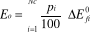 (3-27)
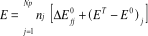 (3-28)

donde:

  ----------------------------------------------------------------------------
  **E(T)**       Energía interna de los productos, en (kcal/kg), a la
                 temperatura de explosión T (K), que es la incógnita de la
                 ecuación.
  -------------- -------------------------------------------------------------
  **E~o~**       Energía interna del explosivo, en (kcal/kg), (su energía de
                 formación a la temperatura de referencia Tº.)

  **T**º         Temperatura de referencia Tº = 298 K (≈ 25 ºC)

  **Nc**         Número de compuestos que forman la mezcla explosiva.

  **p~i~**       Porcentaje en peso del componente i en la mezcla, (%).

  **∆Eº~fi~**    Energía de formación del componente i a Tº en (kcal/kg)

  **∆Eº~fj~**    Energía de formación del producto j a Tº en (kcal/mol).

  **n~j~**       Cantidad de producto j, formada en la reacción de explosión,
                 (mol/kg).

  **(E^T\ ^**-   Incremento de energía interna desde Tº a T del producto de
  **E^0^ )~j~**  explosión j, en (kcal/mol)
  ----------------------------------------------------------------------------

Como en termoquímica las reacciones a presión constante son mucho más
comunes que a volumen constante:

En la bibliografía es mucho más fácil encontrar datos tabulados de
entalpías, que de energías internas. (véase *JANAF* \[5\] y *Lide, David
R*. \[6\]).

Expresando (3-28) en función de las entalpías de los productos de
explosión, queda:

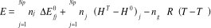 (3-29)

donde:

+-------------+-------------------------------------------------------------+
| **∆Eº~fj~** | Energía de formación del producto j a Tº, en (kcal/mol).    |
|             |                                                             |
|             | (véase **tabla 3-2**)                                       |
+=============+=============================================================+
| **(H^T^-    | Incremento de energía interna desde Tº a T del producto de  |
| H^0^)~j~**  | explosión j, en (kcal/mol). Los valores de H^T^ - H^0^      |
|             | están tabulados para cada producto de explosión en la       |
|             | **tabla 3-4**.                                              |
+-------------+-------------------------------------------------------------+
| **n~g~**    | Moles de productos gaseosos, (mol/kg).                      |
+-------------+-------------------------------------------------------------+
| **R**       | R=1,9871917·10^-3^ (kcal·mol^-1^·kg^-1^).                   |
+-------------+-------------------------------------------------------------+
| **n~j~**    | Cantidad de producto j, formada en la reacción de           |
|             | explosión, (mol/kg).                                        |
+-------------+-------------------------------------------------------------+

Sustituyendo (3-29) en (3-1) y pasando a un miembro los términos
dependientes de la temperatura, la ecuación de la energía se transforma
en:

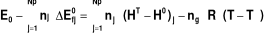 (3-30)

que equivale a:

**Q = Q~S~(T)** (3-31)

donde:

  ------------------------------------------------------------------------
  **Q**      Calor de explosión, independiente de la temperatura,
             (kcal/kg).
  ---------- -------------------------------------------------------------
  **Q~S~**   Calor sensible de los productos de explosión. Depende de la
             temperatura, que es la incógnita de la ecuación, (kcal/kg).

  ------------------------------------------------------------------------

***Tabla 3-4: Entalpías de los productos de explosión.***

```{=latex}
\addcontentsline{lot}{table}{Tabla 3-4: Entalpías de los productos de explosión.}
```

+-----------------------------------------------------------------------------------------------------------------------------------------------------------------------------------------------------------------------------------------+---------+---------+
| **H^T^- H^298^ (kcal / mol)**                                                                                                                                                                                                           |         |         |
+:=================================:+:===============:+:===============:+:===============:+:===============:+:===============:+:===============:+:===============:+:===============:+:===============:+:===============:+:===============:+:=======:+:=======:+
| **T (K)**                         | **Al~2~O~3~**   | **B~2~O~3~**    | **BaO**         | **BeO**         | **BrH**         | **C**           | **CO**          | **CO~2~**       | **CaO**         | **ClH**         | **CoO**         | **CuO**           |
+-----------------------------------+-----------------+-----------------+-----------------+-----------------+-----------------+-----------------+-----------------+-----------------+-----------------+-----------------+-----------------+-------------------+
| 298                               | 0,000           | 0,000           | 0,000           | 0,000           | 0,000           | 0,000           | 0,000           | 0,000           | 0,000           | 0,000           | 0,000           | 0,000             |
+-----------------------------------+-----------------+-----------------+-----------------+-----------------+-----------------+-----------------+-----------------+-----------------+-----------------+-----------------+-----------------+-------------------+
| 300                               | 0,035           | 0,028           | 0,020           | 0,011           | 0,013           | 0,004           | 0,013           | 0,016           | 0,019           | 0,013           | 0,019           | 0,030             |
+-----------------------------------+-----------------+-----------------+-----------------+-----------------+-----------------+-----------------+-----------------+-----------------+-----------------+-----------------+-----------------+-------------------+
| 400                               | 2,147           | 1,712           | 1,165           | 0,727           | 0,710           | 0,250           | 0,711           | 0,958           | 1,098           | 0,710           | 1,076           | 1,681             |
+-----------------------------------+-----------------+-----------------+-----------------+-----------------+-----------------+-----------------+-----------------+-----------------+-----------------+-----------------+-----------------+-------------------+
| 500                               | 4,577           | 3,671           | 2,387           | 1,594           | 1,411           | 0,569           | 1,417           | 1,987           | 2,262           | 1,408           | 2,155           | 3,394             |
+-----------------------------------+-----------------+-----------------+-----------------+-----------------+-----------------+-----------------+-----------------+-----------------+-----------------+-----------------+-----------------+-------------------+
| 600                               | 7,193           | 5,872           | 3,652           | 2,567           | 2,120           | 0,947           | 2,137           | 3,087           | 3,492           | 2,112           | 3,256           | 5,169             |
+-----------------------------------+-----------------+-----------------+-----------------+-----------------+-----------------+-----------------+-----------------+-----------------+-----------------+-----------------+-----------------+-------------------+
| 700                               | 9,940           | 8,339           | 4,946           | 3,614           | 2,840           | 1,372           | 2,873           | 4,245           | 4,781           | 2,823           | 4,379           | 7,006             |
+-----------------------------------+-----------------+-----------------+-----------------+-----------------+-----------------+-----------------+-----------------+-----------------+-----------------+-----------------+-----------------+-------------------+
| 800                               | 12,778          | 16,700          | 6,263           | 4,716           | 3,575           | 1,831           | 3,627           | 5,453           | 6,125           | 3,546           | 5,524           | 8,905             |
+-----------------------------------+-----------------+-----------------+-----------------+-----------------+-----------------+-----------------+-----------------+-----------------+-----------------+-----------------+-----------------+-------------------+
| 900                               | 16,685          | 19,880          | 7,598           | 5,855           | 4,325           | 2,318           | 4,397           | 6,702           | 7,521           | 4,281           | 6,691           | 10,866            |
+-----------------------------------+-----------------+-----------------+-----------------+-----------------+-----------------+-----------------+-----------------+-----------------+-----------------+-----------------+-----------------+-------------------+
| ***1000***                        | ***18,644***    | ***23,033***    | ***8,948***     | ***7,019***     | ***5,090***     | ***2,824***     | ***5,183***     | ***7,984***     | ***8,969***     | ***5,030***     | ***7,880***     | ***12,889***      |
+-----------------------------------+-----------------+-----------------+-----------------+-----------------+-----------------+-----------------+-----------------+-----------------+-----------------+-----------------+-----------------+-------------------+
| 1100                              | 21,644          | 26,155          | 10,314          | 8,200           | 5,869           | 3,347           | 5,983           | 9,296           | 10,467          | 5,793           | 9,091           | 14,974            |
+-----------------------------------+-----------------+-----------------+-----------------+-----------------+-----------------+-----------------+-----------------+-----------------+-----------------+-----------------+-----------------+-------------------+
| 1200                              | 24,674          | 29,244          | 11,692          | 9,399           | 6,662           | 3,883           | 6,794           | 10,632          | 12,016          | 6,559           | 10,324          | 17,121            |
+-----------------------------------+-----------------+-----------------+-----------------+-----------------+-----------------+-----------------+-----------------+-----------------+-----------------+-----------------+-----------------+-------------------+
| 1300                              | 27,745          | 32,311          | 13,083          | 10,614          | 7,466           | 4,432           | 7,616           | 11,988          | 13,614          | 7,356           | 11,579          | 19,330            |
+-----------------------------------+-----------------+-----------------+-----------------+-----------------+-----------------+-----------------+-----------------+-----------------+-----------------+-----------------+-----------------+-------------------+
| 1400                              | 30,859          | 35,367          | 14,487          | 11,847          | 8,282           | 4,988           | 8,446           | 13,362          | 15,261          | 8,155           | 12,856          | 21,601            |
+-----------------------------------+-----------------+-----------------+-----------------+-----------------+-----------------+-----------------+-----------------+-----------------+-----------------+-----------------+-----------------+-------------------+
| 1500                              | 34,004          | 38,421          | 15,902          | 13,098          | 9,107           | 5,552           | 9,285           | 14,750          | 16,958          | 8,965           | 14,155          | 23,934            |
+-----------------------------------+-----------------+-----------------+-----------------+-----------------+-----------------+-----------------+-----------------+-----------------+-----------------+-----------------+-----------------+-------------------+
| 1600                              | 37,181          | 41,475          | 17,329          | 14,366          | 9,941           | 6,122           | 10,130          | 16,152          | 18,704          | 9,783           | 15,476          | 26,329            |
+-----------------------------------+-----------------+-----------------+-----------------+-----------------+-----------------+-----------------+-----------------+-----------------+-----------------+-----------------+-----------------+-------------------+
| 1700                              | 40,388          | 44,530          | 18,768          | 15,652          | 10,782          | 6,696           | 10,980          | 17,565          | 20,488          | 10,610          | 16,819          | 41,739            |
+-----------------------------------+-----------------+-----------------+-----------------+-----------------+-----------------+-----------------+-----------------+-----------------+-----------------+-----------------+-----------------+-------------------+
| 1800                              | 43,624          | 47,576          | 20,217          | 16,955          | 11,631          | 7,275           | 11,836          | 18,987          | 22,342          | 11,445          | 18,184          | 43,939            |
+-----------------------------------+-----------------+-----------------+-----------------+-----------------+-----------------+-----------------+-----------------+-----------------+-----------------+-----------------+-----------------+-------------------+
| 1900                              | 46,235          | 50,630          | 21,678          | 18,275          | 12,486          | 7,857           | 12,697          | 20,418          | 24,234          | 12,287          | 19,571          | 46,139            |
+-----------------------------------+-----------------+-----------------+-----------------+-----------------+-----------------+-----------------+-----------------+-----------------+-----------------+-----------------+-----------------+-------------------+
| ***2000***                        | ***50,175***    | ***53,684***    | ***23,149***    | ***19,613***    | ***13,346***    | ***8,442***     | ***13,561***    | ***21,857***    | ***26,175***    | ***13,135***    | ***20,980***    | ***48,339***      |
+-----------------------------------+-----------------+-----------------+-----------------+-----------------+-----------------+-----------------+-----------------+-----------------+-----------------+-----------------+-----------------+-------------------+
| 2100                              | 53,486          | 56,738          | 24,632          | 20,968          | 14,212          | 9,029           | 14,430          | 23,303          | 28,165          | 13,988          | 30,664          | 50,539            |
+-----------------------------------+-----------------+-----------------+-----------------+-----------------+-----------------+-----------------+-----------------+-----------------+-----------------+-----------------+-----------------+-------------------+
| 2200                              | 56,819          | 59,792          | 39,921          | 22,341          | 15,082          | 9,620           | 15,301          | 24,755          | 30,203          | 14,847          | 32,214          | 52,739            |
+-----------------------------------+-----------------+-----------------+-----------------+-----------------+-----------------+-----------------+-----------------+-----------------+-----------------+-----------------+-----------------+-------------------+
| 2300                              | 60,176          | 62,846          | 41,311          | 23,731          | 15,956          | 10,212          | 16,175          | 26,212          | 32,290          | 15,711          | 33,764          | 54,939            |
+-----------------------------------+-----------------+-----------------+-----------------+-----------------+-----------------+-----------------+-----------------+-----------------+-----------------+-----------------+-----------------+-------------------+
| 2400                              | 91,925          | 153,069         | 42,701          | 25,234          | 16,835          | 10,807          | 17,052          | 27,674          | 34,425          | 16,579          | 35,314          | 57,139            |
+-----------------------------------+-----------------+-----------------+-----------------+-----------------+-----------------+-----------------+-----------------+-----------------+-----------------+-----------------+-----------------+-------------------+
| 2500                              | 95,387          | 155,589         | 44,091          | 26,697          | 17,717          | 11,403          | 17,931          | 29,141          | 36,609          | 17,451          | 36,864          | 59,339            |
+-----------------------------------+-----------------+-----------------+-----------------+-----------------+-----------------+-----------------+-----------------+-----------------+-----------------+-----------------+-----------------+-------------------+
| 2600                              | 98,849          | 158,115         | 45,481          | 28,168          | 18,602          | 12,002          | 18,813          | 30,613          | 38,842          | 18,327          | 38,414          | 61,539            |
+-----------------------------------+-----------------+-----------------+-----------------+-----------------+-----------------+-----------------+-----------------+-----------------+-----------------+-----------------+-----------------+-------------------+
| 2700                              | 102,312         | 160,644         | 46,871          | 29,647          | 19,491          | 12,602          | 19,696          | 32,088          | 41,123          | 19,207          | 39,964          | 63,739            |
+-----------------------------------+-----------------+-----------------+-----------------+-----------------+-----------------+-----------------+-----------------+-----------------+-----------------+-----------------+-----------------+-------------------+
| 2800                              | 105,774         | 163,177         | 48,261          | 31,134          | 20,382          | 13,203          | 20,582          | 33,567          | 43,452          | 20,090          | 41,514          | 65,939            |
+-----------------------------------+-----------------+-----------------+-----------------+-----------------+-----------------+-----------------+-----------------+-----------------+-----------------+-----------------+-----------------+-------------------+
| 2900                              | 109,236         | 165,714         | 49,651          | 47,813          | 21,276          | 13,807          | 21,469          | 35,049          | 63,830          | 20,976          | 43,064          | 68,139            |
+-----------------------------------+-----------------+-----------------+-----------------+-----------------+-----------------+-----------------+-----------------+-----------------+-----------------+-----------------+-----------------+-------------------+
| ***3000***                        | ***112,699***   | ***168,253***   | ***51,041***    | ***49,413***    | ***22,173***    | ***14,412***    | ***22,357***    | ***36,535***    | ***66,257***    | ***21,864***    | ***44,614***    | ***70,339***      |
+-----------------------------------+-----------------+-----------------+-----------------+-----------------+-----------------+-----------------+-----------------+-----------------+-----------------+-----------------+-----------------+-------------------+
| 3100                              | 116,161         | 170,795         | 52,431          | 51,013          | 23,072          | 15,018          | 23,248          | 38,024          | 68,732          | 22,756          | 46,164          | 72,539            |
+-----------------------------------+-----------------+-----------------+-----------------+-----------------+-----------------+-----------------+-----------------+-----------------+-----------------+-----------------+-----------------+-------------------+
| 3200                              | 119,623         | 173,340         | 53,821          | 52,613          | 23,974          | 15,626          | 24,139          | 39,515          | 71,256          | 23,650          | 47,714          | 74,739            |
+-----------------------------------+-----------------+-----------------+-----------------+-----------------+-----------------+-----------------+-----------------+-----------------+-----------------+-----------------+-----------------+-------------------+
| 3300                              | 123,085         | 175,887         | 55,211          | 54,213          | 24,877          | 16,236          | 25,032          | 41,010          | 73,828          | 24,546          | 49,264          | 76,939            |
+-----------------------------------+-----------------+-----------------+-----------------+-----------------+-----------------+-----------------+-----------------+-----------------+-----------------+-----------------+-----------------+-------------------+
| 3400                              | 126,548         | 178,436         | 56,601          | 55,813          | 25,783          | 16,847          | 25,927          | 42,507          | 76,448          | 25,445          | 50,814          | 79,139            |
+-----------------------------------+-----------------+-----------------+-----------------+-----------------+-----------------+-----------------+-----------------+-----------------+-----------------+-----------------+-----------------+-------------------+
| 3500                              | 130,010         | 180,987         | 57,991          | 57,413          | 26,691          | 17,460          | 26,822          | 44,006          | 79,117          | 26,346          | 52,364          | 81,339            |
+-----------------------------------+-----------------+-----------------+-----------------+-----------------+-----------------+-----------------+-----------------+-----------------+-----------------+-----------------+-----------------+-------------------+
| 3600                              | 133,472         | 183,540         | 59,381          | 59,013          | 27,601          | 18,074          | 27,719          | 45,508          | 81,834          | 27,249          | 53,914          | 83,539            |
+-----------------------------------+-----------------+-----------------+-----------------+-----------------+-----------------+-----------------+-----------------+-----------------+-----------------+-----------------+-----------------+-------------------+
| 3700                              | 136,934         | 186,094         | 60,771          | 60,613          | 28,513          | 18,690          | 28,617          | 47,012          | 84,600          | 28,154          | 55,464          | 85,739            |
+-----------------------------------+-----------------+-----------------+-----------------+-----------------+-----------------+-----------------+-----------------+-----------------+-----------------+-----------------+-----------------+-------------------+
| 3800                              | 140,397         | 188,650         | 62,161          | 62,213          | 29,426          | 19,307          | 29,516          | 48,518          | 87,414          | 29,061          | 57,014          | 87,939            |
+-----------------------------------+-----------------+-----------------+-----------------+-----------------+-----------------+-----------------+-----------------+-----------------+-----------------+-----------------+-----------------+-------------------+
| 3900                              | 143,859         | 191,207         | 63,551          | 63,813          | 30,341          | 19,926          | 30,416          | 50,027          | 90,277          | 29,970          | 58,564          | 90,139            |
+-----------------------------------+-----------------+-----------------+-----------------+-----------------+-----------------+-----------------+-----------------+-----------------+-----------------+-----------------+-----------------+-------------------+
| ***4000***                        | ***147,321***   | ***193,765***   | ***64,941***    | ***65,413***    | ***31,258***    | ***20,546***    | ***31,316***    | ***51,538***    | ***93,188***    | ***30,881***    | ***60,114***    | ***92,339***      |
+-----------------------------------+-----------------+-----------------+-----------------+-----------------+-----------------+-----------------+-----------------+-----------------+-----------------+-----------------+-----------------+-------------------+
| 4100                              | 150,784         | 196,325         | 66,331          | 207,382         | 32,176          | 21,168          | 32,218          | 53,051          | 96,148          | 31,793          | 61,664          | 94,539            |
+-----------------------------------+-----------------+-----------------+-----------------+-----------------+-----------------+-----------------+-----------------+-----------------+-----------------+-----------------+-----------------+-------------------+
| 4200                              | 154,246         | 198,886         | 67,721          | 208,300         | 33,096          | 21,792          | 33,121          | 54,566          | 99,156          | 32,707          | 63,214          | 96,739            |
+-----------------------------------+-----------------+-----------------+-----------------+-----------------+-----------------+-----------------+-----------------+-----------------+-----------------+-----------------+-----------------+-------------------+
| 4300                              | 157,708         | 201,448         | 69,111          | 209,220         | 34,018          | 22,416          | 34,025          | 56,082          | 102,212         | 33,623          | 64,764          | 98,939            |
+-----------------------------------+-----------------+-----------------+-----------------+-----------------+-----------------+-----------------+-----------------+-----------------+-----------------+-----------------+-----------------+-------------------+
| 4400                              | 161,170         | 204,010         | 70,501          | 210,140         | 34,941          | 23,045          | 34,930          | 57,601          | 105,317         | 34,540          | 66,314          | 101,139           |
+-----------------------------------+-----------------+-----------------+-----------------+-----------------+-----------------+-----------------+-----------------+-----------------+-----------------+-----------------+-----------------+-------------------+
| 4500                              | 164,633         | 206,574         | 71,891          | 211,061         | 35,866          | 23,674          | 35,835          | 59,122          | 108,470         | 35,459          | 67,864          | 103,339           |
+-----------------------------------+-----------------+-----------------+-----------------+-----------------+-----------------+-----------------+-----------------+-----------------+-----------------+-----------------+-----------------+-------------------+
| 4600                              | 168,095         | 209,139         | 73,281          | 211,982         | 36,791          | 24,305          | 36,741          | 60,644          | 111,672         | 36,379          | 69,414          | 105,539           |
+-----------------------------------+-----------------+-----------------+-----------------+-----------------+-----------------+-----------------+-----------------+-----------------+-----------------+-----------------+-----------------+-------------------+
| 4700                              | 171,557         | 211,704         | 74,671          | 212,905         | 37,719          | 24,937          | 37,649          | 62,169          | 114,922         | 37,301          | 70,964          | 107,739           |
+-----------------------------------+-----------------+-----------------+-----------------+-----------------+-----------------+-----------------+-----------------+-----------------+-----------------+-----------------+-----------------+-------------------+
| 4800                              | 175,020         | 214,270         | 76,061          | 213,829         | 38,647          | 25,572          | 38,557          | 63,695          | 118,220         | 38,224          | 72,514          | 109,939           |
+-----------------------------------+-----------------+-----------------+-----------------+-----------------+-----------------+-----------------+-----------------+-----------------+-----------------+-----------------+-----------------+-------------------+
| 4900                              | 178,482         | 216,837         | 77,451          | 214,753         | 39,578          | 26,208          | 39,465          | 65,223          | 121,567         | 39,148          | 74,064          | 112,139           |
+-----------------------------------+-----------------+-----------------+-----------------+-----------------+-----------------+-----------------+-----------------+-----------------+-----------------+-----------------+-----------------+-------------------+
| ***5000***                        | ***181,944***   | ***219,404***   | ***78,841***    | ***215,678***   | ***40,509***    | ***26,846***    | ***40,375***    | ***66,753***    | ***124,963***   | ***40,074***    | ***75,614***    | ***114,339***     |
+-----------------------------------+-----------------+-----------------+-----------------+-----------------+-----------------+-----------------+-----------------+-----------------+-----------------+-----------------+-----------------+-------------------+
| 5100                              | 185,406         | 221,972         | 80,231          | 216,604         | 41,442          | 27,487          | 41,285          | 68,285          | 128,406         | 41,001          | 77,164          | 116,539           |
+-----------------------------------+-----------------+-----------------+-----------------+-----------------+-----------------+-----------------+-----------------+-----------------+-----------------+-----------------+-----------------+-------------------+
| 5200                              | 188,868         | 224,541         | 81,621          | 217,531         | 42,375          | 28,129          | 42,196          | 69,819          | 131,899         | 41,930          | 78,714          | 118,739           |
+-----------------------------------+-----------------+-----------------+-----------------+-----------------+-----------------+-----------------+-----------------+-----------------+-----------------+-----------------+-----------------+-------------------+
| 5300                              | 192,330         | 227,110         | 83,011          | 218,458         | 43,311          | 28,773          | 43,108          | 71,355          | 135,439         | 42,859          | 80,264          | 120,939           |
+-----------------------------------+-----------------+-----------------+-----------------+-----------------+-----------------+-----------------+-----------------+-----------------+-----------------+-----------------+-----------------+-------------------+
| 5400                              | 195,792         | 229,680         | 84,401          | 219,386         | 44,247          | 29,419          | 44,021          | 72,893          | 139,028         | 43,790          | 81,814          | 123,139           |
+-----------------------------------+-----------------+-----------------+-----------------+-----------------+-----------------+-----------------+-----------------+-----------------+-----------------+-----------------+-----------------+-------------------+
| 5500                              | 199,254         | 232,250         | 85,791          | 220,315         | 45,185          | 30,068          | 44,934          | 74,433          | 142,666         | 44,723          | 83,364          | 125,339           |
+-----------------------------------+-----------------+-----------------+-----------------+-----------------+-----------------+-----------------+-----------------+-----------------+-----------------+-----------------+-----------------+-------------------+
| 5600                              | 202,716         | 234,821         | 87,181          | 221,246         | 46,124          | 30,718          | 45,849          | 75,976          | 146,351         | 45,656          | 84,914          | 127,539           |
+-----------------------------------+-----------------+-----------------+-----------------+-----------------+-----------------+-----------------+-----------------+-----------------+-----------------+-----------------+-----------------+-------------------+
| 5700                              | 206,178         | 237,392         | 88,571          | 222,176         | 47,064          | 31,371          | 46,763          | 77,521          | 150,086         | 46,591          | 86,464          | 129,739           |
+-----------------------------------+-----------------+-----------------+-----------------+-----------------+-----------------+-----------------+-----------------+-----------------+-----------------+-----------------+-----------------+-------------------+
| 5800                              | 209,640         | 239,963         | 89,961          | 223,107         | 48,005          | 32,026          | 47,679          | 79,068          | 152,868         | 47,527          | 88,014          | 131,939           |
+-----------------------------------+-----------------+-----------------+-----------------+-----------------+-----------------+-----------------+-----------------+-----------------+-----------------+-----------------+-----------------+-------------------+
| 5900                              | 213,102         | 242,535         | 91,351          | 224,039         | 48,948          | 32,683          | 48,595          | 80,617          | 157,700         | 48,464          | 89,564          | 134,139           |
+-----------------------------------+-----------------+-----------------+-----------------+-----------------+-----------------+-----------------+-----------------+-----------------+-----------------+-----------------+-----------------+-------------------+
| ***6000***                        | ***216,564***   | ***245,107***   | ***92,741***    | ***224,972***   | ***49,891***    | ***33,342***    | ***49,513***    | ***82,168***    | ***161,579***   | ***49,402***    | ***91,114***    | ***136,339***     |
+-----------------------------------+-----------------+-----------------+-----------------+-----------------+-----------------+-----------------+-----------------+-----------------+-----------------+-----------------+-----------------+-------------------+

+-----------------------------------------------------------------------------------------------------------------------------------------------------------------------------------------------------------------------------------------+---------+---------+
| **H^T^- H^298^ (kcal / mol)**                                                                                                                                                                                                           |         |         |
+:=================================:+:===============:+:===============:+:===============:+:===============:+:===============:+:===============:+:===============:+:===============:+:===============:+:===============:+:===============:+:=======:+:=======:+
| **T (K)**                         | **FH**          | **FeO**         | **H~2~**        | **H~2~O**       | **Hg**          | **K~2~CO~3~**   | **Li~2~CO~3~**  | **MgO**         | **MnO**         | **MoO~3~**      | **N~2~**        | **Na~2~CO~3~**    |
+-----------------------------------+-----------------+-----------------+-----------------+-----------------+-----------------+-----------------+-----------------+-----------------+-----------------+-----------------+-----------------+-------------------+
| 298                               | 0,000           | 0,000           | 0,000           | 0,000           | 0,000           | 0,000           | 0,000           | 0,000           | 0,000           | 0,000           | 0,000           | 0,000             |
+-----------------------------------+-----------------+-----------------+-----------------+-----------------+-----------------+-----------------+-----------------+-----------------+-----------------+-----------------+-----------------+-------------------+
| 300                               | 0,013           | 0,022           | 0,013           | 0,015           | 0,012           | 0,051           | 0,043           | 0,016           | 0,025           | 0,033           | 0,013           | 0,049             |
+-----------------------------------+-----------------+-----------------+-----------------+-----------------+-----------------+-----------------+-----------------+-----------------+-----------------+-----------------+-----------------+-------------------+
| 400                               | 0,709           | 1,240           | 0,707           | 0,825           | 0,673           | 2,956           | 2,543           | 0,978           | 1,130           | 1,935           | 0,710           | 2,867             |
+-----------------------------------+-----------------+-----------------+-----------------+-----------------+-----------------+-----------------+-----------------+-----------------+-----------------+-----------------+-----------------+-------------------+
| 500                               | 1,406           | 2,497           | 1,406           | 1,654           | 1,325           | 6,164           | 5,418           | 2,030           | 2,284           | 3,979           | 1,413           | 6,056             |
+-----------------------------------+-----------------+-----------------+-----------------+-----------------+-----------------+-----------------+-----------------+-----------------+-----------------+-----------------+-----------------+-------------------+
| 600                               | 2,104           | 3,792           | 2,106           | 2,509           | 1,974           | 9,640           | 8,736           | 3,138           | 3,473           | 6,125           | 2,125           | 9,702             |
+-----------------------------------+-----------------+-----------------+-----------------+-----------------+-----------------+-----------------+-----------------+-----------------+-----------------+-----------------+-----------------+-------------------+
| 700                               | 2,804           | 5,119           | 2,808           | 3,390           | 16,649          | 13,359          | 13,127          | 4,283           | 4,689           | 8,367           | 2,853           | 13,890            |
+-----------------------------------+-----------------+-----------------+-----------------+-----------------+-----------------+-----------------+-----------------+-----------------+-----------------+-----------------+-----------------+-------------------+
| 800                               | 3,508           | 6,475           | 3,514           | 4,300           | 17,146          | 17,309          | 16,711          | 5,457           | 5,930           | 10,707          | 3,596           | 17,837            |
+-----------------------------------+-----------------+-----------------+-----------------+-----------------+-----------------+-----------------+-----------------+-----------------+-----------------+-----------------+-----------------+-------------------+
| 900                               | 4,217           | 7,857           | 4,226           | 5,240           | 17,642          | 21,487          | 20,726          | 6,652           | 7,193           | 13,150          | 4,355           | 21,655            |
+-----------------------------------+-----------------+-----------------+-----------------+-----------------+-----------------+-----------------+-----------------+-----------------+-----------------+-----------------+-----------------+-------------------+
| ***1000***                        | ***4,934***     | ***9,263***     | ***4,944***     | ***6,209***     | ***18,139***    | ***25,890***    | ***35,879***    | ***7,867***     | ***8,479***     | ***15,700***    | ***5,129***     | ***25,782***      |
+-----------------------------------+-----------------+-----------------+-----------------+-----------------+-----------------+-----------------+-----------------+-----------------+-----------------+-----------------+-----------------+-------------------+
| 1100                              | 5,660           | 10,692          | 5,670           | 7,210           | 18,636          | 30,518          | 40,311          | 9,098           | 9,786           | 30,059          | 5,917           | 30,220            |
+-----------------------------------+-----------------+-----------------+-----------------+-----------------+-----------------+-----------------+-----------------+-----------------+-----------------+-----------------+-----------------+-------------------+
| 1200                              | 6,395           | 12,142          | 6,404           | 8,240           | 19,133          | 42,008          | 44,743          | 10,343          | 11,113          | 33,094          | 6,718           | 41,885            |
+-----------------------------------+-----------------+-----------------+-----------------+-----------------+-----------------+-----------------+-----------------+-----------------+-----------------+-----------------+-----------------+-------------------+
| 1300                              | 7,140           | 13,613          | 7,148           | 9,298           | 19,630          | 47,008          | 49,175          | 11,597          | 12,461          | 36,128          | 7,529           | 46,415            |
+-----------------------------------+-----------------+-----------------+-----------------+-----------------+-----------------+-----------------+-----------------+-----------------+-----------------+-----------------+-----------------+-------------------+
| 1400                              | 7,896           | 15,104          | 7,902           | 10,384          | 20,126          | 52,008          | 53,607          | 12,860          | 13,829          | 39,162          | 8,350           | 50,945            |
+-----------------------------------+-----------------+-----------------+-----------------+-----------------+-----------------+-----------------+-----------------+-----------------+-----------------+-----------------+-----------------+-------------------+
| 1500                              | 8,661           | 16,611          | 8,668           | 11,495          | 20,623          | 57,008          | 58,039          | 14,130          | 15,217          | 42,196          | 9,179           | 55,475            |
+-----------------------------------+-----------------+-----------------+-----------------+-----------------+-----------------+-----------------+-----------------+-----------------+-----------------+-----------------+-----------------+-------------------+
| 1600                              | 9,437           | 18,134          | 9,446           | 12,630          | 21,120          | 62,008          | 62,471          | 15,409          | 16,625          | 115,806         | 10,015          | 60,005            |
+-----------------------------------+-----------------+-----------------+-----------------+-----------------+-----------------+-----------------+-----------------+-----------------+-----------------+-----------------+-----------------+-------------------+
| 1700                              | 10,221          | 25,468          | 10,233          | 13,787          | 21,617          | 67,008          | 66,903          | 16,695          | 18,053          | 117,759         | 10,858          | 64,535            |
+-----------------------------------+-----------------+-----------------+-----------------+-----------------+-----------------+-----------------+-----------------+-----------------+-----------------+-----------------+-----------------+-------------------+
| 1800                              | 11,015          | 27,097          | 11,030          | 14,964          | 22,114          | 72,008          | 71,335          | 17,988          | 19,501          | 119,715         | 11,707          | 69,065            |
+-----------------------------------+-----------------+-----------------+-----------------+-----------------+-----------------+-----------------+-----------------+-----------------+-----------------+-----------------+-----------------+-------------------+
| 1900                              | 11,816          | 28,728          | 11,836          | 16,160          | 22,610          | 77,008          | 75,767          | 19,290          | 20,968          | 121,675         | 12,560          | 73,595            |
+-----------------------------------+-----------------+-----------------+-----------------+-----------------+-----------------+-----------------+-----------------+-----------------+-----------------+-----------------+-----------------+-------------------+
| ***2000***                        | ***12,626***    | ***30,358***    | ***12,651***    | ***17,373***    | ***23,107***    | ***82,008***    | ***80,199***    | ***20,600***    | ***22,455***    | ***123,637***   | ***13,418***    | ***78,125***      |
+-----------------------------------+-----------------+-----------------+-----------------+-----------------+-----------------+-----------------+-----------------+-----------------+-----------------+-----------------+-----------------+-------------------+
| 2100                              | 13,443          | 31,988          | 13,475          | 18,602          | 23,604          | 87,008          | 84,631          | 21,917          | 36,893          | 125,602         | 14,280          | 82,655            |
+-----------------------------------+-----------------+-----------------+-----------------+-----------------+-----------------+-----------------+-----------------+-----------------+-----------------+-----------------+-----------------+-------------------+
| 2200                              | 14,267          | 33,618          | 14,307          | 19,846          | 24,101          | 92,008          | 89,063          | 23,243          | 38,243          | 127,568         | 15,146          | 87,185            |
+-----------------------------------+-----------------+-----------------+-----------------+-----------------+-----------------+-----------------+-----------------+-----------------+-----------------+-----------------+-----------------+-------------------+
| 2300                              | 15,097          | 35,247          | 15,146          | 21,103          | 24,598          | 97,008          | 93,495          | 24,576          | 39,593          | 129,537         | 16,015          | 91,715            |
+-----------------------------------+-----------------+-----------------+-----------------+-----------------+-----------------+-----------------+-----------------+-----------------+-----------------+-----------------+-----------------+-------------------+
| 2400                              | 15,933          | 36,878          | 15,993          | 22,372          | 25,094          | 102,008         | 97,927          | 25,917          | 40,943          | 131,507         | 16,886          | 96,245            |
+-----------------------------------+-----------------+-----------------+-----------------+-----------------+-----------------+-----------------+-----------------+-----------------+-----------------+-----------------+-----------------+-------------------+
| 2500                              | 16,774          | 38,507          | 16,848          | 23,653          | 25,591          | 107,008         | 102,359         | 27,266          | 42,293          | 133,478         | 17,761          | 100,775           |
+-----------------------------------+-----------------+-----------------+-----------------+-----------------+-----------------+-----------------+-----------------+-----------------+-----------------+-----------------+-----------------+-------------------+
| 2600                              | 17,621          | 40,138          | 17,708          | 24,945          | 26,088          | 112,008         | 106,791         | 28,623          | 43,643          | 135,450         | 18,638          | 105,305           |
+-----------------------------------+-----------------+-----------------+-----------------+-----------------+-----------------+-----------------+-----------------+-----------------+-----------------+-----------------+-----------------+-------------------+
| 2700                              | 18,473          | 41,768          | 18,575          | 26,246          | 26,585          | 117,008         | 111,223         | 29,987          | 44,993          | 137,424         | 19,517          | 109,835           |
+-----------------------------------+-----------------+-----------------+-----------------+-----------------+-----------------+-----------------+-----------------+-----------------+-----------------+-----------------+-----------------+-------------------+
| 2800                              | 19,329          | 43,397          | 19,448          | 27,556          | 27,082          | 122,008         | 115,655         | 31,360          | 46,343          | 139,398         | 20,398          | 114,365           |
+-----------------------------------+-----------------+-----------------+-----------------+-----------------+-----------------+-----------------+-----------------+-----------------+-----------------+-----------------+-----------------+-------------------+
| 2900                              | 20,189          | 45,028          | 20,326          | 28,875          | 27,578          | 127,008         | 120,087         | 32,740          | 47,693          | 141,374         | 21,280          | 118,895           |
+-----------------------------------+-----------------+-----------------+-----------------+-----------------+-----------------+-----------------+-----------------+-----------------+-----------------+-----------------+-----------------+-------------------+
| ***3000***                        | ***21,054***    | ***46,658***    | ***21,210***    | ***30,201***    | ***28,075***    | ***132,008***   | ***124,519***   | ***34,128***    | ***49,043***    | ***143,350***   | ***22,165***    | ***123,425***     |
+-----------------------------------+-----------------+-----------------+-----------------+-----------------+-----------------+-----------------+-----------------+-----------------+-----------------+-----------------+-----------------+-------------------+
| 3100                              | 21,922          | 48,287          | 22,098          | 31,535          | 28,572          | 137,008         | 128,951         | 54,026          | 50,393          | 145,327         | 23,051          | 127,955           |
+-----------------------------------+-----------------+-----------------+-----------------+-----------------+-----------------+-----------------+-----------------+-----------------+-----------------+-----------------+-----------------+-------------------+
| 3200                              | 22,794          | 49,917          | 22,992          | 32,876          | 29,069          | 142,008         | 133,383         | 55,476          | 51,743          | 147,304         | 23,939          | 132,485           |
+-----------------------------------+-----------------+-----------------+-----------------+-----------------+-----------------+-----------------+-----------------+-----------------+-----------------+-----------------+-----------------+-------------------+
| 3300                              | 23,669          | 51,548          | 23,891          | 34,223          | 29,566          | 147,008         | 137,815         | 56,926          | 53,093          | 149,282         | 24,829          | 137,015           |
+-----------------------------------+-----------------+-----------------+-----------------+-----------------+-----------------+-----------------+-----------------+-----------------+-----------------+-----------------+-----------------+-------------------+
| 3400                              | 24,548          | 53,178          | 24,794          | 35,577          | 30,062          | 152,008         | 142,247         | 58,376          | 54,443          | 151,261         | 25,719          | 141,545           |
+-----------------------------------+-----------------+-----------------+-----------------+-----------------+-----------------+-----------------+-----------------+-----------------+-----------------+-----------------+-----------------+-------------------+
| 3500                              | 25,429          | 54,807          | 25,703          | 36,936          | 30,559          | 157,008         | 146,679         | 59,826          | 55,793          | 153,240         | 26,611          | 146,075           |
+-----------------------------------+-----------------+-----------------+-----------------+-----------------+-----------------+-----------------+-----------------+-----------------+-----------------+-----------------+-----------------+-------------------+
| 3600                              | 26,313          | 56,438          | 26,616          | 38,300          | 31,056          | 162,008         | 151,111         | 174,510         | 57,143          | 155,220         | 27,505          | 150,605           |
+-----------------------------------+-----------------+-----------------+-----------------+-----------------+-----------------+-----------------+-----------------+-----------------+-----------------+-----------------+-----------------+-------------------+
| 3700                              | 27,200          | 155,825         | 27,535          | 39,669          | 31,553          | 167,008         | 155,543         | 175,444         | 58,493          | 157,200         | 28,399          | 155,135           |
+-----------------------------------+-----------------+-----------------+-----------------+-----------------+-----------------+-----------------+-----------------+-----------------+-----------------+-----------------+-----------------+-------------------+
| 3800                              | 28,090          | 156,812         | 28,457          | 41,043          | 32,050          | 172,008         | 159,975         | 176,378         | 59,843          | 159,180         | 29,295          | 159,665           |
+-----------------------------------+-----------------+-----------------+-----------------+-----------------+-----------------+-----------------+-----------------+-----------------+-----------------+-----------------+-----------------+-------------------+
| 3900                              | 28,982          | 157,803         | 29,385          | 42,422          | 32,547          | 177,008         | 164,407         | 177,314         | 61,193          | 161,161         | 30,191          | 164,195           |
+-----------------------------------+-----------------+-----------------+-----------------+-----------------+-----------------+-----------------+-----------------+-----------------+-----------------+-----------------+-----------------+-------------------+
| ***4000***                        | ***29,877***    | ***158,798***   | ***30,317***    | ***43,805***    | ***33,044***    | ***182,008***   | ***168,839***   | ***178,251***   | ***62,543***    | ***163,142***   | ***31,089***    | ***168,725***     |
+-----------------------------------+-----------------+-----------------+-----------------+-----------------+-----------------+-----------------+-----------------+-----------------+-----------------+-----------------+-----------------+-------------------+
| 4100                              | 30,774          | 159,797         | 31,253          | 45,192          | 33,541          | 187,008         | 173,271         | 179,190         | 63,893          | 165,123         | 31,988          | 173,255           |
+-----------------------------------+-----------------+-----------------+-----------------+-----------------+-----------------+-----------------+-----------------+-----------------+-----------------+-----------------+-----------------+-------------------+
| 4200                              | 31,673          | 160,800         | 32,194          | 46,583          | 34,038          | 192,008         | 177,703         | 180,129         | 65,243          | 167,104         | 32,888          | 177,785           |
+-----------------------------------+-----------------+-----------------+-----------------+-----------------+-----------------+-----------------+-----------------+-----------------+-----------------+-----------------+-----------------+-------------------+
| 4300                              | 32,574          | 161,807         | 33,139          | 47,977          | 34,535          | 197,008         | 182,135         | 181,070         | 66,593          | 169,086         | 33,788          | 182,315           |
+-----------------------------------+-----------------+-----------------+-----------------+-----------------+-----------------+-----------------+-----------------+-----------------+-----------------+-----------------+-----------------+-------------------+
| 4400                              | 33,478          | 162,817         | 34,088          | 49,375          | 35,032          | 202,008         | 186,567         | 182,012         | 67,943          | 171,068         | 34,690          | 186,845           |
+-----------------------------------+-----------------+-----------------+-----------------+-----------------+-----------------+-----------------+-----------------+-----------------+-----------------+-----------------+-----------------+-------------------+
| 4500                              | 34,383          | 163,830         | 35,042          | 50,777          | 35,529          | 207,008         | 190,999         | 182,955         | 69,293          | 173,051         | 35,593          | 191,375           |
+-----------------------------------+-----------------+-----------------+-----------------+-----------------+-----------------+-----------------+-----------------+-----------------+-----------------+-----------------+-----------------+-------------------+
| 4600                              | 35,290          | 164,847         | 35,999          | 52,181          | 36,027          | 212,008         | 195,431         | 183,900         | 70,643          | 175,033         | 36,496          | 195,905           |
+-----------------------------------+-----------------+-----------------+-----------------+-----------------+-----------------+-----------------+-----------------+-----------------+-----------------+-----------------+-----------------+-------------------+
| 4700                              | 36,199          | 165,867         | 36,961          | 53,589          | 36,525          | 217,008         | 199,863         | 184,845         | 71,993          | 177,016         | 37,400          | 200,435           |
+-----------------------------------+-----------------+-----------------+-----------------+-----------------+-----------------+-----------------+-----------------+-----------------+-----------------+-----------------+-----------------+-------------------+
| 4800                              | 37,110          | 166,890         | 37,926          | 55,000          | 37,023          | 222,008         | 204,295         | 185,792         | 73,343          | 178,999         | 38,306          | 204,965           |
+-----------------------------------+-----------------+-----------------+-----------------+-----------------+-----------------+-----------------+-----------------+-----------------+-----------------+-----------------+-----------------+-------------------+
| 4900                              | 38,023          | 167,915         | 38,895          | 56,413          | 37,521          | 227,008         | 208,727         | 186,740         | 74,693          | 180,982         | 39,212          | 209,495           |
+-----------------------------------+-----------------+-----------------+-----------------+-----------------+-----------------+-----------------+-----------------+-----------------+-----------------+-----------------+-----------------+-------------------+
| ***5000***                        | ***38,937***    | ***168,943***   | ***39,868***    | ***57,829***    | ***38,019***    | ***232,008***   | ***213,159***   | ***187,689***   | ***76,043***    | ***182,965***   | ***40,119***    | ***214,025***     |
+-----------------------------------+-----------------+-----------------+-----------------+-----------------+-----------------+-----------------+-----------------+-----------------+-----------------+-----------------+-----------------+-------------------+
| 5100                              | 39,853          | 169,974         | 40,845          | 59,248          | 38,518          | 237,008         | 217,591         | 188,640         | 77,393          | 184,948         | 41,027          | 218,555           |
+-----------------------------------+-----------------+-----------------+-----------------+-----------------+-----------------+-----------------+-----------------+-----------------+-----------------+-----------------+-----------------+-------------------+
| 5200                              | 40,771          | 171,007         | 41,825          | 60,669          | 39,018          | 242,008         | 222,023         | 189,591         | 78,743          | 186,932         | 41,935          | 223,085           |
+-----------------------------------+-----------------+-----------------+-----------------+-----------------+-----------------+-----------------+-----------------+-----------------+-----------------+-----------------+-----------------+-------------------+
| 5300                              | 41,690          | 172,042         | 42,809          | 62,093          | 39,518          | 247,008         | 226,455         | 190,544         | 80,093          | 188,916         | 42,845          | 227,615           |
+-----------------------------------+-----------------+-----------------+-----------------+-----------------+-----------------+-----------------+-----------------+-----------------+-----------------+-----------------+-----------------+-------------------+
| 5400                              | 42,611          | 173,079         | 43,797          | 63,520          | 40,018          | 252,008         | 230,887         | 191,497         | 81,443          | 190,899         | 43,755          | 232,145           |
+-----------------------------------+-----------------+-----------------+-----------------+-----------------+-----------------+-----------------+-----------------+-----------------+-----------------+-----------------+-----------------+-------------------+
| 5500                              | 43,533          | 174,119         | 44,788          | 64,949          | 40,519          | 257,008         | 235,319         | 192,452         | 82,793          | 192,883         | 44,667          | 236,675           |
+-----------------------------------+-----------------+-----------------+-----------------+-----------------+-----------------+-----------------+-----------------+-----------------+-----------------+-----------------+-----------------+-------------------+
| 5600                              | 44,457          | 175,160         | 45,783          | 66,381          | 41,021          | 262,008         | 239,751         | 193,409         | 84,143          | 194,867         | 45,579          | 241,205           |
+-----------------------------------+-----------------+-----------------+-----------------+-----------------+-----------------+-----------------+-----------------+-----------------+-----------------+-----------------+-----------------+-------------------+
| 5700                              | 45,382          | 176,202         | 46,781          | 67,815          | 41,523          | 267,008         | 244,183         | 194,366         | 85,493          | 196,852         | 46,492          | 245,735           |
+-----------------------------------+-----------------+-----------------+-----------------+-----------------+-----------------+-----------------+-----------------+-----------------+-----------------+-----------------+-----------------+-------------------+
| 5800                              | 46,308          | 177,246         | 47,783          | 69,251          | 42,027          | 272,008         | 248,615         | 195,324         | 86,843          | 198,836         | 47,406          | 250,265           |
+-----------------------------------+-----------------+-----------------+-----------------+-----------------+-----------------+-----------------+-----------------+-----------------+-----------------+-----------------+-----------------+-------------------+
| 5900                              | 47,236          | 178,292         | 48,788          | 70,690          | 42,532          | 277,008         | 253,047         | 196,284         | 88,193          | 200,820         | 48,321          | 254,795           |
+-----------------------------------+-----------------+-----------------+-----------------+-----------------+-----------------+-----------------+-----------------+-----------------+-----------------+-----------------+-----------------+-------------------+
| ***6000***                        | ***48,166***    | ***179,339***   | ***49,796***    | ***72,131***    | ***43,037***    | ***282,008***   | ***257,479***   | ***197,245***   | ***89,543***    | ***202,805***   | ***49,237***    | ***259,325***     |
+-----------------------------------+-----------------+-----------------+-----------------+-----------------+-----------------+-----------------+-----------------+-----------------+-----------------+-----------------+-----------------+-------------------+

+-------------------------------------------------------------------------------------------------------------------------------------------------------------------------+---------------+
| **H^T^- H^298^ (kcal / mol)**                                                                                                                                           |               |
+:============:+:============:+:============:+:============:+:=============:+:============:+:=============:+:=============:+:=============:+:=============:+:============:+:=============:+
| **T (K)**    | **NiO**      | **O~2~**     | **PO**       | **PbO**       | **SO~2~**    | **Sb~2~O~3~** | **SiO~2~**    | **TiO~2~**    | **WO~3~**     | **ZnO**      | **ZrO~2~**    |
+--------------+--------------+--------------+--------------+---------------+--------------+---------------+---------------+---------------+---------------+--------------+---------------+
| 298          | 0,000        | 0,000        | 0,000        | 0,000         | 0,000        | 0,000         | 0,000         | 0,000         | 0,000         | 0,000        | 0,000         |
+--------------+--------------+--------------+--------------+---------------+--------------+---------------+---------------+---------------+---------------+--------------+---------------+
| 300          | 0,019        | 0,013        | 0,014        | 0,022         | 0,018        | 0,045         | 0,012         | 0,024         | 0,032         | 0,018        | 0,025         |
+--------------+--------------+--------------+--------------+---------------+--------------+---------------+---------------+---------------+---------------+--------------+---------------+
| 400          | 1,174        | 0,724        | 0,778        | 1,222         | 1,016        | 2,553         | 0,937         | 1,423         | 1,896         | 1,050        | 1,471         |
+--------------+--------------+--------------+--------------+---------------+--------------+---------------+---------------+---------------+---------------+--------------+---------------+
| 500          | 2,435        | 1,455        | 1,561        | 2,462         | 2,093        | 5,233         | 2,195         | 2,928         | 3,942         | 2,167        | 3,048         |
+--------------+--------------+--------------+--------------+---------------+--------------+---------------+---------------+---------------+---------------+--------------+---------------+
| 600          | 3,752        | 2,210        | 2,364        | 3,742         | 3,237        | 8,083         | 3,621         | 4,500         | 6,118         | 3,332        | 4,699         |
+--------------+--------------+--------------+--------------+---------------+--------------+---------------+---------------+---------------+---------------+--------------+---------------+
| 700          | 5,106        | 2,988        | 3,185        | 5,062         | 4,433        | 11,105        | 5,145         | 6,122         | 8,382         | 4,530        | 6,400         |
+--------------+--------------+--------------+--------------+---------------+--------------+---------------+---------------+---------------+---------------+--------------+---------------+
| 800          | 6,485        | 3,785        | 4,020        | 6,834         | 5,669        | 14,297        | 6,731         | 7,785         | 10,706        | 5,754        | 8,139         |
+--------------+--------------+--------------+--------------+---------------+--------------+---------------+---------------+---------------+---------------+--------------+---------------+
| 900          | 7,884        | 4,600        | 4,867        | 8,283         | 6,936        | 17,661        | 8,359         | 9,485         | 13,074        | 6,998        | 9,909         |
+--------------+--------------+--------------+--------------+---------------+--------------+---------------+---------------+---------------+---------------+--------------+---------------+
| ***1000***   | ***9,299***  | ***5,427***  | ***5,723***  | ***9,796***   | ***8,225***  | ***35,965***  | ***10,017***  | ***11,219***  | ***15,483***  | ***8,261***  | ***11,707***  |
+--------------+--------------+--------------+--------------+---------------+--------------+---------------+---------------+---------------+---------------+--------------+---------------+
| 1100         | 10,729       | 6,266        | 6,586        | 11,373        | 9,540        | 39,565        | 11,699        | 12,985        | 18,235        | 9,540        | 13,529        |
+--------------+--------------+--------------+--------------+---------------+--------------+---------------+---------------+---------------+---------------+--------------+---------------+
| 1200         | 12,172       | 7,114        | 7,455        | 15,732        | 10,886       | 43,165        | 13,399        | 14,781        | 20,620        | 10,835       | 15,375        |
+--------------+--------------+--------------+--------------+---------------+--------------+---------------+---------------+---------------+---------------+--------------+---------------+
| 1300         | 13,626       | 7,971        | 8,329        | 17,192        | 12,206       | 46,765        | 15,113        | 16,608        | 23,044        | 12,145       | 17,242        |
+--------------+--------------+--------------+--------------+---------------+--------------+---------------+---------------+---------------+---------------+--------------+---------------+
| 1400         | 15,091       | 8,835        | 9,206        | 18,652        | 13,556       | 50,365        | 16,840        | 16,464        | 25,507        | 13,468       | 19,131        |
+--------------+--------------+--------------+--------------+---------------+--------------+---------------+---------------+---------------+---------------+--------------+---------------+
| 1500         | 16,566       | 9,706        | 10,088       | 20,112        | 14,915       | 53,965        | 18,577        | 20,348        | 28,009        | 14,806       | 22,430        |
+--------------+--------------+--------------+--------------+---------------+--------------+---------------+---------------+---------------+---------------+--------------+---------------+
| 1600         | 18,052       | 10,583       | 10,972       | 21,572        | 16,282       | 57,565        | 20,323        | 22,262        | 30,551        | 16,157       | 24,210        |
+--------------+--------------+--------------+--------------+---------------+--------------+---------------+---------------+---------------+---------------+--------------+---------------+
| 1700         | 19,547       | 11,465       | 11,858       | 23,032        | 17,656       | 70,060        | 22,076        | 24,203        | 33,131        | 17,521       | 25,990        |
+--------------+--------------+--------------+--------------+---------------+--------------+---------------+---------------+---------------+---------------+--------------+---------------+
| 1800         | 21,052       | 12,354       | 12,747       | 75,168        | 19,035       | 72,140        | 23,837        | 26,173        | 53,592        | 18,899       | 27,770        |
+--------------+--------------+--------------+--------------+---------------+--------------+---------------+---------------+---------------+---------------+--------------+---------------+
| 1900         | 22,566       | 13,249       | 13,638       | 76,052        | 20,420       | 74,220        | 25,306        | 28,170        | 56,743        | 20,289       | 29,550        |
+--------------+--------------+--------------+--------------+---------------+--------------+---------------+---------------+---------------+---------------+--------------+---------------+
| ***2000***   | ***24,089*** | ***14,149*** | ***14,531*** | ***76,940***  | ***21,809*** | ***76,300***  | ***29,679***  | ***30,196***  | ***59,893***  | ***21,692*** | ***31,330***  |
+--------------+--------------+--------------+--------------+---------------+--------------+---------------+---------------+---------------+---------------+--------------+---------------+
| 2100         | 25,621       | 15,054       | 15,425       | 77,832        | 23,407       | 78,380        | 31,729        | 32,249        | 60,042        | 23,108       | 33,110        |
+--------------+--------------+--------------+--------------+---------------+--------------+---------------+---------------+---------------+---------------+--------------+---------------+
| 2200         | 27,162       | 15,966       | 16,320       | 78,728        | 24,601       | 80,460        | 33,779        | 48,341        | 84,427        | 24,536       | 34,890        |
+--------------+--------------+--------------+--------------+---------------+--------------+---------------+---------------+---------------+---------------+--------------+---------------+
| 2300         | 40,751       | 16,882       | 17,217       | 79,628        | 26,002       | 82,540        | 171,149       | 52,441        | 85,396        | 25,978       | 36,670        |
+--------------+--------------+--------------+--------------+---------------+--------------+---------------+---------------+---------------+---------------+--------------+---------------+
| 2400         | 42,181       | 17,804       | 18,116       | 80,532        | 27,402       | 84,620        | 172,620       | 54,531        | 87,366        | 27,431       | 38,450        |
+--------------+--------------+--------------+--------------+---------------+--------------+---------------+---------------+---------------+---------------+--------------+---------------+
| 2500         | 43,611       | 18,732       | 19,015       | 81,440        | 28,815       | 86,700        | 174,092       | 56,641        | 89,337        | 28,898       | 40,230        |
+--------------+--------------+--------------+--------------+---------------+--------------+---------------+---------------+---------------+---------------+--------------+---------------+
| 2600         | 45,041       | 19,664       | 19,915       | 82,352        | 30,225       | 88,780        | 175,565       | 58,741        | 91,310        | 30,376       | 42,010        |
+--------------+--------------+--------------+--------------+---------------+--------------+---------------+---------------+---------------+---------------+--------------+---------------+
| 2700         | 46,471       | 20,602       | 20,817       | 83,268        | 31,639       | 90,860        | 177,040       | 60,841        | 93,283        | 31,868       | 43,790        |
+--------------+--------------+--------------+--------------+---------------+--------------+---------------+---------------+---------------+---------------+--------------+---------------+
| 2800         | 47,901       | 21,545       | 21,719       | 84,188        | 33,055       | 92,940        | 178,516       | 62,941        | 95,258        | 33,371       | 45,570        |
+--------------+--------------+--------------+--------------+---------------+--------------+---------------+---------------+---------------+---------------+--------------+---------------+
| 2900         | 49,331       | 22,493       | 22,623       | 85,112        | 34,474       | 95,020        | 179,993       | 65,031        | 97,233        | 34,887       | 47,350        |
+--------------+--------------+--------------+--------------+---------------+--------------+---------------+---------------+---------------+---------------+--------------+---------------+
| ***3000***   | ***50,761*** | ***23,446*** | ***23,527*** | ***86,040***  | ***35,895*** | ***97,100***  | ***181,471*** | ***67,141***  | ***99,209***  | ***36,416*** | ***70,026***  |
+--------------+--------------+--------------+--------------+---------------+--------------+---------------+---------------+---------------+---------------+--------------+---------------+
| 3100         | 52,191       | 24,403       | 24,432       | 86,972        | 37,317       | 99,180        | 182,949       | 203,522       | 101,186       | 37,956       | 72,126        |
+--------------+--------------+--------------+--------------+---------------+--------------+---------------+---------------+---------------+---------------+--------------+---------------+
| 3200         | 53,621       | 25,365       | 25,338       | 87,908        | 38,745       | 101,260       | 184,428       | 205,204       | 103,164       | 39,510       | 74,226        |
+--------------+--------------+--------------+--------------+---------------+--------------+---------------+---------------+---------------+---------------+--------------+---------------+
| 3300         | 55,051       | 26,331       | 26,245       | 88,848        | 40,173       | 103,340       | 185,908       | 206,486       | 105,142       | 41,075       | 76,326        |
+--------------+--------------+--------------+--------------+---------------+--------------+---------------+---------------+---------------+---------------+--------------+---------------+
| 3400         | 56,481       | 27,302       | 27,152       | 89,792        | 41,603       | 105,420       | 187,389       | 207,970       | 107,121       | 42,653       | 78,426        |
+--------------+--------------+--------------+--------------+---------------+--------------+---------------+---------------+---------------+---------------+--------------+---------------+
| 3500         | 57,911       | 28,276       | 28,061       | 90,740        | 43,035       | 107,500       | 188,870       | 209,452       | 109,100       | 44,243       | 80,526        |
+--------------+--------------+--------------+--------------+---------------+--------------+---------------+---------------+---------------+---------------+--------------+---------------+
| 3600         | 59,341       | 29,254       | 28,970       | 91,692        | 44,469       | 109,580       | 190,351       | 210,935       | 111,079       | 45,845       | 82,626        |
+--------------+--------------+--------------+--------------+---------------+--------------+---------------+---------------+---------------+---------------+--------------+---------------+
| 3700         | 60,771       | 30,236       | 29,879       | 92,648        | 45,906       | 111,660       | 191,833       | 212,419       | 113,059       | 47,460       | 84,726        |
+--------------+--------------+--------------+--------------+---------------+--------------+---------------+---------------+---------------+---------------+--------------+---------------+
| 3800         | 62,201       | 31,221       | 30,790       | 93,608        | 47,344       | 113,740       | 193,316       | 213,903       | 115,040       | 49,087       | 86,826        |
+--------------+--------------+--------------+--------------+---------------+--------------+---------------+---------------+---------------+---------------+--------------+---------------+
| 3900         | 63,631       | 32,209       | 31,701       | 94,572        | 48,784       | 115,820       | 194,799       | 215,388       | 117,020       | 50,726       | 88,926        |
+--------------+--------------+--------------+--------------+---------------+--------------+---------------+---------------+---------------+---------------+--------------+---------------+
| ***4000***   | ***65,061*** | ***33,201*** | ***32,613*** | ***95,540***  | ***50,226*** | ***117,900*** | ***196,282*** | ***216,872*** | ***118,997*** | ***52,377*** | ***91,026***  |
+--------------+--------------+--------------+--------------+---------------+--------------+---------------+---------------+---------------+---------------+--------------+---------------+
| 4100         | 66,491       | 34,196       | 33,525       | 96,512        | 51,670       | 119,980       | 197,765       | 218,357       | 120,983       | 54,041       | 93,126        |
+--------------+--------------+--------------+--------------+---------------+--------------+---------------+---------------+---------------+---------------+--------------+---------------+
| 4200         | 67,921       | 35,193       | 34,438       | 97,488        | 53,116       | 122,060       | 199,249       | 219,843       | 122,964       | 55,717       | 95,226        |
+--------------+--------------+--------------+--------------+---------------+--------------+---------------+---------------+---------------+---------------+--------------+---------------+
| 4300         | 69,351       | 36,193       | 35,352       | 98,468        | 54,563       | 124,140       | 200,734       | 221,328       | 124,946       | 57,406       | 97,226        |
+--------------+--------------+--------------+--------------+---------------+--------------+---------------+---------------+---------------+---------------+--------------+---------------+
| 4400         | 70,781       | 37,196       | 36,266       | 99,452        | 56,013       | 126,220       | 202,218       | 222,814       | 126,928       | 59,106       | 99,426        |
+--------------+--------------+--------------+--------------+---------------+--------------+---------------+---------------+---------------+---------------+--------------+---------------+
| 4500         | 72,211       | 38,201       | 37,181       | 100,440       | 57,464       | 128,300       | 203,703       | 224,297       | 128,911       | 60,819       | 101,526       |
+--------------+--------------+--------------+--------------+---------------+--------------+---------------+---------------+---------------+---------------+--------------+---------------+
| 4600         | 73,641       | 39,208       | 38,097       | 101,432       | 58,917       | 130,380       | 205,188       | 225,786       | 130,893       | 62,544       | 252,401       |
+--------------+--------------+--------------+--------------+---------------+--------------+---------------+---------------+---------------+---------------+--------------+---------------+
| 4700         | 75,071       | 40,218       | 39,013       | 102,428       | 60,371       | 132,460       | 206,673       | 227,272       | 132,876       | 64,281       | 253,790       |
+--------------+--------------+--------------+--------------+---------------+--------------+---------------+---------------+---------------+---------------+--------------+---------------+
| 4800         | 76,501       | 41,229       | 39,930       | 103,428       | 61,828       | 134,540       | 208,158       | 228,759       | 134,859       | 66,031       | 255,179       |
+--------------+--------------+--------------+--------------+---------------+--------------+---------------+---------------+---------------+---------------+--------------+---------------+
| 4900         | 77,931       | 42,247       | 40,848       | 104,432       | 63,286       | 136,620       | 209,645       | 230,245       | 136,842       | 67,793       | 256,567       |
+--------------+--------------+--------------+--------------+---------------+--------------+---------------+---------------+---------------+---------------+--------------+---------------+
| ***5000***   | ***79,361*** | ***43,257*** | ***41,766*** | ***105,440*** | ***64,745*** | ***138,700*** | ***211,130*** | ***231,716*** | ***138,825*** | ***69,567*** | ***257,956*** |
+--------------+--------------+--------------+--------------+---------------+--------------+---------------+---------------+---------------+---------------+--------------+---------------+
| 5100         | 80,791       | 44,274       | 42,684       | 106,452       | 66,207       | 140,780       | 212,616       | 233,219       | 140,809       | 71,353       | 259,346       |
+--------------+--------------+--------------+--------------+---------------+--------------+---------------+---------------+---------------+---------------+--------------+---------------+
| 5200         | 82,221       | 45,292       | 43,603       | 107,468       | 67,670       | 142,860       | 214,102       | 234,706       | 142,792       | 73,151       | 260,735       |
+--------------+--------------+--------------+--------------+---------------+--------------+---------------+---------------+---------------+---------------+--------------+---------------+
| 5300         | 83,651       | 46,311       | 44,523       | 108,488       | 69,134       | 144,940       | 215,588       | 236,193       | 144,776       | 74,962       | 262,626       |
+--------------+--------------+--------------+--------------+---------------+--------------+---------------+---------------+---------------+---------------+--------------+---------------+
| 5400         | 85,081       | 47,332       | 45,444       | 109,512       | 70,601       | 147,020       | 217,075       | 237,681       | 146,760       | 76,785       | 263,513       |
+--------------+--------------+--------------+--------------+---------------+--------------+---------------+---------------+---------------+---------------+--------------+---------------+
| 5500         | 86,511       | 48,353       | 46,365       | 110,540       | 72,069       | 149,100       | 218,561       | 239,168       | 148,744       | 78,620       | 264,903       |
+--------------+--------------+--------------+--------------+---------------+--------------+---------------+---------------+---------------+---------------+--------------+---------------+
| 5600         | 87,941       | 49,277       | 47,286       | 111,572       | 73,538       | 151,180       | 220,048       | 240,656       | 150,728       | 80,468       | 266,292       |
+--------------+--------------+--------------+--------------+---------------+--------------+---------------+---------------+---------------+---------------+--------------+---------------+
| 5700         | 89,371       | 50,401       | 48,208       | 112,608       | 75,040       | 153,260       | 221,535       | 242,143       | 152,712       | 82,327       | 267,682       |
+--------------+--------------+--------------+--------------+---------------+--------------+---------------+---------------+---------------+---------------+--------------+---------------+
| 5800         | 90,801       | 51,426       | 49,131       | 113,648       | 76,482       | 155,340       | 223,022       | 243,631       | 154,696       | 84,199       | 269,071       |
+--------------+--------------+--------------+--------------+---------------+--------------+---------------+---------------+---------------+---------------+--------------+---------------+
| 5900         | 92,231       | 52,452       | 50,054       | 114,692       | 77,957       | 157,420       | 224,509       | 245,119       | 156,681       | 86,083       | 270,461       |
+--------------+--------------+--------------+--------------+---------------+--------------+---------------+---------------+---------------+---------------+--------------+---------------+
| ***6000***   | ***93,661*** | ***53,479*** | ***50,978*** | ***115,740*** | ***79,343*** | ***159,500*** | ***225,996*** | ***246,607*** | ***158,665*** | ***87,979*** | ***271,851*** |
+--------------+--------------+--------------+--------------+---------------+--------------+---------------+---------------+---------------+---------------+--------------+---------------+

La resolución de (3-31) proporcionará la temperatura de explosión.

Para lograr este objetivo, se empleará el siguiente método iterativo:

a\) Se supone una temperatura T~i~, (por ejemplo: **T~1~=3000 K**)

b\) Si el balance de oxígeno es negativo, se determina la composición de
los productos de explosión a dicha temperatura T~i~.

c\) Se evalúan Q y Q~S~(T~i~).

d\) Si \| Q - Q~S~(T)\| \> ε, se supone una nueva T, y se vuelve a "b)".

Si Q \> Q~S~(T), habrá que aumentar la temperatura de prueba (o
disminuirla en caso contrario.

Una vez que a dos temperaturas, Q~1~ \> Q~S,1~(T~1~) y Q~2~ \<
Q~S,2~(T~2~), se puede interpolar nuevas temperaturas, con:

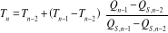 (3-32)

Cuando la nueva temperatura estimada mediante (3-32), difiera de la
última en menos de 10 K, se detiene el proceso iterativo.

Según la norma UNE 31-002 \[1\]: Se tomará como temperatura de explosión
la última estimada y como calor de explosión el último calculado, ambos
valores redondeados al número más próximo múltiplo de cinco y el calor
de explosión se expresará en kJ/kg y la temperatura en Kelvin.

## Volumen normal de gases

Se entiende por tal el volumen que ocuparían los productos gaseosos
producidos por cada kilogramo de explosivo, en condiciones normales a 1
atm = 1,013·10^5^ Pa y 0 ºC = 273,15 K[^5]

Suponiendo el comportamiento ideal de los productos de explosión
gaseosos, el volumen normal de gases se calcula con la siguiente
expresión:

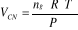 (3-33)

y la "fuerza" o energía específica con:

**f = n~g~·R·T** (3-34)

donde:

  -------------------------------------------------------------------------
  **V~CN~**   Volumen de gases en condiciones normales, en (m^3^/kg).
  ----------- -------------------------------------------------------------
  **Tº**      T^0^ = 273,15 K

  **n~g~**    Moles de productos gaseosos, en (mol/kg).

  **R**       R=8,31441 J/(mol·K)

  **Pº**      Pº=1,013·10^5^ Pa

  **f**       Energía o "fuerza" específica del explosivo, en (J/kg).
  -------------------------------------------------------------------------

Ambos valores, en general, no coinciden puesto que al pasar de T a Tº
suelen producirse fenómenos de condensación. Supondremos despreciables
las condensaciones.

## Parámetros de detonación

Aunque el método de cálculo se basa en un balance termoquímico en el
estado de explosión a volumen constante, los resultados obtenidos se
pueden utilizar para estimar las variables mecánicas del estado de
detonación CJ, como son: la presión de detonación, la densidad de
detonación y el coeficiente adiabático.

Las fórmulas empíricas que van a emplear son las propuestas por *Kamlet,
M.J y Jacobs, S.J*. \[3\]. Estas fórmulas se basan en un estudio
estadístico sobre propiedades de detonación, obtenidas mediante un
cálculo con códigos de detonación complejos, de un gran número de
explosivos compuestos por C, H, N y O en un intervalo de densidades
desde 1 g/cm^3^ a 2 g/cm^3^, y son:

**P = K~p~ · ρ~o~^2^ · φ** (3-35)

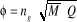 (3-36)

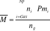 (3-37)

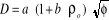 (3-38)

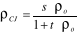 (3-39)

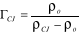 (3-40)

donde:

+------------------------+-------------------------------------------------------------+
| **P**                  | Presión de detonación, en (GPa).                            |
+========================+=============================================================+
| **K~p~**               | Constante K~p~ = 7,617·10^-4^ (ρ~0~ en g/cm^3^) .           |
+------------------------+-------------------------------------------------------------+
| **ρ~o~**               | Densidad inicial o de encartuchado, en (g/cm^3^)            |
|                        |                                                             |
|                        | 1 g/cm^3^ = 1000 kg/m^3^                                    |
+------------------------+-------------------------------------------------------------+
| **φ**                  | Factor auxiliar, (mol^1/2^ ·J ^1/2^ · kg ^-1^)              |
+------------------------+-------------------------------------------------------------+
| **n~g~**               | Cantidad de gases producida en la detonación, en (mol/kg).  |
+------------------------+-------------------------------------------------------------+
| **Q**                  | Calor de explosión, en (kJ/kg).                             |
+------------------------+-------------------------------------------------------------+
|  | Masa molecular media de los productos         |
|                        | gaseosos, en (g/mol).                                       |
|                        |                                                             |
|                        | Observación si n~g~ = 0, M=0.                               |
+------------------------+-------------------------------------------------------------+
| **Np**                 | Número de productos de explosión.                           |
+------------------------+-------------------------------------------------------------+
| **n~i~**               | Cantidad de producto i, formada en la reacción de           |
|                        | explosión, en (mol/kg).                                     |
+------------------------+-------------------------------------------------------------+
| **Pm~i~**              | Peso molecular del producto gaseoso i, en (g/mol).          |
+------------------------+-------------------------------------------------------------+
| **D**                  | Velocidad de detonación, en (m/s)                           |
+------------------------+-------------------------------------------------------------+
| **a**                  | Constante empírica: a=22,33                                 |
+------------------------+-------------------------------------------------------------+
| **b**                  | Constante empírica: b=1,3.                                  |
+------------------------+-------------------------------------------------------------+
| **ρ~CJ~**              | Densidad de detonación, en (g/cm^3^)                        |
+------------------------+-------------------------------------------------------------+
| **s**                  | Constante empírica: s=1,47 g/cm^3^.                         |
+------------------------+-------------------------------------------------------------+
| **t**                  | t=0,05625.                                                  |
+------------------------+-------------------------------------------------------------+
| **Γ~CJ~**              | Coeficiente adiabático ( - ). Suponiendo los gases          |
|                        | politrópicos (gases ideales con capacidad calorífica        |
|                        | constante, la expresión se deduce de las ecuaciones         |
|                        | mecánicas del choque. )                                     |
+------------------------+-------------------------------------------------------------+

La expresiones (3-35), (3-36), (3-39) y (3-49), se representan en las
**figuras 3-5**, **3-6**, **3-7** y **3-8**, para un intervalo de
densidades iniciales de 1 g/cm^3^ a 2 g/cm^3^.

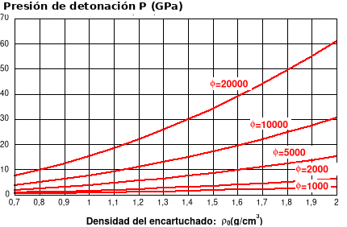{width="5.979166666666667in"
height="3.8125in"}[^6]

***Figura 3-5: Presión de detonación.***

```{=latex}
\addcontentsline{lof}{figure}{Figura 3-5: Presión de detonación.}
```

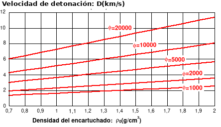{width="5.927083333333333in"
height="3.5729166666666665in"}[^7]

***Figura 3-6: Velocidad de detonación.***

```{=latex}
\addcontentsline{lof}{figure}{Figura 3-6: Velocidad de detonación.}
```

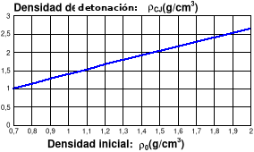{width="3.9479166666666665in"
height="2.3645833333333335in"}

***Figura 3-7: Densidad de detonación.***

```{=latex}
\addcontentsline{lof}{figure}{Figura 3-7: Densidad de detonación.}
```

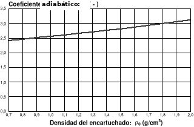{width="4.71875in" height="2.9791666666666665in"}

***Figura 3-8: Coeficiente adiabático.***

```{=latex}
\addcontentsline{lof}{figure}{Figura 3-8: Coeficiente adiabático.}
```

## Observaciones

a\) **Calor de explosión:

Analizando los pasos dados en el proceso de cálculo, se puede observar
que: La presión influye en la composición de los productos considerados:
(CO~2~, CO, H~2~O, H~2~), puesto que el equilibrio depende de **K~2~**,
véase (3-8).

La estimación de la presión mediante la ecuación de los gases ideales es
una aproximación grosera, por lo que el calor de explosión obtenido
mediante el método de cálculo simplificado no coincide con el calor de
explosión a volumen constante.

Según *Sanchidrián Blanco* \[2\], el calor de explosión calculado
resulta ser de un 10 % a un 15 % superior al obtenido experimentalmente
en el calorímetro.

A pesar de todo lo anterior los resultados obtenidos son más que
aceptables.

b\) **Ecuaciones de estado**:

La suposición del comportamiento ideal de los gases afecta tanto a la
composición los productos de explosión como a las funciones
termodinámicas:

El equilibrio (3-6) está, en realidad, más desplazado hacia el CO~2~,
puesto que habría que efectuar una modificación de la ecuación de los
gases ideales, por medio de un factor de corrección, lo que afectaría a
la relación **P/n~g~** (y por lo tanto a la constante de equilibrio
**K~2~'**).

La temperatura de explosión se ve afectada en gran medida al suponer los
gases ideales y los sólidos incompresibles, puesto que esta suposición
distorsiona los valores de la energía interna de los productos que se
incluyen en la ecuación de la energía (I), (que es de dónde se obtiene
la temperatura de explosión.)

El resultado final es que se obtienen temperatura de explosión
excesivamente altas.

Para obtener resultados más precisos se hace imprescindible acudir a
ecuaciones de estado de tipo virial más apropiadas (y complejas), como
por ejemplo la *BKW* (por *Becker-Kistiakosky-Wilson*) como hace *Mader,
C.L* \[9\].

c\) **Fórmulas de *Kamlet y Jacobs* \[3\]:**

Las expresiones (3-35) y (3-38) se obtuvieron mediante un ajuste
estadístico con los resultados que proporcionaba un código complejo de
detonación (denominado Ruby) aplicado a explosivos formados
exclusivamente por C, H, N y O.

El error cometido era menor del 5 % en la mayoría de los casos.

Si aplicamos (3-35) y (3-38) a explosivos formados por otros elementos
diferentes de los cuatro anteriores, los resultados serán menos fiables
a medida que aumente la proporción de estos.

# Breves nociones sobre la ingeniería del *software*

La Ingeniería del *software* es una metodología aplicable al diseño, a
la escritura, y al mantenimiento eficientes de los programas
informáticos.

Construir un programa es observar un conjunto de métodos y reglas, con
vistas a la obtención racional de un material de *software.*

Entre estas reglas se incluyen los fundamentos conceptuales, la
organización de los proyectos, la definición de los criterios de calidad
y su valoración junto con los medios y acciones que hacen posible la
mejora del material informático.

La metodología de la Ingeniería del *software* afecta a un gran campo de
actividades; como pueden ser: la gestión comercial, el cálculo técnico y
científico, el control de procesos, los sistemas operativos y los
programas de utilidad, las ayudas a la producción de información, la
ingeniería, la enseñanza y el diseño asistido por ordenador y la
ofimática.

La Ingeniería del *software,* como se indica en la **figura 4-1**,
implica cinco fases generales que son aplicables al desarrollo de un
programa.

**a)** **Análisis de requisitos:** Consiste en una *descripción
detallada* de lo que se pretende conseguir con la herramienta
informática que se piensa desarrollar.

**b) Diseño:** Constituye un perfil de cómo los requisitos van a
implementarse en el programa.

**c) Codificación:** Es el proceso de *escritura del programa* en un
lenguaje de programación determinado.

**d)** **Comprobación:** Examina exhaustivamente los errores del
programa, asegurándose que la aplicación informática *cumple las
especificaciones* consideradas en los requisitos.

**e) Mantenimiento:** Es la fase que se encarga de la

*actualización y mejora* de las características del programa.

En los capítulos del 5 al 9, se desarrollan las cinco fases de la
Ingeniería del *software* y se aplican a la construcción de la
aplicación informática ***Explocal***.

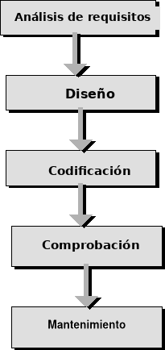{width="2.8541666666666665in" height="6.15625in"}

***Figura 4-1: Fases en la ejecución de un proyecto informático:***

```{=latex}
\addcontentsline{lof}{figure}{Figura 4-1: Fases en la ejecución de un proyecto informático}
```

***INGENIERÍA DEL SOFTWARE***

# ANÁLISIS DE REQUISITOS[]{.indexref entry="ANÁLISIS  DE  REQUISITOS."}

La fase de *análisis de requisitos*, dentro de la Ingeniería del
*software* persigue como fin describir de forma exhaustiva las
características de la aplicación informática que se pretende
desarrollar, para ello se elabora una lista, con su explicación
correspondiente, de las propiedades (y restricciones) a las que la
aplicación informática debe ajustarse.

El análisis de requisitos determina las metas que debe cumplir el
proyecto de *software* y qué se debe hacer para conseguirlas.

Esta fase es la que tiene mayor peso en el proyecto, puesto que fija
tanto el punto de partida como los objetivos que se tendrán que cumplir.

En general, para la mayoría de los proyectos de *software*, la
documentación que acompaña a los requisitos consiste en algo que está
entre una lista corta y una descripción detallada.

Para los aficionados, por ejemplo, la documentación de los requisitos
puede consistir sólo en una lista breve de los atributos del programa y
una breve descripción de su comportamiento.

Pero, en general, cualquier proyecto profesional (realizado por un
equipo profesional) en la que los programadores, los diseñadores y
analistas son personas distintas, los documentos que se incluirán son:

a)  Una descripción detallada de la *necesidad* o propósito del
    programa.

b)  Las especificaciones completas del **sistema**, (tanto del sistema
    operativo como del soporte físico)

c)  Explicación de los **servicios** que va a proporcionar la aplicación
    informática.

d)  Una descripción de todas las **funciones** del *software*.
    (Descripción de los cálculos)

e)  Los requisitos de una **base de datos** de información externa.

f)  Una descripción de los **requisitos de mantenimiento**.

g)  Un **glosario**.

h)  Un **índice** (En este caso incluido al comienzo del proyecto)

## Necesidad, propósito y características de la aplicación informática comercial

El primer paso que debe dar cualquier análisis de requisitos es
*justificar* la necesidad de la herramienta informática que se pretende
construir.

Esta cuestión es de gran importancia puesto que si después de realizar
un gran esfuerzo y dedicar recursos, tanto humanos como materiales, para
obtener un material informático determinado, el resultado final no
supone una mejora sustancial respecto a la utilización de otras
herramientas informáticas e incluso no supera el empleo de una técnica
manual, se habrá estado tirando el tiempo y el dinero.

En el *proceso de detonación* de un explosivo se libera energía mediante
una reacción química exotérmica muy rápida. Los productos de explosión
de esta reacción, mayoritariamente gaseosos, se encuentran en el
instante en que se completa la reacción, en unas condiciones de presión,
temperatura y densidad que es necesario conocer para llevar a cabo una
*aplicación racional de los explosivos* a cada uso en particular.

Por ejemplo: en barrenos húmedos se descarta el empleo de explosivos con
nitrato amónico entre sus componentes. En casos como este la elección
del explosivo se puede realizar a partir de su composición, pero en
general es necesario conocer las características de la detonación. Como
en el caso de que se desee obtener grandes bloques (baja fragmentación),
es aconsejable el empleo de explosivos con preponderancia del volumen de
gases respecto a su poder rompedor.

Pero si además de evaluar las características de un explosivo, es
posible predecir la influencia que va a tener la composición del
explosivo en estas características, será posible alterar la composición
para conseguir el efecto deseado. Esta es, sin duda, la utilidad
práctica que persigue cualquier método de cálculo de las características
teóricas de los explosivos.

La herramienta informática que se va a desarrollar debe, por lo tanto,
poder permitir *comparar*, con una cierta comodidad, el efecto que
produce, en los resultados, cualquier variación en la composición de la
mezcla explosiva.

El principal propósito de la informatización del método de cálculo

de las principales características teóricas de los explosivos es
desarrollar una herramienta fiable con la que se puedan obtener los
parámetros de detonación de cualquier mezcla explosiva de una forma
rápida, ágil y eficaz, puesto que permitirá reducir el tiempo necesario
empleado en realizar el cálculo de forma manual, de aproximadamente
media hora, a segundos, que es el tiempo que lleva introducir los datos.

De todos los métodos de cálculo que existen, se va a trabajar con el que
se encuentra recogido en la norma UNE 31-002-94. Esta elección se ve
respaldada tanto por la difusión que tiene la norma como por la
sencillez y generalidad del método. Además se trata de un método que
resuelve un problema bien definido y con una solución algorítmica
conocida lo que asegura la viabilidad del diseño del programa.

La aplicación informática va a revalorizar, en cierto modo, el método de
cálculo puesto que permitirá estudiar con facilidad la influencia que
tiene cualquier variación de un componente (o componentes) en una
familia mezclas explosivas.

## Estudio de los costes de una aplicación informática

Cuando se pretende desarrollar una aplicación informática que sustituye
a otra (o a un método manual), hay que sopesar las ventajas e
inconvenientes que presentará la creación de una nueva herramienta
informática antes de incurrir en unos costes superiores a la alternativa
de continuar empleando la ya existente.

Los costes del método automático de resolución, son los que acarrea
tanto la construcción como la utilización de la aplicación informática y
se pueden clasificar según la siguiente división de *costes
interdependientes:*

(véase **tabla 5-1**)

***Tabla 5-1 : Costes del método automático.***

```{=latex}
\addcontentsline{lot}{table}{Tabla 5-1 : Costes del método automático.}
```

+-----------------------------------------------------------------------+
| ***- Costes del método de Cálculo Automático.***                      |
|                                                                       |
| ***(CA)***                                                            |
+:=====================================================================:+
| Costes de desarrollo:                                                 |
|                                                                       |
| (CA~Desarrollo~)                                                      |
+-----------------------------------------------------------------------+
| Costes del sistema:                                                   |
|                                                                       |
| (CA~Sistema~)                                                         |
+-----------------------------------------------------------------------+
| Costes del tiempo de ejecución: (CA~Ejecución~=f(n))                  |
+-----------------------------------------------------------------------+
| Costes de aprendizaje del manejo:                                     |
|                                                                       |
| (CA~Aprendizaje~)                                                     |
+-----------------------------------------------------------------------+

Fuente: Elaboración propia.

Nota: n es el número de veces que se aplica el método.

Los conceptos anteriores se pueden expresar tanto en tiempo como en
dinero, si se consideran los honorarios de analistas, diseñadores,
programadores y usuarios.

En lo que sigue se considera que todos los costes están expresados en
unidades uniformes.

Los ***costes del desarrollo*** **(CA~Desarrollo~):** incluyen los
costes de análisis, diseño, codificación, comprobación y mantenimiento.

No es difícil darse cuenta que la etapa de desarrollo influye notablemente
en los demás conceptos: Por ejemplo los costes del sistema dependen de
las decisiones tomadas en la fase de análisis, los costes de aprendizaje
dependen también tanto del tipo de aplicación considerada en el análisis
como de la eficiencia de las etapas de diseño y comprobación.

También cuenta, notablemente, las herramientas de programación de las
que se disponga.

Si se desea minimizar en lo posible el tiempo y esfuerzo dedicado al
desarrollo de una aplicación informática se debe emplear la metodología
que marca la Ingeniería del *software*.

Con los sistemas operativos actuales, que constituyen un entorno común a
todas las aplicaciones, suele ser práctica común hoy en día en las
empresas profesionales del sector **aprovechar** la estructura de una
aplicación para desarrollar otra distinta (puesto que el *interfaz de
usuario* es siempre similar).

En efecto, es mucho más económico partir de un código robusto y ya
comprobado y dedicar el esfuerzo de desarrollo sólo a las
características particulares de cada aplicación que empezar desde cero.

Últimamente se ha producido un abuso de esta práctica que ha originado
innumerables versiones ligeramente diferentes de la misma aplicación
informática que en ocasiones lo único que ha conseguido ha sido
confundir e irritar al usuario.

Desgraciadamente en la aplicación objetivo de este proyecto no se ha
podido contar con estas facilidades.

Los **costes del sistema: (CA~Sistema~)** engloban tanto el soporte
físico *(hardware)* como el conjunto de programas necesarios que hacen
posible el funcionamiento de la aplicación (*software*).

Esto incluye: los costes del procesador, sus sensores y transductores
(las memorias en particular) y los programas de utilidad con los que
vaya ocupado, como por ejemplo el sistema operativo.

El procesador se caracteriza por el número y naturaleza del conjunto de
instrucciones elementales, el tiempo de ejecución de las mismas, el
tamaño de la memoria interna y de los programas de utilidad (sistema
operativo) y se elige de acuerdo con criterios de organización ajenos al
campo de los diseñadores de *software*.

El diseñador sólo puede limitar la cantidad de memoria interna necesaria
si reduce el número de funciones que desarrolla la aplicación
informática.

Sin embargo, es frecuentemente inútil gastar tiempo en reducir el uso de
la memoria interna, ya que, además del incremento de coste de diseño del
programa, se tiende a reducir tanto la comprensibilidad como la
versatilidad del diseño.

Cuanto más complejo y extenso sea el programa que se necesite más caro
será el sistema que consiga hacerlo funcionar.

Aunque lo normal es que no se decida la compra de un sistema informático
para ejecutar, en exclusiva, un único programa, precisamente el éxito de
los ordenadores personales se basa en la capacidad de poder llevar a
cabo distintas tareas.

Esta es la razón que implica que el *coste del sistema* se **reparta**
entre todas las aplicaciones que el usuario utilice en un sistema en
particular.

Teniendo en cuenta esta aseveración, se debe intentar elegir, en la fase
de análisis del proyecto, por un sistema ampliamente difundido y no por
otro *sui generis* más limitado.

Los **Costes de ejecución: (CA~Ejecución~=f(n))** dependen tanto del
proceso que automatizan como de la potencia del sistema.

La rapidez es la principal baza con la que juegan los ordenadores al
competir con un método no automático.

Si se quiere reducir el tiempo de ejecución, en lo posible, hay que
invertir en un sistema más potente (y caro) o intentar optimizar el
algoritmo del programa.

Sin embargo, la opción de optimizar puede ocasionar problemas similares
a los que puede causar un intento de reducir las necesidades de memoria
del programa.

Los **Costes de aprendizaje : (CA~Aprendizaje~)** junto con los costes
de ejecución y sistema son los que recaen en el usuario final (y por lo
tanto en el consumidor o cliente).

El fin último que persigue cualquier aplicación informática es realizar
una tarea determinada con la mayor facilidad y sencillez posibles.

No es extraño, por lo tanto, que las tendencias actuales en lo que se
refiere a sistemas operativos se hayan dirigido a facilitar la vida de
los usuarios permitiendo el desarrollo de utilidades de fácil manejo.

En este contexto se han establecido ciertos estándares como el CUA
*(Common User Interface)* definido por IBM y adoptado por el sistema
operativo *Windows* que reducen la curva de aprendizaje mediante el uso
de unos interfaces de usuario comunes.

Con esto se consigue que el usuario sólo gaste su tiempo en aprender
cómo manejar las funciones que ofrece la aplicación informática en sí, y
no en el manejo del sistema.

Cuando se maneja un programa informático, es frecuente que todos los
pormenores del cálculo queden ocultos al usuario, por lo que no es
necesario poseer un conocimiento exhaustivo del método de cálculo para
utilizar correctamente el programa .

Como consecuencia de lo anterior se consigue disminuir el tiempo de
aprendizaje.

Si no empleamos el ordenador incurriremos en los siguientes costes
reflejados en la **tabla 5-2**:

**Tabla 5-2 : Costes del método manual.**

+-----------------------------------------------------------------------+
| ***Costes del empleo de un método de cálculo manual (CM)***           |
+:=====================================================================:+
| Coste de aprendizaje:                                                 |
|                                                                       |
| (CM~Aprendizaje~)                                                     |
+-----------------------------------------------------------------------+
| Coste de ejecución del método:                                        |
|                                                                       |
| (CM~Ejecución~=f(n))                                                  |
+-----------------------------------------------------------------------+

Fuente: Elaboración propia.

Nota: n es el número de veces que se aplica el método

Los **costes de aprendizaje** del método manual incluyen

el conocimiento exhaustivo tanto de las generalidades como de los
detalles de todas las etapas del cálculo.

En general se puede decir que el coste de aprendizaje del método manual
es superior al automático. Aunque aprender a utilizar el cálculo manual
tiene la ventaja de proporcionar una visión más profunda del problema,
no asegura la comprensión del método (al igual que el método
automático).

Las principales ventajas que posee el método automático (bien diseñado y
depurado) sobre el manual son: la mayor comodidad, la rapidez, y la
ausencia de errores.

Es decir menor **coste de ejecución.**

Cuando el método de cálculo se aplica gran cantidad de veces es siempre
más ventajoso su automatización que la insistencia en su forma manual.

A partir de este razonamiento se puede concluir como, una vez más, con
una mayor inversión (desarrollando una aplicación informática) se puede
obtener un menor coste operativo (coste de ejecución)

De este modo se puede transformar un esfuerzo eminentemente repetitivo
(como realizar cien veces el mismo cálculo), en uno creativo (como
programar).

Hay que recordar que aunque el ordenador siempre lleve las de ganar
cuando se trata de realizar tareas repetitivas, utilizar el ordenador
sin justificación es una pérdida de tiempo.

La cuantificación *a priori* de los costes de una aplicación
informática, antes de desarrollarla, es una tarea que entraña gran
dificultad.

Sólo si se posee experiencia en desarrollar aplicaciones similares es
posible realizar una estimación previa de lo que puede costar.

## Especificaciones del sistema

La aplicación informática ***Explocal*** está pensada para poder ser
utilizada por cualquier usuario de ordenadores personales.

Debido a la gran difusión que han tenido los ordenadores personales tipo
**IBM - PC y compatibles**, se ha optado por ellos como plataforma de
desarrollo de la aplicación ***Explocal***.

La evolución de los ordenadores personales ha hecho imprescindible el
uso de sistemas operativos avanzados para poder aprovechar al máximo las
posibilidades de los procesadores disponibles en la actualidad.

De todos los sistemas operativos de amplia difusión para IBM - PC son
sin duda el *Windows* y el MS-DOS, (ambos desarrollados por Microsoft)
los más utilizados en la actualidad por usuarios de todo el mundo.

La aparición de la versión *Windows* 95 del sistema operativo
*Microsoft* *Windows* no ha roto la compatibilidad con las versiones
anteriores del *Windows* (*3.0, 3.1, 3.11 para Trabajo en Grupo*), ni
con el sistema operativo *MS-DOS*.

Esta circunstancia convierte a cualquiera de las versiones de *Windows*
3.1 ó 3.11 en las más compatibles, a excepción del MS-DOS, puesto que
también lo son con los sistemas operativos *OS/2* y *OS/2 Warp* de
IBM*.*

### Características del entorno *Windows*. Comparación con el DOS

Se puede decir que *Windows* es más que un sistema operativo es un
entorno gráfico.

*Microsoft Windows* hace más sencilla la vida de usuario.

Las aplicaciones informáticas para *Windows* reducen la curva de
aprendizaje mediante el empleo de interfaces de usuario familiares: Una
vez que el usuario ha configurado *Windows* para un monitor y una
impresora particulares desaparecen los persistentes problemas de
compatibilidad que antes se producían con la instalación de cada nuevo
paquete de *software* en *MS-DOS*.

El usuario también se beneficia de algunas características implícitas en
*Windows* como: la transferencia de datos entre distintos programas

(mediante el portapapeles), la ejecución de más de un programa a la vez,
la posibilidad de establecer enlaces dinámicos entre programas en
ejecución, la mezcla entre texto y gráficos y un interfaz de pulsar y
soltar común.

Estas características son las que inclinan la balanza a favor de
*Windows* en el desarrollo de una aplicación como ***Explocal*** puesto
que se desea una aplicación versátil y de fácil manejo.

### Soporte necesario mínimo y mínimo recomendado

El soporte mínimo necesario, para ejecutar una aplicación informática
determinada, viene condicionado por las características que un sistema
(o equipo) debe poseer para poder utilizar aplicaciones *Windows*.

Tanto el *hardware* como el *software* necesario para ejecutar
***Explocal*** es el que viene reflejado en la **tabla 5-3**.

En la **tabla 5-3** también se incluyen las características del sistema
que se va a emplear en la codificación de ***Explocal***.

***Tabla 5-3 : Soporte necesario y plataforma de desarrollo.***

```{=latex}
\addcontentsline{lot}{table}{Tabla 5-3 : Soporte necesario y plataforma de desarrollo.}
```

  ----------------------------------------------------------------------------
                         ***Soporte      ***Soporte mínimo    ***Soporte de
                          mínimo***        recomendado***     desarrollo***
  ------------------ ------------------- ------------------ ------------------
      ***Sistema        *Windows* 3.1      *Windows* 3.1      *Windows* 3.11
     operativo***                                            para trabajo en
                                                                  grupo.

   ***Procesador***      Intel 80286        Intel 80386        Intel 80486

   ***Velocidad***         12 MHz              33 MHz             66 MHz

    ***Monitor***            B/N               Color              Color

   ***Resolución***          EGA                VGA                SVGA

      ***RAM***             1 Mb                2 Mb               8 Mb
  ----------------------------------------------------------------------------

Fuente: Elaboración propia, basada en datos de Microsoft

## Funciones a implementar

Los datos y resultados del problema constituyen una lista compleja de
información e incluyen:

a\) **La** **composición de la mezcla:** Nombre de los reactivos,
porcentajes, fórmulas, energías de formación.

b\) **Las características de la mezcla:** Nombre del explosivo, densidad
de encartuchado, energía interna, fórmula para 1 kg de explosivo,
balance de oxígeno.

c\) **La composición de los productos de explosión**.

d\) **Los parámetros de la reacción a volumen constante:**

Calor de explosión, temperatura de explosión, moles de productos
gaseosos, volumen de gases en condiciones normales, energía específica,
masa molecular media de productos gaseosos.

e\) **Los parámetros de detonación:** Presión de detonación, velocidad
de detonación, densidad de detonación, coeficiente adiabático.

La manera más versátil de presentar todos los datos anteriores es, sin
duda, un *procesador de textos*.

En consecuencia ***Explocal*** debe poseer todas las funciones de un
procesador de textos, y si queremos acceder a datos de diferentes
explosivos a la vez la aplicación debe poseer un interfaz tipo MDI.

### Funciones de un procesador de textos

Las funciones de un procesador de textos se pueden clasificar en:

a\) Escritura de texto por teclado.

b\) Posibilidad de seleccionar todo o una parte del texto.

c\) Acceso al portapapeles de *Windows*: Esta característica permite
compartir datos con otras aplicaciones y es, sin duda, una de las
ventajas más sobresaliente de *Windows* respecto a MS-DOS.

Debe incorporar las funciones de "*cortar*" y "*pegar*".

d\) Escritura y lectura de datos en disco: indiferentemente si se trata
de disco duro o de *disquete*.

e\) Buscar y reemplazar un texto.

f\) Salida del texto por impresora.

### Funciones de una aplicación MDI

Muchas aplicaciones de *Windows* (como el *Administrador de programas*,
y el *Administrador de archivos)* implementan un interfaz especial de
*Windows* con múltiples ventanas.

Se trata de un interfaz estándar de *Windows* denominado *Multiple
Document Interface (**MDI**)*. El estándar MDI forma parte del estándar
CUA *(Common User Access)* definido por IBM.

Cada aplicación que cumple las especificaciones MDI posibilita la
apertura de ventanas hijas para tareas específicas, tales como edición
de textos, manejo de bases de datos o trabajo con una hoja de cálculo.

Las funciones genéricas que incorpora una aplicación MDI son:

a\) **Creación y cierre individual de ventanas hijas.**

b\) **Dimensionamiento** de cada una de las ventanas hijas.

c\) **Organización de iconos.**

d\) **Organización de ventanas** abiertas en mosaico o cascada.

Las funciones anteriores van permitir que utilizando ***Explocal*** se
pueda comparar de un solo vistazo diferentes mezclas explosivas.

### Funciones del cálculo de una mezcla explosiva

El programa debe incorporar todo el proceso de cálculo descrito en la
norma UNE 31-002 \[1\] .

Esto incluye:

a\) **Introducción de datos** de una mezcla explosiva.

b\) Manejo de **fórmulas químicas**: Cálculo de pesos moleculares.

c\) Cálculo del **balance de oxígeno**.

d\) **Discusión del tipo de explosivo**, excedentario o deficitario en
oxígeno.

e\) Cálculo de la **composición de los productos** de detonación y de la
temperatura de explosión:

Si el explosivo es deficitario en oxígeno el programa debe incorporar
una función que resuelva una ecuación polinómica de tercer grado y
discuta la solución obtenida. En cualquier caso se necesita la
resolución de la ecuación en temperatura mediante un proceso iterativo.

f\) Cálculo del número de moles gaseosos, masa molecular media de
productos gaseosos y volumen de gases.

g\) Aplicación de las **fórmulas empíricas** de *Kamlet y Jacobs* \[3\]

h\) Detección de **errores** en el proceso de cálculo y discusión

de los resultados obtenidos.

i\) **Visualización de los resultados** en pantalla.

j\) Posibilidad de **cambiar las unidades** de los resultados.

### Funciones de una aplicación informática comercial

Aunque no son intrínsecamente necesarias para el funcionamiento básico
del programa, existe una serie de características que proporcionan un
toque de calidad a cualquier aplicación informática.

Las más importantes son:

a\) **Iconos descriptivos** de la aplicación y de las ventanas hijas.

b\) **Programa de instalación**.

c\) **Acceso** a la **aplicación mediante el Administrador de
Programas**: Debe permitir iniciar la aplicación con el archivo
seleccionado.

d\) Archivo de **ayuda en hipertexto:**

con acceso mediante menú y mediante botones.

(\*.HLP)

e\) Archivo de **inicialización** que almacene las preferencias elegidas
por el usuario. (\*.INI)

f\) Incorporación de **información** sobre la versión del programa.

### Funciones de un programa de instalación

El programa de instalación soporta la responsabilidad de ser la primera
impresión que cualquier usuario se va a llevar de la aplicación
comercial; y dado que muchas veces la primera impresión es la que
cuenta: es de sentido común cuidar al máximo sus prestaciones y su
estética.

Los usuarios finales esperan un conjunto de características de los
programas de instalación. Añadir estas características puede asegurar
que la utilidad de la instalación produzca una buena impresión.

Estas características pueden resumirse en:

a\) **Ejecutable en *Windows:*** El software de instalación debería
ejecutarse desde *Windows* puesto que la aplicación informática está
diseñada para este sistema operativo.

c\) **Unidades de destino y origen modificables:** Después de mostrar un
pequeño mensaje, el programa de instalación debería solicitar al usuario
confirmación tanto de la unidad de origen como de la unidad de destino y
del directorio de instalación.

Se debería sugerir un valor por defecto para cada uno.

d\) **Opciones de instalación:** A continuación se puede preguntar al
usuario qué opciones se van a instalar, (no todos los usuarios querrán
instalar los ejemplos, o los archivos de ayuda).

En este caso, como en los demás, también se debería sugerir opciones
por defecto.

d\) **Control del espacio disponible:** Tan pronto como el programa
conozca cuántos y qué archivos se van a instalar, se debería comprobar
que en la unidad de destino hay espacio suficiente antes de continuar.
Si no hay espacio suficiente es mejor avisar al usuario antes de
comenzar la copia, en vez de agotar el espacio del disco después de
haber copiado casi todos los archivos de distribución. El programa de
instalación puede sugerir al usuario que elimine algunos archivos que
use con poca frecuencia o que no usa para hacer un hueco en el disco.

e\) **Indicador de progreso:** Cuando el programa de instalación esté
preparado para empezar a copiar archivos de los discos de distribución
al disco duro del usuario final, el cursor del ratón debe cambiar al
cursor de espera

(símbolo del reloj de arena). Durante la secuencia de copia debe
aparecer en pantalla un indicador de progreso que mantenga completamente
informado al usuario.

(Con frecuencia se usa una barra que se expande y un texto con el
porcentaje realizado de instalación.)

f\) **Discos de distribución:** Si la aplicación informática se
distribuye en más de un disquete, se debería asegurar que no es
necesario introducir un disco más de una vez en la unidad, durante la
instalación.

g\) **Nuevo grupo de programas:** Después de que el programa de
instalación haya terminado de copiar archivos en el disco del usuario
final, se debería añadir un nuevo grupo de programas en el Administrador
de programas de *Windows*. El grupo de programas debería contener un
icono por cada ejecutable de la aplicación informática.

Escribir un buen programa de instalación no es una tarea fácil, ya que:
crear y actualizar el indicador de progreso y usar el intercambio
dinámico de datos (DDE) para ordenar al *Administrador de archivos* que
cree un nuevo grupo presenta una elevada complicación técnica.

Aunque el desarrollo de un programa de instalación no esté entre los
objetivos de este proyecto se incluye uno, de calidad más que aceptable,
en el disco que se adjunta en los anexos de proyecto, que permite la
instalación de todos los archivos que forman parte de la aplicación
informática ***Explocal***.

Estos archivos son:

h\) Archivo ejecutable.

i\) Ayuda en hipertexto.

j\) Ejemplos.

k\) Archivos de datos.

l\) Bibliotecas enlace dinámico.

m\) Archivo de inicialización.

## Bases de datos de información externa

Se pretende organizar toda la información que necesita ***Explocal***
para su correcto funcionamiento en archivos de datos (extensión \*.DAT)

Un criterio, de gran importancia, que se debe tener en cuenta para
facilitar la vida del usuario es: procurar disminuir (al mínimo) el
número de datos que se deben introducir para conseguir hacer funcionar
correctamente el programa en cuestión.

En ***Explocal*** se debe, por lo tanto, conseguir que una vez que se ha
seleccionado un compuesto determinado, el programa se encargue de buscar
sus datos adicionales (como pueden ser su fórmula, nombre completo,
energía de formación, etc.) y de calcular otros (como su peso molecular,
y su balance de oxígeno)

Esto obliga a crear un archivo de datos (que se denominará REACTIVO.DAT)
conteniendo información con datos de diversos componentes de explosivos.

En el *ANEXO B* de la norma UNE 31-002 \[1\] se puede encontrar la
información necesaria para crear REACTIVO.DAT.

También se necesita incorporar información sobre los productos de
detonación con datos sobre: átomo asociado al producto de detonación
(símbolo y masa atómica), fórmula del producto de explosión, fórmula del
producto para el cálculo del balance de oxígeno, incremento de entalpía
específica en un intervalo amplio de temperaturas, temperatura de
vaporización y energía de formación. Todos estos datos se almacenan en
el archivo TABLPROD.DAT.

Los datos sobre los valores de las constantes de equilibrio se
encuentran en el archivo CONSTANT.DAT y son los que incluye la norma UNE
31-002 \[1\] en su ANEXO C.

Como se puede deducir de todo lo anterior se intenta colocar todos los
datos químicos y termoquímicos en archivos de texto (de fácil edición)
para que se puedan modificar sin esfuerzo. Esto es interesante debido a
que los datos pueden variar dependiendo de la fuente de donde se tomen.

Por último se considera un archivo con las descripciones de los errores
que pueden ocurrir en la aplicación de los cálculos: ERROR.DAT.

## Requisitos del mantenimiento

Se consideran las siguientes posibilidades de cambio en el código del
programa:

a\) **Traducción del programa a otros idiomas:** La codificación debe
garantizar un fácil acceso a los textos.

b\) **Cambio en los datos:** Sólo es necesario editar y cambiar los
archivos de datos.

c\) **Actualización de la aplicación a *Windows* *95*:**

Se debe cambiar el *interfaz de usuario*, por lo que puede resultar muy
útil separar en el código donde se implementa el funcionamiento del
interfaz, del código donde se incluyen los cálculos.

# DISEÑO

La fase de diseño dentro de la ingeniería del *software* es la fase más
importante ya que afecta de forma directa al resto de las fases.

La calidad del código, la fidelidad de los servicios del *software* y de
los requisitos funcionales, y la efectividad del mantenimiento, dependen
de la fase de diseño.

El diseño de un programa abarca todas las soluciones al problema
planteado por los requisitos, e incluye los principios de diseño
establecidos por las ciencias dedicadas a los ordenadores.

El diseño de un programa debe tener en cuenta las cuestiones siguientes:

a\) **Diseño descendente**, que implica la identificación

(desde alto nivel o desde las generalidades, hasta tareas específicas),
de:

\- Los módulos principales de administración general, (abarcan todas las
operaciones del programa).

\- Las teclas de funciones para llevar a cabo estas operaciones
generales.

\- Las funciones individuales para realizar operaciones específicas.

\- Las funciones de bajo nivel para ejecutar en detalle tareas dentro de
cada operación.

b\) **Alta coherencia**, que requiere que:

\- Los módulos y las funciones realicen operaciones específicas y bien
definidas, como partes integrantes del objetivo del *software.*

\- Las funciones que se agrupen juntas en un módulo, estén estrechamente
relacionadas.

\- Todas las funciones dentro de un módulo sean necesarias para
conseguir los objetivos del mismo.

c\) **Libre de acoplamientos**, que pretende conseguir de forma tan
razonable como sea posible:

\- Módulos independientes que realicen tareas sin tener que acceder a
otros módulos.

\- Iteración mínima entre los módulos y funciones (es decir cada función
puede acceder solamente a aquellas funciones que se requieren para
realizar sus operaciones).

\- Acceso en cada módulo y función, a la mínima cantidad de datos de
otros módulos necesarios para llevar a cabo una tarea.

d\) **Diagrama de estructura**, que presente los módulos

(ficheros), los subprogramas (funciones) de cada módulo y las relaciones
entre los módulos y los subprogramas.

El diagrama de la estructura es la representación visual de los
principios del diseño descendente, la alta coherencia y el libre
acoplamiento.

## Módulos principales

En el diseño de ***Explocal*** se consideran *dos módulos principales*:

a\) **Módulo de cálculo de un explosivo,** que debe proporcionar:

\- Una estructura de datos adecuada para almacenar toda la información
relativa a los datos, resultados y variables intermedias necesarias para
resolver un determinado problema de cálculo.

\- Funciones de lectura y comprobación de datos desde el disco.
(archivos \*.DAT).

\- Funciones para calcular datos adicionales.

\- Funciones que incorporen cada una de las etapas del proceso de
cálculo.

\- Funciones de detección y comprobación de errores en el cálculo.

b\) **Módulo del interfaz de usuario,** incluyendo:

\- Respuesta a las acciones del usuario: manejo del teclado y del ratón,
(tanto en el menú como en los cuadros de diálogo).

\- Introducción de datos y obtención de resultados en el módulo de los
cálculos.

\- Manejo del editor de textos. Impresión.

\- Lectura y escritura de datos en el disco.

\- Acceso al archivo de ayuda.

-Manejo de las ventanas de la aplicación MDI.

Para ser fiel al principio de desacoplamiento entre módulos: el nexo de
unión entre ambos módulos debe ser lo más reducido posible, como se
puede apreciar en el esquema reflejado en la ***figura 6-1***:

***Figura 6-1: Módulos principales.***

```{=latex}
\addcontentsline{lof}{figure}{Figura 6-1: Módulos principales.}
```

El código del interfaz de usuario está recogido en el archivo
EXPLOCAL.CPP e incluye el fichero de cabecera CALCULOS.H que contiene el
código relativo al cálculo de las características teóricas de los
explosivos.

Esta separación de módulos independientes se tiene en cuenta tanto en la
fase de diseño como en la de codificación y garantiza cierta facilidad
de actualización del programa a otros sistemas operativos.

En realidad es el *interfaz de usuario* el que incorpora las estructuras
de datos y funciones de los cálculos. Esta es la razón que obliga a que
el acceso a los datos de los cálculos sea lo más simple posible.

## Diseño del módulo de cálculo de un explosivo

### Estructuras de los datos del módulo de cálculo

Tras una observación minuciosa del método de cálculo, se pueden
clasificar todos los datos, constantes y resultados según la ***tabla
6-1***.

***Tabla 6-1: Clasificación de los datos.***

```{=latex}
\addcontentsline{lot}{table}{Tabla 6-1: Clasificación de los datos.}
```

  -----------------------------------------------------------------------
                            Datos del problema.
  -----------------------------------------------------------------------
                             Tablas de datos.

                         Resultados del problema.

                           Errores del problema.
  -----------------------------------------------------------------------

Fuente: Elaboración propia.

El diseño de las funciones necesarias para realizar los cálculos está
fuertemente influenciado por la organización de las estructuras de
datos. El flujo de información en el módulo de cálculos, teniendo en
cuenta la clasificación de la ***tabla 6-1***, se representa en la
***figura 6-2***.

***Figura 6-2: Flujo de información entre los datos de los cálculos.***

```{=latex}
\addcontentsline{lof}{figure}{Figura 6-2: Flujo de información entre los datos de los cálculos.}
```

Cada tipo de dato, clasificado en la ***tabla 6-1*** dependiendo de la
misión que desempeña en los cálculos, está constituido por una serie de
variables y estructuras que se agrupan en función de la información que
almacenan.

Una estructura de datos, se define como un conjunto de variables
relacionadas entre sí. En las ***tablas 6-2***, ***6-3*** y ***6-4*** se
organizan los datos necesarios para el cálculo de las características
teóricas de los explosivos en: variables simples y en estructuras. Esta
organización abre una vía para construir un algoritmo de resolución.

***Tabla 6-2: Datos del problema (Estructuras y variables):***

```{=latex}
\addcontentsline{lot}{table}{Tabla 6-2: Datos del problema (Estructuras y variables):}
```

**DATOS DEL PROBLEMA:** Características de un problema determinado
**Datos de la mezcla explosiva:**

Datos del conjunto de reactivos que forman la mezcla:

(*Los datos de los reactivos forman, en realidad, una matriz de datos*

*de dimensión MAX_REACTIVOS.)*

Número de reactivos que forman la mezcla: **NumReact**

**Nota:** La densidad de encartuchado y el nombre del explosivo, aunque

son datos del problema, se han incluido entre los resultados puesto que

sufren una comprobación que puede alterar su contenido.

***Tabla 6-3: Tablas de datos y errores (Estructuras y variables)***

```{=latex}
\addcontentsline{lot}{table}{Tabla 6-3: Tablas de datos y errores (Estructuras y variables)}
```

**TABLAS DE DATOS:** Los datos que incluyen deber ser leídos,
previamente,

del disco.

**Datos de los productos de explosión:** Forman una matriz de dimensión
MAX_PRODUCTOS = 35. En explosivos excedentarios en oxígeno se considera
que se forma un producto de explosión por cada elemento, se

toman en cuenta un total de MAX_ELEMENTOS = 32.

**Datos de las constantes de equilibrio:** Datos de K~1~ ( -) y K~2~
(Pa) desde

300 K hasta 6000 K cada 100 K, total TBL_DATOS = 58 datos.

**Tabla de errores:** Descripciones y estado de los indicadores del
error.

**Nota:** Los moles de los productos de explosión, se adjuntan a la
tabla de productos

de explosión (por razones obvias) aunque en realidad sean resultados del
problema

***Tabla 6-4: Resultados del problema (Estructuras y variables)***

```{=latex}
\addcontentsline{lot}{table}{Tabla 6-4: Resultados del problema (Estructuras y variables)}
```

**Resultados del problema:**

Las ***tablas 6-2, 6-3** y **6-4***, contienen (en negrita) los nombres
con los que se va a designar a las variables y a las estructuras en el
código C++. La organización realizada agrupa datos con una estrecha
relación.

Las tablas que contienen datos de las constantes de equilibrio y de las
entalpías de los productos de explosión son homogéneas en los intervalos
de temperatura, esta propiedad simplifica las funciones de acceso a
estos datos.

La tabla de datos de los productos de explosión almacena la información
incluida en la ***tablas 3-1*** y ***3-2*** junto con los datos de las
entalpías de los productos de explosión que vienen en la ***tabla
3-4***.

Las tablas de las *constantes de equilibrio* contienen los datos que
incluye la norma UNE 31-002 \[1\] en su ANEXO C.

En la **tabla 3-3** se comparan los datos de las constantes de
equilibrio con los de *Meyer R.* \[8\].

Como ya se tuvo en cuenta en la fase de requisitos, todos los datos se
almacenan en disco en *archivos de texto*. Esto permite que el usuario
puede acceder a los datos y por lo tanto modificarlos.

Se puede consultar datos de otras fuentes e incluso considerar que se
forman otros productos de explosión.

La organización de los datos que se ha efectuado afecta profundamente al
diseño de las funciones, por ejemplo para calcular el balance de oxígeno
una sustancia química deberemos partir de la fórmula de un compuesto,
(en vez de partir de una tabla de pesos), por lo que necesitaremos
acceder a la fórmula del compuesto y determinar el número de átomos de
un elemento dado en la fórmula, esto obliga a crear una función que
devuelva el número de átomos de un elemento en una fórmula.

Además también se deben considerar funciones que lean los datos de los
ficheros de texto y los almacenen en las estructuras.

El diseño de las estructuras de datos que se ha efectuado minimiza el
número de datos necesarios, por ejemplo no se incluyen en la tabla los
pesos moleculares de los productos de explosión puesto que es posible
determinarlos a partir de su fórmula.

Otra característica reseñable del diseño es que permite que el usuario
introduzca el menor número de datos posible para calcular un explosivo,
el resto se debe leer del archivo de datos.

### Diseño de las funciones necesarias para el cálculo

El diseño de las funciones de los cálculos se basa en el principio
*diseño descendente:* es decir, empieza por el diseño de las funciones
de alto nivel y finaliza con el diseño de las funciones para tareas
específicas.

La función principal del cálculo incorpora **todas** las etapas del
cálculo, el interfaz de usuario debe llamar a una única función para
conseguir los resultados.

La función principal denominada **CalcResultado** se esquematiza en la
***tabla 6-5***, teniendo en cuenta las funciones de menor nivel que
debe incluir en su diseño. Entre estas funciones es de hacer notar la
inclusión de las funciones de detección de errores.

Los errores se consignan durante el proceso de cálculo, sin detenerlo.

Al dividir la función principal en módulos independientes, se consigue
separar las ramas del tronco principal del diseño.

El diseño finaliza cuando se han construido las funciones auxiliares de
acceso y manejo de las tablas de datos, consiguiéndose, de este modo

enlazar la función principal con las estructuras y variables de datos.

Todas las funciones de los cálculos se incluyen, junto con una
descripción detallada en la ***tabla 6-6***, entre ellas se incluyen las
funciones principales, las auxiliares, las de consigna de errores y las
de lectura de datos del disco.

***Tabla 6-5: Función principal: CalcResultado.***

```{=latex}
\addcontentsline{lot}{table}{Tabla 6-5: Función principal: CalcResultado.}
```

+--------+------------------------------------------+----------------------------+
| **Nº** | **Descripción**                          | **Funciones**              |
+:======:+==========================================+:===========================+
| **1**  | Previa: Carga los datos de los reactivos | **CargarDatosReactivos**   |
|        | y verifica sus valores.                  |                            |
|        |                                          | **VerificarDensidad**      |
+--------+------------------------------------------+----------------------------+
| **2**  | Calcula la fórmula para un kilo de       | **CalcFormula_1kg**        |
|        | explosivo.                               |                            |
+--------+------------------------------------------+----------------------------+
| **3**  | Calcula la energía interna de la mezcla  | **CalcEnergia_Interna**    |
|        | explosiva.                               |                            |
+--------+------------------------------------------+----------------------------+
| **4**  | Calcula el balance de oxígeno.           | **CalcBO**                 |
+--------+------------------------------------------+----------------------------+
| **5**  | Calcula los moles de los productos de    | **CalcMolesProductos**     |
|        | explosión a excepción del grafito ( C),  |                            |
|        | CO, CO~2~, H~2~O y H~2~, si el balance   |                            |
|        | de oxígeno es negativo.                  |                            |
+--------+------------------------------------------+----------------------------+
| **6a** | Si el explosivo es excedentario en       | **CalcQexplosion**         |
|        | oxígeno se calcula el calor de explosión |                            |
|        | y la temperatura de explosión (mediante  | **CalcTexplosion.**        |
|        | un proceso iterativo) por separado.      |                            |
+--------+------------------------------------------+----------------------------+
| **6b** | Si el explosivo es deficitario, la       | **CalcTexpMolesProductos** |
|        | composición de los productos, el calor   |                            |
|        | de explosión y la temperatura de         |                            |
|        | explosión están interrelacionados. La    |                            |
|        | ecuación se resuelve mediante un proceso |                            |
|        | iterativo que incluye una ecuación       |                            |
|        | polinómica de tercer grado.              |                            |
+--------+------------------------------------------+----------------------------+
| **7**  | Calcula los moles gaseosos a la          | **CalcNg**                 |
|        | temperatura de explosión, la masa        |                            |
|        | molecular de los productos, los          | **CalcM**                  |
|        | parámetros adicionales y los de          |                            |
|        | detonación mediante las fórmulas de      | **CalcParamAdic**          |
|        | Kamlet - Jacobs.                         |                            |
|        |                                          | **CalcKamletJacobs**       |
+--------+------------------------------------------+----------------------------+
| **8**  | Verificar los resultados obtenidos.      | **VerificarResultados**    |
+--------+------------------------------------------+----------------------------+

Nota I: Las funciones de la **tabla 6-5** están ordenados por orden de
ejecución.

Nota II: La **tabla 6-5**, constituye un esquema del algoritmo del
proceso de cálculo.

***Tabla 6-6: Descripción de las funciones de los cálculos.***

```{=latex}
\addcontentsline{lot}{table}{Tabla 6-6: Descripción de las funciones de los cálculos.}
```

+-------------------------+----------------+--------------+---------------------+--------------+-----------------------------+
| **Nombre**              | **Parámetros** | **Respuesta  | **Descripción**     | **Funciones  | **Datos que emplea o        |
|                         |                | o            |                     | auxiliares** | modifica.**                 |
|                         |                | Resultado.** |                     |              |                             |
+:========================+:==============:+:============:+:====================+:============:+:===========================:+
| **BorrarDatos**         | \-             |              | Reinicializa los    | BorrarError, | Reactivo, Resultado         |
|                         |                |              | datos del problema. | BorrarMoles  |                             |
+-------------------------+----------------+--------------+---------------------+--------------+-----------------------------+
| **BorrarError**         | \-             | \-           | Reinicializa la     | \-           | Error\[i\].Ind              |
|                         |                |              | lista de errores.   |              |                             |
+-------------------------+----------------+--------------+---------------------+--------------+-----------------------------+
| **BorrarMoles**         | \-             | \-           | Reinicializa los    | \-           | TablaProd\[i\].Moles        |
|                         |                |              | moles de los        |              |                             |
|                         |                |              | productos de        |              |                             |
|                         |                |              | explosión.          |              |                             |
+-------------------------+----------------+--------------+---------------------+--------------+-----------------------------+
| **CalcBO**              | i,             | Balance de   | *Caso: i=BO_PROBO:* | CalcPmol,    | TablaProd\[i\].Masa_atomica |
|                         |                | oxígeno (%)  |                     |              |                             |
|                         | fórmula        |              | Calcula el balance  | CalcNumAt    | TablaProd\[i\].FormulaBO    |
|                         |                |              | de oxígeno según la |              |                             |
|                         |                |              | definición, es      |              | TablaProd\[i\].Formula      |
|                         |                |              | decir, supone que   |              |                             |
|                         |                |              | los productos de    |              |                             |
|                         |                |              | explosión están en  |              |                             |
|                         |                |              | su mayor estado de  |              |                             |
|                         |                |              | oxidación. Se       |              |                             |
|                         |                |              | emplea en todos los |              |                             |
|                         |                |              | resultados que se   |              |                             |
|                         |                |              | muestran en         |              |                             |
|                         |                |              | pantalla.           |              |                             |
|                         |                |              |                     |              |                             |
|                         |                |              | *Caso:              |              |                             |
|                         |                |              | i=BO_PRODEX:*       |              |                             |
|                         |                |              |                     |              |                             |
|                         |                |              | Calcula el balance  |              |                             |
|                         |                |              | de oxígeno teniendo |              |                             |
|                         |                |              | en cuenta los       |              |                             |
|                         |                |              | productos de        |              |                             |
|                         |                |              | explosión que se    |              |                             |
|                         |                |              | van a formar. Se    |              |                             |
|                         |                |              | emplea en decidir   |              |                             |
|                         |                |              | si el explosivo es  |              |                             |
|                         |                |              | de verdad           |              |                             |
|                         |                |              | excedentario o      |              |                             |
|                         |                |              | deficitario en      |              |                             |
|                         |                |              | oxígeno y para      |              |                             |
|                         |                |              | calcular los moles  |              |                             |
|                         |                |              | de oxígeno entre    |              |                             |
|                         |                |              | los productos de    |              |                             |
|                         |                |              | explosión.          |              |                             |
+-------------------------+----------------+--------------+---------------------+--------------+-----------------------------+
| **CalcCoef**            | temperatura,   | Coeficientes | Calcula la ecuación | K1,          | \-                          |
|                         | Bh, Bo, Bc,    | de la        | en moles de CO,     |              |                             |
|                         |                | ecuación     | f_nCO a partir de   | K2\_         |                             |
|                         | f_nCO          | polinómica   | los términos        |              |                             |
|                         |                | de tercer    | independientes del  |              |                             |
|                         | Grafito        | grado en     | sistema H, O, C, de |              |                             |
|                         |                | moles de CO  | la temperatura y de |              |                             |
|                         |                |              | si se produce o no  |              |                             |
|                         |                |              | grafito.            |              |                             |
+-------------------------+----------------+--------------+---------------------+--------------+-----------------------------+
| **CalcEnergia_Interna** | \-             | Energía      | Calcula la energía  | \-           | Reactivo\[i\].Porcentaje    |
|                         |                | interna de   | a partir de los     |              |                             |
|                         |                | la mezcla    | datos de los        |              | Reactivo\[i\].Energia       |
|                         |                | explosiva.   | reactivos.          |              |                             |
|                         |                |              |                     |              | NumReact                    |
|                         |                |              |                     |              |                             |
|                         |                |              |                     |              | Resultado.Eo                |
+-------------------------+----------------+--------------+---------------------+--------------+-----------------------------+
| **Calcf_nCO**           | f_nCO,         | Valor de la  | Devuelve el valor   | \-           | \-                          |
|                         |                | función      | de la función       |              |                             |
|                         | nCO            | polinómica.  | polinómica de       |              |                             |
|                         |                |              | tercer grado en el  |              |                             |
|                         |                |              | punto nCO, es       |              |                             |
|                         |                |              | decir: f(nCO)       |              |                             |
+-------------------------+----------------+--------------+---------------------+--------------+-----------------------------+

*(Continúa)*

+------------------------+----------------+--------------+-----------------------+--------------+--------------------------+
| **Nombre**             | **Parámetros** | **Respuesta  | **Descripción**       | **Funciones  | **Datos que emplea o     |
|                        |                | o            |                       | auxiliares** | modifica.**              |
|                        |                | Resultado.** |                       |              |                          |
+:=======================+:==============:+:============:+:======================+:============:+:========================:+
| **CalcFormula_1kg**    | \-             | Fórmula para | Agrupa todos los      | CalcNumAt    | Resultado.Formula_1kg    |
|                        |                | un kilo de   | datos de la mezcla    |              |                          |
|                        |                | explosivo.   | explosiva en uno sólo |              | Reactivo\[i\].Porcentaje |
|                        |                |              | de fácil manejo.      |              |                          |
|                        |                |              |                       |              | Reactivo\[i\].PesoMol    |
|                        |                |              |                       |              |                          |
|                        |                |              |                       |              | Reactivo\[i\].Formula    |
|                        |                |              |                       |              |                          |
|                        |                |              |                       |              | TablaProd\[i\].Simbolo   |
|                        |                |              |                       |              |                          |
|                        |                |              |                       |              | Resultado.Formula_1kg    |
|                        |                |              |                       |              |                          |
|                        |                |              |                       |              | NumReact                 |
+------------------------+----------------+--------------+-----------------------+--------------+--------------------------+
| **CalcKamletJacobs**   | \-             | Parámetros   | Aproximación al       | \-           | Resultado.Fi             |
|                        |                | de           | estado CJ de las      |              |                          |
|                        |                | detonación.  | detonaciones mediante |              | Resultado.Pcj            |
|                        |                |              | fórmulas empíricas.   |              |                          |
|                        |                |              |                       |              | Resultado.Dcj            |
|                        |                |              |                       |              |                          |
|                        |                |              |                       |              | Resultado.dcj            |
|                        |                |              |                       |              |                          |
|                        |                |              |                       |              | Resultado.d0             |
|                        |                |              |                       |              |                          |
|                        |                |              |                       |              | Resultado.CoefAdiab      |
+------------------------+----------------+--------------+-----------------------+--------------+--------------------------+
| **CalcM**              | \-             | Masa         | Calcula la masa       | CalcNg,      | Resultado.Texplosion     |
|                        |                | molecular    | molecular de los      |              | TablaProd\[i\].Moles     |
|                        |                | media de     | productos gaseosos.   | Gas,         |                          |
|                        |                | gases.       |                       |              | TablaProd\[i\].Formula   |
|                        |                |              |                       | CalcMol      |                          |
+------------------------+----------------+--------------+-----------------------+--------------+--------------------------+
| **CalcMolesProductos** | \-             | Moles de los | Calcula los moles de  | CalcNumAt,   | Resultado.Formula_1kg    |
|                        |                | productos de | los productos de      |              | TablaProd\[i\].Moles     |
|                        |                | explosión.   | explosión suponiendo  | CalcPMol,    |                          |
|                        |                |              | que tanto el carbono  |              | TablaProd\[i\].Formula   |
|                        |                |              | como el hidrógeno se  | CalcBO       |                          |
|                        |                |              | oxidan completamente  |              |                          |
|                        |                |              | a CO~2~ y H~2~O, y    |              |                          |
|                        |                |              | que el resto de los   |              |                          |
|                        |                |              | elementos se oxidan a |              |                          |
|                        |                |              | óxido o carbonato,    |              |                          |
|                        |                |              | excepto los halógenos |              |                          |
|                        |                |              | que forman el haluro  |              |                          |
|                        |                |              | correspondiente y el  |              |                          |
|                        |                |              | Hg que se volatiliza. |              |                          |
|                        |                |              |                       |              |                          |
|                        |                |              | No calcula los moles  |              |                          |
|                        |                |              | de oxígeno. Para      |              |                          |
|                        |                |              | mezclas deficitarias  |              |                          |
|                        |                |              | en oxígeno no         |              |                          |
|                        |                |              | proporciona los moles |              |                          |
|                        |                |              | de productos:         |              |                          |
|                        |                |              | CO~2~,CO,C,H~2~O,H~2~ |              |                          |
|                        |                |              | que dependen de la    |              |                          |
|                        |                |              | temperatura.          |              |                          |
+------------------------+----------------+--------------+-----------------------+--------------+--------------------------+
| **CalcNg**             | temperatura    | Moles        | Cantidad de moles     | Gas          | TablaProd\[i\].Moles     |
|                        |                | gaseosos     | gaseosos producidos   |              |                          |
|                        |                |              | en la detonación      |              |                          |
|                        |                |              | (mol/kg)              |              |                          |
+------------------------+----------------+--------------+-----------------------+--------------+--------------------------+
| **CalcNumAt**          | fórmula,       | Número de    | Determina el número   | \-           | TablaProd\[i\].Simbolo   |
|                        |                | átomos.      | de átomos del         |              |                          |
|                        | i              |              | elemento "i" en       |              |                          |
|                        |                |              | "fórmula"             |              |                          |
+------------------------+----------------+--------------+-----------------------+--------------+--------------------------+
| **CalcParamAdic**      | \-             | Parámetros   | Calcula el volumen de | \-           | Resultado.f              |
|                        |                |              | gases en condiciones  |              |                          |
|                        |                | adicionales. | normales y la energía |              | Resultado.Ng             |
|                        |                |              | especifica del        |              |                          |
|                        |                |              | explosivo.            |              | Resultado.Vcn            |
+------------------------+----------------+--------------+-----------------------+--------------+--------------------------+

*(Continúa)*

+--------------------+----------------+---------------+--------------------------------------+----------------+-----------------------------+
| **Nombre**         | **Parámetros** | **Respuesta o | **Descripción**                      | **Funciones    | **Datos que emplea o        |
|                    |                | Resultado.**  |                                      | auxiliares**   | modifica.**                 |
+:===================+:==============:+:=============:+:=====================================+:==============:+:===========================:+
| **CalcPMol**       | fórmula        | Peso          | Calcula el peso molecular del        | CalcNumAt      | TablaProd\[i\].Masa_atomica |
|                    |                | molecular     | compuesto dado por "fórmula"         |                |                             |
+--------------------+----------------+---------------+--------------------------------------+----------------+-----------------------------+
| **CalcQexplosion** | \-             | Calor de      | Calcula el calor de explosión        | \-             | Resultado.Qexplosion        |
|                    |                | explosión.    | (kcal/kg) a partir de la energía     |                |                             |
|                    |                |               | interna y los productos de           |                | TablaProd\[i\].Moles        |
|                    |                |               | explosión.                           |                |                             |
|                    |                |               |                                      |                | TablaProd\[i\].Eformacion   |
+--------------------+----------------+---------------+--------------------------------------+----------------+-----------------------------+
| **CalcQsensible**  | temperatura    | Calor         | Se emplea en la resolución de la     | CalcNg,        | TablaProd\[i\].Moles        |
|                    |                | sensible de   | ecuación en temperatura en los       | HT_H298        |                             |
|                    |                | los productos | procesos iterativos.                 |                |                             |
|                    |                | de explosión  |                                      |                |                             |
|                    |                | (kcal/kg)     |                                      |                |                             |
+--------------------+----------------+---------------+--------------------------------------+----------------+-----------------------------+
| **CalcRemonte**    | temperatura,   | SI / NO       | Realiza el remonte del sistema,      | K2\_           | TablaProd\[i\].Moles        |
|                    | Bh, Bo, Bc,    |               | determinando los moles de CO~2~, CO, |                |                             |
|                    |                |               | C,                                   |                |                             |
|                    | nCO,           |               |                                      |                |                             |
|                    |                |               | H~2~O, H~2~. Además verifica si la   |                |                             |
|                    | Grafito        |               | solución es correcta o no.           |                |                             |
+--------------------+----------------+---------------+--------------------------------------+----------------+-----------------------------+
| **CalcResultado**  | \-             | \-            | Enlaza todas las funciones para      | Ver tabla 3-4  | Resultado.BO                |
|                    |                |               | conseguir el algoritmo completo.     |                |                             |
|                    |                |               |                                      |                | Resultado.Ng                |
+--------------------+----------------+---------------+--------------------------------------+----------------+-----------------------------+
| **CalcSolucion**   | fn_CO,         | Solución de   | Devuelve los moles de CO producidos  | \-             | \-                          |
|                    |                | la ecuación   | (mol/kg). Teniendo en cuenta las     |                |                             |
|                    | CotaInf,       | polinómica    | restricciones de la solución. Cotas  |                |                             |
|                    |                |               | superior e inferior.                 |                |                             |
|                    | CotaSup        |               |                                      |                |                             |
+--------------------+----------------+---------------+--------------------------------------+----------------+-----------------------------+
| **CalcTermindep**  | j              | Término       | Calcula el término independiente del | CalcNumAt      | Resultado.Formula_1kg       |
|                    |                | independiente | sistema de ecuaciones formado por    |                |                             |
|                    |                | j.            | los balances de H, O, C.             |                | TablaProd\[i\].Moles        |
|                    |                |               |                                      |                |                             |
|                    |                |               | Sólo funciona para explosivos        |                |                             |
|                    |                |               | deficitarios en oxígeno.             |                |                             |
+--------------------+----------------+---------------+--------------------------------------+----------------+-----------------------------+
| **CalcTexplosion** | \-             | Temperatura   | Resuelve la ecuación:                | CalcQsensible, | Resultado.Texplosion        |
|                    |                | de explosión. |                                      |                |                             |
|                    |                |               | *Qsensible(temperatura)=Qexplosion*. |                | Resultado.Qexplosion        |
|                    |                |               |                                      |                |                             |
|                    |                |               | Sólo funciona si el explosivo es     |                |                             |
|                    |                |               | excedentario en oxígeno.             |                |                             |
+--------------------+----------------+---------------+--------------------------------------+----------------+-----------------------------+

*(Continúa)*

+----------------------------+----------------+--------------+---------------------+------------------+---------------------------+
| **Nombre**                 | **Parámetros** | **Respuesta  | **Descripción**     | **Funciones      | **Datos que emplea o      |
|                            |                | o            |                     | auxiliares**     | modifica.**               |
|                            |                | Resultado.** |                     |                  |                           |
+:===========================+:==============:+:============:+:====================+:================:+:=========================:+
| **CalcTexpMolesProductos** | \-             | Composición  | Calcula la          | CalcTermIndep,   | Resultado.Texplosion      |
|                            |                | y            | temperatura de      |                  |                           |
|                            |                | temperatura. | explosión y los     | CalcNumAt,       | Resultado.Qexplosion      |
|                            |                |              | moles de            |                  |                           |
|                            |                |              | C(grafito), CO,     | CalcCoef,        |                           |
|                            |                |              | CO~2~, H~2~O, H~2~. |                  |                           |
|                            |                |              | Sólo si el          | CalcSolucion,    |                           |
|                            |                |              | explosivo es        |                  |                           |
|                            |                |              | deficitario.        | CalcRemonte,     |                           |
|                            |                |              |                     |                  |                           |
|                            |                |              |                     | CalcQsensible,   |                           |
|                            |                |              |                     |                  |                           |
|                            |                |              |                     | PonerError,      |                           |
|                            |                |              |                     |                  |                           |
|                            |                |              |                     | BorrarMoles      |                           |
+----------------------------+----------------+--------------+---------------------+------------------+---------------------------+
| **CalcTotal**              | \-             | Porcentaje   | Porcentaje total de | \-               | Reactivo\[i\].Porcentaje, |
|                            |                | total        | la mezcla (%). Se   |                  | NumReact                  |
|                            |                |              | emplea en comprobar |                  |                           |
|                            |                |              | si se han           |                  |                           |
|                            |                |              | introducido         |                  |                           |
|                            |                |              | correctamente los   |                  |                           |
|                            |                |              | datos.              |                  |                           |
+----------------------------+----------------+--------------+---------------------+------------------+---------------------------+
| **CargarDatosReactivos**   | \-             | \-           | Carga del archivo   | CalcBO,          | Reactivo                  |
|                            |                |              | los datos de los    |                  |                           |
|                            |                |              | reactivos que el    | CalcPMol         |                           |
|                            |                |              | usuario ha          |                  |                           |
|                            |                |              | seleccionado.       |                  |                           |
+----------------------------+----------------+--------------+---------------------+------------------+---------------------------+
| **CargarTablaError**       | directorio     | SI / NO      | Carga el archivo de | PonerError       | Error\[i\].des            |
|                            |                |              | datos y almacena    |                  |                           |
|                            |                |              | los datos en las    |                  | ERROR.DAT                 |
|                            |                |              | estructuras. La     |                  |                           |
|                            |                |              | respuesta es        |                  |                           |
|                            |                |              | afirmativa si ha    |                  |                           |
|                            |                |              | podido encontrar el |                  |                           |
|                            |                |              | archivo de datos.   |                  |                           |
+----------------------------+----------------+--------------+---------------------+------------------+---------------------------+
| **CargarTablaK12**         | directorio     | SI / NO      | Carga el archivo de | PonerError       | Tabla_K1\[i\]             |
|                            |                |              | datos y almacena    |                  |                           |
|                            |                |              | los datos en las    |                  | Tabla_K2\[i\]             |
|                            |                |              | estructuras. La     |                  |                           |
|                            |                |              | respuesta es        |                  | CONSTANT.DAT              |
|                            |                |              | afirmativa si ha    |                  |                           |
|                            |                |              | podido encontrar el |                  |                           |
|                            |                |              | archivo de datos.   |                  |                           |
+----------------------------+----------------+--------------+---------------------+------------------+---------------------------+
| **CargarTablaProd**        | directorio     | SI / NO      | Carga el archivo de | PonerError,      | TablaProd                 |
|                            |                |              | datos y almacena    | BorrarDatos,     |                           |
|                            |                |              | los datos en las    |                  | Error\[i\].des            |
|                            |                |              | estructuras. La     | CargarTablaError |                           |
|                            |                |              | respuesta es        |                  | TABLPROD.DAT              |
|                            |                |              | afirmativa si ha    |                  |                           |
|                            |                |              | podido encontrar el |                  |                           |
|                            |                |              | archivo de datos.   |                  |                           |
+----------------------------+----------------+--------------+---------------------+------------------+---------------------------+
| **Gas**                    | temperatura,   | SI / NO      | ¿El producto "i" es | \-               | TablaProd\[i\].Tvapor     |
|                            |                |              | gaseoso o no a la   |                  |                           |
|                            | i              |              | "Tª" temperatura.   |                  |                           |
+----------------------------+----------------+--------------+---------------------+------------------+---------------------------+

*(Continúa)*

+-------------------------+----------------+--------------+---------------------+--------------+-----------------------------+
| **Nombre**              | **Parámetros** | **Respuesta  | **Descripción**     | **Funciones  | **Datos que emplea o        |
|                         |                | o            |                     | auxiliares** | modifica.**                 |
|                         |                | Resultado.** |                     |              |                             |
+:========================+:==============:+:============:+:====================+:============:+:===========================:+
| **HT_H298**             | temperatura,   | Entalpía     | Función de acceso a | IndiceTbl    | TablaProd\[i\].HT_H298\[j\] |
|                         |                |              | la tabla de datos,  |              |                             |
|                         | j              |              | realiza una         |              |                             |
|                         |                |              | interpolación       |              |                             |
|                         |                |              | lineal cuando se le |              |                             |
|                         |                |              | pide una entalpía   |              |                             |
|                         |                |              | de los productos de |              |                             |
|                         |                |              | explosión entre dos |              |                             |
|                         |                |              | valores de la       |              |                             |
|                         |                |              | tabla.              |              |                             |
+-------------------------+----------------+--------------+---------------------+--------------+-----------------------------+
| **IndiceTbl**           | temperatura    | Índice       | Aproxima el índice  | PonerError   | \-                          |
|                         |                | tablas.      | de acceso a las     |              |                             |
|                         |                |              | tablas. El dato     |              |                             |
|                         |                |              | buscado en las      |              |                             |
|                         |                |              | tablas se interpola |              |                             |
|                         |                |              | linealmente entre   |              |                             |
|                         |                |              | los valores enteros |              |                             |
|                         |                |              | más próximos.       |              |                             |
+-------------------------+----------------+--------------+---------------------+--------------+-----------------------------+
| **K1**                  | temperatura    | Constante de | Función de acceso a | IndiceTbl    | Tabla_K1\[i\]               |
|                         |                | equilibrio   | las tablas. Valor   |              |                             |
|                         |                | K~1~         | de la constante de  |              |                             |
|                         |                |              | equilibrio K1.      |              |                             |
+-------------------------+----------------+--------------+---------------------+--------------+-----------------------------+
| **K2\_**                | temperatura    | Constante de | Función de acceso a | IndiceTbl    | Tabla_K2\[i\]               |
|                         |                | equilibrio   | las tablas. Valor   |              |                             |
|                         |                | K~2~´        | de la constante de  |              |                             |
|                         |                |              | equilibrio K2'      |              |                             |
|                         |                |              | (kg/mol).           |              |                             |
+-------------------------+----------------+--------------+---------------------+--------------+-----------------------------+
| **PonerError**          | i              | \-           | Activa el indicador | \-           | Error\[i\].Ind              |
|                         |                |              | i de la lista de    |              |                             |
|                         |                |              | errores.            |              |                             |
+-------------------------+----------------+--------------+---------------------+--------------+-----------------------------+
| **TomarError**          | i              | SI / NO      | Devuelve el estado  | \-           | Error\[i\].Ind              |
|                         |                |              | del error i de la   |              |                             |
|                         |                |              | lista de errores.   |              |                             |
+-------------------------+----------------+--------------+---------------------+--------------+-----------------------------+
| **VerificarDensidad**   | \-             | \-           | Si la densidad      | PonerError   | Resultado.d0                |
|                         |                |              | inicial es errónea, |              |                             |
|                         |                |              | usa un valor por    |              |                             |
|                         |                |              | defecto.            |              |                             |
+-------------------------+----------------+--------------+---------------------+--------------+-----------------------------+
| **VerificarResultados** | \-             | \-           | Verifica los        | PonerError,  | Resultado                   |
|                         |                |              | valores de los      |              |                             |
|                         |                |              | resultados del      | CalcNg       |                             |
|                         |                |              | problema.           |              |                             |
+-------------------------+----------------+--------------+---------------------+--------------+-----------------------------+

*(Fin)*

Nota I: Como se puede observar, la tabla está ordenada alfabéticamente
por el nombre de la función.

Nota II: Los nombres de las funciones, estructuras y variables coinciden
con los de la etapa de codificación, hay que hacer notar que en C++ no
se admiten tildes en los nombres.

Nota III: En los nombres de las estructuras se ha empleado el operador
punto de C, del modo siguiente:

*(Nombre_estructura).Elemento_de_la_estructura*

## Diseño del interfaz de usuario

El *interfaz de usuario* de una aplicación informática está constituido
por todos aquellas funciones que permiten la interacción del programa
con los periféricos: como el teclado, la pantalla, las unidades de disco
y la impresora.

Sin el *interfaz de usuario* sería imposible manejar el programa.

Con la llegada de los entornos gráficos, como el *Windows*, el interfaz
de usuario de las aplicaciones informáticas ha sufrido notables mejoras.

Se han abandonado las rígidas líneas de órdenes y las listas de
impresoras incompatibles consiguiendo que el *software* se diseñe
pensando en el usuario y no en el diseñador.

Un diseño correcto del interfaz de usuario disminuye el tiempo de
aprendizaje del usuario y proporciona a la aplicación un aspecto
profesional.

### Funciones de un interfaz de usuario para *Windows.*

En el paquete *del Entorno de Desarrollo Integrado (IDE) de Borland C++*
con el que se va a codificar ***Explocal***, está incluida una aplicación
denominada *Resource Workshop* que permite diseñar todos los elementos
gráficos de una aplicación para *Windows* sin escribir ni una sola línea
de código.

Los elementos gráficos se almacenan en un archivo de recursos

(\*.RC), que previamente incluidos en el archivo de proyecto (\*. PRJ)
se compilan junto con el código.

Esta característica permite separar el diseño de los elementos gráficos
para un programa *Windows* de la codificación.

El diseño del *interfaz de usuario* debe incluir, por consiguiente, los
siguientes elementos:

\- Ventana de la aplicación informática.

\- Iconos de la aplicación y de las ventanas hijas.

\- Menú, teclas aceleradoras y funciones respuesta asociadas.

\- Cuadros de diálogo, botones, listas, cajas de texto y funciones de
respuesta asociados.

\- Funciones de manejo de las ventana hijas.

\- Funciones de escritura y lectura de archivos.

\- Funciones del manejo del procesador de textos:

(impresora, portapapeles, buscar y reemplazar texto.)

\- Mapas de bits.

\- Funciones de acceso al archivo de ayuda.

\- Introducción y modificación de datos para el cálculo.

\- Interacción de todos los elementos.

### Diseño de los iconos

Explocal hace uso de tres iconos:

a\) Icono de la aplicación o de la ventana marco:

Es el icono que representa el programa y por lo tanto debe ser un
logotipo que distinga ***Explocal*** del resto de aplicaciones
*Windows*.

b\) Icono de las ventanas hijas o ventanas de texto:

Resulta necesario puesto que se va a diseñar una aplicación MDI.
Representa a las ventanas hijas cuando están minimizadas.

c\) Icono para la identificación de los diálogos de entrada y salida de
ficheros del disco:

Sólo se utiliza para avisar al usuario de la grabación o lectura de
ficheros en disco, únicamente desempeña

funciones estéticas.

La ***figura 6-3*** muestra el aspecto que presentan los iconos que se
han diseñado.

{width="5.802083333333333in"
height="2.2083333333333335in"}

***Figura 6-3: Diseño de los iconos de Explocal.***

```{=latex}
\addcontentsline{lof}{figure}{Figura 6-3: Diseño de los iconos de Explocal.}
```

### Menú. Funciones respuesta

El usuario selecciona la tarea que desea realizar mediante el típico
menú *Windows* de múltiples opciones y submenús desplegables que
constituye la base de toda aplicación basada en ventanas.

En *Windows*, el nivel superior de un menú se muestra a lo largo de la
parte superior de la ventana. Los submenús se visualizan como menús de
tipo emergente.

El manejo del menú se realiza principalmente mediante el empleo del
ratón, aunque en cualquier aplicación informática profesional debe ser
posible hacer uso del menú con la única ayuda del teclado.

El teclado tiene acceso el menú de tres formas diferentes:

a\) Selección mediante las *teclas del cursor, el tabulador y la tecla
"Alt*:": Se incorpora a cualquier menú *Windows* por el propio sistema.

b\) Las *teclas de acceso rápido* seleccionan una de las opciones de un
submenú: La tecla elegida se tiene en cuenta añadiendo el carácter
*ampersand* "&", delante de la letra del nombre del submenú (en el menú:
aparecerá la letra que representa a la tecla de acceso rápido,
subrayada)

c\) *Las teclas aceleradoras*: representan una combinación de teclas que
selecciona una de las funciones del menú sin necesidad de acceder a la
opción en el menú. Se utilizan únicamente en las funciones del menú que
se emplean con mayor frecuencia.

***Explocal*** incorpora las tres formas de uso del teclado.

El menú debe mantener activas únicamente las opciones que es posible
seleccionar en un momento determinado. Con este propósito en mente, el
código debe incluir una función que se encargue de activar (o
desactivar) ciertas opciones del menú.

Los distintos tipos funciones que debe incluir el menú son los
siguientes:

d\) Manejo de las ventanas hijas.

e\) Manejo del editor de texto.

f\) Introducción de datos.

g\) Manejo de los archivos.

h\) Acceso a la ayuda.

i\) Selección de preferencias.

El objetivo de estas funciones se puede cumplir: directamente o con la
ayuda de cuadros de diálogo, por lo que en muchas ocasiones es tarea del
menú ceder el control de la aplicación a los cuadros de diálogo.

En la ***tabla 6-7***, se incluyen todas las opciones del menú contando
con: las selecciones, los submenús, el objetivo que cumplen, las teclas
aceleradoras y las de acceso rápido.

La agrupación de cada submenú con cada elemento del nivel superior del
menú (o selección) se realiza atendiendo a las especificaciones del
*estándar (CUA) de IBM*.

***Tabla 6-7: Opciones del menú.***

```{=latex}
\addcontentsline{lot}{table}{Tabla 6-7: Opciones del menú.}
```

| **Selec.** | **Submenú** | **Tecla acel.** | **Descripción de la función.** |
|---|---|---|---|
| Archivo | Nuevo | \-- | Creando una ventana hija de texto vacía. |
| | Abrir\... | \-- | Abre un archivo de texto del disco. Emplea un cuadro de diálogo para seleccionar el nombre del archivo. |
| | Guardar | \-- | Guarda el *archivo de texto* correspondiente a la ventana hija activa. |
| | Guardar como\... | \-- | Guarda un *archivo de texto* en el disco. Emplea un cuadro de diálogo para seleccionar el nombre del archivo. |
| | Imprimir | \-- | Saca por impresora el texto de la ventana hija. |
| | Preferencias\... | \-- | Cuadro de diálogo de preferencias. |
| | Salir | Alt + F4 | Abandona la aplicación, cerrando la ventana principal y las ventanas hijas abiertas. |
| Edición | Deshacer | Ctrl + Z | Borra la última operación realizada el editor de la ventana hija activa. |
| | Cortar | Ctrl + X | Elimina el texto seleccionado en el editor de la ventana hija activa y copia el texto seleccionado al portapapeles. |
| | Copiar | Ctrl + C | Copia el texto seleccionado de la ventana hija activa al portapapeles. |
| | Pegar | Ctrl + V | Copia el contenido de portapapeles en el editor a partir de la posición del cursor. |
| | Borrar | Supr | Elimina el texto seleccionado del editor. |
| | Borrar todo | Ctrl+Sup | Elimina todo el contenido del editor de texto. |
| | Seleccionar todo | Ctrl + E | Extiende la selección a todo el texto del editor de la ventana hija activa. |
| Buscar | Buscar\... | \-- | Busca en el editor, la primera aparición del texto introducido mediante un cuadro de diálogo. |
| | Repetir búsqueda | F3 | Busca la siguiente aparición del texto introducido anteriormente, en la ventana hija activa. |
| | Reemplazar\... | \-- | Reemplaza el texto seleccionado por otro. |
| Explosivo | Nuevo explosivo\... | F5 | Después de que se introduzcan los datos del explosivo, con la ayuda de tres cuadros de diálogo, crea una ventana hija conteniendo los resultados del explosivo. |
| | Abrir explosivo\... | F6 | Carga los datos del explosivo del disco y muestra los resultados en una ventana hija. |
| | Guardar explosivo | \-- | Guarda los datos del explosivo introducido, en el archivo asociado al explosivo. |
| | Guardar explosivo como\... | \-- | Guarda los datos del explosivo asociado a la ventana hija activa, en el archivo cuyo nombre se introduce mediante un cuadro de diálogo. |
| | Modificar composición\... | F7 | Cambia los datos del explosivo asociado a la ventana hija activa y actualiza los resultados. |
| | Modificar lista de reactivos\... | \-- | Accede al archivo de datos REACTIVO.DAT y permite modificar su contenido. |

(Continúa)

| **Selec.** | **Submenú** | **Tecla acel.** | **Descripción de la función.** |
|---|---|---|---|
| Ventana | Cascada | May+F5 | Organiza todas las ventanas hijas abiertas, solapando unas con otras. |
| | Mosaico | May+F4 | Organiza todas las ventanas hijas abiertas, cubriendo todo el espacio de la ventana marco. |
| | Organizar iconos | \-- | Coloca y ordena los iconos de las ventanas hijas minimizadas. |
| | Cerrar todo | \-- | Cierra todas las ventanas hijas. |
| Ayuda | Índice | F1 | Acceso al índice del archivo de ayuda. |
| | Buscar ayuda sobre\... | \-- | Acceso al contenido del archivo de ayuda. |
| | Acerca de Explocal\... | \-- | Muestra en pantalla un cuadro de diálogo con información sobre ***Explocal***. |

(Fin)

Nota I: Las opciones de los submenús cuyo nombre termina con puntos
suspensivos (\...), necesitan la ayuda de un cuadro de diálogo para su
ejecución.

Nota II: El carácter subrayado en el nombre del submenú equivale a la
tecla de acceso rápido del submenú.

Nota III: Las entradas marcadas en gris en la tabla, permanecen
desactivadas mientras no se creen ventanas hijas puesto que corresponden
a funciones que trabajan con estas ventanas.

Como se puede apreciar en la **tabla 6-7**: la construcción del menú se
ha diseñado procurando que (tanto en las selecciones como en los
submenús): los nombres (y su situación), las teclas de acceso rápido y
las teclas aceleradoras, coincidan con los de los editores incluidos en
el *Windows* (como por ejemplo el *Bloc de notas* o el *Microsoft -
Word*).

De este modo se consigue que la aplicación resulte fácil de manejar a
cualquier usuario acostumbrado a trabajar con el entorno *Windows*.

### Cuadros de diálogo

Después de los menús, no hay elementos de la interfaz de *Windows* más
importantes que los cuadros de diálogo. Un *cuadro de diálogo* es un
tipo de ventana que proporciona un medio más flexible que los menús para
la interacción del usuario con la aplicación informática para *Windows*
.

En general, los cuadros de diálogo permiten al usuario seleccionar o
introducir información que empleando un menú sería difícil (o imposible)
de manejar.

Un cuadro de diálogo interactúa con el usuario por medio de uno o más
controles.

Un *control* es un tipo específico de ventana de entrada o salida. Un
control pertenece a su ventana padre que en este caso el cuadro de
diálogo.

Como ya se indicó en la ***tabla 6-7***, ciertas funciones del menú
necesitan el auxilio de cuadros de diálogo para ejecutarse.

En general, ***Explocal***, emplea cuadros de diálogo cuando es
necesario introducir datos en el programa.

Cada elemento que forma parte del cuadro de diálogo (botones, cuadros de
lista, cuadros de edición\...), necesita una o varias funciones de
respuesta para manejarlo.

Existen cuadros de diálogo que necesitan que se les proporcione una
función de autoconfiguración que cargue datos o inicialice *los cuadros
de lista* y los *cuadros de edición*.

En la ***tabla 6-8*** se listan todos los cuadros de diálogo de
***Explocal*** y su modo de acceso.

***Tabla 6-8: Cuadros de diálogo.***

```{=latex}
\addcontentsline{lot}{table}{Tabla 6-8: Cuadros de diálogo.}
```

| **Modo de acceso al diálogo.** | **Nombre** | **Título.** |
|---|---|---|
| Archivo/ Abrir\...; Explosivo/Abrir explosivo\... | SD_FILEOPEN | Abrir |
| Archivo/Guardar como\...; Explosivo/Guardar explosivo como\... | SD_FILESAVE | Guardar como |
| Buscar/ Buscar\... | SD_SEARCH | Buscar |
| Buscar/ Reemplazar\... | SD_REPLACE | Reemplazar |
| Explosivo/Nuevo explosivo\...; DIALOGO_2/Botón(Cancelar) | DIALOGO_1 | Composición cualitativa de la mezcla explosiva. |
| DIALOGO_1/Botón(Aceptar) DIALOGO_3/ Botón(Cancelar); Explosivo/Modificar composición\... | DIALOGO_2 | Composición cuantitativa de la mezcla. |
| DIALOGO_2/ Botón(Aceptar) | DIALOGO_3 | Introducir datos adicionales. |
| Explosivo/Modificar lista de reactivos\...; DIALOGO_5/ Botón(Cancelar); DIALOGO_5/ Botón(Aceptar) | DIALOGO_4 | Modificar la lista de reactivos. |
| DIALOGO_4/Botón(Añadir) | DIALOGO_5 | Introducir datos del reactivo. |
| Archivo/Preferencias\... | DIALOGO_6 | Preferencias |
| Ayuda/Acerca de Explocal\... | DIALOGO_ACERCA | Acerca de Explocal |

El aspecto que presentan los cuadros de diálogo de ***Explocal*** se
muestran en las ***figuras*** desde la ***6-4*** a la ***6-14***.

En las figuras también se puede observar los controles que contiene cada
diálogo.

Los botones de todos los diálogos de ***Explocal***, son de los
denominados botones al estilo *Borland (Borland Windows Custom
Controls)*.

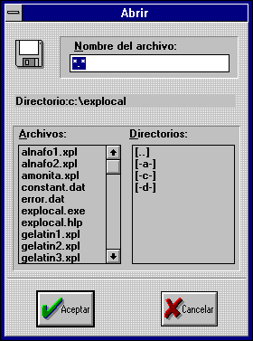{width="2.9166666666666665in"
height="3.9270833333333335in"}

***Figura 6-4: SD_FILEOPEN***

```{=latex}
\addcontentsline{lof}{figure}{Figura 6-4: SD\_FILEOPEN}
```

{width="2.6354166666666665in" height="2.8125in"}

***Figura 6-5: SD_FILESAVEAS***

```{=latex}
\addcontentsline{lof}{figure}{Figura 6-5: SD\_FILESAVEAS}
```

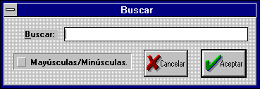{width="3.84375in" height="1.3229166666666667in"}

***Figura 6-6: SD_SEARCH***

```{=latex}
\addcontentsline{lof}{figure}{Figura 6-6: SD\_SEARCH}
```

{width="3.8958333333333335in"
height="1.7604166666666667in"}

***Figura 6-7: SD_REPLACE***

```{=latex}
\addcontentsline{lof}{figure}{Figura 6-7: SD\_REPLACE}
```

{width="3.3541666666666665in"
height="3.9583333333333335in"}

***Figura 6-8: DIALOGO_ACERCA***

```{=latex}
\addcontentsline{lof}{figure}{Figura 6-8: DIALOGO\_ACERCA}
```

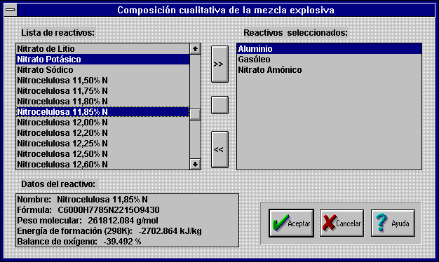{width="6.520833333333333in"
height="3.8958333333333335in"}

***Figura 6-9: DIALOGO_1***

```{=latex}
\addcontentsline{lof}{figure}{Figura 6-9: DIALOGO\_1}
```

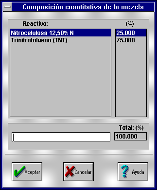{width="3.3645833333333335in"
height="4.072916666666667in"}
{width="3.6041666666666665in"
height="2.8020833333333335in"}

***Figura 6-10: DIALOGO_2 Figura 6-11: DIALOGO_3***

```{=latex}
\addcontentsline{lof}{figure}{Figura 6-10: DIALOGO\_2}
\addcontentsline{lof}{figure}{Figura 6-11: DIALOGO\_3}
```

{width="4.40625in" height="4.291666666666667in"}
{width="3.5in" height="3.3333333333333335in"}

***Figura 6-12: DIALOGO_4 Figura 6-13: DIALOGO_5***

```{=latex}
\addcontentsline{lof}{figure}{Figura 6-12: DIALOGO\_4}
\addcontentsline{lof}{figure}{Figura 6-13: DIALOGO\_5}
```

{width="3.6041666666666665in" height="2.71875in"}

***Figura 6-14: DIALOGO_6***

```{=latex}
\addcontentsline{lof}{figure}{Figura 6-14: DIALOGO\_6}
```

Los diálogos que leen los datos de los reactivos almacenados en el
archivo de texto REACTIVO.DAT (diálogos: DIALOGO_1, DIALOGO_4)

contienen un *cuadro de lista* con los nombres de los reactivos y otro
con los datos de un reactivo.

Cualquier selección (con el rectángulo foco) en la lista de los nombres
de los reactivos, produce que se muestren, en la otra lista, los datos
del reactivo seleccionado.

El *rectángulo foco* marca el elemento del diálogo que, en un momento
dado, recibe los mensajes del usuario. Este rectángulo se debe poder
mover, ordenadamente, por todos los controles con la ayuda del ratón y
sólo con el teclado.

El diálogo de *Preferencias* (véase ***figura 6-14***) modifica el
archivo de inicialización EXPLOCAL.INI.

### Mapas de Bits

Al iniciar la aplicación ***Explocal***, es necesario cargar todos los
datos necesarios para su funcionamiento, situados en los archivos
TABLPROD.DAT, CONSTANT.DAT y ERROR.DAT.

Esta operación lleva cierto tiempo y mientras transcurre: se cambia el
cursor al cursor de espera (reloj de arena) y se muestra un *mapa de
bits* con un logotipo del programa.

El mapa de bits se muestra en la ***figura 6-15***.

{width="4.166666666666667in"
height="4.166666666666667in"}

***Figura 6-15: Mapa de bits.***

```{=latex}
\addcontentsline{lof}{figure}{Figura 6-15: Mapa de bits.}
```

# CODIFICACIÓN

La fase de codificación de la Ingeniería del *software* implica el uso
de un lenguaje particular de programación (en este caso C++) para llevar
adelante el diseño del programa. Esta fase, como las otras, sigue
ciertos principios de la *disciplina de programación*, denominados:

a\) **Programación descendente:** En la que las funciones son más o
menos escritas en orden, desde las rutinas de alto nivel (general) a las
rutinas de bajo nivel (específico), paralelamente al *diseño
descendente* utilizado en la fase de diseño. La programación descendente
tiene la ventaja de ser generalmente mejor para interpretar que la
programación ascendente, puesto que tiende a centrarse en los detalles
individuales y no abarca lo suficiente el diseño del programa.

b\) **Ocupación de la información,** que implica limitaciones en la
"visibilidad" de las funciones y variables para aquellos módulos y
funciones que necesiten la información.

c\) **Nombres con significación** de los objetos del programa
(funciones, variables, estructuras\...). Un identificador debe contener
información intrínseca sobre el propósito del objeto. Por ejemplo la
variable llamada **masa_atomica** es más descriptiva que **ma** ó que
**xj7**.

d\) **Control del programa**, que sigue los siguientes principios:

\- Utilizar una posibilidad de entrada única y de salida

única en todas las funciones.

\- Evitar la sentencia **goto** *(programación espagueti*)

\- limitar la formación de estructuras anidadas **if\...else**.

e\) **Disposición del programa**, que incluye numerosos espacios en
blanco y párrafos consistentes (identación de bloques de sentencias).

f\) **Documentación interna**, que incluye identificadores con
significación (como se mencionó antes) y comentarios explicativos.

g\) **Lista de datos**, que incluye una lista alfabética de objetos de
programa (módulos, funciones, variables, estructuras)

Los listados de los diferentes módulos que componen el código de la
aplicación informática ***Explocal***, se incorporan en los anexos del
proyecto debido a su gran extensión.

Observando el código de cada módulo se puede comprobar la gran
importancia que los principios: a, b, c, d, e, f, han tenido en su
elaboración.

## Características del entorno de desarrollo de *software.*

Las herramientas disponibles para poder construir una aplicación,
influyen notablemente en la codificación.

La utilización de uno u otro lenguaje de programación para llevar a cabo
un proyecto informático es muchas veces determinante de su éxito o
fracaso.

Esta es la principal razón que obliga a conocer en profundidad las
características de un determinado lenguaje de programación, las
bibliotecas de funciones y el entorno gráfico del compilador (o
intérprete).

El contenido de todos los archivos, conteniendo el código de
***Explocal*** se muestran en los anexos del proyecto.

### El lenguaje C

El lenguaje de programación C fue desarrollado en 1972 por *Dennis
Ritchie*, de los laboratorios Bell. La idea principal de Ritchie era
crear un lenguaje de programación de *propósito* *general* que realizara
muchas de las tareas reservadas anteriormente a los lenguajes
ensambladores y con el que resultara fácil de programar. Obtuvo un éxito
admirable mediante la combinación de las ventajas de los lenguajes
compiladores y ensambladores.

El lenguaje C permite un total control del ordenador, tanto a bajo como
a alto nivel (código máquina), por lo que se puede considerar un
lenguaje de alto y bajo nivel.

Su sintaxis es taquigráfica, permitiendo disminuir el número de
caracteres necesario para programar cualquier código.

C incorpora, además, toda la filosofía de la *programación estructurada*
lo que le sitúa por delante de lenguajes no estructurados (con saltos)
tipo BASIC.

### El lenguaje C++

C++ es un superconjunto de C.

El C++ que en un principio se llamó "C con clases" fue desarrollado por
*Bjarne Stroustrup* en los laboratorios Bell de Murray Hill (Nueva
Jersey) en 1980.

En 1983 se le cambió el nombre por el de C++ (que quiere decir
"incremento de C"). Desde entonces ha experimentado dos revisiones de
importancia (una en 1985, y otra en 1989). La versión actual de C++ es
la 2.1, y es la que está implementada en el paquete de la versión *3.1
de C++ de Borland*.

Una de las razones que motivaron el desarrollo de C++ fue la de permitir
al programador, manejar programas de una complejidad cada vez más
creciente.

Aunque C++ se puede aplicar a cualquier tipo de tarea de programación,
está especialmente indicado para crear aplicaciones *Windows*.

Una razón de ello, es que el sistema operativo *Windows* está organizado
de una forma orientada a objetos.

En efecto, de forma muy concreta, una ventana (window en inglés) es un
objeto.

De esta manera, Borland C++ proporciona un entorno óptimo para el
desarrollo de aplicaciones *Windows*.

Puesto que C++ es un lenguaje de programación orientado a objetos y que
*Windows* es un sistema operativo orientado a objetos.

### La programación orientada a objetos (OOP)

La programación orientada a objetos (o más brevemente OOP) es una nueva
forma de abordar el trabajo de programación. Los enfoques de
programación han cambiado drásticamente desde la invención de la
computadora.

La razón principal que ha originado este cambio ha sido atender la
creciente complejidad de los programas: Por ejemplo, cuando se
inventaron las computadoras, la programación se hacía desde el panel de
control de la computadora, donde se introducían las instrucciones de
máquina binarias mediante conmutadores (*toggles*).

Este enfoque funcionó, siempre y cuando los programas no tuvieran más de
unos cuantos centenares de instrucciones de extensión. A medida que
fueron creciendo los programas, se inventó el lenguaje ensamblador, de
modo que un programador pudiera hacer frente a programas cada vez más
grandes y cada vez más complejos, mediante la representación simbólica
de las instrucciones de máquina. A medida que siguieron creciendo los
programas se introdujeron los lenguajes de alto nivel, que le
proporcionan al programador mejores herramientas para manejar dicha
complejidad.

El primer lenguaje de gran difusión fue indiscutiblemente el FORTRAN.
Aunque el FORTRAN fue un impresionante primer paso, no se puede decir
que sea un lenguaje que estimule la preparación de programas claros y
fáciles de entender.

Los años sesenta vieron nacer a la programación estructurada. Este es el
método que preconizan los lenguajes tales como C y Pascal. Por medio de
la utilización de lenguajes estructurados, por primera vez fue posible
escribir con bastante facilidad programas de complejidad moderada. No
obstante, tan pronto como el proyecto alcanza un cierto tamaño, se hace
incontrolable.

Llega un momento en que su complejidad excede a aquélla que puede
manejar un programador aún mediante la programación estructurada.

Consideremos lo siguiente: en cada hito del desarrollo de la
programación, se crearon métodos para permitir al programador trabajar
con una complejidad creciente. En cada paso del camino, un nuevo enfoque
tomó los mejores elementos de los métodos anteriores y avanzó hacia
adelante.

En la actualidad, muchos proyectos se hallan próximos o bien en el punto
mismo a partir del cual el enfoque estructurado ya no tiene validez. Para
resolver este problema, se inventó la programación orientada a objetos.

La programación orientada a objetos ha tomado las mejores ideas de la
programación estructurada y las ha combinado con varios conceptos nuevos
y poderosos, que estimulan a contemplar la tarea de programación bajo un
nuevo prisma. La programación orientada a objetos permite que un
problema se pueda descomponer más fácilmente en subgrupos de partes
relacionadas del mismo problema. Entonces, por medio del lenguaje, se
pueden traducir estos subgrupos en unidades auto contenidas denominadas
objetos.

Todos los lenguajes de programación orientada a objetos tienen tres
cosas en común:

a\) **Los objetos**:

Es la característica individual más importante de un lenguaje de
programación orientada a objetos. Expresado en términos sencillos, **un
objeto es un ente lógico que contiene datos e instrucciones que
manipulan dichos datos**. Dentro de un objeto, parte de las
instrucciones y/o de los datos pueden ser privados (*private*) con
respecto al objeto e inaccesibles a cualquier elemento que esté fuera
del objeto. Otras instrucciones y/o datos pueden ser públicos (*public*)
y por lo tanto accesibles desde otras partes de un programa.

Al hacer privados los elementos confidenciales o delicados, un objeto
puede impedir que cualquier otra parte no relacionada con el programa,
modifique de forma accidental o bien utilice de forma indebida dichos
elementos.

El enlace de las instrucciones junto con los datos de esta manera
especial se conoce como **encapsulamiento**.

b\) **Polimorfismo:**

Los lenguajes de programación orientada a objetos soportan el
polimorfismo, lo que en esencia quiere decir que un mismo nombre puede
ser utilizado para varios propósitos levemente distintos, pero
relacionados entre sí. El polimorfismo permite que se use un nombre para
especificar una clase general de acción. No obstante dependiendo del
tipo de dato con el cual se esté tratando, se ejecutará una instrucción
específica de la clase general.

El C++ presta soporte tanto al polimorfismo en tiempo de ejecución como
en tiempo de compilación puesto que C++ es un lenguaje de compilador.

c\) **Herencia:**

La herencia es un proceso por medio del cual un objeto puede adquirir
las propiedades de otro. Esto es importante porque permite dar soporte
al concepto de clasificación. Sin el uso de las clasificaciones, cada
objeto tendría que definir de forma explícita todas sus características.
No obstante, cuando se necesita definir solamente aquellas cualidades
que hacen que el objeto sea único dentro de su clase. El mecanismo de
herencia es el que se encarga de que un objeto se pueda considerar como
un caso particular de una clase más general.

### La biblioteca de clases *ObjectWindows* (*OWL*)

C++ y Turbo C++ para *Windows* proporciona una biblioteca de clases
llamada *Object* *Windows* que simplifica enormemente la programación
para *Windows.*

Sin una biblioteca semejante, la codificación de aplicaciones *Windows*
se volvería más dificultosa, e incluso frustrante, y precisaría de un
proceso de programación de mayor coste.

La ventaja más sobresaliente de la biblioteca *ObjectWindows* es que
oculta de manera efectiva muchos de los detalles de la programación para
*Windows*, con lo cual se puede concentrar realmente en el esfuerzo en
la creación de programas *Windows*, en vez de tener que detenerse en los
numerosos e intrincados detalles que usualmente están relacionados con
esta labor.

El entorno *Windows* es accesible mediante un interfaz controlado por
medio de llamadas, que se denomina *interfaz de programas de aplicación*
(API). Las, aproximadamente, 1000 funciones de la API efectúan todos los
servicios que proporciona *Windows*.

Por su parte, *Object Windows* es una jerarquía compleja de clases que
viene a encapsular porciones de la API para simplificar la creación de
programas para *Windows.*

No obstante, *Object Windows* siempre utiliza en último término la API
para efectuar todas sus operaciones.

Hay un subsistema de la API que se llama *Interfaz de Dispositivos
Gráficos*

(GDI); es la parte de *Windows* que presta soporte gráfico independiente
de los dispositivos. Las funciones del GDI son las que posibilitan que
una aplicación informática para *Windows* se pueda ejecutar en una
amplia variedad de sistemas diferentes (*hardware*).

El éxito de la biblioteca de clases *Object Windows* se basa en la
implementación de la programación orientada a objetos combinándola con
los procesos de programación basada en eventos que constituye la
filosofía subyacente bajo la programación *Windows.*

Es de hacer notar que: Aunque la creación de aplicaciones informáticas
sofisticadas para *Windows* con la biblioteca OWL requiere algunos
esfuerzos, programar con *Object Windows* es mucho más fácil (y
económico) que usar el tradicional paquete *SDK de Microsoft*.

## Codificación de los módulos

### Archivo de proyecto (EXPLOCAL.PRJ)

El archivo de proyecto de una aplicación contiene toda la información
necesaria para compilar el código ejecutable (\*.EXE), información que
consiste en: las opciones de compilación y enlazado, nombre de los
archivos de recursos, bibliotecas precompiladas, módulos de código
(\*.CPP) y archivo de definición.

El entorno integrado se debe configurara para conseguir que tanto el
compilador como el enlazador generen un código tipo: *Windows EXE*,
empleando un modelo de memoria *Large* (grande) y con instrucciones para
el procesador 80386 con procesador matemático 80387.

Los archivos que forman parte del proyecto de la aplicación informática
***Explocal***, se relacionan en la **tabla 7-1**.

**Tabla 7-1: Contenido del archivo de proyecto.**

  -----------------------------------------------------------------------
  **Nombre del archivo.** **Descripción.**
  ----------------------- -----------------------------------------------
  EXPLOCAL.CPP            Archivo principal: Contiene el código del
                          interfaz de usuario que incluye el archivo de
                          cabecera con los cálculos (CALCULOS.H)

  EXPLOCAL.RC             Archivo de las recursos: Constituye una
                          descripción de los elementos gráficos empleados
                          por el interfaz de usuario.

  BWCC.LIB                Biblioteca precompilada: con las funciones
                          necesarias para incorporar a los diálogos los
                          controles al estilo Borland (BWCC).

  EXPLOCAL.DEF            Archivo de definición: Contiene información
                          técnica acerca de la estructura del archivo
                          ejecutable completo, describe características
                          como el tamaño de la pila local y el nombre de
                          la función gestora de mensajes.
  -----------------------------------------------------------------------

### Relaciones de inclusión entre los módulos principales

En la inclusión de módulos se emplea la inclusión condicional:

***(#if defined\...#endif)*** para evitar incluir el mismo código dos o
más veces y ralentizar el proceso de compilación. Por esta razón cada
módulo define un macro de identificación propio, cuyo nombre es casi
coincidente con el del archivo (por ejemplo el macro identificador del
archivo de cabecera EXPLOCAL.H es \_\_EXPLOCAL_H).

EXPLOCAL.CPP incluye el archivo que contiene los macros empleados en el
código (EXPLOCAL.H) y también el archivo con los cálculos (CALCULOS.H).

Como el cabecero CALCULOS.H necesita acceder a los macros también
incluye a EXPLOCAL.H (aunque se evite la doble inclusión mediante
condiciones), la razón que obliga a que la relación de inclusión se
disponga de este modo es poder independizar lo más posible los dos
módulos principales.

La relación entre los módulos principales se esquematiza en la **figura
7-1**.

***Figura 7-1: Relación entre módulos.***

```{=latex}
\addcontentsline{lof}{figure}{Figura 7-1: Relación entre módulos.}
```

### Utilización de los recursos

*Windows* define como **recursos** varios tipos corrientes de objetos.
Los recursos comprenden elementos tales como menús, iconos, cuadros de
diálogo y gráficos hechos mediante mapas de bits.

Un recurso se crea separadamente del programa, pero se añade al archivo
\*.EXE cuando se efectúa el enlace del programa. Los recursos están
contenidos en los archivos de recursos que poseen una extensión \*.RC.

Los archivos de recursos se pueden crear con cualquier editor de texto

(como el editor del entorno de C++), pero lo habitual es crearlos con el
programa *Resource Workshop* (Taller de recursos).

Los recursos se compilan con un compilador de recursos. El compilador
los transforma en un archivo \*.RES, que se enlaza con el programa. Los
recursos de ***Explocal*** son los que incluyen la información de todos
los elementos comunes diseñados en el apartado **6.3**. Los elementos
que constituyen los recursos de ***Explocal*** se han organizado en
distintos archivos según la **tabla 7-2**.

***Tabla 7-2: Archivos de recursos.***

```{=latex}
\addcontentsline{lot}{table}{Tabla 7-2: Archivos de recursos.}
```

+-------------------+--------------------------------------------------+
| **Nombre del      | **Descripción.**                                 |
| archivo.**        |                                                  |
+===================+==================================================+
| EXPLOCAL.RC       | Archivo principal, incuye todos los demás        |
|                   | archivos.                                        |
+-------------------+--------------------------------------------------+
| MENU.RC           | Menú de la aplicación y teclas aceleradoras.     |
+-------------------+--------------------------------------------------+
| DISCO.ICO         | Iconos gráficos de ***Explocal***.               |
|                   |                                                  |
| APLIC.ICO         | Se muestran en la **figura 6-3**.                |
|                   |                                                  |
| HIJAS.ICO         |                                                  |
+-------------------+--------------------------------------------------+
| KFILEDIA.DLG      | Diálogos de acceso al disco, estándar, y de      |
|                   | entrada de datos.                                |
| KSTDWND.DLG       |                                                  |
|                   | Todos los diálogos se representan en las figuras |
| KINPUTDIA.DLG     | desde la **6-4** a la **6-12**.                  |
|                   |                                                  |
| DIALOGOS.DLG      |                                                  |
+-------------------+--------------------------------------------------+
| EXPLOCAL.BMP      | Mapa de bits: Gráfico que se muestra al cargar   |
|                   | la aplicación. Se puede ver en la figura 6-13    |
+-------------------+--------------------------------------------------+
| VERSION.RC        | Descripción de la versión de ***Explocal***.     |
+-------------------+--------------------------------------------------+
| EXPLOCAL.H        | Archivo que contiene los macros empleados (como  |
|                   | los identificadores de los controles de los      |
|                   | diálogos).                                       |
+-------------------+--------------------------------------------------+

## Componentes de la aplicación MDI

Una aplicación, como ***Explocal***, que cumpla con el estándar MDI
consiste en los siguientes objetos (clases):

a\) El **marco visible** de la ventana MDI, que contiene todos los
restantes objetos MDI.

La ventana marco (**VentanaMarcoMDI**) es un ejemplar de la clase
**TMDIFrame**, o de sus descendientes. Cada aplicación informática MDI
tiene una ventana marco MDI.

b\) La **ventana cliente invisible**, realiza la gestión de trasfondo de
la ventanas hijas MDI que son creadas y destruidas dinámicamente.

Esta ventana cliente MDI es un ejemplar de la clase **TMDIClient**. Cada
aplicación MDI tiene una ventana MDI .cliente.

c\) Las **ventanas hijas MDI** (**VentanaHijaMDI**) dinámicas y visible.
Una aplicación MDI crea y destruye múltiples ejemplares de las ventanas
hijas MDI. Una ventana hija es un ejemplar de la clase **TWindow** o de
sus descendientes. Estas ventanas son posicionadas, movidas,
redimensionadas, maximizadas y minimizadas dentro del área definida por
la ventana marco MDI. En cualquier (mientras exista al menos una ventana
hija MDI), tendremos solamente una ventana hija activa.

Cuando se maximiza una ventana hija MDI, ésta ocupa el área definida
por la ventana marco MDI.

También cuando se minimiza (o se transforma en un icono) una ventana
hija MDI, el icono correspondiente a esta ventana aparece en la parte
inferior de la ventana marco MDI

## Jerarquía de clases del interfaz de usuario

La filosofía de la programación orientada a objetos obliga a encapsular
todos los datos (junto con las funciones que manejan esos datos) en
objetos.

La programación en *Windows* basada en objetos aconseja identificar las
ventanas ( principales, marco MDI, hijas MDI, cuadros de diálogo,
controles\...) y los objetos ( clases).

La definición de las clases se realiza mediante un proceso de herencia a
partir de las clases de la bibliotecas *Object* *Windows*.

La relación o jerarquía entre las clases se representa en la ***figura
7-2**.*

{width="5.302083333333333in"
height="4.208333333333333in"}

***Figura 7-2: Jerarquía de clases del interfaz de usuario MDI.***

```{=latex}
\addcontentsline{lof}{figure}{Figura 7-2: Jerarquía de clases del interfaz de usuario MDI.}
```

A las clases de la ***figura 7-2*** hay que añadir la clase *Explosivo*
definida en el módulo CALCULOS.H e independiente de la jerarquía de las
otras clases.

El propósito de todas las clases definidas por ***Explocal*** se tiene
en cuenta en la ***tabla 7-3***.

***Tabla 7-3: Propósito de las clases definidas para Explocal.***

```{=latex}
\addcontentsline{lot}{table}{Tabla 7-3: Propósito de las clases definidas para Explocal.}
```

+-----------------+----------------+-------------------------------------------+
| **Nombre de la  | **Descendiente | **Propósito**                             |
| clase:**        | de:**          |                                           |
+:===============:+:==============:+===========================================+
| VentanaHijaMDI  | TEditWindow    | Constituye una con un **editor de         |
|                 |                | texto**, que incluye todas las funciones  |
|                 |                | necesarias para manejar el texto y los    |
|                 |                | datos de un explosivo, así como la        |
|                 |                | impresión de los resultados por impresora |
|                 |                | o pantalla.                               |
|                 |                |                                           |
|                 |                | Además se encarga de responder a todas    |
|                 |                | las funciones del menú relativas a la     |
|                 |                | ventana hija activa.                      |
+-----------------+----------------+-------------------------------------------+
| VentanaMarcoMDI | TMDIFrame      | Realiza el manejo de las **funciones del  |
|                 |                | menú** y de las ventanas hijas, es la     |
|                 |                | ventana principal de la aplicación. Es de |
|                 |                | hacer notar que la gestión de trasfondo   |
|                 |                | de la aplicación la realiza la clase      |
|                 |                | *TMDIClient* con la que la *ventana       |
|                 |                | marco* intercambia información.           |
+-----------------+----------------+-------------------------------------------+
| Dialogo_Base    | TDialog        | Diálogo que incorpora las funciones del   |
|                 |                | manejo de los datos del archivo de        |
|                 |                | reactivos: REACTIVO.DAT                   |
+-----------------+----------------+-------------------------------------------+
| Dialogo1        | Dialogo_Base   | Añade las funciones y los controles para  |
|                 |                | introducir la composición cualitativa de  |
|                 |                | la mezcla.                                |
+-----------------+----------------+-------------------------------------------+
| Dialogo2        | TDialog        | Añade las funciones y los controles para  |
|                 |                | introducir la composición cuantitativa de |
|                 |                | la mezcla: El porcentaje en peso de cada  |
|                 |                | reactivo.                                 |
+-----------------+----------------+-------------------------------------------+
| Dialogo3        | TDialog        | Añade las funciones y los controles para  |
|                 |                | introducir los datos adicionales:         |
|                 |                | densidad inicial y nombre de la mezcla.   |
+-----------------+----------------+-------------------------------------------+
| Dialogo4        | Dialogo_Base   | Modifica la lista de reactivos.           |
+-----------------+----------------+-------------------------------------------+
| Dialogo5        | TDialog        | Introduce los datos de un nuevo reactivo. |
+-----------------+----------------+-------------------------------------------+
| Dialogo6        | TDialog        | Preferencias, accede al archivo           |
|                 |                | EXPLOCAL.INI                              |
+-----------------+----------------+-------------------------------------------+
| AplicacionMDI   | TApplication   | Clase principal de la aplicación, se      |
|                 |                | encarga de manejar el resto de las clases |
|                 |                | y de acceder a la biblioteca de enlace    |
|                 |                | dinámico con los controles al estilo      |
|                 |                | *Borland (BWCC.DLL)*.                     |
+-----------------+----------------+-------------------------------------------+

# COMPROBACIÓN[]{.indexref entry="COMPROBACIÓN"}

La fase de comprobación dentro de la Ingeniería del *software* implica
asegurarse de que cada función trabaja como se espera que se haga
(*depuración*) y que todo el sistema de *software* cumple con las
especificaciones dadas en los documentos de requisitos (*cumplimiento de
objetivos*).

La fase de comprobación comienza con la corrección de los errores
sintácticos en la escritura del código y termina con el ajuste de las
características de la aplicación en su conjunto.

En la versión Beta de ***Explocal***, incluida en los discos anexos al
proyecto, se ha realizado una primera comprobación, tanto de los
resultados del cálculo como del *interfaz de usuario*, suficiente para
garantizar un funcionamiento libre de errores.

## Depuración de errores

Para aproximarse a la depuración, es necesario en primer lugar, evitar
errores utilizando disciplinas de programación apropiadas y tener
conocimiento de los errores potenciales.

En la **tabla 8-1** se muestran algunos errores comunes, que se pueden
evitar fácilmente mientras se escribe el código; prestando un poco de
atención se puede ahorrar mucho tiempo en el proceso de comprobación:

***Tabla 8-1: Errores comunes.***

```{=latex}
\addcontentsline{lot}{table}{Tabla 8-1: Errores comunes.}
```

+-----------------------------------------------------------------------+
| Uso del signo de asignación igual ('=') en lugar del signo lógico de  |
| comparación ('==').                                                   |
+=======================================================================+
| Llamada a una función con argumentos que no sean enteros antes de     |
| haberla definido o declarado, u olvidando el uso necesario de los     |
| ficheros de cabecera (.H)                                             |
+-----------------------------------------------------------------------+
| Uso de los tipos **char** (con signo) con códigos extendidos de       |
| pantalla o teclado. Por ejemplo, el código de byte auxiliar de IBM    |
| para **Alt-0** es 129, pero este valor se interpreta como -127 por    |
| ser de tipo **char** ( con signo).                                    |
|                                                                       |
| Hay que usar unsigned char o int siempre que esté implicado un código |
| de pantalla o del teclado.                                            |
+-----------------------------------------------------------------------+
| Uso de un punto y coma al final de la sentencia **for**,              |
| **do\...while** o **while**.                                          |
+-----------------------------------------------------------------------+
| Uso de punto y coma al final de una directiva **#define**. El punto y |
| coma se convierte en parte de la cadena a sustituir.                  |
+-----------------------------------------------------------------------+
| Intento de asignar una cadena constante a un *array* de cadena        |
| empleando una sentencia de asignación en vez de **strcpy**.           |
+-----------------------------------------------------------------------+
| Confusión entre las cabeceras STDIO.H y STDLIB.H                      |
+-----------------------------------------------------------------------+
| Confusión entre el operador Y bit a bit '&' y el operador lógico Y    |
| '&&'                                                                  |
+-----------------------------------------------------------------------+
| Asignación de un valor a una expresión.                               |
|                                                                       |
| var++=15; // \*\*Error\*\*                                            |
+-----------------------------------------------------------------------+
| Uso del índice 1 en el primer elemento de un matriz o vector          |
| (*array*) . En C todas las matrices comienzan en el elemento 0        |
+-----------------------------------------------------------------------+

## Archivos ejemplo

En los anexos del proyecto se incluyen una serie de resultados que han
sido obtenidos con la versión final de ***Explocal***.

Todos los ejemplos se incluyen, como archivo de ***Explocal*** (\*.XPL),
en el disco de instalación de la versión Beta 1.0.

En los ejemplos, se ha procurado incluir por lo menos un ejemplo de cada
tipo de explosivo industrial, como:

\- ANFOs.

\- ALNAFOs.

\- Dinamitas.

\- Explosivos de seguridad de intercambio iónico.

\- Gelatinas.

\- Emulsiones.

Los archivos ejemplo cumplen dos importantes misiones: ayudar a la
comprobación exhaustiva del programa y servir de herramienta de aprender
a manejar ***Explocal.***

# MANTENIMIENTO DEL SOFTWARE

El mantenimiento de una aplicación informática conlleva: corregir los
fallos de programación después de estudiar la fase de comprobación,
ajustar los requisitos y mejorar las funciones del programa.

**Nunca se termina un proyecto de programación definitivamente**,
ninguno de los principales sistemas de software está **totalmente**
libre fallos.

Además, el *software* está en constante evolución y debe adaptarse tanto
a las nuevas tecnologías (ordenadores más potentes, progresos en los
gráficos, nuevos sistemas operativos, dispositivos de entrada
alternativos, etc.) como a las nuevas necesidades de los usuarios.

Aunque ***Explocal*** (versión Beta 1.0) es un programa completo y libre
de fallos, antes de ser comercializado necesita un replanteamiento de
los requisitos y una posterior comprobación exhaustiva de todas las
funciones de la aplicación informática.

Entre las posibles mejoras, ampliaciones y añadidos se pueden considerar
las siguientes:

\- **Traducción a otros idiomas**: Se puede conseguir sin ni siquiera
tener una copia del código C++ de la aplicación, puesto que todas las
cadenas de caracteres se almacenan en los recursos (EXPLOCAL.RC y sus
módulos de inclusión) y se pueden modificar con la aplicación *Resource
Workshop* accediendo directamente al archivo ejecutable ( EXPLOCAL.EXE).

\- **Actualización a *Windows* 95:** Se necesita cambiar el interfaz de
usuario (EXPLOCAL.CPP), dejando intacto el módulo de los cálculos.

La actualización está facilitada por la modularidad del programa y
dificultada por la necesidad de emplear una nueva biblioteca C++ para
*Windows* 95.

Las nuevas bibliotecas para la programación en *Windows* 95, no
coinciden en líneas generales con las de *Windows* 3.1, por lo que la
actualización obliga a cargar con: los costes de adquisición de una nueva
versión del compilador, los costes de aprendizaje de las funciones de la
nueva biblioteca y los costes de codificación.

\- **Actualización de los datos:** (previa consulta de otras fuentes de
información) : Sólo es necesario modificar adecuadamente los archivos de
texto con los datos (\*.DAT) con cualquier procesador de textos.

\- **Mejora del procesador de textos:** de modo que se permita emplear
texto con formato ( con subíndices, negrita, cursiva, cambio de
tamaño\...).

Cualquier cambio, como este, del procesador de textos que no se pueda
realizar modificando la funcionalidad de la clase *TEditWindow* de la
biblioteca *Object Windows*, requiere un remodelado completo del bloque
del interfaz de usuario. Sólo se podría reutilizar el módulo de
cálculos.

\- **Mejoras en el proceso de impresión**: La impresión de textos en
***Explocal*** funciona al más bajo nivel posible. Se pueden utilizar
las clases *TPrintout, TPrinter, TPrinterSetupDlg* y *PrinterAbortDlg* (
proporcionadas en uno de los ejemplos que se proporcionan con el
compilador de *Borland C++*), para poder detener el proceso de impresión
y configurar la impresora.

# CONCLUSIONES[]{.indexref entry="CONCLUSIONES."}

Una vez terminada la fase de comprobación de ***Explocal*** se configura
adecuadamente el programa de instalación y de este modo se obtiene la
aplicación final, que viene incluida, en soporte electromagnético, junto
al resto de los documentos del proyecto.

La versión de ***Explocal***, con la que se da por "concluido" el
proyecto, es una versión de la denominadas Beta y por lo tanto no es
definitiva.

Como ya se hizo notar, el desarrollo de una aplicación informática no
termina **nunca** ( siempre se puede modificar, mejorar, adaptar\...) y
es necesario cortar el proceso cíclico de desarrollo, una vez rebasado
cierto punto.

El desarrollo de la versión Beta de cualquier aplicación informática
constituye una etapa intermedia entre el desarrollo del *software* y su
comercialización.

A partir de la versión Beta se puede tomar la decisión final, de tipo
económico, sobre si se puede comercializar o no la aplicación, o en caso
de estar desarrollando el programa por encargo de un cliente, si el
resultado final es satisfactorio o no lo es.

A la versión Beta se le pueden añadir nuevas funciones, siguiendo, otra
vez, las etapas de: requisitos, codificación y mantenimiento.

En la fase de mantenimiento ya se han perfilado las posibles mejoras y
cambios que se pueden realizar a ***Explocal***.

La versión Beta de ***Explocal***, sin ninguna mejora añadida,
constituye por sí sola una aplicación lista para ser empleada en la
determinación de las características teóricas de los explosivos.

***Explocal*** proporciona una primera aproximación al proceso de la
detonación en cualquier mezcla explosiva.

El método de cálculo que incorpora es un método simplificado y ha sido
incluido por AENOR en la norma UNE 31-002-94 \[1\].

Es de destacar que el programa realiza un estudio a volumen constante y
trabaja, en consecuencia, en la rama de las detonaciones de la Hugoniot,
por lo que no es válido para el estudio de las deflagraciones ( además
las deflagraciones se producen a baja velocidad y habría que tener en
cuenta fenómenos de difusión térmica que desvirtúan por completo la
metodología empleada.)

En el desarrollo de la aplicación informática ***Explocal*** se ha
cuidado al máximo el *interfaz de usuario*, es decir, la forma que tiene
la persona que utilice el programa de acceder a la información que este
contiene y manejarlo.

El *interfaz de usuario* de ***Explocal*** está constituido por una
serie de elementos gráficos ( como: menús, cuadros de diálogo, iconos,
mapas de bits, botones\...) que además de conseguir dar un aspecto
atractivo a ***Explocal*** le proporcionan la ventaja de ser muy
sencillo de manejar.

Pero ***Explocal*** no es una aplicación informática aislada del resto
sino, por el contrario, una aplicación que puede compartir información
con el resto del entorno *Windows.* Es de destacar, llegado a este
punto, que ***Explocal*** puede copiar los resultados de cualquier
cálculo en el *portapapeles*, desde donde se puede enviar a otras
aplicaciones como procesadores de texto u hojas de cálculo.

Aunque desarrollada para la versión de *Windows 3.1*, ***Explocal***
puede funcionar, sin problemas, en versiones superiores como la *3.11
para Trabajo en Grupo* o la, más moderna aún, *Windows* 95

# REFERENCIAS[]{.indexref entry="REFERENCIAS."} {-}

\[1\] UNE 31-002-94 Cálculo de las principales características teóricas
de los explosivos.

\[2\] Sanchidrián Blanco, J.Ángel: "Cálculo de las principales
características teóricas de los explosivos" en Memorial de
ingeniería de armamento, nº 124 ·3^er^ Trimestre 1991

\[3\] KAMLET, Mortimer.J. y JACOBS, S.J, "Chemistry of Detonations"

\(1968\) en The Journal of Chemical Physics, Vol. 48 nº 1
(1 enero)

pp. 23-50.

\[4\] FORUM ATÓMICO ESPAÑOL (1991): Tabla periódica de los
elementos. *FAE (Madrid).*

\[5\] JANAF (1971): Thermochemical Tables. *Office of
Standard Reference Data, National Bureau of Standards. Washington, D.C.*

\[6\] LIDE, David R. (1989): CRC Handbook of Chemistry and
Physics. *CRC Press Inc., Boca Raton (Florida)*

\[7\] MEYER, R. (1987): Explosives. *VCH
Verlagsgesellschaft mbH. Weinheim, (Alemania).*

\[8\] TSIPKIN, G.G y TSIPKIN, A.G. (1988): Fórmulas
Matemáticas Algebra Geometría Análisis
matemático. *Mir, Moscú.*

\[9\] MADER, C.L. (1963): Detonation Properties of
Condensed Explosives Computed Using the
Becker-Kistiakowsky-Wilson Equation of State. Report
LA-2900. *Los Alamos Scientific Laboratory*

*\*

# BIBLIOGRAFÍA[]{.indexref entry="BIBLIOGRAFÍA."} {-}

\- ADAMS, Lee (1994): Programación avanzada de gráficos
en C para Windows. *Windcrest McGraw-Hill, Madrid.*

\- AGUILAR, F. (1972): Los explosivos y sus aplicaciones.
*Servicio de Publicaciones de la J.E.N., Madrid.*

\- CLEMENT SHAMMAS, Namir (1993): Guía de programación en
Windows. Librería ObjectWindows. *Anaya Multimedia,
Madrid.*

\- COOK, M.A. (1985): The Science of High Explosives.
*Robert E. Krieger Publishing Company, Malabar (Florida).*

\- FICKETT, W. y DAVIS, W. C. (1979): Detonation.
*University of California Press, Berkeley y Los Angeles.*

\- FRANCO GARCÍA, Ángel (1995): Desarrollo avanzado de
aplicaciones Windows con Borland C++ 4.0 y ObjectWindows
2.0 *McGraw-Hill, Madrid.*

\- JOHANSSON, C.H. y Persson, P.A. (1970), Detonics of
High Explosives. *Academic Press, Inc.*

\- KERNIGHAN, Brian W. y RITCHIE, Dennis M. (1985) : El
lenguaje de programación C. *Prentice Hall,
Barcelona*.

\- MADER, C. L., (1979): Numerical Modeling of
Detonations. *University of California Press, Berkeley y
Los Angeles.*

\- SAWTELL, Christopher (1993): Syllabus for the C Language
Course *chris@gerty.equinox.gen.nz. correo electrónico,
Linwood (Nueva Zelanda)*

\- SCHILDT, Herbert (1994): Aplique Turbo C++ para Windows
. *Osborne McGraw-Hill, Madrid*.

\- THORIN, Marc (1987): Ingeniería del software.
*Paraninfo, Madrid*

\- ZIMMERMAN, Scott y B. ZIMMERMAN, Beverly (1990): La biblia del TURBO
C. Fundamentos y técnicas avanzadas de
programación. *Anaya Multimedia, Madrid*

[^1]: Nota: Como v=1/ρ(kg/m^3^), la ecuaciones H-R se pueden expresar en
    función de la densidad, en vez del volumen específico.

[^2]: Nota I: Los tres últimos productos de explosión C, CO y H~2~, sólo
    se considera que se producen en explosivos deficitarios en oxígeno.

    Nota II: En la tabla se indican las diferencias entre los productos
    de explosión y de los productos para el cálculo del balance de
    oxígeno.

    Fuentes: Forum Atómico Español \[4\] (masa atómica) y UNE 31-002
    \[1\]

[^3]: **Nota I**: Los tres últimos productos de explosión, sólo se
    pueden producir en explosivos deficitarios en oxígeno, y no se
    consideran asociado a ningún elemento. Esta circunstancia implica
    que, en realidad esta tabla se pueda considerar como dos tablas
    unidas: una de productos de explosión y otra de elementos.

    **Nota II**: El programa ***Explocal*** necesita acceder a ciertas
    posiciones de la tabla, esto obliga a conservar el orden de las
    entradas de la tabla.

    **Nota III**: Los productos con Tvaporización \> 6000 K, se
    consideran sólidos o líquidos en el intervalo 298 K - 6000 K
    atendiendo al criterio de la norma UNE 31-002 \[1\], aunque existan
    casos como el grafito que sublima 3925 K, o los carbonatos que se
    descomponen al alcanzar cierta temperatura.

    **Nota IV**: Fuentes:

    Forum Atómico Español \[4\] (masa atómica)

    JANAF \[5\] y Lide, David R. \[6\] (resto de los datos)

[^4]: Nota I: Las constantes de equilibrio tabuladas corresponden a las
    dos reacciones siguientes:

    CO~2~ + H~2~ ⇔ CO + H~2~O

    K~1~ = PCO · PH~2~O / PCO~2~ · PH~2~

    CO~2~ + C ⇔ 2 CO

    K~2~ = PCO^2^ / PCO~2~

    Nota II: La constante K~1~ es adimensional a diferencia de K~2~ que
    tiene dimensiones de presión.

    Nota III: El programa ***Explocal*** incorpora los datos de la norma
    UNE 31-002 \[1\] .

[^5]: Nota I: En la norma UNE 31-002 \[1\], pág. 10, define las
    condiciones normales para el cálculo del volumen de gases a
    1,013·10^5^ Pa, pero a 298 K, para posteriormente calcular el
    volumen de gases con 273,15 K. En todos los cálculos termodinámicos,
    la norma, emplea como estado de referencia 298 K, aunque en la
    definición del *volumen de gases en condiciones normales* de la pág
    3, usa 273,15 K. Se trata, sin duda de una errata de AENOR.

    Nota II: La norma UNE 31-002 \[1\], tampoco advierte a que
    temperatura se debe considerar el estado de agregación de los
    productos de explosión: Si a la temperatura de explosión o a la
    temperatura normal.

[^6]: Nota I: Las dimensiones del factor φ en la figura son: φ ( J^1/2^
    ·mol^1/2^ · kg^-1^ )

    Nota II: P (GPa) = K~p~ · ρ~o~ ^2^ (g/cm^3^) · φ ( J^1/2^ ·mol^1/2^
    · kg^-1^) ; siendo: K~p~ = 7.617 · 10^-4^

[^7]: Nota I: Las dimensiones del coeficiente φ en la figura son:
    φ( J^1/2^ ·mol^1/2^ · kg^-1^ )

    Nota II: D (m/s) = a · ( 1.0 + b · ρ~o~ (g/cm^3^) ) ·φ^1/2^ ( J^1/2^
    ·mol^1/2^ · kg^-1^); a=22,33; b=1,3;
