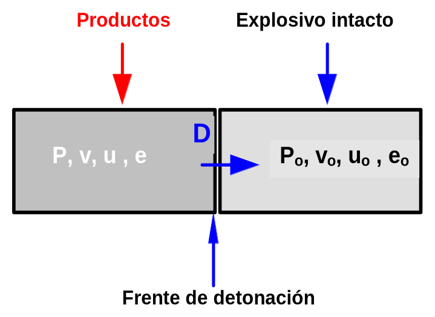
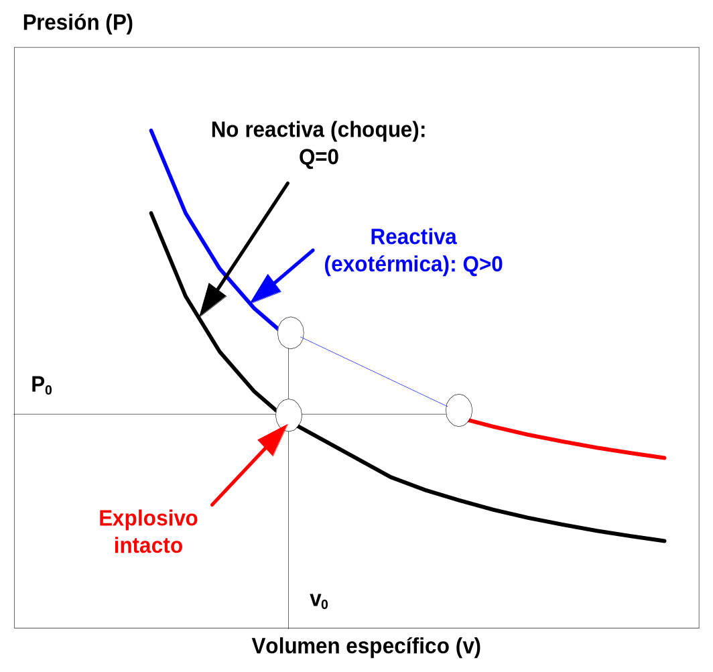
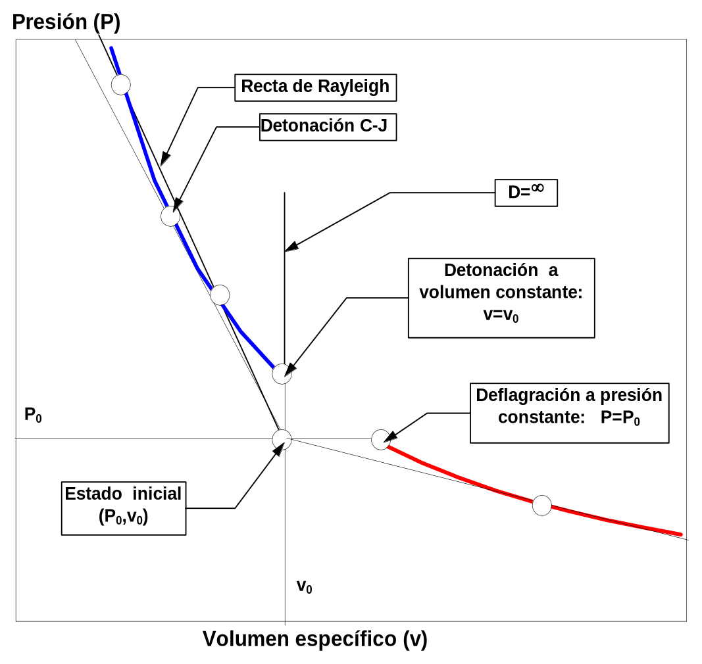
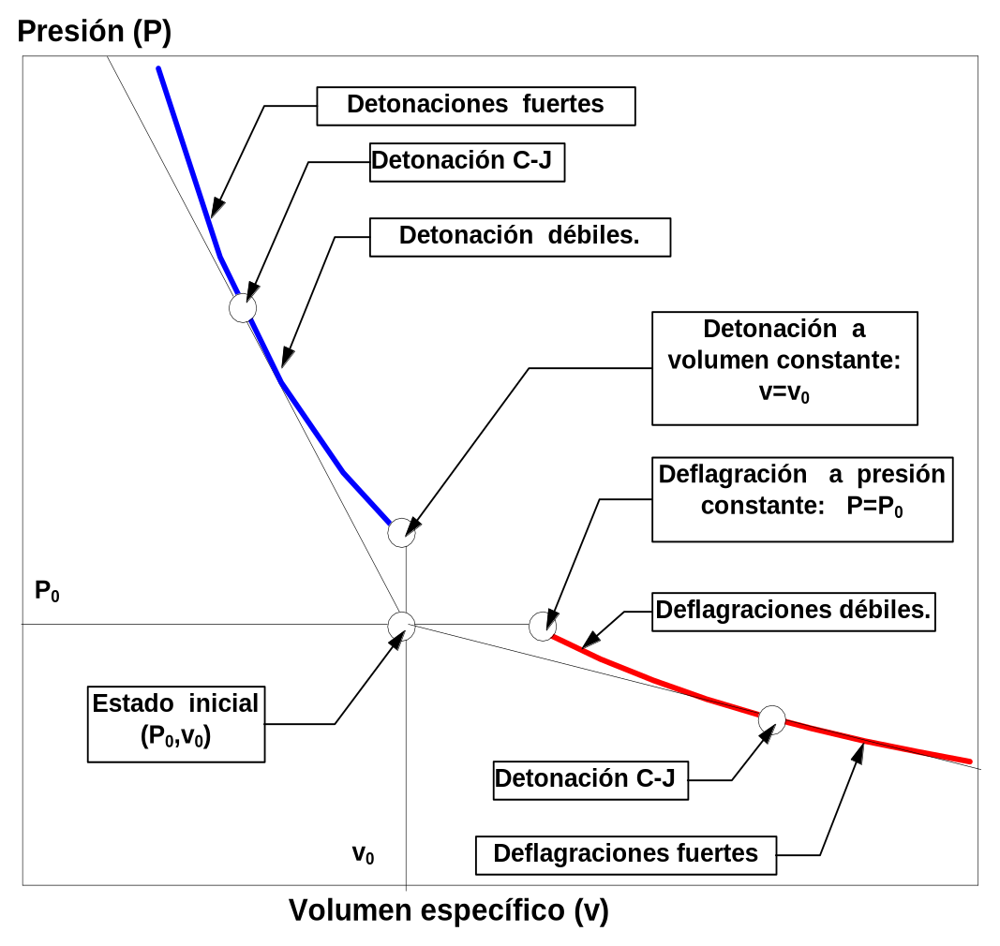
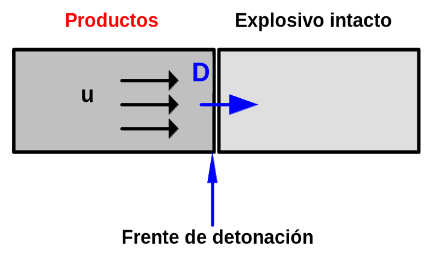
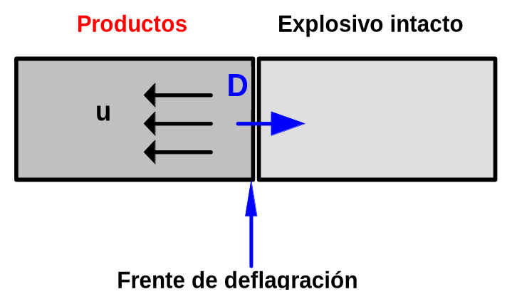

# 2. Introducción a la teoría de la detonación

## 2.1 Definiciones

**Balance de Oxígeno:** Cantidad de oxígeno que sobra o falta a una
mezcla explosiva para oxidar *completamente* todos los elementos
químicos que la componen, salvo el nitrógeno que se supone inerte,
expresada en tanto por ciento en peso. Es negativo (deficitario) si
falta y positivo (excedentario) si sobra.

**Calor de Explosión:** Máxima energía que se puede liberar en la
reacción de un explosivo. Se trata de la característica más importante
de un explosivo, puesto que representa la capacidad del explosivo para
generar choques e impartir movimiento al medio en el que está confinado,
es decir su poder energético.

**Coeficiente Adiabático:** Disminución de la presión, respecto a un
aumento de volumen manteniendo la entropía constante. En los gases
ideales es igual a la relación entre calores específicos.

**Densidad Inicial:** Densidad de la mezcla explosiva intacta, es decir,
antes de sufrir el proceso de explosión. Se denomina a veces densidad
del encartuchado (o del granel).

**Detonación:** Proceso de explosión en el cual se produce flujo de
productos de reacción, inducido por la propagación de la onda de
reacción de velocidad supersónica respecto al material intacto.

**Detonación Ideal:** Detonación con un frente de onda plano (diámetro
infinito), en el que la reacción se produce instantáneamente en el
frente de discontinuidad (entre reactivos y productos), y se mueve a
velocidad constante (de forma estacionaria).

**Deflagración:** Proceso de explosión en el cual la onda de reacción se
propaga a una velocidad inferior a la del sonido en el material sin
reaccionar o intacto.

**Estado Chapman-Jouguet o Estado C-J:** Estado que alcanzan los
productos en una detonación en régimen estacionario, en el instante de
completarse la reacción.

**Explosivo:** Sustancia susceptible de sufrir una explosión.

**Explosión:** Proceso por el cual una sustancia se transforma
bruscamente en productos, en su mayor parte en estado gaseoso, con una
velocidad de transformación suficientemente alta, de forma que los
productos se encuentran a presiones y temperaturas elevadas.

**Presión de Detonación:** Presión en el estado C-J (Chapman-Jouguet).
Difiere de la presión a volumen constante.

**Temperatura de Explosión:** Temperatura que alcanzan los productos de
explosión considerando que la energía liberada (calor de explosión) se
invierte exclusivamente en calentar los productos de reacción.

**Velocidad de Detonación:** Velocidad de propagación de la onda de
detonación.

**Volumen de gases en condiciones normales:** Volumen que ocuparían los
productos gaseosos de la explosión (de 1 kg de explosivo) a una
temperatura de 273,15 K (0 ºC) y a una presión de 1,013 · 10 ^5^ Pa (1
atm).

## 2.2 Detonación ideal

Para que se produzca la detonación de una sustancia deben concurrir, dos
fenómenos fundamentales: una *reacción exotérmica* y una *onda de
choque*.

Cuando el frente de la onda de choque alcanza a la sustancia explosiva,
produce una activación del explosivo (debido a una compresión) que
reacciona exotérmicamente y a gran velocidad, liberándose energía
suficiente para mantener la onda de choque.

La detonación es por lo tanto un proceso automantenido, que continúa
mientras no se haya agotado todo el explosivo.

Debido a que el proceso de detonación es un proceso de gran complejidad
es necesario despreciar los factores que influyen en él en menor medida,
aunque sin perderlos de vista.

La detonación ideal, se representa en la ***figura 2-1*** y supone que
el frente de detonación (de forma plana) se mueve hacia el explosivo
intacto a una velocidad constante **D**.

{#figura-2-1}

La onda de choque activa el explosivo intacto (que posee unas propiedades
de volumen específico **v~0~**, velocidad másica **u~0~**, energía
interna específica **e~0~** y presión **P~0~**) y se transforma en los
productos (con propiedades **v**, **u**, **e**, **P**).

## 2.3 Ecuaciones de Hugoniot - Rankine

Aunque originalmente fueron deducidas para *choques no reactivos* (es
decir: onda de choque pero sin reacción exotérmica) son perfectamente
aplicables a choques reactivos (y por lo tanto a detonaciones).

Las *ecuaciones de Hugoniot - Rankine* se basan en aplicar las
condiciones de conservación: de la masa (2-1), de la cantidad de
movimiento (2-2) y un balance de energía (2-3) a un dominio que englobe
al frente de detonación.

$$\dfrac{D-u}{v} = \dfrac{D-u_0}{v_0}
\tag{2-1}$$

$$\dfrac{(D-u_0)\cdot(u-u_0)}{v_0} = P - P_0
\tag{2-2}$$

$$E(P,v) - E_0(P_0,v_0) = -\dfrac{1}{2}\cdot(P+P_0)\cdot(v-v_0)
\tag{2-3}$$

donde:

| Variable | Significado |
|---|---|
| **D** | Velocidad de detonación, en (m/s). |
| **u~0~** | Velocidad inicial del explosivo, en (m/s), el caso típico es el de un explosivo inicialmente en reposo: **u~0~=0**. |
| **u** | Velocidad de los productos de explosión. |
| **v~0~** | Volumen específico inicial (o de encartuchado), en (m^3^/kg). |
| **v**[^cap2-1] | Volumen específico de los productos de explosión, en (m^3^/kg). |
| **P~0~** | Presión inicial, en (Pa) (como por ejemplo 1 atm). |
| **P** | Presión de los productos de detonación, en (Pa). |
| **E~0~** | Energía interna del explosivo intacto, en (J/kg), es una función de estado que, en general, depende de la presión y del volumen específico: **e~0~=e~0~ (P~0~,v~0~)**. |
| **E** | Energía interna de los productos de explosión, en (J/kg), es una función de estado que depende de la presión y del volumen específico y en la mayoría de los casos difiere de e~0~, puesto que la naturaleza de los productos difiere de los reactivos: **e=e (P,v)**. |
| **Q** | Calor de reacción (de explosión), en (J/kg) es la diferencia de energía de formación entre reactivos (explosivo) y producto. Si tomamos el estado **(P~0~,v~0~)**, como estado de referencia es la diferencia de energía interna entre reactivos y productos en dicho estado: **Q** = **e(P~0~,v~0~) - e~0~ (P~0~,v~0~)**. |

Para que el calor de reacción aparezca explícitamente en (2-3), sólo hay
que sumar y restar **e(P~0~,v~0~)** al primer término de (2-3), de este
modo sustituyendo el valor de **Q**, en función de la diferencia de
energías de formación entre explosivo y productos de detonación
(suponiendo, que el explosivo está inicialmente en el estado normal
de referencia y en reposo), se tiene:

$$\dfrac{D-u}{v} = \dfrac{D}{v_0}
\tag{2-4}$$

$$\dfrac{D\cdot u}{v_0} = P - P_0
\tag{2-5}$$

$$E(P,v) - E(P_0,v_0) = \dfrac{1}{2}\cdot(P+P_0)\cdot(v_0-v) + Q
\tag{2-6}$$

En (2-6), se puede observar, como a volumen constante (**v=v~0~**): El
calor de la reacción se invierte en aumentar la energía interna de los
productos.

Las ecuaciones de *Hugoniot - Rankine,* constituyen un sistema de tres
ecuaciones con cuatro incógnitas (si no contamos con la composición de
los productos de explosión).

El sistema tiene por lo tanto un grado de libertad.

## 2.4 Curva de Hugoniot

Se denomina curva de *Hugoniot - Rankine* (o «*hugoniot*»), a cualquier
representación de una variable de detonación en función de otra.

En lo que sigue se va a emplear **hugoniots P-v** (presión - volumen
específico).

Si se observa la expresión (2-6), la **hugoniot P-v** debe tener forma
similar a una hipérbola (no es igual, porque el primer miembro no es
constante).

En un choque no reactivo: **Q = 0**, en el estado a volumen constante:
**v~0~ = v**,

(2-6) se reduce a:

$$e(P,v_0) - e(P_0,v_0) = 0 \Leftrightarrow P = P_0
\tag{2-7}$$

Esto significa que la curva pasa por el punto: **(P~0~,v~0~)**, es decir
el estado inicial es compatible con los posibles estados de choque.

En cambio en un *choque reactivo exotérmico* (como una detonación):
**Q\>0**,

y como la energía interna es una función creciente de **P**, se tiene
que:

$$e(P,v_0) - e(P_0,v_0) = Q > 0 \Leftrightarrow P > P_0
\tag{2-8}$$

Estas conclusiones se representan gráficamente en la ***figura 2-2***.

{#figura-2-2}

## 2.5 Recta de Rayleigh

Si se elimina la velocidad másica **u** de (2-4) y (2-5), se obtiene:

$$\dfrac{P-P_0}{v-v_0} = -\left[\dfrac{D}{v_0}\right]^2
\tag{2-9}$$

que se puede considerar como un haz de rectas, que pasa por el punto
**(P~0~,v~0~)**, y con una pendiente variable función del parámetro
**D** (velocidad de reacción).

Estas rectas se denominan *rectas de Rayleigh.*

Como el segundo miembro de la expresión (2-9) es siempre negativo, se
deduce que son imposibles los estados en los que **v\>v~0~** y además
**P\>P~0~**. Sólo son admisibles dos opciones (véase en la ***figura
2-3***):

a\) **v≤v~0~** y **P\>P~0~** (que corresponde a las detonaciones.)

b\) **v\>v~0~** y **P≤P~0~** (deflagraciones.)

En las ***figuras 2-2**, **2-3** y **2-4***, se puede ver como la
presencia del calor de explosión exotérmico: aleja la hugoniot del
estado inicial del explosivo, y además: divide la curva en dos ramas
diferentes, separadas por un tramo de estados incompatibles que está
limitado por los estados a volumen y presión constante.

Como se puede apreciar en la ***figura 2-3***, en general cada *recta de
Rayleigh* corta a la hugoniot en **dos puntos**.

Excepto cuando la *recta es tangente* a la *hugoniot*.

El estado de *detonación a volumen constante* implica una pendiente de
90 º, o lo que es lo mismo una *velocidad de detonación infinita*
(**D=∞**). Esta razón obliga a pensar que el estado a volumen constante
es un estado sin existencia real, aunque de gran interés teórico.

El estado de reacción a presión constante, por el contrario, es la
intersección de una recta de Rayleigh horizontal que implica una
velocidad de reacción nula: **D=0**.

En la rama de las deflagraciones las ondas de reacción poseen
propiedades cualitativas similares a las ondas de combustión ordinaria.
De hecho, las temperaturas de llama se calculan mediante un análisis a
presión constante.

Aunque para estudiar las ondas de deflagración, se debe tener en cuenta,
que: los *fenómenos de transmisión del calor* y de *difusión de materia*
no son despreciables, por lo que la rama de las deflagraciones de la
hugoniot, no constituye una buena aproximación de lo que acontece en
cualquier deflagración.

{#figura-2-3}

## 2.6 El estado de Chapman-Jouguet (CJ)

En la ***figura 2-3*** se comprueba como de todos los estados de
detonación posibles, existe uno en el que la velocidad de detonación es
mínima, denominado estado C-J. Precisamente corresponde al punto donde
una de las *rectas de Rayleigh* es tangente a la *hugoniot*.

Se puede comprobar de forma experimental como los explosivos, en régimen
próximo al ideal, poseen una velocidad de detonación única que
corresponde con la calculada por la condición de tangencia (denominada
*condición de Chapman-Jouguet*).

Sin aportar una demostración teórica, debido a la brevedad de este
trabajo, se debe recalcar que: las detonaciones CJ son las únicas que
tienen posibilidad de propagarse de forma estacionaria.

El estado CJ de las detonaciones presenta las siguientes propiedades:

a\) La recta de Rayleigh y la hugoniot son tangentes (y la velocidad de
detonación es mínima):

$$\left(\dfrac{\partial P}{\partial v}\right)_{Hug.} = \dfrac{P-P_0}{v-v_0} = -\left(\dfrac{D}{v_0}\right)^2
\tag{2-10}$$

b\) La hugoniot es tangente a la isentrópica de los productos.

c\) El frente de detonación se aleja de los productos a una velocidad
**c** que coincide con la del sonido propagándose en los productos de
detonación; siendo:

$$c^2 = \left(\dfrac{\partial P}{\partial \rho}\right)_S = -v^2 \cdot \left(\dfrac{\partial P}{\partial v}\right)_S
\tag{2-11}$$

## 2.7 Tipos de detonaciones y deflagraciones

En la rama de las deflagraciones, de la condición de tangencia entre la
hugoniot y la *recta de Rayleigh* se deduce una velocidad de reacción
máxima.

Cada estado CJ divide a cada una de las ramas de la hugoniot en dos
tramos, por lo que en la hugoniot aparecerán: detonaciones fuertes,
detonación CJ, detonaciones débiles, estado a volumen constante, estados
incompatibles, deflagración a presión constante, deflagraciones débiles,
deflagración CJ y deflagraciones fuertes, como se puede apreciar en la
***figura 2-4***. En la **tabla 2-1**, aparecen algunas de sus
características.

{#figura-2-4}

[]{#tabla-2-1}
**Tabla 2-1: Tipos de detonaciones y deflagraciones**

| | Detonaciones (Fuertes) | Detonaciones (CJ) | Detonaciones (Débiles) | Deflagraciones (Fuertes) | Deflagraciones (CJ) | Deflagraciones (Débiles) |
|---|---|---|---|---|---|---|
| Condición | **v≤v~0~, P\>P~0~** | | | **v\>v~0~, P≤P~0~** | | |
| Régimen | Son supersónicas respecto al explosivo inicial: **D\>c~0~** | | | Son subsónicas respecto al explosivo inicial: **D\<c~0~** | | |
| Sentido de la velocidad de los productos | La velocidad de los productos tiene el mismo sentido que el frente de ondas. **(u\>0)** | | | La velocidad de los productos tiene distinto sentido que el frente de ondas. **(u\<0)** | | |
| Esquema |  | | |  | | |
| Descripción | El frente de detonación se aleja de los productos más despacio que el sonido en ellos. | El frente de detonación se aleja a la velocidad del sonido en ellos. | El frente de detonación se aleja de los productos más rápido que el sonido en ellos. | | | |
| Condición de velocidad | **u+c\>D** | **u+c=D** | **u+c\<D** | **u+c\<D** | **u+c=D** | **u+c\>D** |
| Régimen resultante | **Subsónicas.** | **Sónicas.** | **Supersónicas.** | **Supersónicas** | **Sónica** | **Subsónica** |

[^cap2-1]: Nota: Como v=1/ρ(kg/m^3^), la ecuaciones H-R se pueden expresar en
    función de la densidad, en vez del volumen específico.
