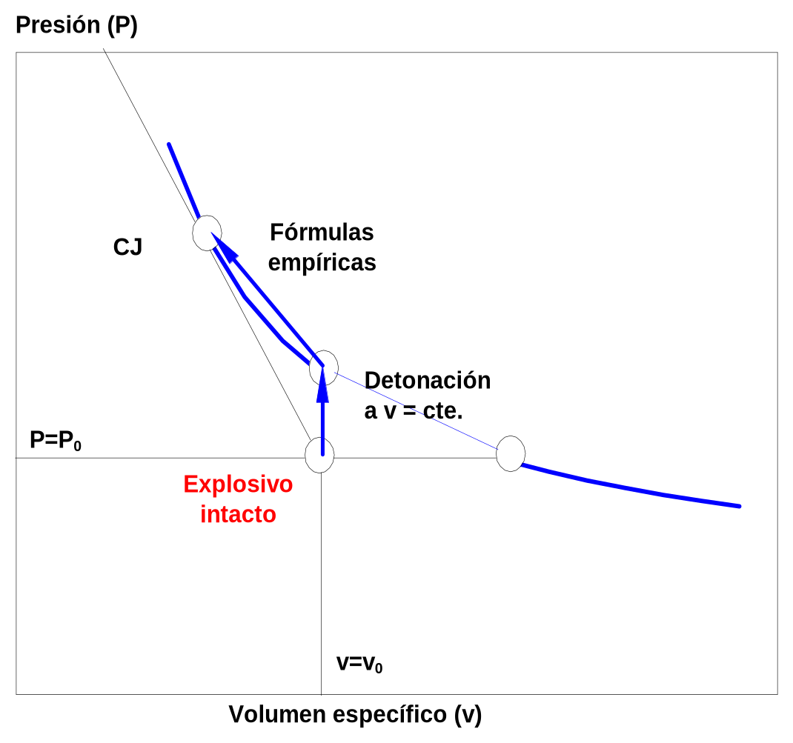
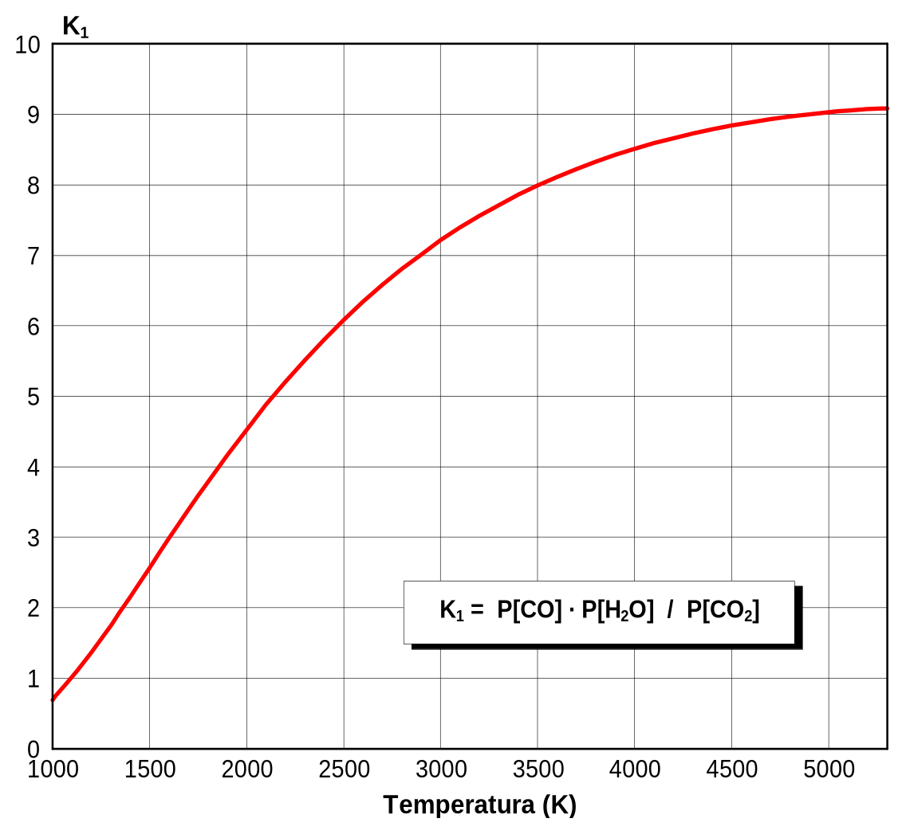
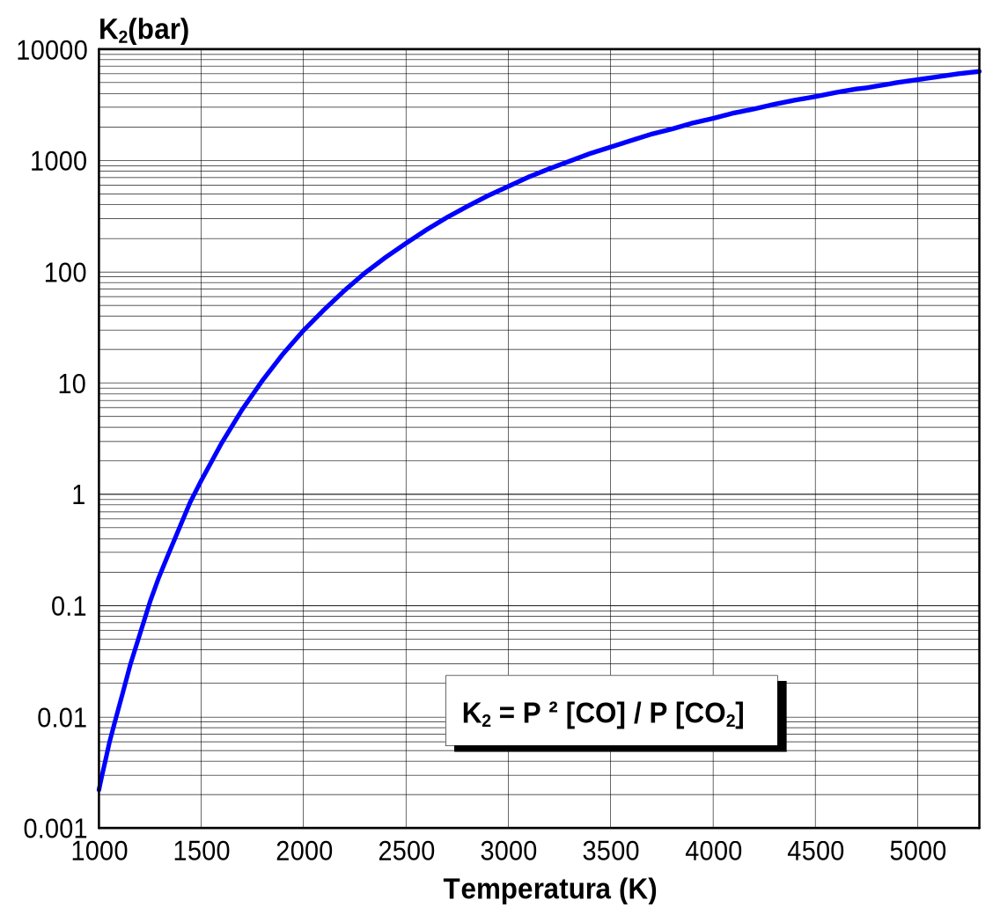
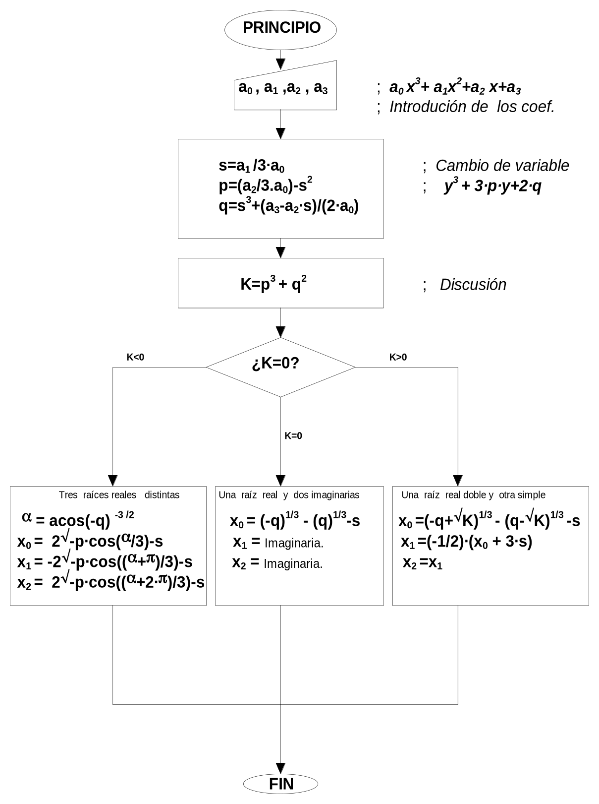
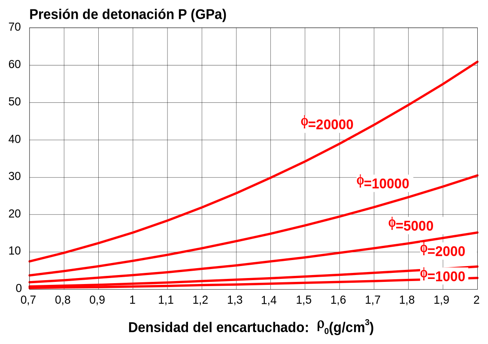
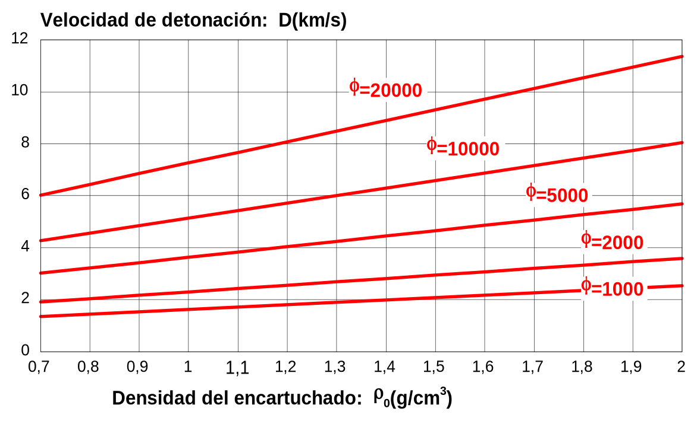
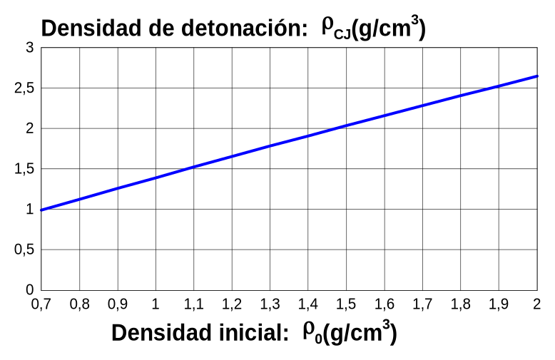
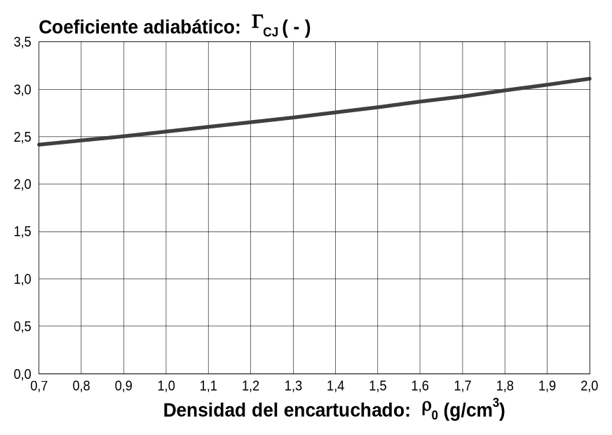

# 3. Descripción del método de cálculo simplificado

## 3.1 Generalidades

El método de cálculo empleado que incorpora ***Explocal*** es el que ha
sido recogido por AENOR en la norma UNE 31-002 [[1]](13-referencias.md#referencia-1) y coincide con el
descrito por *Sanchidrián Blanco* [[2]](13-referencias.md#referencia-2).

La norma UNE 31-002 [[1]](13-referencias.md#referencia-1) establece un método simplificado de cálculo de
las principales características de los explosivos, como son:

- Balance de oxígeno.

- Calor de explosión.

- Temperatura de explosión.

- Presión de detonación.

- Velocidad de detonación.

- Composición de los productos de explosión mayoritarios.

- Volumen de gases en condiciones normales.

Como datos de partida de problema se considerarán: la composición de la
mezcla explosiva (expresada como porcentaje en peso de cada componente),
y la densidad inicial.

Debido a que se trata de un **método simplificado**, se asumen ciertas
hipótesis de partida que alejan los resultados del comportamiento real
de los explosivos. Por este motivo los resultados obtenidos por
aplicación de la norma UNE 31-002 [[1]](13-referencias.md#referencia-1) deben considerarse como una
**aproximación** a las características reales de funcionamiento de los
explosivos.

El método de cálculo presupone un régimen de *detonación ideal* por lo
que se desprecian los *fenómenos cinéticos* y los de *difusión térmica*.

Para calcular la composición de los productos de explosión y la
temperatura de explosión, el método considera el estado de detonación a
volumen constante como una aproximación al estado de detonación CJ.

A *volumen constante:* el volumen específico de explosión es igual al
inicial (**v=v~o~**) y la ecuación de la energía (2-3) de la
detonación queda:

$$E - E_o = 0
\tag{3-1}$$

La expresión (3-1) es una *ecuación en temperatura* que se resolverá
suponiendo que la energía interna depende en exclusiva de la
temperatura, es decir, los productos de explosión se comportan como
*gases ideales*.

La energía interna total depende de la composición de los productos de
explosión. Con el objetivo de *reducir el número de incógnitas* se
considera que: cada elemento de la mezcla explosiva forma **un único
producto de explosión**, con las excepciones del carbono, el hidrógeno y
el oxígeno que forman: C (grafito), CO, CO~2~, H~2~ y H~2~O.

El resto de los parámetros de detonación se determinan mediante las
fórmulas empíricas de *Kamlet, M.J y Jacobs, S.J.* [[3]](13-referencias.md#referencia-3).

Los parámetros numéricos que incluyen las fórmulas, fueron ajustados
para mezclas explosivas de densidades comprendidas entre 1 g/cm^3^ y 2
g/cm^3^ formadas únicamente por C, H, O y N.

Cuanto mayor sea la proporción de otros elementos distintos de los
cuatro anteriores, menor será la precisión obtenida.

El método de cálculo se esquematiza, en la **figura [3-1](05-metodo-calculo.md#figura-3-1)**.

{#figura-3-1}

## 3.2 Desarrollo del cálculo

### 3.2.1 Planteamiento de la fórmula del explosivo

A partir de la composición porcentual de las especies químicas (o
reactivos), que componen el explosivo, y que constituyen los datos del
problema planteado, se calcula la fórmula para un kilogramo de explosivo
del siguiente modo:

$b_j = 10 \cdot \displaystyle\sum_{i=1}^{Nc} a_{ij} \cdot \dfrac{p_i}{Pm_i}$, **j = 1,2,…, Ne;** (3-2)

donde:

| Símbolo | Significado |
|---|---|
| **b~j~** | Átomos del elemento j en la fórmula de 1 kg de explosivo. |
| **Nc** | Número de componentes de la mezcla explosiva. |
| **a~ij~** | Átomos del elemento j en la fórmula del componente i. |
| **p~i~** | Porcentaje en peso del componente i. (%) |
| **Pm~i~** | Peso molecular del componente i en (g/mol), (se calcula a partir de las masas atómicas de la **tabla [3-1](05-metodo-calculo.md#tabla-3-1)**) |
| **Ne** | Número de elementos químicos que forman la composición del explosivo. |

### 3.2.2 Cálculo de la energía de formación del explosivo

Se tomará como temperatura de referencia: **T~o~ = 298 K**.

La energía de formación del explosivo se determina a partir de las
energías de formación a 298 K de cada componente (véase UNE 31-002
[[1]](13-referencias.md#referencia-1)).

A diferencia de la norma UNE 31-002 [[1]](13-referencias.md#referencia-1), se considera que todas las
variables energéticas están expresadas en calorías, puesto que todas las
tablas termoquímicas están expresadas, generalmente, en calorías (o en
kilocalorías): **1 cal = 4,184 J**.

La energía de formación del explosivo se calcula mediante la fórmula:

$$E_o = \Delta E_f = \sum_{i=1}^{Nc} \Delta E_{fi} \dfrac{P_i}{100}
\tag{3-3}$$

## 3.3 Balance de oxígeno y productos de reacción

### 3.3.1 Balance de oxígeno

Se calcula, expresado en porcentaje, mediante la expresión:

$$BO = \dfrac{100 \cdot Pm[O] \cdot (O_E - O_N)}{Pm}
\tag{3-4}$$

donde:

| Símbolo | Significado |
|---|---|
| **BO** | *Balance de oxígeno* en (%) = (g/100g). |
| **Pm[O]** | *Peso molecular del oxígeno atómico*: 15,9994 g/mol (véase **tabla [3-1](05-metodo-calculo.md#tabla-3-1)**). |
| **Pm** | *Peso molecular del explosivo*, si el explosivo está expresado por su fórmula para 1 kg, en (g/mol). Pm =1 kg/mol = 1000 g/mol. |
| **O~E~** | *Oxígeno existente* (o el oxígeno que contiene el explosivo). o los átomos de oxígeno que figuran en la fórmula de 1 kg de explosivo. |
| **O~N~** | *Oxígeno necesario* para oxidar los elementos del explosivo. |

Nota I: **O~E~** y **O~N~**, se consideran en la norma UNE 31-002
[[1]](13-referencias.md#referencia-1) en g/mol, es decir ya incluyen el factor: 15,9994.

Para calcular el *oxígeno necesario*, se considera que los elementos se
oxidan para formar los productos que se indican en la **tabla [3-1](05-metodo-calculo.md#tabla-3-1)**.

El *oxígeno necesario* es igual a la suma de los átomos de cada
elemento, multiplicado por el peso para el cálculo de balance de
oxígeno.

Como se puede apreciar en la ***tabla [3-1](05-metodo-calculo.md#tabla-3-1)***, existen diferencias entre
los productos para el balance de oxígeno y los productos de explosión.

Los datos de las masas atómicas que incluye la norma UNE 31-002 [[1]](13-referencias.md#referencia-1),
en su *anexo A*, son menos precisos que los del Fórum Atómico Español
[[4]](13-referencias.md#referencia-4), por lo que se ha preferido emplear estos últimos.

[]{#tabla-3-1}
**Tabla 3-1: Datos para calcular el balance de oxígeno.**[^cap3-2]

| Elemento asociado | Masa atómica (g/mol) | Producto de explosión | Producto para el cálculo del B.O. | Peso para el cálculo del oxígeno necesario |
|---|---|---|---|---|
| Al | 26,98154 | Al~2~O~3~ | Al~2~O~3~ | 3/2 |
| B | 10,811 | B~2~O~3~ | B~2~O~3~ | 3/2 |
| Ba | 137,327 | BaO | BaO | 1 |
| Be | 9,01218 | BeO | BeO | 1 |
| Br | 79,904 | BrH | BrH | -1/2 |
| C | 12,011 | CO~2~ | CO~2~ | 2 |
| Ca | 40,078 | CaO | CaO | 1 |
| Cl | 35,4527 | ClH | ClH | -1/2 |
| Co | 58,9332 | CoO | Co~2~O~3~ | 3/2 |
| Cu | 63,546 | CuO | CuO | 1 |
| F | 18,9984 | FH | FH | -1/2 |
| Fe | 55,847 | FeO | Fe~2~O~3~ | 3/2 |
| H | 1,00794 | H~2~O | H~2~O | 1/2 |
| Hg | 200,59 | Hg | HgO | 1 |
| K | 39,0983 | K~2~CO~3~ | K~2~O | 1/2 |
| Li | 6,941 | Li~2~CO~3~ | Li~2~O | 1/2 |
| Mg | 24,305 | MgO | MgO | 1 |
| Mn | 54,93805 | MnO | MnO~2~ | 2 |
| Mo | 95,94 | MoO~3~ | MoO~3~ | 3 |
| N | 14,00674 | N~2~ | N~2~ | 0 |
| Na | 22,98977 | Na~2~CO~3~ | Na~2~O | 1/2 |
| Ni | 58,69 | NiO | Ni~2~O~3~ | 3/2 |
| O | 15,9994 | O~2~ | -- | -- |
| P | 30,97376 | PO | P~2~O~5~ | 5/2 |
| Pb | 207,2 | PbO | PbO~2~ | 2 |
| S | 32,066 | SO~2~ | SO~2~ | 2 |
| Sb | 121,75 | Sb~2~O~3~ | Sb~2~O~5~ | 5/2 |
| Si | 28,0855 | SiO~2~ (Cuarzo) | SiO~2~ | 2 |
| Ti | 47,88 | TiO~2~ | TiO~2~ | 2 |
| W | 185,85 | WO~3~ | WO~3~ | 3 |
| Zn | 65,39 | ZnO | ZnO | 1 |
| Zr | 91,224 | ZrO~2~ | ZrO~2~ | 2 |
| -- | -- | C (Grafito) | -- | -- |
| -- | -- | CO | -- | -- |
| -- | -- | H~2~ | -- | -- |

### 3.3.2 Productos de explosión

Con el único objetivo de simplificar el cálculo de la composición de los
productos de detonación, se limita el número total de estos.

Sólo se toman en consideración los productos de detonación mayoritarios
(véase **tabla [3-1](05-metodo-calculo.md#tabla-3-1)** o **tabla [3-2](05-metodo-calculo.md#tabla-3-2)**).

Se tienen en cuenta los siguientes productos, según el caso:

**a)** ***Balance de oxígeno positivo (o nulo):*** El explosivo es
excedentario en oxígeno: se forma un producto por cada elemento en la
composición de la mezcla.

Como: CO~2~, CO, H~2~O, O~2~ y N~2~ entre otros.

(Nótese la presencia de oxígeno libre O~2~).

**b)** ***Balance de oxígeno negativo***: se forma un producto por cada
elemento y además se pueden formar C, CO, y H~2~.

(No hay oxígeno libre, pero sí hidrógeno gas.)

Como se puede observar, los productos de explosión difieren, en general,
de los productos que se emplean para el cálculo del balance de oxígeno.
Esta circunstancia provoca una *inconsistencia* en la elección de los
productos de detonación, puesto que es posible que existan mezclas
explosivas con balance de oxígeno positivo en las que no se produzca
oxígeno libre (sean en realidad deficitarias para el método de cálculo).

Para solucionar este problema se podría cambiar la definición de balance
de oxígeno por otra en la que se considere que: "el balance de oxígeno
es la cantidad de oxígeno que sobra o falta para oxidar los elementos de
su composición hasta formar los productos de detonación que se forman en
mezclas excedentarias".

El programa ***Explocal*** considera dos definiciones distintas, puesto
que así se sigue la norma y además se soluciona la inconsistencia.

[]{#tabla-3-2}
**Tabla 3-2: Datos de los productos de explosión.**[^cap3-3]

| Elemento asociado | Masa atómica (g/mol) | Producto de explosión | ∆Ef^298^ (kcal/mol) | Temperatura vaporización (K) |
|---|---|---|---|---|
| Al | 26,98154 | **Al~2~O~3~** | -396 | \> 6000 |
| B | 10,811 | **B~2~O~3~** | -302,8 | 2316 |
| Ba | 137,327 | **BaO** | -134,3 | \> 6000 |
| Be | 9,01218 | **BeO** | -142,8 | 4060 |
| Br | 79,904 | **BrH** | -9,01 | 206,15 |
| C | 12,011 | **CO~2~** | -94,05 | 194,65 |
| Ca | 40,078 | **CaO** | -115,49 | \> 6000 |
| Cl | 35,4527 | **ClH** | -22,06 | 188,25 |
| Co | 58,9332 | **CoO** | -56,57 | \> 6000 |
| Cu | 63,546 | **CuO** | -37,3 | \> 6000 |
| F | 18,9984 | **FH** | -65,44 | 292,69 |
| Fe | 55,847 | **FeO** | -64,72 | 3687 |
| H | 1,00794 | **H~2~O** | -57,5 | 373,15 |
| Hg | 200,59 | **Hg** | 0 | 629,73 |
| K | 39,0983 | **K~2~CO~3~** | -273,93 | \> 6000 |
| Li | 6,941 | **Li~2~CO~3~** | -289,75 | \> 6000 |
| Mg | 24,305 | **MgO** | -143,4 | 3533 |
| Mn | 54,93805 | **MnO** | -91,77 | \> 6000 |
| Mo | 95,94 | **MoO~3~** | -177,2 | 1600 |
| N | 14,00674 | **N~2~** | 0 | 77,35 |
| Na | 22,98977 | **Na~2~CO~3~** | -270,3 | \> 6000 |
| Ni | 58,69 | **NiO** | -57 | \> 6000 |
| O | 15,9994 | **O~2~** | 0 | 90,19 |
| P | 30,97376 | **PO** | -1,16 | 298,15 |
| Pb | 207,2 | **PbO** | -44,86 | \> 6000 |
| S | 32,066 | **SO~2~** | -70,95 | 263,15 |
| Sb | 121,75 | **Sb~2~O~3~** | -168,56 | \> 6000 |
| Si | 28,0855 | **SiO~2~ (Cuarzo)** | -217,1 | 2230 |
| Ti | 47,88 | **TiO~2~** | -225,2 | 3023,15 |
| W | 185,85 | **WO~3~** | -200,57 | 2110 |
| Zn | 65,39 | **ZnO** | -82,94 | \> 6000 |
| Zr | 91,224 | **ZrO~2~** | -261,7 | 4548 |
| -- | -- | **C (Grafito)** | 0 | \> 6000 |
| -- | -- | **CO** | -26,76 | 81,65 |
| -- | -- | **H~2~** | 0 | 20,35 |

## 3.4 Calor y temperatura de explosión

### 3.4.1 Composición de los productos

Coincidiendo con la clasificación por el balance de oxígeno se suponen
dos casos: (Siendo: **Np,** el número de productos formados en la
explosión y **Ne,** el número de elementos distintos de la mezcla)

**a) Balance de oxígeno positivo (o nulo): (Np=Ne)**

El número de productos de explosión coincide con el número de elementos.
Estableciendo los balances estequiométricos de cada elemento se obtiene
un *sistema de ecuaciones lineales*, cuya resolución (inmediata en
muchos casos) proporciona la composición de los productos.

**b) Balance de oxígeno negativo: (Np=Ne+2)**

Se tienen dos productos más que elementos ya que se producen C, CO, H~2~
pero no O~2~.

El sistema de ecuaciones se forma con los balances estequiométricos de
cada elemento junto con las dos ecuaciones de equilibrio siguientes:

**CO~2~ + H~2~ ⇔ CO + H~2~O ;**
$K_1 = \dfrac{P_{CO} \cdot P_{H_2O}}{P_{CO_2} \cdot P_{H_2}}$**;**
(3-5)

**CO~2~ + C ⇔ 2 CO;**
$K_2 = \dfrac{P^2_{CO}}{P_{CO_2}}$**;**
(3-6)

La constante **K~1~** es adimensional a diferencia de **K~2~** que tiene
dimensiones de presión. Si tenemos en cuenta que la presión es
proporcional a la cantidad de gas obtendremos:

$K_1 = \dfrac{nCO \cdot nH_2O}{nCO_2 \cdot nH_2}$**;**
(3-7)
$K_2 = \dfrac{P^2_{CO}}{P_{CO_2}} = \dfrac{n^2_{CO}}{n_{CO_2}} \cdot \dfrac{P}{n_g} = \dfrac{n^2_{CO}}{n_{CO_2}} \cdot F$**;**
(3-8)

$$n_g = \sum_{i=Gas}^{Np} n_i
\tag{3-9}$$

$$F = \dfrac{P}{n_g} = \rho \cdot n_g \cdot R \cdot T \approx \rho_o \cdot n_g \cdot R \cdot T
\tag{3-10}$$

$$K_2' = \dfrac{K_2}{F}
\tag{3-11}$$

donde:

| Símbolo | Significado |
|---|---|
| **P** | Presión de detonación en (Pa). |
| **n~g~** | Cantidad de gases producida en la detonación en (mol/kg). En la **tabla [3-2](05-metodo-calculo.md#tabla-3-2)** se incluye la temperatura a la que los productos de explosión están en estado gaseoso. *(Tvapor)* |
| **F** | Factor de fugacidad de la constante de equilibrio en (Pa · kg/mol). |
| **ρ~o~** | Densidad inicial o de encartuchado en (kg/m^3^). 1 g/cm^3^ = 1000 kg/m^3^ |
| **ρ** | Densidad después de la transformación a volumen constante en (kg/m^3^). Si se desprecia al volumen ocupado por los productos condensados se puede considerar igual a la densidad inicial. |
| **T** | (K) Temperatura a la que se considera el equilibrio en (K). (incógnita). |
| **R** | Constante de los gases: R=8,31441 (J·K^-1^·mol^-1^). |
| **K~1~** | Constante de equilibrio: ( - ) |
| **K~2~** | Constante de equilibrio: (Pa) |
| **K~2~'** | Constante de equilibrio independiente de la presión (kg/mol). |

Los equilibrios químicos dependen fuertemente de la temperatura, como se
puede apreciar en la **tabla [3-3](05-metodo-calculo.md#tabla-3-3)** y en las **figuras [3-2](05-metodo-calculo.md#figura-3-2)** y **[3-3](05-metodo-calculo.md#figura-3-3)**,
dónde se incluyen los valores de ambas constantes: **K~1~** y **K~2~**
en un intervalo de temperaturas entre 298 K y 6000 K.

Con excepción de los elementos que aparecen en los equilibrios (3-5) y
(3-6) (es decir C, H y O), todos los demás elementos conducen a balances
estequiométricos que equivalen a ecuaciones lineales en una sola
variable de solución inmediata, con los que se determinaran los moles
de: carbonatos, haluros y óxidos, entre otros.

[]{#tabla-3-3}
**Tabla 3-3: Constantes de equilibrio.**[^cap3-4]

| Temperatura (K) | K~1~ ( - ) — UNE 31-002-94 [[1]](13-referencias.md#referencia-1) (ANEXO C, pág. 24) | K~2~ (Pa) — UNE 31-002-94 [[1]](13-referencias.md#referencia-1) (ANEXO C, pág. 24) | K~1~ ( - ) — Meyer, R. [[7]](13-referencias.md#referencia-7) | K~2~ (Pa) — Meyer, R. [[7]](13-referencias.md#referencia-7) |
|---|---|---|---|---|
| 298 | 9,5840E-06 | 3,8030E-19 | - | - |
| 300 | 1,0620E-05 | 5,8100E-19 | - | - |
| 400 | 6,4420E-04 | 1,4700E-11 | - | - |
| 500 | 7,2610E-03 | 4,0020E-07 | - | - |
| 600 | 3,5160E-02 | 3,5010E-04 | - | - |
| 700 | 0,1054 | 4,2870E-02 | - | - |
| 800 | 0,2361 | 1,5350E+00 | - | - |
| 900 | 0,4335 | 2,4160E+01 | - | - |
| ***1000*** | ***0,6934*** | ***2,1340E+02*** | ***0,6929*** | ***2,2160E+02*** |
| 1100 | 1,0069 | 1,2470E+03 | - | - |
| 1200 | 1,3646 | 5,3350E+03 | 1,3632 | 5,5130E+03 |
| 1300 | 1,7498 | 1,8000E+04 | - | - |
| 1400 | 2,1538 | 5,0370E+04 | 2,1548 | 5,3460E+04 |
| 1500 | 2,5645 | 1,2140E+05 | 2,5667 | 1,3170E+05 |
| 1600 | 2,9785 | 2,6010E+05 | 2,9802 | 2,8850E+05 |
| 1700 | 3,3884 | 5,0450E+05 | 3,3835 | 5,7440E+05 |
| 1800 | 3,7757 | 8,9950E+05 | 3,7803 | 1,0560E+06 |
| 1900 | 4,1591 | 1,5020E+06 | 4,1615 | 1,8150E+06 |
| ***2000*** | ***4,5290*** | ***2,3730E+06*** | ***4,5270*** | ***2,9480E+06*** |
| 2100 | 4,8753 | 3,5570E+06 | 4,8760 | 4,5610E+06 |
| 2200 | 5,2000 | 5,1040E+06 | 5,2046 | 6,7670E+06 |
| 2300 | 5,5208 | 7,0890E+06 | 5,5154 | 9,6830E+06 |
| 2400 | 5,8076 | 9,5080E+06 | 5,8070 | 1,3420E+07 |
| 2500 | 6,0814 | 1,2400E+07 | 6,0851 | 1,8100E+07 |
| 2600 | 6,3387 | 1,5790E+07 | 6,3413 | 2,3810E+07 |
| 2700 | 6,5766 | 1,9680E+07 | 6,5819 | 3,0650E+07 |
| 2800 | 6,8077 | 2,4110E+07 | 6,8075 | 3,8700E+07 |
| 2900 | 7,0146 | 2,9030E+07 | 7,0147 | 4,8020E+07 |
| ***3000*** | ***7,2111*** | ***3,4370E+07*** | ***7,2127*** | ***5,8680E+07*** |
| 3100 | 7,3961 | 4,0170E+07 | 7,3932 | 7,0690E+07 |
| 3200 | 7,5509 | 4,6360E+07 | 7,5607 | 8,4100E+07 |
| 3300 | 7,7268 | 5,3060E+07 | 7,7143 | 9,8910E+07 |
| 3400 | 7,8524 | 5,9680E+07 | 7,8607 | 1,1510E+08 |
| 3500 | 7,9899 | 6,6870E+07 | 7,9910 | 1,3270E+08 |
| 3600 | 8,1196 | 7,4300E+07 | 8,1144 | 1,5170E+08 |
| 3700 | 8,2224 | 8,1860E+07 | 8,2266 | 1,7200E+08 |
| 3800 | 8,3368 | 8,9640E+07 | 8,3310 | 1,9360E+08 |
| 3900 | 8,4333 | 9,7550E+07 | 8,4258 | 2,1640E+08 |
| ***4000*** | ***8,5114*** | ***1,0530E+08*** | ***8,5124*** | ***2,4060E+08*** |
| 4100 | 8,6099 | 1,1340E+08 | 8,5926 | 2,6560E+08 |
| 4200 | 8,6497 | 1,2080E+08 | 8,6634 | 2,9190E+08 |
| 4300 | 8,7297 | 1,2910E+08 | 8,7296 | 3,1910E+08 |
| 4400 | 8,7902 | 1,3670E+08 | 8,7900 | 3,4740E+08 |
| 4500 | 8,8308 | 1,4420E+08 | 8,8442 | 3,7650E+08 |
| 4600 | 8,9125 | 1,5220E+08 | 8,8888 | 4,0640E+08 |
| 4700 | 8,9536 | 1,5970E+08 | 8,9304 | 4,3700E+08 |
| 4800 | 8,9743 | 1,6670E+08 | 8,9698 | 4,6480E+08 |
| 4900 | 8,9950 | 1,7340E+08 | 9,0001 | 5,0030E+08 |
| ***5000*** | ***9,0365*** | ***1,8000E+08*** | ***9,0312*** | ***5,3290E+08*** |
| 5100 | 9,0573 | 1,8690E+08 | 9,0524 | 5,6590E+08 |
| 5200 | 9,0782 | 1,9330E+08 | 9,0736 | 5,9930E+08 |
| 5300 | 9,0872 | 1,9910E+08 | 9,0872 | 6,3310E+08 |
| 5400 | 9,0991 | 2,0510E+08 | - | - |
| 5500 | 9,1201 | 2,1080E+08 | - | - |
| 5600 | 9,1201 | 2,1580E+08 | - | - |
| 5700 | 9,1201 | 2,2150E+08 | - | - |
| 5800 | 9,1201 | 2,2640E+08 | - | - |
| 5900 | 9,1201 | 2,3040E+08 | - | - |
| ***6000*** | ***9,1411*** | ***2,3560E+08*** | ***-*** | ***-*** |

Nota I: Las constantes de equilibrio tabuladas corresponden a las dos
reacciones siguientes:

CO~2~ + H~2~ ⇔ CO + H~2~O ; K~1~ = PCO · PH~2~O / PCO~2~ · PH~2~

CO~2~ + C ⇔ 2 CO ; K~2~ = PCO^2^ / PCO~2~

Nota II: La constante K~1~ es adimensional a diferencia de K~2~ que
tiene dimensiones de presión.

Nota III: El programa ***Explocal*** incorpora los datos de la norma UNE
31-002 [[1]](13-referencias.md#referencia-1).

{#figura-3-2}

{#figura-3-3}

Nota: 1 bar = 10^5^ Pa = 10^5^ N/m^2^

En adelante centraremos la atención en los balances de los elementos C,
H y O. Se obtienen las ecuaciones:

Carbono:

$$nCO_2 + nCO + nC + \text{nCarbonatos} = b_C
\tag{3-12}$$

Hidrógeno:

$$2 \cdot nH_2O + 2 \cdot H_2 + \text{nHalógenos} = b_H
\tag{3-13}$$

Oxígeno:

$$2 \cdot nCO_2 + nCO + nH_2O + \text{nÓxidos} + 3 \cdot \text{nCarbonatos} = b_O
\tag{3-14}$$

Los valores de **b~C~**, **b~H~** y **b~O~** se toman de la fórmula de 1
kg de explosivo.

Sustituyendo los moles de carbonatos, haluros y óxidos en las ecuaciones
(3-12), (3-13) y (3-14), y pasando todo al segundo miembro, junto con
las ecuaciones (3-7) y (3-8), se tendrá un sistema de la forma:

*Sistema con formación de grafito*:

$$nCO_2 + nCO + nC = b_C - \text{nCarbonatos} = B_C
\tag{3-15}$$

$$nH_2O + H_2 = \dfrac{b_H - \text{nHalógenos}}{2} = B_H
\tag{3-16}$$

$$2 \cdot nCO_2 + nCO + nH_2O = b_O - \text{nÓxidos} - 3 \cdot \text{nCarbonatos} = B_O
\tag{3-17}$$

$$nCO \cdot nH_2O = K_1 \cdot nCO_2 \cdot nH_2
\tag{3-18}$$

$$nCO^2 = K_2' \cdot nCO_2
\tag{3-19}$$

El sistema es de cinco ecuaciones con seis incógnitas (puesto que hay
que añadir la temperatura), y se resolverá junto con la ecuación del
balance de energía (3-1). El método de resolución que se empleará es
iterativo, teniendo a la temperatura como última incógnita sobre la que
itera.

La resolución del sistema formado por las ecuaciones de la (3-15) a la
(3-19), se efectúa resolviendo la ecuación de tercer grado (3-20) en
moles por kilo de monóxido de carbono (nCO) y calculando el resto de las
incógnitas (nCO~2,~ nC, nH~2~ y nH~2~O) mediante proceso de remonte.

$$2 \cdot \dfrac{K_1}{K_2'^2} \cdot nCO^3 + \dfrac{K_1+2}{K_2'} \cdot nCO^2 + \left[1 + \dfrac{K_1}{K_2'} \cdot (B_H - B_o)\right] \cdot nCO - B_o = 0 ; \tag{3-20}$$

El algoritmo de resolución de ecuaciones de tercer grado se representa
en la ***figura [3-4](05-metodo-calculo.md#figura-3-4)***. (Adaptado de *Tsipkin, G.G y Tsipkin, A.G*.
[[8]](13-referencias.md#referencia-8))

Si ninguna de las tres soluciones de la ecuación (3-20) produce un
resultado con significado físico (lo que implica que: todas las
incógnitas son positivas y además el contenido en cualquier elemento no
rebasa el inicial de la fórmula de un kilo de explosivo), se descarta la
posibilidad de que se forme grafito libre (C). En ese caso se trabaja
con el siguiente sistema:

*Sistema sin formación de grafito*:

$$nCO_2 + nCO = B_C
\tag{3-21}$$

$$nH_2O + H_2 = B_H
\tag{3-22}$$

$$2 \cdot nCO_2 + nCO + nH_2O = B_O
\tag{3-23}$$

$$nCO \cdot nH_2O = K_1 \cdot nCO_2 \cdot nH_2
\tag{3-24}$$

$$nC = 0
\tag{3-25}$$

Cuya solución puede obtenerse resolviendo la ecuación de segundo grado:

$$(1 - K_1) \cdot nCO^2 + \left[K_1 \cdot (B_H - B_O - 3 \cdot B_C) + (B_O - 2 \cdot B_C)\right] \cdot nCO + K_1 \cdot B_C \cdot (B_o - B_H - 3 \cdot B_C) = 0
\tag{3-26}$$

Una de cuyas raíces será compatible con la positividad de las
incógnitas.

{#figura-3-4}

### 3.4.2 Balance de energía

La ecuación de la energía, suponiendo en proceso de reacción a volumen
constante, es:

$$E(T) - E_o = 0
\tag{3-1}$$

$$E_o = \sum_{i=1}^{Nc} \dfrac{p_i}{100} \cdot \Delta E^0_{fi}
\tag{3-27}$$

<!-- La imagen original image37.wmf, situada entre las etiquetas de las fórmulas (3-27) y (3-28), se ha convertido a un PNG en blanco/ilegible (falló la conversión desde el Word original). No lleva número de ecuación propio en el original y, a diferencia de las imágenes 36 y 38 (que sí reproducen íntegras las fórmulas (3-27) y (3-28), confirmadas visualmente), no ha sido posible determinar con confianza razonable qué contenido matemático distinto aportaba; probablemente se trate de un objeto OLE duplicado o dañado ya en el documento Word original. FÓRMULA PENDIENTE: imagen original ilegible. -->

$$E = \sum_{j=1}^{Np} n_j \cdot \left[\Delta E^0_{fj} + (E^T - E^0)_j\right]
\tag{3-28}$$

donde:

| Símbolo | Significado |
|---|---|
| **E(T)** | Energía interna de los productos, en (kcal/kg), a la temperatura de explosión T (K), que es la incógnita de la ecuación. |
| **E~o~** | Energía interna del explosivo, en (kcal/kg), (su energía de formación a la temperatura de referencia Tº.) |
| **Tº** | Temperatura de referencia Tº = 298 K (≈ 25 ºC) |
| **Nc** | Número de compuestos que forman la mezcla explosiva. |
| **p~i~** | Porcentaje en peso del componente i en la mezcla, (%). |
| **∆Eº~fi~** | Energía de formación del componente i a Tº en (kcal/kg) |
| **∆Eº~fj~** | Energía de formación del producto j a Tº en (kcal/mol). |
| **n~j~** | Cantidad de producto j, formada en la reacción de explosión, (mol/kg). |
| **(E^T^-E^0^)~j~** | Incremento de energía interna desde Tº a T del producto de explosión j, en (kcal/mol) |

Como en termoquímica las reacciones a presión constante son mucho más
comunes que a volumen constante:

En la bibliografía es mucho más fácil encontrar datos tabulados de
entalpías, que de energías internas. (véase *JANAF* [[5]](13-referencias.md#referencia-5) y *Lide, David
R*. [[6]](13-referencias.md#referencia-6)).

Expresando (3-28) en función de las entalpías de los productos de
explosión, queda:

$$E = \sum_{j=1}^{Np} n_j \cdot \Delta E^0_{fj} + \sum_{j=1}^{Np} n_j \cdot (H^T - H^0)_j - n_g \cdot R \cdot (T - T°)
\tag{3-29}$$

donde:

| Símbolo | Significado |
|---|---|
| **∆Eº~fj~** | Energía de formación del producto j a Tº, en (kcal/mol). (véase **tabla [3-2](05-metodo-calculo.md#tabla-3-2)**) |
| **(H^T^-H^0^)~j~** | Incremento de energía interna desde Tº a T del producto de explosión j, en (kcal/mol). Los valores de H^T^ - H^0^ están tabulados para cada producto de explosión en la **tabla [3-4](05-metodo-calculo.md#tabla-3-4)**. |
| **n~g~** | Moles de productos gaseosos, (mol/kg). |
| **R** | R=1,9871917·10^-3^ (kcal·mol^-1^·kg^-1^). |
| **n~j~** | Cantidad de producto j, formada en la reacción de explosión, (mol/kg). |

Sustituyendo (3-29) en (3-1) y pasando a un miembro los términos
dependientes de la temperatura, la ecuación de la energía se transforma
en:

$$E_0 - \sum_{j=1}^{Np} n_j \cdot \Delta E^0_{fj} = \sum_{j=1}^{Np} n_j \cdot (H^T - H^0)_j - n_g \cdot R \cdot (T - T°)
\tag{3-30}$$

que equivale a:

$$Q = Q_S(T)
\tag{3-31}$$

donde:

| Símbolo | Significado |
|---|---|
| **Q** | Calor de explosión, independiente de la temperatura, (kcal/kg). |
| **Q~S~** | Calor sensible de los productos de explosión. Depende de la temperatura, que es la incógnita de la ecuación, (kcal/kg). |

[]{#tabla-3-4}
**Tabla 3-4: Entalpías de los productos de explosión**

*Tabla dividida en varios bloques de columnas por motivos de maquetación (35 especies químicas no caben en el ancho de una página); todas comparten las mismas filas de temperatura T (K)*

*Tabla [3-4](05-metodo-calculo.md#tabla-3-4) (1/5)*

| T (K) | Al~2~O~3~ | B~2~O~3~ | BaO | BeO | BrH | C | CO |
|---|---|---|---|---|---|---|---|
| 298 | 0,000 | 0,000 | 0,000 | 0,000 | 0,000 | 0,000 | 0,000 |
| 300 | 0,035 | 0,028 | 0,020 | 0,011 | 0,013 | 0,004 | 0,013 |
| 400 | 2,147 | 1,712 | 1,165 | 0,727 | 0,710 | 0,250 | 0,711 |
| 500 | 4,577 | 3,671 | 2,387 | 1,594 | 1,411 | 0,569 | 1,417 |
| 600 | 7,193 | 5,872 | 3,652 | 2,567 | 2,120 | 0,947 | 2,137 |
| 700 | 9,940 | 8,339 | 4,946 | 3,614 | 2,840 | 1,372 | 2,873 |
| 800 | 12,778 | 16,700 | 6,263 | 4,716 | 3,575 | 1,831 | 3,627 |
| 900 | 16,685 | 19,880 | 7,598 | 5,855 | 4,325 | 2,318 | 4,397 |
| ***1000*** | ***18,644*** | ***23,033*** | ***8,948*** | ***7,019*** | ***5,090*** | ***2,824*** | ***5,183*** |
| 1100 | 21,644 | 26,155 | 10,314 | 8,200 | 5,869 | 3,347 | 5,983 |
| 1200 | 24,674 | 29,244 | 11,692 | 9,399 | 6,662 | 3,883 | 6,794 |
| 1300 | 27,745 | 32,311 | 13,083 | 10,614 | 7,466 | 4,432 | 7,616 |
| 1400 | 30,859 | 35,367 | 14,487 | 11,847 | 8,282 | 4,988 | 8,446 |
| 1500 | 34,004 | 38,421 | 15,902 | 13,098 | 9,107 | 5,552 | 9,285 |
| 1600 | 37,181 | 41,475 | 17,329 | 14,366 | 9,941 | 6,122 | 10,130 |
| 1700 | 40,388 | 44,530 | 18,768 | 15,652 | 10,782 | 6,696 | 10,980 |
| 1800 | 43,624 | 47,576 | 20,217 | 16,955 | 11,631 | 7,275 | 11,836 |
| 1900 | 46,235 | 50,630 | 21,678 | 18,275 | 12,486 | 7,857 | 12,697 |
| ***2000*** | ***50,175*** | ***53,684*** | ***23,149*** | ***19,613*** | ***13,346*** | ***8,442*** | ***13,561*** |
| 2100 | 53,486 | 56,738 | 24,632 | 20,968 | 14,212 | 9,029 | 14,430 |
| 2200 | 56,819 | 59,792 | 39,921 | 22,341 | 15,082 | 9,620 | 15,301 |
| 2300 | 60,176 | 62,846 | 41,311 | 23,731 | 15,956 | 10,212 | 16,175 |
| 2400 | 91,925 | 153,069 | 42,701 | 25,234 | 16,835 | 10,807 | 17,052 |
| 2500 | 95,387 | 155,589 | 44,091 | 26,697 | 17,717 | 11,403 | 17,931 |
| 2600 | 98,849 | 158,115 | 45,481 | 28,168 | 18,602 | 12,002 | 18,813 |
| 2700 | 102,312 | 160,644 | 46,871 | 29,647 | 19,491 | 12,602 | 19,696 |
| 2800 | 105,774 | 163,177 | 48,261 | 31,134 | 20,382 | 13,203 | 20,582 |
| 2900 | 109,236 | 165,714 | 49,651 | 47,813 | 21,276 | 13,807 | 21,469 |
| ***3000*** | ***112,699*** | ***168,253*** | ***51,041*** | ***49,413*** | ***22,173*** | ***14,412*** | ***22,357*** |
| 3100 | 116,161 | 170,795 | 52,431 | 51,013 | 23,072 | 15,018 | 23,248 |
| 3200 | 119,623 | 173,340 | 53,821 | 52,613 | 23,974 | 15,626 | 24,139 |
| 3300 | 123,085 | 175,887 | 55,211 | 54,213 | 24,877 | 16,236 | 25,032 |
| 3400 | 126,548 | 178,436 | 56,601 | 55,813 | 25,783 | 16,847 | 25,927 |
| 3500 | 130,010 | 180,987 | 57,991 | 57,413 | 26,691 | 17,460 | 26,822 |
| 3600 | 133,472 | 183,540 | 59,381 | 59,013 | 27,601 | 18,074 | 27,719 |
| 3700 | 136,934 | 186,094 | 60,771 | 60,613 | 28,513 | 18,690 | 28,617 |
| 3800 | 140,397 | 188,650 | 62,161 | 62,213 | 29,426 | 19,307 | 29,516 |
| 3900 | 143,859 | 191,207 | 63,551 | 63,813 | 30,341 | 19,926 | 30,416 |
| ***4000*** | ***147,321*** | ***193,765*** | ***64,941*** | ***65,413*** | ***31,258*** | ***20,546*** | ***31,316*** |
| 4100 | 150,784 | 196,325 | 66,331 | 207,382 | 32,176 | 21,168 | 32,218 |
| 4200 | 154,246 | 198,886 | 67,721 | 208,300 | 33,096 | 21,792 | 33,121 |
| 4300 | 157,708 | 201,448 | 69,111 | 209,220 | 34,018 | 22,416 | 34,025 |
| 4400 | 161,170 | 204,010 | 70,501 | 210,140 | 34,941 | 23,045 | 34,930 |
| 4500 | 164,633 | 206,574 | 71,891 | 211,061 | 35,866 | 23,674 | 35,835 |
| 4600 | 168,095 | 209,139 | 73,281 | 211,982 | 36,791 | 24,305 | 36,741 |
| 4700 | 171,557 | 211,704 | 74,671 | 212,905 | 37,719 | 24,937 | 37,649 |
| 4800 | 175,020 | 214,270 | 76,061 | 213,829 | 38,647 | 25,572 | 38,557 |
| 4900 | 178,482 | 216,837 | 77,451 | 214,753 | 39,578 | 26,208 | 39,465 |
| ***5000*** | ***181,944*** | ***219,404*** | ***78,841*** | ***215,678*** | ***40,509*** | ***26,846*** | ***40,375*** |
| 5100 | 185,406 | 221,972 | 80,231 | 216,604 | 41,442 | 27,487 | 41,285 |
| 5200 | 188,868 | 224,541 | 81,621 | 217,531 | 42,375 | 28,129 | 42,196 |
| 5300 | 192,330 | 227,110 | 83,011 | 218,458 | 43,311 | 28,773 | 43,108 |
| 5400 | 195,792 | 229,680 | 84,401 | 219,386 | 44,247 | 29,419 | 44,021 |
| 5500 | 199,254 | 232,250 | 85,791 | 220,315 | 45,185 | 30,068 | 44,934 |
| 5600 | 202,716 | 234,821 | 87,181 | 221,246 | 46,124 | 30,718 | 45,849 |
| 5700 | 206,178 | 237,392 | 88,571 | 222,176 | 47,064 | 31,371 | 46,763 |
| 5800 | 209,640 | 239,963 | 89,961 | 223,107 | 48,005 | 32,026 | 47,679 |
| 5900 | 213,102 | 242,535 | 91,351 | 224,039 | 48,948 | 32,683 | 48,595 |
| ***6000*** | ***216,564*** | ***245,107*** | ***92,741*** | ***224,972*** | ***49,891*** | ***33,342*** | ***49,513*** |

*Tabla [3-4](05-metodo-calculo.md#tabla-3-4) (2/5)*

| T (K) | CO~2~ | CaO | ClH | CoO | CuO | FH | FeO |
|---|---|---|---|---|---|---|---|
| 298 | 0,000 | 0,000 | 0,000 | 0,000 | 0,000 | 0,000 | 0,000 |
| 300 | 0,016 | 0,019 | 0,013 | 0,019 | 0,030 | 0,013 | 0,022 |
| 400 | 0,958 | 1,098 | 0,710 | 1,076 | 1,681 | 0,709 | 1,240 |
| 500 | 1,987 | 2,262 | 1,408 | 2,155 | 3,394 | 1,406 | 2,497 |
| 600 | 3,087 | 3,492 | 2,112 | 3,256 | 5,169 | 2,104 | 3,792 |
| 700 | 4,245 | 4,781 | 2,823 | 4,379 | 7,006 | 2,804 | 5,119 |
| 800 | 5,453 | 6,125 | 3,546 | 5,524 | 8,905 | 3,508 | 6,475 |
| 900 | 6,702 | 7,521 | 4,281 | 6,691 | 10,866 | 4,217 | 7,857 |
| ***1000*** | ***7,984*** | ***8,969*** | ***5,030*** | ***7,880*** | ***12,889*** | ***4,934*** | ***9,263*** |
| 1100 | 9,296 | 10,467 | 5,793 | 9,091 | 14,974 | 5,660 | 10,692 |
| 1200 | 10,632 | 12,016 | 6,559 | 10,324 | 17,121 | 6,395 | 12,142 |
| 1300 | 11,988 | 13,614 | 7,356 | 11,579 | 19,330 | 7,140 | 13,613 |
| 1400 | 13,362 | 15,261 | 8,155 | 12,856 | 21,601 | 7,896 | 15,104 |
| 1500 | 14,750 | 16,958 | 8,965 | 14,155 | 23,934 | 8,661 | 16,611 |
| 1600 | 16,152 | 18,704 | 9,783 | 15,476 | 26,329 | 9,437 | 18,134 |
| 1700 | 17,565 | 20,488 | 10,610 | 16,819 | 41,739 | 10,221 | 25,468 |
| 1800 | 18,987 | 22,342 | 11,445 | 18,184 | 43,939 | 11,015 | 27,097 |
| 1900 | 20,418 | 24,234 | 12,287 | 19,571 | 46,139 | 11,816 | 28,728 |
| ***2000*** | ***21,857*** | ***26,175*** | ***13,135*** | ***20,980*** | ***48,339*** | ***12,626*** | ***30,358*** |
| 2100 | 23,303 | 28,165 | 13,988 | 30,664 | 50,539 | 13,443 | 31,988 |
| 2200 | 24,755 | 30,203 | 14,847 | 32,214 | 52,739 | 14,267 | 33,618 |
| 2300 | 26,212 | 32,290 | 15,711 | 33,764 | 54,939 | 15,097 | 35,247 |
| 2400 | 27,674 | 34,425 | 16,579 | 35,314 | 57,139 | 15,933 | 36,878 |
| 2500 | 29,141 | 36,609 | 17,451 | 36,864 | 59,339 | 16,774 | 38,507 |
| 2600 | 30,613 | 38,842 | 18,327 | 38,414 | 61,539 | 17,621 | 40,138 |
| 2700 | 32,088 | 41,123 | 19,207 | 39,964 | 63,739 | 18,473 | 41,768 |
| 2800 | 33,567 | 43,452 | 20,090 | 41,514 | 65,939 | 19,329 | 43,397 |
| 2900 | 35,049 | 63,830 | 20,976 | 43,064 | 68,139 | 20,189 | 45,028 |
| ***3000*** | ***36,535*** | ***66,257*** | ***21,864*** | ***44,614*** | ***70,339*** | ***21,054*** | ***46,658*** |
| 3100 | 38,024 | 68,732 | 22,756 | 46,164 | 72,539 | 21,922 | 48,287 |
| 3200 | 39,515 | 71,256 | 23,650 | 47,714 | 74,739 | 22,794 | 49,917 |
| 3300 | 41,010 | 73,828 | 24,546 | 49,264 | 76,939 | 23,669 | 51,548 |
| 3400 | 42,507 | 76,448 | 25,445 | 50,814 | 79,139 | 24,548 | 53,178 |
| 3500 | 44,006 | 79,117 | 26,346 | 52,364 | 81,339 | 25,429 | 54,807 |
| 3600 | 45,508 | 81,834 | 27,249 | 53,914 | 83,539 | 26,313 | 56,438 |
| 3700 | 47,012 | 84,600 | 28,154 | 55,464 | 85,739 | 27,200 | 155,825 |
| 3800 | 48,518 | 87,414 | 29,061 | 57,014 | 87,939 | 28,090 | 156,812 |
| 3900 | 50,027 | 90,277 | 29,970 | 58,564 | 90,139 | 28,982 | 157,803 |
| ***4000*** | ***51,538*** | ***93,188*** | ***30,881*** | ***60,114*** | ***92,339*** | ***29,877*** | ***158,798*** |
| 4100 | 53,051 | 96,148 | 31,793 | 61,664 | 94,539 | 30,774 | 159,797 |
| 4200 | 54,566 | 99,156 | 32,707 | 63,214 | 96,739 | 31,673 | 160,800 |
| 4300 | 56,082 | 102,212 | 33,623 | 64,764 | 98,939 | 32,574 | 161,807 |
| 4400 | 57,601 | 105,317 | 34,540 | 66,314 | 101,139 | 33,478 | 162,817 |
| 4500 | 59,122 | 108,470 | 35,459 | 67,864 | 103,339 | 34,383 | 163,830 |
| 4600 | 60,644 | 111,672 | 36,379 | 69,414 | 105,539 | 35,290 | 164,847 |
| 4700 | 62,169 | 114,922 | 37,301 | 70,964 | 107,739 | 36,199 | 165,867 |
| 4800 | 63,695 | 118,220 | 38,224 | 72,514 | 109,939 | 37,110 | 166,890 |
| 4900 | 65,223 | 121,567 | 39,148 | 74,064 | 112,139 | 38,023 | 167,915 |
| ***5000*** | ***66,753*** | ***124,963*** | ***40,074*** | ***75,614*** | ***114,339*** | ***38,937*** | ***168,943*** |
| 5100 | 68,285 | 128,406 | 41,001 | 77,164 | 116,539 | 39,853 | 169,974 |
| 5200 | 69,819 | 131,899 | 41,930 | 78,714 | 118,739 | 40,771 | 171,007 |
| 5300 | 71,355 | 135,439 | 42,859 | 80,264 | 120,939 | 41,690 | 172,042 |
| 5400 | 72,893 | 139,028 | 43,790 | 81,814 | 123,139 | 42,611 | 173,079 |
| 5500 | 74,433 | 142,666 | 44,723 | 83,364 | 125,339 | 43,533 | 174,119 |
| 5600 | 75,976 | 146,351 | 45,656 | 84,914 | 127,539 | 44,457 | 175,160 |
| 5700 | 77,521 | 150,086 | 46,591 | 86,464 | 129,739 | 45,382 | 176,202 |
| 5800 | 79,068 | 152,868 | 47,527 | 88,014 | 131,939 | 46,308 | 177,246 |
| 5900 | 80,617 | 157,700 | 48,464 | 89,564 | 134,139 | 47,236 | 178,292 |
| ***6000*** | ***82,168*** | ***161,579*** | ***49,402*** | ***91,114*** | ***136,339*** | ***48,166*** | ***179,339*** |

*Tabla [3-4](05-metodo-calculo.md#tabla-3-4) (3/5)*

| T (K) | H~2~ | H~2~O | Hg | K~2~CO~3~ | Li~2~CO~3~ | MgO | MnO |
|---|---|---|---|---|---|---|---|
| 298 | 0,000 | 0,000 | 0,000 | 0,000 | 0,000 | 0,000 | 0,000 |
| 300 | 0,013 | 0,015 | 0,012 | 0,051 | 0,043 | 0,016 | 0,025 |
| 400 | 0,707 | 0,825 | 0,673 | 2,956 | 2,543 | 0,978 | 1,130 |
| 500 | 1,406 | 1,654 | 1,325 | 6,164 | 5,418 | 2,030 | 2,284 |
| 600 | 2,106 | 2,509 | 1,974 | 9,640 | 8,736 | 3,138 | 3,473 |
| 700 | 2,808 | 3,390 | 16,649 | 13,359 | 13,127 | 4,283 | 4,689 |
| 800 | 3,514 | 4,300 | 17,146 | 17,309 | 16,711 | 5,457 | 5,930 |
| 900 | 4,226 | 5,240 | 17,642 | 21,487 | 20,726 | 6,652 | 7,193 |
| ***1000*** | ***4,944*** | ***6,209*** | ***18,139*** | ***25,890*** | ***35,879*** | ***7,867*** | ***8,479*** |
| 1100 | 5,670 | 7,210 | 18,636 | 30,518 | 40,311 | 9,098 | 9,786 |
| 1200 | 6,404 | 8,240 | 19,133 | 42,008 | 44,743 | 10,343 | 11,113 |
| 1300 | 7,148 | 9,298 | 19,630 | 47,008 | 49,175 | 11,597 | 12,461 |
| 1400 | 7,902 | 10,384 | 20,126 | 52,008 | 53,607 | 12,860 | 13,829 |
| 1500 | 8,668 | 11,495 | 20,623 | 57,008 | 58,039 | 14,130 | 15,217 |
| 1600 | 9,446 | 12,630 | 21,120 | 62,008 | 62,471 | 15,409 | 16,625 |
| 1700 | 10,233 | 13,787 | 21,617 | 67,008 | 66,903 | 16,695 | 18,053 |
| 1800 | 11,030 | 14,964 | 22,114 | 72,008 | 71,335 | 17,988 | 19,501 |
| 1900 | 11,836 | 16,160 | 22,610 | 77,008 | 75,767 | 19,290 | 20,968 |
| ***2000*** | ***12,651*** | ***17,373*** | ***23,107*** | ***82,008*** | ***80,199*** | ***20,600*** | ***22,455*** |
| 2100 | 13,475 | 18,602 | 23,604 | 87,008 | 84,631 | 21,917 | 36,893 |
| 2200 | 14,307 | 19,846 | 24,101 | 92,008 | 89,063 | 23,243 | 38,243 |
| 2300 | 15,146 | 21,103 | 24,598 | 97,008 | 93,495 | 24,576 | 39,593 |
| 2400 | 15,993 | 22,372 | 25,094 | 102,008 | 97,927 | 25,917 | 40,943 |
| 2500 | 16,848 | 23,653 | 25,591 | 107,008 | 102,359 | 27,266 | 42,293 |
| 2600 | 17,708 | 24,945 | 26,088 | 112,008 | 106,791 | 28,623 | 43,643 |
| 2700 | 18,575 | 26,246 | 26,585 | 117,008 | 111,223 | 29,987 | 44,993 |
| 2800 | 19,448 | 27,556 | 27,082 | 122,008 | 115,655 | 31,360 | 46,343 |
| 2900 | 20,326 | 28,875 | 27,578 | 127,008 | 120,087 | 32,740 | 47,693 |
| ***3000*** | ***21,210*** | ***30,201*** | ***28,075*** | ***132,008*** | ***124,519*** | ***34,128*** | ***49,043*** |
| 3100 | 22,098 | 31,535 | 28,572 | 137,008 | 128,951 | 54,026 | 50,393 |
| 3200 | 22,992 | 32,876 | 29,069 | 142,008 | 133,383 | 55,476 | 51,743 |
| 3300 | 23,891 | 34,223 | 29,566 | 147,008 | 137,815 | 56,926 | 53,093 |
| 3400 | 24,794 | 35,577 | 30,062 | 152,008 | 142,247 | 58,376 | 54,443 |
| 3500 | 25,703 | 36,936 | 30,559 | 157,008 | 146,679 | 59,826 | 55,793 |
| 3600 | 26,616 | 38,300 | 31,056 | 162,008 | 151,111 | 174,510 | 57,143 |
| 3700 | 27,535 | 39,669 | 31,553 | 167,008 | 155,543 | 175,444 | 58,493 |
| 3800 | 28,457 | 41,043 | 32,050 | 172,008 | 159,975 | 176,378 | 59,843 |
| 3900 | 29,385 | 42,422 | 32,547 | 177,008 | 164,407 | 177,314 | 61,193 |
| ***4000*** | ***30,317*** | ***43,805*** | ***33,044*** | ***182,008*** | ***168,839*** | ***178,251*** | ***62,543*** |
| 4100 | 31,253 | 45,192 | 33,541 | 187,008 | 173,271 | 179,190 | 63,893 |
| 4200 | 32,194 | 46,583 | 34,038 | 192,008 | 177,703 | 180,129 | 65,243 |
| 4300 | 33,139 | 47,977 | 34,535 | 197,008 | 182,135 | 181,070 | 66,593 |
| 4400 | 34,088 | 49,375 | 35,032 | 202,008 | 186,567 | 182,012 | 67,943 |
| 4500 | 35,042 | 50,777 | 35,529 | 207,008 | 190,999 | 182,955 | 69,293 |
| 4600 | 35,999 | 52,181 | 36,027 | 212,008 | 195,431 | 183,900 | 70,643 |
| 4700 | 36,961 | 53,589 | 36,525 | 217,008 | 199,863 | 184,845 | 71,993 |
| 4800 | 37,926 | 55,000 | 37,023 | 222,008 | 204,295 | 185,792 | 73,343 |
| 4900 | 38,895 | 56,413 | 37,521 | 227,008 | 208,727 | 186,740 | 74,693 |
| ***5000*** | ***39,868*** | ***57,829*** | ***38,019*** | ***232,008*** | ***213,159*** | ***187,689*** | ***76,043*** |
| 5100 | 40,845 | 59,248 | 38,518 | 237,008 | 217,591 | 188,640 | 77,393 |
| 5200 | 41,825 | 60,669 | 39,018 | 242,008 | 222,023 | 189,591 | 78,743 |
| 5300 | 42,809 | 62,093 | 39,518 | 247,008 | 226,455 | 190,544 | 80,093 |
| 5400 | 43,797 | 63,520 | 40,018 | 252,008 | 230,887 | 191,497 | 81,443 |
| 5500 | 44,788 | 64,949 | 40,519 | 257,008 | 235,319 | 192,452 | 82,793 |
| 5600 | 45,783 | 66,381 | 41,021 | 262,008 | 239,751 | 193,409 | 84,143 |
| 5700 | 46,781 | 67,815 | 41,523 | 267,008 | 244,183 | 194,366 | 85,493 |
| 5800 | 47,783 | 69,251 | 42,027 | 272,008 | 248,615 | 195,324 | 86,843 |
| 5900 | 48,788 | 70,690 | 42,532 | 277,008 | 253,047 | 196,284 | 88,193 |
| ***6000*** | ***49,796*** | ***72,131*** | ***43,037*** | ***282,008*** | ***257,479*** | ***197,245*** | ***89,543*** |

*Tabla [3-4](05-metodo-calculo.md#tabla-3-4) (4/5)*

| T (K) | MoO~3~ | N~2~ | Na~2~CO~3~ | NiO | O~2~ | PO | PbO |
|---|---|---|---|---|---|---|---|
| 298 | 0,000 | 0,000 | 0,000 | 0,000 | 0,000 | 0,000 | 0,000 |
| 300 | 0,033 | 0,013 | 0,049 | 0,019 | 0,013 | 0,014 | 0,022 |
| 400 | 1,935 | 0,710 | 2,867 | 1,174 | 0,724 | 0,778 | 1,222 |
| 500 | 3,979 | 1,413 | 6,056 | 2,435 | 1,455 | 1,561 | 2,462 |
| 600 | 6,125 | 2,125 | 9,702 | 3,752 | 2,210 | 2,364 | 3,742 |
| 700 | 8,367 | 2,853 | 13,890 | 5,106 | 2,988 | 3,185 | 5,062 |
| 800 | 10,707 | 3,596 | 17,837 | 6,485 | 3,785 | 4,020 | 6,834 |
| 900 | 13,150 | 4,355 | 21,655 | 7,884 | 4,600 | 4,867 | 8,283 |
| ***1000*** | ***15,700*** | ***5,129*** | ***25,782*** | ***9,299*** | ***5,427*** | ***5,723*** | ***9,796*** |
| 1100 | 30,059 | 5,917 | 30,220 | 10,729 | 6,266 | 6,586 | 11,373 |
| 1200 | 33,094 | 6,718 | 41,885 | 12,172 | 7,114 | 7,455 | 15,732 |
| 1300 | 36,128 | 7,529 | 46,415 | 13,626 | 7,971 | 8,329 | 17,192 |
| 1400 | 39,162 | 8,350 | 50,945 | 15,091 | 8,835 | 9,206 | 18,652 |
| 1500 | 42,196 | 9,179 | 55,475 | 16,566 | 9,706 | 10,088 | 20,112 |
| 1600 | 115,806 | 10,015 | 60,005 | 18,052 | 10,583 | 10,972 | 21,572 |
| 1700 | 117,759 | 10,858 | 64,535 | 19,547 | 11,465 | 11,858 | 23,032 |
| 1800 | 119,715 | 11,707 | 69,065 | 21,052 | 12,354 | 12,747 | 75,168 |
| 1900 | 121,675 | 12,560 | 73,595 | 22,566 | 13,249 | 13,638 | 76,052 |
| ***2000*** | ***123,637*** | ***13,418*** | ***78,125*** | ***24,089*** | ***14,149*** | ***14,531*** | ***76,940*** |
| 2100 | 125,602 | 14,280 | 82,655 | 25,621 | 15,054 | 15,425 | 77,832 |
| 2200 | 127,568 | 15,146 | 87,185 | 27,162 | 15,966 | 16,320 | 78,728 |
| 2300 | 129,537 | 16,015 | 91,715 | 40,751 | 16,882 | 17,217 | 79,628 |
| 2400 | 131,507 | 16,886 | 96,245 | 42,181 | 17,804 | 18,116 | 80,532 |
| 2500 | 133,478 | 17,761 | 100,775 | 43,611 | 18,732 | 19,015 | 81,440 |
| 2600 | 135,450 | 18,638 | 105,305 | 45,041 | 19,664 | 19,915 | 82,352 |
| 2700 | 137,424 | 19,517 | 109,835 | 46,471 | 20,602 | 20,817 | 83,268 |
| 2800 | 139,398 | 20,398 | 114,365 | 47,901 | 21,545 | 21,719 | 84,188 |
| 2900 | 141,374 | 21,280 | 118,895 | 49,331 | 22,493 | 22,623 | 85,112 |
| ***3000*** | ***143,350*** | ***22,165*** | ***123,425*** | ***50,761*** | ***23,446*** | ***23,527*** | ***86,040*** |
| 3100 | 145,327 | 23,051 | 127,955 | 52,191 | 24,403 | 24,432 | 86,972 |
| 3200 | 147,304 | 23,939 | 132,485 | 53,621 | 25,365 | 25,338 | 87,908 |
| 3300 | 149,282 | 24,829 | 137,015 | 55,051 | 26,331 | 26,245 | 88,848 |
| 3400 | 151,261 | 25,719 | 141,545 | 56,481 | 27,302 | 27,152 | 89,792 |
| 3500 | 153,240 | 26,611 | 146,075 | 57,911 | 28,276 | 28,061 | 90,740 |
| 3600 | 155,220 | 27,505 | 150,605 | 59,341 | 29,254 | 28,970 | 91,692 |
| 3700 | 157,200 | 28,399 | 155,135 | 60,771 | 30,236 | 29,879 | 92,648 |
| 3800 | 159,180 | 29,295 | 159,665 | 62,201 | 31,221 | 30,790 | 93,608 |
| 3900 | 161,161 | 30,191 | 164,195 | 63,631 | 32,209 | 31,701 | 94,572 |
| ***4000*** | ***163,142*** | ***31,089*** | ***168,725*** | ***65,061*** | ***33,201*** | ***32,613*** | ***95,540*** |
| 4100 | 165,123 | 31,988 | 173,255 | 66,491 | 34,196 | 33,525 | 96,512 |
| 4200 | 167,104 | 32,888 | 177,785 | 67,921 | 35,193 | 34,438 | 97,488 |
| 4300 | 169,086 | 33,788 | 182,315 | 69,351 | 36,193 | 35,352 | 98,468 |
| 4400 | 171,068 | 34,690 | 186,845 | 70,781 | 37,196 | 36,266 | 99,452 |
| 4500 | 173,051 | 35,593 | 191,375 | 72,211 | 38,201 | 37,181 | 100,440 |
| 4600 | 175,033 | 36,496 | 195,905 | 73,641 | 39,208 | 38,097 | 101,432 |
| 4700 | 177,016 | 37,400 | 200,435 | 75,071 | 40,218 | 39,013 | 102,428 |
| 4800 | 178,999 | 38,306 | 204,965 | 76,501 | 41,229 | 39,930 | 103,428 |
| 4900 | 180,982 | 39,212 | 209,495 | 77,931 | 42,247 | 40,848 | 104,432 |
| ***5000*** | ***182,965*** | ***40,119*** | ***214,025*** | ***79,361*** | ***43,257*** | ***41,766*** | ***105,440*** |
| 5100 | 184,948 | 41,027 | 218,555 | 80,791 | 44,274 | 42,684 | 106,452 |
| 5200 | 186,932 | 41,935 | 223,085 | 82,221 | 45,292 | 43,603 | 107,468 |
| 5300 | 188,916 | 42,845 | 227,615 | 83,651 | 46,311 | 44,523 | 108,488 |
| 5400 | 190,899 | 43,755 | 232,145 | 85,081 | 47,332 | 45,444 | 109,512 |
| 5500 | 192,883 | 44,667 | 236,675 | 86,511 | 48,353 | 46,365 | 110,540 |
| 5600 | 194,867 | 45,579 | 241,205 | 87,941 | 49,277 | 47,286 | 111,572 |
| 5700 | 196,852 | 46,492 | 245,735 | 89,371 | 50,401 | 48,208 | 112,608 |
| 5800 | 198,836 | 47,406 | 250,265 | 90,801 | 51,426 | 49,131 | 113,648 |
| 5900 | 200,820 | 48,321 | 254,795 | 92,231 | 52,452 | 50,054 | 114,692 |
| ***6000*** | ***202,805*** | ***49,237*** | ***259,325*** | ***93,661*** | ***53,479*** | ***50,978*** | ***115,740*** |

*Tabla [3-4](05-metodo-calculo.md#tabla-3-4) (5/5)*

| T (K) | SO~2~ | Sb~2~O~3~ | SiO~2~ | TiO~2~ | WO~3~ | ZnO | ZrO~2~ |
|---|---|---|---|---|---|---|---|
| 298 | 0,000 | 0,000 | 0,000 | 0,000 | 0,000 | 0,000 | 0,000 |
| 300 | 0,018 | 0,045 | 0,012 | 0,024 | 0,032 | 0,018 | 0,025 |
| 400 | 1,016 | 2,553 | 0,937 | 1,423 | 1,896 | 1,050 | 1,471 |
| 500 | 2,093 | 5,233 | 2,195 | 2,928 | 3,942 | 2,167 | 3,048 |
| 600 | 3,237 | 8,083 | 3,621 | 4,500 | 6,118 | 3,332 | 4,699 |
| 700 | 4,433 | 11,105 | 5,145 | 6,122 | 8,382 | 4,530 | 6,400 |
| 800 | 5,669 | 14,297 | 6,731 | 7,785 | 10,706 | 5,754 | 8,139 |
| 900 | 6,936 | 17,661 | 8,359 | 9,485 | 13,074 | 6,998 | 9,909 |
| ***1000*** | ***8,225*** | ***35,965*** | ***10,017*** | ***11,219*** | ***15,483*** | ***8,261*** | ***11,707*** |
| 1100 | 9,540 | 39,565 | 11,699 | 12,985 | 18,235 | 9,540 | 13,529 |
| 1200 | 10,886 | 43,165 | 13,399 | 14,781 | 20,620 | 10,835 | 15,375 |
| 1300 | 12,206 | 46,765 | 15,113 | 16,608 | 23,044 | 12,145 | 17,242 |
| 1400 | 13,556 | 50,365 | 16,840 | 16,464 | 25,507 | 13,468 | 19,131 |
| 1500 | 14,915 | 53,965 | 18,577 | 20,348 | 28,009 | 14,806 | 22,430 |
| 1600 | 16,282 | 57,565 | 20,323 | 22,262 | 30,551 | 16,157 | 24,210 |
| 1700 | 17,656 | 70,060 | 22,076 | 24,203 | 33,131 | 17,521 | 25,990 |
| 1800 | 19,035 | 72,140 | 23,837 | 26,173 | 53,592 | 18,899 | 27,770 |
| 1900 | 20,420 | 74,220 | 25,306 | 28,170 | 56,743 | 20,289 | 29,550 |
| ***2000*** | ***21,809*** | ***76,300*** | ***29,679*** | ***30,196*** | ***59,893*** | ***21,692*** | ***31,330*** |
| 2100 | 23,407 | 78,380 | 31,729 | 32,249 | 60,042 | 23,108 | 33,110 |
| 2200 | 24,601 | 80,460 | 33,779 | 48,341 | 84,427 | 24,536 | 34,890 |
| 2300 | 26,002 | 82,540 | 171,149 | 52,441 | 85,396 | 25,978 | 36,670 |
| 2400 | 27,402 | 84,620 | 172,620 | 54,531 | 87,366 | 27,431 | 38,450 |
| 2500 | 28,815 | 86,700 | 174,092 | 56,641 | 89,337 | 28,898 | 40,230 |
| 2600 | 30,225 | 88,780 | 175,565 | 58,741 | 91,310 | 30,376 | 42,010 |
| 2700 | 31,639 | 90,860 | 177,040 | 60,841 | 93,283 | 31,868 | 43,790 |
| 2800 | 33,055 | 92,940 | 178,516 | 62,941 | 95,258 | 33,371 | 45,570 |
| 2900 | 34,474 | 95,020 | 179,993 | 65,031 | 97,233 | 34,887 | 47,350 |
| ***3000*** | ***35,895*** | ***97,100*** | ***181,471*** | ***67,141*** | ***99,209*** | ***36,416*** | ***70,026*** |
| 3100 | 37,317 | 99,180 | 182,949 | 203,522 | 101,186 | 37,956 | 72,126 |
| 3200 | 38,745 | 101,260 | 184,428 | 205,204 | 103,164 | 39,510 | 74,226 |
| 3300 | 40,173 | 103,340 | 185,908 | 206,486 | 105,142 | 41,075 | 76,326 |
| 3400 | 41,603 | 105,420 | 187,389 | 207,970 | 107,121 | 42,653 | 78,426 |
| 3500 | 43,035 | 107,500 | 188,870 | 209,452 | 109,100 | 44,243 | 80,526 |
| 3600 | 44,469 | 109,580 | 190,351 | 210,935 | 111,079 | 45,845 | 82,626 |
| 3700 | 45,906 | 111,660 | 191,833 | 212,419 | 113,059 | 47,460 | 84,726 |
| 3800 | 47,344 | 113,740 | 193,316 | 213,903 | 115,040 | 49,087 | 86,826 |
| 3900 | 48,784 | 115,820 | 194,799 | 215,388 | 117,020 | 50,726 | 88,926 |
| ***4000*** | ***50,226*** | ***117,900*** | ***196,282*** | ***216,872*** | ***118,997*** | ***52,377*** | ***91,026*** |
| 4100 | 51,670 | 119,980 | 197,765 | 218,357 | 120,983 | 54,041 | 93,126 |
| 4200 | 53,116 | 122,060 | 199,249 | 219,843 | 122,964 | 55,717 | 95,226 |
| 4300 | 54,563 | 124,140 | 200,734 | 221,328 | 124,946 | 57,406 | 97,226 |
| 4400 | 56,013 | 126,220 | 202,218 | 222,814 | 126,928 | 59,106 | 99,426 |
| 4500 | 57,464 | 128,300 | 203,703 | 224,297 | 128,911 | 60,819 | 101,526 |
| 4600 | 58,917 | 130,380 | 205,188 | 225,786 | 130,893 | 62,544 | 252,401 |
| 4700 | 60,371 | 132,460 | 206,673 | 227,272 | 132,876 | 64,281 | 253,790 |
| 4800 | 61,828 | 134,540 | 208,158 | 228,759 | 134,859 | 66,031 | 255,179 |
| 4900 | 63,286 | 136,620 | 209,645 | 230,245 | 136,842 | 67,793 | 256,567 |
| ***5000*** | ***64,745*** | ***138,700*** | ***211,130*** | ***231,716*** | ***138,825*** | ***69,567*** | ***257,956*** |
| 5100 | 66,207 | 140,780 | 212,616 | 233,219 | 140,809 | 71,353 | 259,346 |
| 5200 | 67,670 | 142,860 | 214,102 | 234,706 | 142,792 | 73,151 | 260,735 |
| 5300 | 69,134 | 144,940 | 215,588 | 236,193 | 144,776 | 74,962 | 262,626 |
| 5400 | 70,601 | 147,020 | 217,075 | 237,681 | 146,760 | 76,785 | 263,513 |
| 5500 | 72,069 | 149,100 | 218,561 | 239,168 | 148,744 | 78,620 | 264,903 |
| 5600 | 73,538 | 151,180 | 220,048 | 240,656 | 150,728 | 80,468 | 266,292 |
| 5700 | 75,040 | 153,260 | 221,535 | 242,143 | 152,712 | 82,327 | 267,682 |
| 5800 | 76,482 | 155,340 | 223,022 | 243,631 | 154,696 | 84,199 | 269,071 |
| 5900 | 77,957 | 157,420 | 224,509 | 245,119 | 156,681 | 86,083 | 270,461 |
| ***6000*** | ***79,343*** | ***159,500*** | ***225,996*** | ***246,607*** | ***158,665*** | ***87,979*** | ***271,851*** |

La resolución de (3-31) proporcionará la temperatura de explosión.

Para lograr este objetivo, se empleará el siguiente método iterativo:

a) Se supone una temperatura T~i~, (por ejemplo: **T~1~=3000 K**)

b) Si el balance de oxígeno es negativo, se determina la composición de
los productos de explosión a dicha temperatura T~i~.

c) Se evalúan Q y Q~S~(T~i~).

d) Si |Q - Q~S~(T)| \> ε, se supone una nueva T, y se vuelve a «b)».

Si Q \> Q~S~(T), habrá que aumentar la temperatura de prueba (o
disminuirla en caso contrario).

Una vez que a dos temperaturas, Q~1~ \> Q~S,1~(T~1~) y Q~2~ \<
Q~S,2~(T~2~), se puede interpolar nuevas temperaturas, con:

$$T_n = T_{n-2} + (T_{n-1} - T_{n-2}) \cdot \dfrac{Q_{n-1} - Q_{S,n-2}}{Q_{S,n-1} - Q_{S,n-2}}
\tag{3-32}$$

Cuando la nueva temperatura estimada mediante (3-32), difiera de la
última en menos de 10 K, se detiene el proceso iterativo.

Según la norma UNE 31-002 [[1]](13-referencias.md#referencia-1): Se tomará como temperatura de explosión
la última estimada y como calor de explosión el último calculado, ambos
valores redondeados al número más próximo múltiplo de cinco y el calor
de explosión se expresará en kJ/kg y la temperatura en Kelvin.

## 3.5 Volumen normal de gases

Se entiende por tal[^cap3-5] el volumen que ocuparían los productos gaseosos
producidos por cada kilogramo de explosivo, en condiciones normales a 1
atm = 1,013·10^5^ Pa y 0 ºC = 273,15 K

Suponiendo el comportamiento ideal de los productos de explosión
gaseosos, el volumen normal de gases se calcula con la siguiente
expresión:

$$V_{CN} = \dfrac{n_g \cdot R \cdot T°}{P°}
\tag{3-33}$$

y la "fuerza" o energía específica con:

$$f = n_g \cdot R \cdot T
\tag{3-34}$$

donde:

| Símbolo | Significado |
|---|---|
| **V~CN~** | Volumen de gases en condiciones normales, en (m^3^/kg). |
| **Tº** | Tº = 273,15 K |
| **n~g~** | Moles de productos gaseosos, en (mol/kg). |
| **R** | R=8,31441 J/(mol·K) |
| **Pº** | Pº=1,013·10^5^ Pa |
| **f** | Energía o "fuerza" específica del explosivo, en (J/kg). |

Ambos valores, en general, no coinciden puesto que al pasar de T a Tº
suelen producirse fenómenos de condensación. Supondremos despreciables
las condensaciones.

## 3.6 Parámetros de detonación

Aunque el método de cálculo se basa en un balance termoquímico en el
estado de explosión a volumen constante, los resultados obtenidos se
pueden utilizar para estimar las variables mecánicas del estado de
detonación CJ, como son: la presión de detonación, la densidad de
detonación y el coeficiente adiabático.

Las fórmulas empíricas que van a emplear son las propuestas por *Kamlet,
M.J y Jacobs, S.J*. [[3]](13-referencias.md#referencia-3). Estas fórmulas se basan en un estudio
estadístico sobre propiedades de detonación, obtenidas mediante un
cálculo con códigos de detonación complejos, de un gran número de
explosivos compuestos por C, H, N y O en un intervalo de densidades
desde 1 g/cm^3^ a 2 g/cm^3^, y son:

$$P = K_p \cdot \rho_o^2 \cdot \phi
\tag{3-35}$$

$$\phi = n_g \cdot \sqrt{\overline{M} \cdot Q}
\tag{3-36}$$

$$\overline{M} = \dfrac{\displaystyle\sum_{i=Gas}^{Np} n_i \cdot Pm_i}{n_g}
\tag{3-37}$$

$$D = a \cdot (1 + b \cdot \rho_o) \cdot \sqrt{\phi}
\tag{3-38}$$

$$\rho_{CJ} = \dfrac{s \cdot \rho_o}{1 + t \cdot \rho_o}
\tag{3-39}$$

$$\Gamma_{CJ} = \dfrac{\rho_o}{\rho_{CJ} - \rho_o}
\tag{3-40}$$

donde:

| Símbolo | Significado |
|---|---|
| **P** | Presión de detonación, en (GPa). |
| **K~p~** | Constante K~p~ = 7,617·10^-4^ (ρ~0~ en g/cm^3^). |
| **ρ~o~** | Densidad inicial o de encartuchado, en (g/cm^3^). 1 g/cm^3^ = 1000 kg/m^3^ |
| **φ** | Factor auxiliar, (mol^1/2^ ·J^1/2^ · kg^-1^) |
| **n~g~** | Cantidad de gases producida en la detonación, en (mol/kg). |
| **Q** | Calor de explosión, en (kJ/kg). |
| $\overline{M}$ | Masa molecular media de los productos gaseosos, en (g/mol). Observación si n~g~ = 0, M=0. |
| **Np** | Número de productos de explosión. |
| **n~i~** | Cantidad de producto i, formada en la reacción de explosión, en (mol/kg). |
| **Pm~i~** | Peso molecular del producto gaseoso i, en (g/mol). |
| **D** | Velocidad de detonación, en (m/s) |
| **a** | Constante empírica: a=22,33 |
| **b** | Constante empírica: b=1,3. |
| **ρ~CJ~** | Densidad de detonación, en (g/cm^3^) |
| **s** | Constante empírica: s=1,47 g/cm^3^. |
| **t** | t=0,05625. |
| **Γ~CJ~** | Coeficiente adiabático ( - ). Suponiendo los gases politrópicos (gases ideales con capacidad calorífica constante, la expresión se deduce de las ecuaciones mecánicas del choque.) |

La expresiones (3-35), (3-36), (3-39) y (3-49), se representan en las
**figuras [3-5](05-metodo-calculo.md#figura-3-5)**, **[3-6](05-metodo-calculo.md#figura-3-6)**, **[3-7](05-metodo-calculo.md#figura-3-7)** y **[3-8](05-metodo-calculo.md#figura-3-8)**, para un intervalo de
densidades iniciales de 1 g/cm^3^ a 2 g/cm^3^.

{#figura-3-5}[^cap3-6]

{#figura-3-6}[^cap3-7]

{#figura-3-7}

{#figura-3-8}

## 3.7 Observaciones

a) **Calor de explosión:**

Analizando los pasos dados en el proceso de cálculo, se puede observar
que: La presión influye en la composición de los productos considerados:
(CO~2~, CO, H~2~O, H~2~), puesto que el equilibrio depende de **K~2~**,
véase (3-8).

La estimación de la presión mediante la ecuación de los gases ideales es
una aproximación grosera, por lo que el calor de explosión obtenido
mediante el método de cálculo simplificado no coincide con el calor de
explosión a volumen constante.

Según *Sanchidrián Blanco* [[2]](13-referencias.md#referencia-2), el calor de explosión calculado
resulta ser de un 10 % a un 15 % superior al obtenido experimentalmente
en el calorímetro.

A pesar de todo lo anterior los resultados obtenidos son más que
aceptables.

b) **Ecuaciones de estado**:

La suposición del comportamiento ideal de los gases afecta tanto a la
composición los productos de explosión como a las funciones
termodinámicas:

El equilibrio (3-6) está, en realidad, más desplazado hacia el CO~2~,
puesto que habría que efectuar una modificación de la ecuación de los
gases ideales, por medio de un factor de corrección, lo que afectaría a
la relación **P/n~g~** (y por lo tanto a la constante de equilibrio
**K~2~'**).

La temperatura de explosión se ve afectada en gran medida al suponer los
gases ideales y los sólidos incompresibles, puesto que esta suposición
distorsiona los valores de la energía interna de los productos que se
incluyen en la ecuación de la energía (I), (que es de dónde se obtiene
la temperatura de explosión.)

El resultado final es que se obtienen temperatura de explosión
excesivamente altas.

Para obtener resultados más precisos se hace imprescindible acudir a
ecuaciones de estado de tipo virial más apropiadas (y complejas), como
por ejemplo la *BKW* (por *Becker-Kistiakosky-Wilson*) como hace *Mader,
C.L* [[9]](13-referencias.md#referencia-9).

c) **Fórmulas de *Kamlet y Jacobs* [[3]](13-referencias.md#referencia-3):**

Las expresiones (3-35) y (3-38) se obtuvieron mediante un ajuste
estadístico con los resultados que proporcionaba un código complejo de
detonación (denominado Ruby) aplicado a explosivos formados
exclusivamente por C, H, N y O.

El error cometido era menor del 5 % en la mayoría de los casos.

Si aplicamos (3-35) y (3-38) a explosivos formados por otros elementos
diferentes de los cuatro anteriores, los resultados serán menos fiables
a medida que aumente la proporción de estos.

[^cap3-2]: Nota I: Los tres últimos productos de explosión C, CO y H~2~, sólo
    se considera que se producen en explosivos deficitarios en oxígeno.

    Nota II: En la tabla se indican las diferencias entre los productos
    de explosión y de los productos para el cálculo del balance de
    oxígeno.

    Fuentes: Forum Atómico Español [[4]](13-referencias.md#referencia-4) (masa atómica) y UNE 31-002
    [[1]](13-referencias.md#referencia-1)

[^cap3-3]: **Nota I**: Los tres últimos productos de explosión, sólo se
    pueden producir en explosivos deficitarios en oxígeno, y no se
    consideran asociado a ningún elemento. Esta circunstancia implica
    que, en realidad esta tabla se pueda considerar como dos tablas
    unidas: una de productos de explosión y otra de elementos.

    **Nota II**: El programa ***Explocal*** necesita acceder a ciertas
    posiciones de la tabla, esto obliga a conservar el orden de las
    entradas de la tabla.

    **Nota III**: Los productos con Tvaporización \> 6000 K, se
    consideran sólidos o líquidos en el intervalo 298 K - 6000 K
    atendiendo al criterio de la norma UNE 31-002 [[1]](13-referencias.md#referencia-1), aunque existan
    casos como el grafito que sublima 3925 K, o los carbonatos que se
    descomponen al alcanzar cierta temperatura.

    **Nota IV**: Fuentes:

    Forum Atómico Español [[4]](13-referencias.md#referencia-4) (masa atómica)

    JANAF [[5]](13-referencias.md#referencia-5) y Lide, David R. [[6]](13-referencias.md#referencia-6) (resto de los datos)

[^cap3-4]: Nota I: Las constantes de equilibrio tabuladas corresponden a las
    dos reacciones siguientes:

    CO~2~ + H~2~ ⇔ CO + H~2~O

    K~1~ = PCO · PH~2~O / PCO~2~ · PH~2~

    CO~2~ + C ⇔ 2 CO

    K~2~ = PCO^2^ / PCO~2~

    Nota II: La constante K~1~ es adimensional a diferencia de K~2~ que
    tiene dimensiones de presión.

    Nota III: El programa ***Explocal*** incorpora los datos de la norma
    UNE 31-002 [[1]](13-referencias.md#referencia-1).

[^cap3-5]: Nota I: En la norma UNE 31-002 [[1]](13-referencias.md#referencia-1), pág. 10, define las
    condiciones normales para el cálculo del volumen de gases a
    1,013·10^5^ Pa, pero a 298 K, para posteriormente calcular el
    volumen de gases con 273,15 K. En todos los cálculos termodinámicos,
    la norma, emplea como estado de referencia 298 K, aunque en la
    definición del *volumen de gases en condiciones normales* de la pág
    3, usa 273,15 K. Se trata, sin duda de una errata de AENOR.

    Nota II: La norma UNE 31-002 [[1]](13-referencias.md#referencia-1), tampoco advierte a que
    temperatura se debe considerar el estado de agregación de los
    productos de explosión: Si a la temperatura de explosión o a la
    temperatura normal.

[^cap3-6]: Nota I: Las dimensiones del factor φ en la figura son: φ ( J^1/2^
    ·mol^1/2^ · kg^-1^ )

    Nota II: P (GPa) = K~p~ · ρ~o~^2^ (g/cm^3^) · φ ( J^1/2^ ·mol^1/2^
    · kg^-1^) ; siendo: K~p~ = 7.617 · 10^-4^

[^cap3-7]: Nota I: Las dimensiones del coeficiente φ en la figura son:
    φ( J^1/2^ ·mol^1/2^ · kg^-1^ )

    Nota II: D (m/s) = a · ( 1.0 + b · ρ~o~ (g/cm^3^) ) ·φ^1/2^ ( J^1/2^
    ·mol^1/2^ · kg^-1^); a=22,33; b=1,3;
