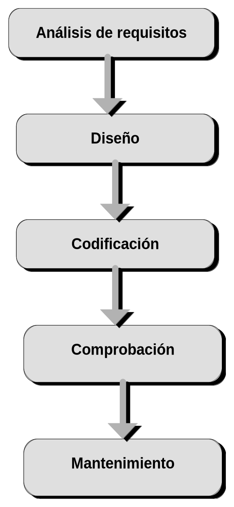

# 4. Breves nociones sobre la ingeniería del software

La Ingeniería del *software* es una metodología aplicable al diseño, a
la escritura, y al mantenimiento eficientes de los programas
informáticos.

Construir un programa es observar un conjunto de métodos y reglas, con
vistas a la obtención racional de un material de *software.*

Entre estas reglas se incluyen los fundamentos conceptuales, la
organización de los proyectos, la definición de los criterios de calidad
y su valoración junto con los medios y acciones que hacen posible la
mejora del material informático.

La metodología de la Ingeniería del *software* afecta a un gran campo de
actividades; como pueden ser: la gestión comercial, el cálculo técnico y
científico, el control de procesos, los sistemas operativos y los
programas de utilidad, las ayudas a la producción de información, la
ingeniería, la enseñanza y el diseño asistido por ordenador y la
ofimática.

La Ingeniería del *software,* como se indica en la **figura 4-1**,
implica cinco fases generales que son aplicables al desarrollo de un
programa.

- **a) Análisis de requisitos:** Consiste en una *descripción
  detallada* de lo que se pretende conseguir con la herramienta
  informática que se piensa desarrollar.

- **b) Diseño:** Constituye un perfil de cómo los requisitos van a
  implementarse en el programa.

- **c) Codificación:** Es el proceso de *escritura del programa* en un
  lenguaje de programación determinado.

- **d) Comprobación:** Examina exhaustivamente los errores del
  programa, asegurándose que la aplicación informática *cumple las
  especificaciones* consideradas en los requisitos.

- **e) Mantenimiento:** Es la fase que se encarga de la *actualización
  y mejora* de las características del programa.

En los capítulos del 5 al 9, se desarrollan las cinco fases de la
Ingeniería del *software* y se aplican a la construcción de la
aplicación informática ***Explocal***.

{#figura-4-1}
