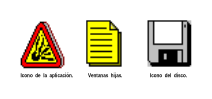
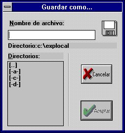
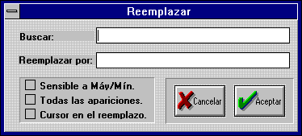
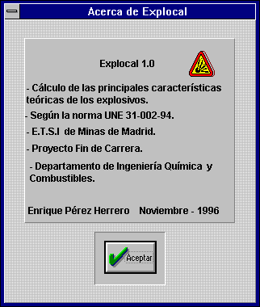
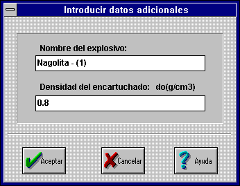
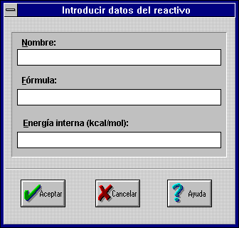
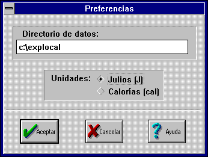

# 6. Diseño

La fase de diseño dentro de la ingeniería del *software* es la fase más
importante ya que afecta de forma directa al resto de las fases.

La calidad del código, la fidelidad de los servicios del *software* y de
los requisitos funcionales, y la efectividad del mantenimiento, dependen
de la fase de diseño.

El diseño de un programa abarca todas las soluciones al problema
planteado por los requisitos, e incluye los principios de diseño
establecidos por las ciencias dedicadas a los ordenadores.

El diseño de un programa debe tener en cuenta las cuestiones siguientes:

a) **Diseño descendente**, que implica la identificación

(desde alto nivel o desde las generalidades, hasta tareas específicas),
de:

- Los módulos principales de administración general, (abarcan todas las
operaciones del programa).

- Las teclas de funciones para llevar a cabo estas operaciones
generales.

- Las funciones individuales para realizar operaciones específicas.

- Las funciones de bajo nivel para ejecutar en detalle tareas dentro de
cada operación.

b) **Alta coherencia**, que requiere que:

- Los módulos y las funciones realicen operaciones específicas y bien
definidas, como partes integrantes del objetivo del *software*.

- Las funciones que se agrupen juntas en un módulo, estén estrechamente
relacionadas.

- Todas las funciones dentro de un módulo sean necesarias para
conseguir los objetivos del mismo.

c) **Libre de acoplamientos**, que pretende conseguir de forma tan
razonable como sea posible:

- Módulos independientes que realicen tareas sin tener que acceder a
otros módulos.

- Iteración mínima entre los módulos y funciones (es decir cada función
puede acceder solamente a aquellas funciones que se requieren para
realizar sus operaciones).

- Acceso en cada módulo y función, a la mínima cantidad de datos de
otros módulos necesarios para llevar a cabo una tarea.

d) **Diagrama de estructura**, que presente los módulos

(ficheros), los subprogramas (funciones) de cada módulo y las relaciones
entre los módulos y los subprogramas.

El diagrama de la estructura es la representación visual de los
principios del diseño descendente, la alta coherencia y el libre
acoplamiento.

## 6.1 Módulos principales

En el diseño de ***Explocal*** se consideran *dos módulos principales*:

a) **Módulo de cálculo de un explosivo,** que debe proporcionar:

- Una estructura de datos adecuada para almacenar toda la información
relativa a los datos, resultados y variables intermedias necesarias para
resolver un determinado problema de cálculo.

- Funciones de lectura y comprobación de datos desde el disco.
(archivos \*.DAT).

- Funciones para calcular datos adicionales.

- Funciones que incorporen cada una de las etapas del proceso de
cálculo.

- Funciones de detección y comprobación de errores en el cálculo.

b) **Módulo del interfaz de usuario,** incluyendo:

- Respuesta a las acciones del usuario: manejo del teclado y del ratón,
(tanto en el menú como en los cuadros de diálogo).

- Introducción de datos y obtención de resultados en el módulo de los
cálculos.

- Manejo del editor de textos. Impresión.

- Lectura y escritura de datos en el disco.

- Acceso al archivo de ayuda.

- Manejo de las ventanas de la aplicación MDI.

Para ser fiel al principio de desacoplamiento entre módulos: el nexo de
unión entre ambos módulos debe ser lo más reducido posible, como se
puede apreciar en el esquema reflejado en la ***figura 6-1***:

***Figura 6-1: Módulos principales***

El código del interfaz de usuario está recogido en el archivo
EXPLOCAL.CPP e incluye el fichero de cabecera CALCULOS.H que contiene el
código relativo al cálculo de las características teóricas de los
explosivos.

Esta separación de módulos independientes se tiene en cuenta tanto en la
fase de diseño como en la de codificación y garantiza cierta facilidad
de actualización del programa a otros sistemas operativos.

En realidad es el *interfaz de usuario* el que incorpora las estructuras
de datos y funciones de los cálculos. Esta es la razón que obliga a que
el acceso a los datos de los cálculos sea lo más simple posible.

## 6.2 Diseño del módulo de cálculo de un explosivo

### 6.2.1 Estructuras de los datos del módulo de cálculo

Tras una observación minuciosa del método de cálculo, se pueden
clasificar todos los datos, constantes y resultados según la ***tabla
6-1***.

[]{#tabla-6-1}
**Tabla 6-1: Clasificación de los datos**

| Datos del problema. |
|---|
| Tablas de datos. |
| Resultados del problema. |
| Errores del problema. |

Fuente: Elaboración propia.

El diseño de las funciones necesarias para realizar los cálculos está
fuertemente influenciado por la organización de las estructuras de
datos. El flujo de información en el módulo de cálculos, teniendo en
cuenta la clasificación de la ***tabla 6-1***, se representa en la
***figura 6-2***.

***Figura 6-2: Flujo de información entre los datos de los cálculos***

Cada tipo de dato, clasificado en la ***tabla 6-1*** dependiendo de la
misión que desempeña en los cálculos, está constituido por una serie de
variables y estructuras que se agrupan en función de la información que
almacenan.

Una estructura de datos, se define como un conjunto de variables
relacionadas entre sí. En las ***tablas 6-2***, ***6-3*** y ***6-4*** se
organizan los datos necesarios para el cálculo de las características
teóricas de los explosivos en: variables simples y en estructuras. Esta
organización abre una vía para construir un algoritmo de resolución.

[]{#tabla-6-2}
**Tabla 6-2: Datos del problema (Estructuras y variables):**

| Categoría | Descripción |
|---|---|
| **DATOS DEL PROBLEMA** | Características de un problema determinado. |
| **Datos de la mezcla explosiva** | Datos del conjunto de reactivos que forman la mezcla: *(los datos de los reactivos forman, en realidad, una matriz de datos de dimensión MAX_REACTIVOS)*. |
| Número de reactivos que forman la mezcla | **NumReact** |

**Nota:** La densidad de encartuchado y el nombre del explosivo, aunque
son datos del problema, se han incluido entre los resultados puesto que
sufren una comprobación que puede alterar su contenido.

[]{#tabla-6-3}
**Tabla 6-3: Tablas de datos y errores (Estructuras y variables)**

| Categoría | Descripción |
|---|---|
| **TABLAS DE DATOS** | Los datos que incluye deben ser leídos, previamente, del disco. |
| **Datos de los productos de explosión** | Forman una matriz de dimensión MAX_PRODUCTOS = 35. En explosivos excedentarios en oxígeno se considera que se forma un producto de explosión por cada elemento, se toman en cuenta un total de MAX_ELEMENTOS = 32. |
| **Datos de las constantes de equilibrio** | Datos de K~1~ (-) y K~2~ (Pa) desde 300 K hasta 6000 K cada 100 K, total TBL_DATOS = 58 datos. |
| **Tabla de errores** | Descripciones y estado de los indicadores del error. |

**Nota:** Los moles de los productos de explosión, se adjuntan a la
tabla de productos de explosión (por razones obvias) aunque en realidad
sean resultados del problema.

[]{#tabla-6-4}
**Tabla 6-4: Resultados del problema (Estructuras y variables)**

*Nota editorial: el documento original solo conserva el título de esta
tabla; el contenido tabular (nombres de variables y estructuras) no se
recuperó en la conversión desde el Word original de 1996 y no ha podido
reconstruirse con fiabilidad a partir del texto disponible.*

Las ***tablas 6-2, 6-3** y **6-4***, contienen (en negrita) los nombres
con los que se va a designar a las variables y a las estructuras en el
código C++. La organización realizada agrupa datos con una estrecha
relación.

Las tablas que contienen datos de las constantes de equilibrio y de las
entalpías de los productos de explosión son homogéneas en los intervalos
de temperatura, esta propiedad simplifica las funciones de acceso a
estos datos.

La tabla de datos de los productos de explosión almacena la información
incluida en las ***tablas 3-1*** y ***3-2*** junto con los datos de las
entalpías de los productos de explosión que vienen en la ***tabla
3-4***.

Las tablas de las *constantes de equilibrio* contienen los datos que
incluye la norma UNE 31-002 [1] en su ANEXO C.

En la **tabla 3-3** se comparan los datos de las constantes de
equilibrio con los de *Meyer R.* [8].

Como ya se tuvo en cuenta en la fase de requisitos, todos los datos se
almacenan en disco en *archivos de texto*. Esto permite que el usuario
pueda acceder a los datos y por lo tanto modificarlos.

Se puede consultar datos de otras fuentes e incluso considerar que se
forman otros productos de explosión.

La organización de los datos que se ha efectuado afecta profundamente al
diseño de las funciones, por ejemplo para calcular el balance de oxígeno
una substancia química deberemos partir de la fórmula de un compuesto,
(en vez de partir de una tabla de pesos), por lo que necesitaremos
acceder a la fórmula del compuesto y determinar el número de átomos de
un elemento dado en la fórmula, esto obliga a crear una función que
devuelva el número de átomos de un elemento en una fórmula.

Además también se deben considerar funciones que lean los datos de los
ficheros de texto y los almacenen en las estructuras.

El diseño de las estructuras de datos que se ha efectuado minimiza el
número de datos necesarios, por ejemplo no se incluyen en la tabla los
pesos moleculares de los productos de explosión puesto que es posible
determinarlos a partir de su fórmula.

Otra característica reseñable del diseño es que permite que el usuario
introduzca el menor número de datos posible para calcular un explosivo,
el resto se debe leer del archivo de datos.

### 6.2.2 Diseño de las funciones necesarias para el cálculo

El diseño de las funciones de los cálculos se basa en el principio
*diseño descendente:* es decir, empieza por el diseño de las funciones
de alto nivel y finaliza con el diseño de las funciones para tareas
específicas.

La función principal del cálculo incorpora **todas** las etapas del
cálculo, el interfaz de usuario debe llamar a una única función para
conseguir los resultados.

La función principal denominada **CalcResultado** se esquematiza en la
***tabla 6-5***, teniendo en cuenta las funciones de menor nivel que
debe incluir en su diseño. Entre estas funciones es de hacer notar la
inclusión de las funciones de detección de errores.

Los errores se consignan durante el proceso de cálculo, sin detenerlo.

Al dividir la función principal en módulos independientes, se consigue
separar las ramas del tronco principal del diseño.

El diseño finaliza cuando se han construido las funciones auxiliares de
acceso y manejo de las tablas de datos, consiguiéndose, de este modo
enlazar la función principal con las estructuras y variables de datos.

Todas las funciones de los cálculos se incluyen, junto con una
descripción detallada en la ***tabla 6-6***, entre ellas se incluyen las
funciones principales, las auxiliares, las de consigna de errores y las
de lectura de datos del disco.

[]{#tabla-6-5}
**Tabla 6-5: Función principal: CalcResultado**

| **Nº** | **Descripción** | **Funciones** |
|:---:|---|---|
| **1** | Previa: Carga los datos de los reactivos y verifica sus valores. | **CargarDatosReactivos**, **VerificarDensidad** |
| **2** | Calcula la fórmula para un kilo de explosivo. | **CalcFormula_1kg** |
| **3** | Calcula la energía interna de la mezcla explosiva. | **CalcEnergia_Interna** |
| **4** | Calcula el balance de oxígeno. | **CalcBO** |
| **5** | Calcula los moles de los productos de explosión a excepción del grafito (C), CO, CO~2~, H~2~O y H~2~, si el balance de oxígeno es negativo. | **CalcMolesProductos** |
| **6a** | Si el explosivo es excedentario en oxígeno se calcula el calor de explosión y la temperatura de explosión (mediante un proceso iterativo) por separado. | **CalcQexplosion**, **CalcTexplosion** |
| **6b** | Si el explosivo es deficitario, la composición de los productos, el calor de explosión y la temperatura de explosión están interrelacionados. La ecuación se resuelve mediante un proceso iterativo que incluye una ecuación polinómica de tercer grado. | **CalcTexpMolesProductos** |
| **7** | Calcula los moles gaseosos a la temperatura de explosión, la masa molecular de los productos, los parámetros adicionales y los de detonación mediante las fórmulas de Kamlet-Jacobs. | **CalcNg**, **CalcM**, **CalcParamAdic**, **CalcKamletJacobs** |
| **8** | Verificar los resultados obtenidos. | **VerificarResultados** |

Nota I: Las funciones de la **tabla 6-5** están ordenados por orden de
ejecución.

Nota II: La **tabla 6-5**, constituye un esquema del algoritmo del
proceso de cálculo.

[]{#tabla-6-6}
**Tabla 6-6: Descripción de las funciones de los cálculos**

| **Nombre** | **Parámetros** | **Respuesta o Resultado.** | **Descripción** | **Funciones auxiliares** | **Datos que emplea o modifica.** |
|---|---|---|---|---|---|
| **BorrarDatos** | - | | Reinicializa los datos del problema. | BorrarError, BorrarMoles | Reactivo, Resultado |
| **BorrarError** | - | - | Reinicializa la lista de errores. | - | Error[i].Ind |
| **BorrarMoles** | - | - | Reinicializa los moles de los productos de explosión. | - | TablaProd[i].Moles |
| **CalcBO** | i, fórmula | Balance de oxígeno (%) | *Caso: i=BO_PROBO:* Calcula el balance de oxígeno según la definición, es decir, supone que los productos de explosión están en su mayor estado de oxidación. Se emplea en todos los resultados que se muestran en pantalla. *Caso: i=BO_PRODEX:* Calcula el balance de oxígeno teniendo en cuenta los productos de explosión que se van a formar. Se emplea en decidir si el explosivo es de verdad excedentario o deficitario en oxígeno y para calcular los moles de oxígeno entre los productos de explosión. | CalcPmol, CalcNumAt | TablaProd[i].Masa_atomica, TablaProd[i].FormulaBO, TablaProd[i].Formula |
| **CalcCoef** | temperatura, Bh, Bo, Bc, f_nCO, Grafito | Coeficientes de la ecuación polinómica de tercer grado en moles de CO | Calcula la ecuación en moles de CO, f_nCO a partir de los términos independientes del sistema H, O, C, de la temperatura y de si se produce o no grafito. | K1, K2_ | - |
| **CalcEnergia_Interna** | - | Energía interna de la mezcla explosiva. | Calcula la energía a partir de los datos de los reactivos. | - | Reactivo[i].Porcentaje, Reactivo[i].Energia, NumReact, Resultado.Eo |
| **Calcf_nCO** | f_nCO, nCO | Valor de la función polinómica. | Devuelve el valor de la función polinómica de tercer grado en el punto nCO, es decir: f(nCO) | - | - |
| **CalcFormula_1kg** | - | Fórmula para un kilo de explosivo. | Agrupa todos los datos de la mezcla explosiva en uno sólo de fácil manejo. | CalcNumAt | Resultado.Formula_1kg, Reactivo[i].Porcentaje, Reactivo[i].PesoMol, Reactivo[i].Formula, TablaProd[i].Simbolo, Resultado.Formula_1kg, NumReact |
| **CalcKamletJacobs** | - | Parámetros de detonación. | Aproximación al estado CJ de las detonaciones mediante fórmulas empíricas. | - | Resultado.Fi, Resultado.Pcj, Resultado.Dcj, Resultado.dcj, Resultado.d0, Resultado.CoefAdiab |
| **CalcM** | - | Masa molecular media de gases. | Calcula la masa molecular de los productos gaseosos. | CalcNg, Gas, CalcMol | Resultado.Texplosion, TablaProd[i].Moles, TablaProd[i].Formula |
| **CalcMolesProductos** | - | Moles de los productos de explosión. | Calcula los moles de los productos de explosión suponiendo que tanto el carbono como el hidrógeno se oxidan completamente a CO~2~ y H~2~O, y que el resto de los elementos se oxidan a óxido o carbonato, excepto los halógenos que forman el haluro correspondiente y el Hg que se volatiliza. No calcula los moles de oxígeno. Para mezclas deficitarias en oxígeno no proporciona los moles de productos: CO~2~,CO,C,H~2~O,H~2~ que dependen de la temperatura. | CalcNumAt, CalcPMol, CalcBO | Resultado.Formula_1kg, TablaProd[i].Moles, TablaProd[i].Formula |
| **CalcNg** | temperatura | Moles gaseosos | Cantidad de moles gaseosos producidos en la detonación (mol/kg) | Gas | TablaProd[i].Moles |
| **CalcNumAt** | fórmula, i | Número de átomos. | Determina el número de átomos del elemento "i" en "fórmula" | - | TablaProd[i].Simbolo |
| **CalcParamAdic** | - | Parámetros adicionales. | Calcula el volumen de gases en condiciones normales y la energía especifica del explosivo. | - | Resultado.f, Resultado.Ng, Resultado.Vcn |
| **CalcPMol** | fórmula | Peso molecular | Calcula el peso molecular del compuesto dado por "fórmula" | CalcNumAt | TablaProd[i].Masa_atomica |
| **CalcQexplosion** | - | Calor de explosión. | Calcula el calor de explosión (kcal/kg) a partir de la energía interna y los productos de explosión. | - | Resultado.Qexplosion, TablaProd[i].Moles, TablaProd[i].Eformacion |
| **CalcQsensible** | temperatura | Calor sensible de los productos de explosión (kcal/kg) | Se emplea en la resolución de la ecuación en temperatura en los procesos iterativos. | CalcNg, HT_H298 | TablaProd[i].Moles |
| **CalcRemonte** | temperatura, Bh, Bo, Bc, nCO, Grafito | SI / NO | Realiza el remonte del sistema, determinando los moles de CO~2~, CO, C, H~2~O, H~2~. Además verifica si la solución es correcta o no. | K2_ | TablaProd[i].Moles |
| **CalcResultado** | - | - | Enlaza todas las funciones para conseguir el algoritmo completo. | Ver tabla 3-4 | Resultado.BO, Resultado.Ng |
| **CalcSolucion** | fn_CO, CotaInf, CotaSup | Solución de la ecuación polinómica | Devuelve los moles de CO producidos (mol/kg). Teniendo en cuenta las restricciones de la solución. Cotas superior e inferior. | - | - |
| **CalcTermindep** | j | Término independiente j. | Calcula el termino independiente del sistema de ecuaciones formado por los balances de H, O, C. Sólo funciona para explosivos deficitarios en oxígeno. | CalcNumAt | Resultado.Formula_1kg, TablaProd[i].Moles |
| **CalcTexplosion** | - | Temperatura de explosión. | Resuelve la ecuación: *Qsensible(temperatura)=Qexplosion*. Sólo funciona si el explosivo es excedentario en oxígeno. | CalcQsensible | Resultado.Texplosion, Resultado.Qexplosion |
| **CalcTexpMolesProductos** | - | Composición y temperatura. | Calcula la temperatura de explosión y los moles de C(grafito), CO, CO~2~, H~2~O, H~2~. Sólo si el explosivo es deficitario. | CalcTermIndep, CalcNumAt, CalcCoef, CalcSolucion, CalcRemonte, CalcQsensible, PonerError, BorrarMoles | Resultado.Texplosion, Resultado.Qexplosion |
| **CalcTotal** | - | Porcentaje total | Porcentaje total de la mezcla (%). Se emplea en comprobar si se han introducido correctamente los datos. | - | Reactivo[i].Porcentaje, NumReact |
| **CargarDatosReactivos** | - | - | Carga del archivo los datos de los reactivos que el usuario ha seleccionado. | CalcBO, CalcPMol | Reactivo |
| **CargarTablaError** | directorio | SI / NO | Carga el archivo de datos y almacena los datos en las estructuras. La respuesta es afirmativa si ha podido encontrar el archivo de datos. | PonerError | Error[i].des, ERROR.DAT |
| **CargarTablaK12** | directorio | SI / NO | Carga el archivo de datos y almacena los datos en las estructuras. La respuesta es afirmativa si ha podido encontrar el archivo de datos. | PonerError | Tabla_K1[i], Tabla_K2[i], CONSTANT.DAT |
| **CargarTablaProd** | directorio | SI / NO | Carga el archivo de datos y almacena los datos en las estructuras. La respuesta es afirmativa si ha podido encontrar el archivo de datos. | PonerError, BorrarDatos, CargarTablaError | TablaProd, Error[i].des, TABLAPROD.DAT |
| **Gas** | temperatura, i | SI / NO | ¿El producto "i" es gaseoso o no a la "Tª" temperatura. | - | TablaProd[i].Tvapor |
| **HT_H298** | temperatura, j | Entalpía | Función de acceso a la tabla de datos, realiza una interpolación lineal cuando se le pide una entalpía de los productos de explosión entre dos valores de la tabla. | IndiceTbl | TablaProd[i].HT_H298[j] |
| **IndiceTbl** | temperatura | Índice tablas. | Aproxima el índice de acceso a las tablas. El dato buscado en las tablas se interpola linealmente entre los valores enteros más próximos. | PonerError | - |
| **K1** | temperatura | Constante de equilibrio K~1~ | Función de acceso a las tablas. Valor de la constante de equilibrio K1. | IndiceTbl | Tabla_K1[i] |
| **K2_** | temperatura | Constante de equilibrio K~2~´ | Función de acceso a las tablas. Valor de la constante de equilibrio K2' (kg/mol). | IndiceTbl | Tabla_K2[i] |
| **PonerError** | i | - | Activa el indicador i de la lista de errores. | - | Error[i].Ind |
| **TomarError** | i | SI / NO | Devuelve el estado del error i de la lista de errores. | - | Error[i].Ind |
| **VerificarDensidad** | - | - | Si la densidad inicial es errónea, usa un valor por defecto. | PonerError | Resultado.d0 |
| **VerificarResultados** | - | - | Verifica los valores de los resultados del problema. | PonerError, CalcNg | Resultado |

Nota I: Como se puede observar, la tabla está ordenada alfabéticamente
por el nombre de la función.

Nota II: Los nombres de las funciones, estructuras y variables coinciden
con los de la etapa de codificación, hay que hacer notar que en C++ no
se admiten tildes en los nombres.

Nota III: En los nombres de las estructuras se ha empleado el operador
punto de C, del modo siguiente:

*(Nombre_estructura).Elemento_de_la_estructura*

## 6.3 Diseño del interfaz de usuario

El *interfaz de usuario* de una aplicación informática está constituido
por todos aquellas funciones que permiten la interacción del programa
con los periféricos: como el teclado, la pantalla, las unidades de disco
y la impresora.

Sin el *interfaz de usuario* sería imposible manejar el programa.

Con la llegada de los entornos gráficos, como el *Windows*, el interfaz
de usuario de las aplicaciones informáticas ha sufrido notables mejoras.

Se han abandonado las rígidas líneas de órdenes y las listas de
impresoras incompatibles consiguiendo que el *software* se diseñe
pensando en el usuario y no en el diseñador.

Un diseño correcto del interfaz de usuario disminuye el tiempo de
aprendizaje del usuario y proporciona a la aplicación un aspecto
profesional.

### 6.3.1 Funciones de un interfaz de usuario para Windows

En el paquete *del Entorno de Desarrollo Integrado (IDE) de Borland C++*
con el que se va a codificar ***Explocal***, está incluida un aplicación
denominada *Resource Workshop* que permite diseñar todos los elementos
gráficos de una aplicación para *Windows* sin escribir ni una sola línea
de código.

Los elementos gráficos se almacenan en un archivo de recursos

(\*.RC), que previamente incluidos en el archivo de proyecto (\*.PRJ)
se compilan junto con el código.

Esta característica permite separar el diseño de los elementos gráficos
para un programa *Windows* de la codificación.

El diseño del *interfaz de usuario* debe incluir, por consiguiente, los
siguientes elementos:

- Ventana de la aplicación informática.

- Iconos de la aplicación y de las ventanas hijas.

- Menú, teclas aceleradoras y funciones respuesta asociadas.

- Cuadros de diálogo, botones, listas, cajas de texto y funciones de
respuesta asociados.

- Funciones de manejo de las ventana hijas.

- Funciones de escritura y lectura de archivos.

- Funciones del manejo del procesador de textos:

(impresora, portapapeles, buscar y reemplazar texto.)

- Mapas de bits.

- Funciones de acceso al archivo de ayuda.

- Introducción y modificación de datos para el cálculo.

- Interacción de todos los elementos.

### 6.3.2 Diseño de los iconos

Explocal hace uso de tres iconos:

a) Icono de la aplicación o de la ventana marco:

Es el icono que representa el programa y por lo tanto debe ser un
logotipo que distinga ***Explocal*** del resto de aplicaciones
*Windows*.

b) Icono de las ventanas hijas o ventanas de texto:

Resulta necesario puesto que se va a diseñar una aplicación MDI.
Representa a las ventanas hijas cuando están minimizadas.

c) Icono para la identificación de los diálogos de entrada y salida de
ficheros del disco:

Sólo se utiliza para avisar al usuario de la grabación o lectura de
ficheros en disco, únicamente desempeña funciones estéticas.

La ***figura 6-3*** muestra el aspecto que presentan los iconos que se
han diseñado.

{#figura-6-3}

### 6.3.3 Menú. Funciones respuesta

El usuario selecciona la tarea que desea realizar mediante el típico
menú *Windows* de múltiples opciones y submenús desplegables que
constituye la base de toda aplicación basada en ventanas.

En *Windows*, el nivel superior de un menú se muestra a lo largo de la
parte superior de la ventana. Los submenús se visualizan como menús de
tipo emergente.

El manejo del menú se realiza principalmente mediante el empleo del
ratón, aunque en cualquier aplicación informática profesional debe ser
posible hacer uso del menú con la única ayuda del teclado.

El teclado tiene acceso al menú de tres formas diferentes:

a) Selección mediante las *teclas del cursor, el tabulador y la tecla
"Alt"*: Se incorpora a cualquier menú *Windows* por el propio sistema.

b) Las *teclas de acceso rápido* seleccionan una de las opciones de un
submenú: La tecla elegida se tiene en cuenta añadiendo el carácter
*ampersand* "&", delante de la letra del nombre del submenú (en el menú
aparecerá la letra que representa a la tecla de acceso rápido,
subrayada).

c) *Las teclas aceleradoras*: representan una combinación de teclas que
selecciona una de las funciones del menú sin necesidad de acceder a la
opción en el menú. Se utilizan únicamente en las funciones del menú que
se emplean con mayor frecuencia.

***Explocal*** incorpora las tres formas de uso del teclado.

El menú debe mantener activas únicamente las opciones que es posible
seleccionar en un momento determinado. Con este propósito en mente, el
código debe incluir una función que se encargue de activar (o
desactivar) ciertas opciones del menú.

Los distintos tipos de funciones que debe incluir el menú son los
siguientes:

d) Manejo de las ventanas hijas.

e) Manejo del editor de texto.

f) Introducción de datos.

g) Manejo de los archivos.

h) Acceso a la ayuda.

i) Selección de preferencias.

El objetivo de estas funciones se puede cumplir: directamente o con la
ayuda de cuadros de diálogo, por lo que en muchas ocasiones es tarea del
menú ceder el control de la aplicación a los cuadros de diálogo.

En la ***tabla 6-7***, se incluyen todas las opciones del menú contando
con: las selecciones, los submenús, el objetivo que cumplen, las teclas
aceleradoras y las de acceso rápido.

La agrupación de cada submenú con cada elemento del nivel superior del
menú (o selección) se realiza atendiendo a las especificaciones del
*estándar (CUAA) de IBM*.

[]{#tabla-6-7}
**Tabla 6-7: Opciones del menú**

| **Selec.** | **Submenú** | **Tecla acel.** | **Descripción de la función.** |
|---|---|---|---|
| Archivo (A) | Nuevo (N) | -- | Creando una ventana hija de texto vacía. |
| | Abrir... (A) | -- | Abre un archivo de texto del disco. Emplea un cuadro de diálogo para seleccionar el nombre del archivo. |
| | Guardar (G) | -- | Guarda el *archivo de texto* correspondiente a la ventana hija activa. |
| | Guardar como... (c) | -- | Guarda un *archivo de texto* en el disco. Emplea un cuadro de diálogo para seleccionar el nombre del archivo. |
| | Imprimir (I) | -- | Saca por impresora el texto de la ventana hija. |
| | Preferencias... (P) | -- | Cuadro de diálogo de preferencias. |
| | Salir (S) | Alt + F4 | Abandona la aplicación, cerrando la ventana principal y las ventanas hijas abiertas. |
| Edición (E) | Deshacer (D) | Ctrl + Z | Borra la última operación realizada en el editor de la ventana hija activa. |
| | Cortar (C) | Ctrl + X | Elimina el texto seleccionado en el editor de la ventana hija activa y copia el texto seleccionado al portapapeles. |
| | Copiar (C) | Ctrl + C | Copia el texto seleccionado de la ventana hija activa al portapapeles. |
| | Pegar (P) | Ctrl + V | Copia el contenido de portapapeles en el editor a partir de la posición del cursor. |
| | Borrar (B) | Supr | Elimina el texto seleccionado del editor. |
| | Borrar todo (r) | Ctrl+Sup | Elimina todo el contenido del editor de texto. |
| | Seleccionar todo (S) | Ctrl + E | Extiende la selección a todo el texto del editor de la ventana hija activa. |
| Buscar | Buscar... (B) | -- | Busca en el editor, la primera aparición del texto introducido mediante un cuadro de diálogo. |
| | Repetir búsqueda (R) | F3 | Busca la siguiente aparición del texto introducido anteriormente, en la ventana hija activa. |
| | Remplazar... (e) | -- | Reemplaza el texto seleccionado por otro. |
| Explosivo (E) | Nuevo explosivo... (N) | F5 | Después de que se introduzcan los datos del explosivo, con la ayuda de tres cuadros de diálogo, crea una ventana hija conteniendo los resultados del explosivo. |
| | Abrir explosivo... (A) | F6 | Carga los datos del explosivo del disco y muestra los resultados en una ventana hija. |
| | Guardar explosivo (G) | -- | Guarda los datos del explosivo introducido, en el archivo asociado al explosivo. |
| | Guardar explosivo como... (u) | -- | Guarda los datos del explosivo asociado a la ventana hija activa, en el archivo cuyo nombre se introduce mediante un cuadro de diálogo. |
| | Modificar composición... (M) | F7 | Cambia los datos del explosivo asociado a la ventana hija activa y actualiza los resultados. |
| | Modificar lista de reactivos... (o) | -- | Accede al archivo de datos REACTIVO.DAT y permite modificar su contenido. |
| Ventana (V) | Cascada (C) | May+F5 | Organiza todas las ventanas hijas abiertas, solapando unas con otras. |
| | Mosaico (M) | May+F4 | Organiza todas las ventanas hijas abiertas, cubriendo todo el espacio de la ventana marco. |
| | Organizar iconos (O) | -- | Coloca y ordena los iconos de las ventanas hijas minimizadas. |
| | Cerrar todo (e) | -- | Cierra todas las ventanas hijas. |
| Ayuda (u) | Índice (Í) | F1 | Acceso al índice del archivo de ayuda. |
| | Buscar ayuda sobre... (B) | | Acceso al contenido del archivo de ayuda. |
| | Acerca de Explocal... (A) | | Muestra en pantalla un cuadro de diálogo con información sobre ***Explocal***. |

Nota I: Las opciones de los submenús cuyo nombre termina con puntos
suspensivos (...), necesitan la ayuda de un cuadro de diálogo para su
ejecución.

Nota II: El carácter entre paréntesis junto al nombre del submenú (que
en la aplicación aparece subrayado) equivale a la tecla de acceso rápido
del submenú.

Nota III: Las entradas marcadas en gris en la tabla, permanecen
desactivadas mientras no se creen ventanas hijas puesto que corresponden
a funciones que trabajan con estas ventanas.

Como se puede apreciar en la **tabla 6-7**: la construcción del menú se
ha diseñado procurando que (tanto en las selecciones como en los
submenús): los nombres (y su situación), las teclas de acceso rápido y
las teclas aceleradoras, coincidan con los de los editores incluidos en
el *Windows* (como por ejemplo el *Bloc de notas* o el *Microsoft
Word*).

De este modo se consigue que la aplicación resulte fácil de manejar a
cualquier usuario acostumbrado a trabajar con el entorno *Windows*.

### 6.3.4 Cuadros de diálogo

Después de los menús, no hay elementos de la interfaz de *Windows* más
importantes que los cuadros de diálogo. Un *cuadro de diálogo* es un
tipo de ventana que proporciona un medio más flexible que los menús para
la interacción del usuario con la aplicación informática para *Windows*.

En general, los cuadros de diálogo permiten al usuario seleccionar o
introducir información que empleando un menú sería difícil (o imposible)
de manejar.

Un cuadro de diálogo interactúa con el usuario por medio de uno o más
controles.

Un *control* es un tipo específico de ventana de entrada o salida. Un
control pertenece a su ventana padre que en este caso es el cuadro de
diálogo.

Como ya se indicó en la ***tabla 6-7***, ciertas funciones del menú
necesitan el auxilio de cuadros de diálogo para ejecutarse.

En general, ***Explocal***, emplea cuadros de diálogo cuando es
necesario introducir datos en el programa.

Cada elemento que forma parte del cuadro de diálogo (botones, cuadros de
lista, cuadros de edición...), necesita una o varias funciones de
respuesta para manejarlo.

Existen cuadros de diálogo que necesitan que se les proporcione una
función de autoconfiguración que cargue datos o inicialice *los cuadros
de lista* y los *cuadros de edición*.

En la ***tabla 6-8*** se listan todos los cuadros de diálogo de
***Explocal*** y su modo de acceso.

[]{#tabla-6-8}
**Tabla 6-8: Cuadros diálogo**

| **Modo de acceso al diálogo.** | **Nombre** | **Título.** |
|---|---|---|
| Archivo (A) / Abrir... (A); Explosivo (E) / Abrir explosivo... (A) | SD_FILEOPEN | Abrir |
| Archivo (A) / Guardar como... (c); Explosivo (E) / Guardar explosivo como... (u) | SD_FILESAVE | Guardar como |
| Buscar (B) / Buscar... (B) | SD_SEARCH | Buscar |
| Buscar (B) / Remplazar... (e) | SD_REPLACE | Reemplazar |
| Explosivo (E) / Nuevo explosivo... (N); DIALOGO_2/Botón(Cancelar) | DIALOGO_1 | Composición cualitativa de la mezcla explosiva. |
| DIALOGO_1/Botón(Aceptar); DIALOGO_3/Botón(Cancelar); Explosivo (E) / Modificar composición... (M) | DIALOGO_2 | Composición cuantitativa de la mezcla. |
| DIALOGO_2/Botón(Aceptar) | DIALOGO_3 | Introducir datos adicionales. |
| Explosivo (E) / Modificar lista de reactivos... (o); DIALOGO_5/Botón(Cancelar); DIALOGO_5/Botón(Aceptar) | DIALOGO_4 | Modificar la lista de reactivos. |
| DIALOGO_4/Botón(Añadir) | DIALOGO_5 | Introducir datos del reactivo. |
| Archivo (A) / Preferencias... (P) | DIALOGO_6 | Preferencias |
| Ayuda (u) / Acerca de Explocal... (A) | DIALOGO_ACERCA | Acerca de Explocal |

El aspecto que presentan los cuadros de diálogo de ***Explocal*** se
muestran en las ***figuras*** desde la ***6-4*** a la ***6-14***.

En las figuras también se puede observar los controles que contiene cada
diálogo.

Los botones de todos los diálogos de ***Explocal***, son de los
denominados botones al estilo *Borland (Borland Windows Custom
Controls)*.

{#figura-6-4}

{#figura-6-5}

{#figura-6-6}

{#figura-6-7}

{#figura-6-8}

{#figura-6-9}

{#figura-6-10}

{#figura-6-11}

{#figura-6-12}

{#figura-6-13}

{#figura-6-14}

Los diálogos que leen los datos de los reactivos almacenados en el
archivo de texto REACTIVO.DAT (diálogos: DIALOGO_1, DIALOGO_4)
contienen un *cuadro de lista* con los nombres de los reactivos y otro
con los datos de un reactivo.

Cualquier selección (con el rectángulo foco) en la lista de los nombres
de los reactivos, produce que se muestren, en la otra lista, los datos
del reactivo seleccionado.

El *rectángulo foco* marca el elemento del diálogo que, en un momento
dado, recibe los mensajes del usuario. Este rectángulo se debe poder
mover, ordenadamente, por todos los controles con la ayuda del ratón y
sólo con el teclado.

El diálogo de *Preferencias* (véase ***figura 6-14***) modifica el
archivo de inicialización EXPLOCAL.INI.

### 6.3.5 Mapas de Bits

Al iniciar la aplicación ***Explocal***, es necesario cargar todos los
datos necesarios para su funcionamiento, situados en los archivos
TABLPROD.DAT, CONSTANT.DAT y ERROR.DAT.

Esta operación lleva cierto tiempo y mientras transcurre: se cambia el
cursor al cursor de espera (reloj de arena) y se muestra un *mapa de
bits* con un logotipo del programa.

El mapa de bits se muestra en la ***figura 6-15***.

{#figura-6-15}
