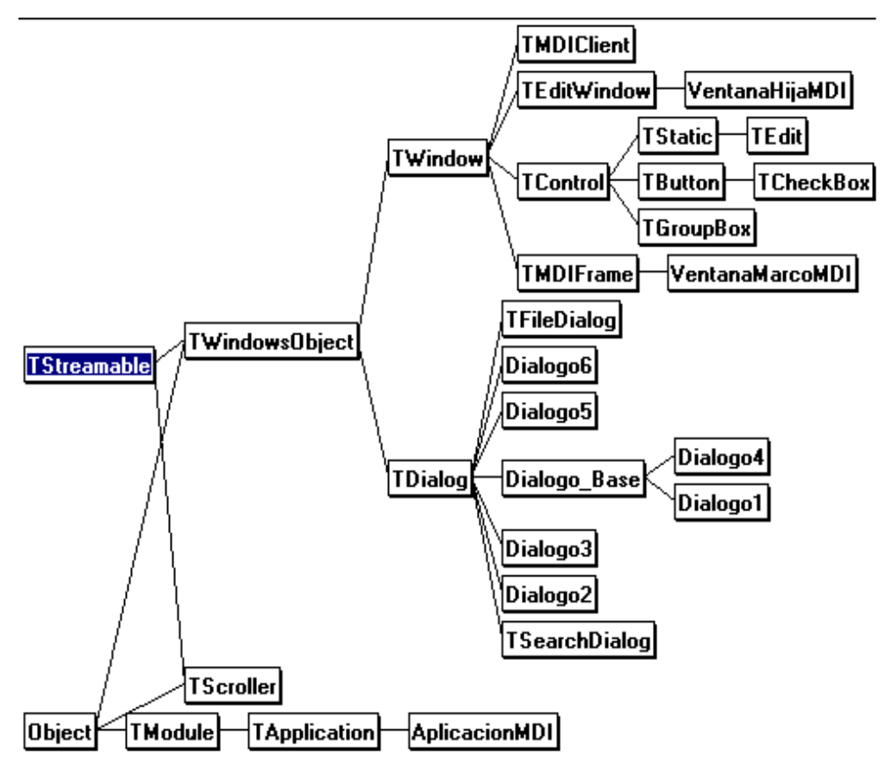

# 7. Codificación

La fase de codificación de la Ingeniería del *software* implica el uso
de un lenguaje particular de programación (en este caso C++) para llevar
adelante el diseño del programa. Esta fase, como las otras, sigue
ciertos principios de la *disciplina de programación*, denominados:

a) **Programación descendente:** En la que las funciones son más o
menos escritas en orden, desde las rutinas de alto nivel (general) a las
rutinas de bajo nivel (específico), paralelamente al *diseño
descendente* utilizado en la fase de diseño. La programación descendente
tiene la ventaja de ser generalmente mejor para interpretar que la
programación ascendente, puesto que tiende a centrarse en los detalles
individuales y no abarca lo suficiente el diseño del programa.

b) **Ocupación de la información,** que implica limitaciones en la
"visibilidad" de las funciones y variables para aquellos módulos y
funciones que necesiten la información.

c) **Nombres con significación** de los objetos del programa
(funciones, variables, estructuras...). Un identificador debe contener
información intrínseca sobre el propósito del objeto. Por ejemplo la
variable llamada **masa_atomica** es más descriptiva que **ma** ó que
**xj7**.

d) **Control del programa**, que sigue los siguientes principios:

- Utilizar una posibilidad de entrada única y de salida única en todas
  las funciones.

- Evitar la sentencia **goto** *(programación espagueti)*.

- Limitar la formación de estructuras anidadas **if...else**.

e) **Disposición del programa**, que incluye numerosos espacios en
blanco y párrafos consistentes (identación de bloques de sentencias).

f) **Documentación interna**, que incluye identificadores con
significación (como se mencionó antes) y comentarios explicativos.

g) **Lista de datos**, que incluye una lista alfabética de objetos de
programa (módulos, funciones, variables, estructuras).

Los listados de los diferentes módulos que componen el código de la
aplicación informática ***Explocal***, se incorporan en los anexos del
proyecto debido a su gran extensión.

Observando el código de cada módulo se puede comprobar la gran
importancia que los principios: a, b, c, d, e, f, han tenido en su
elaboración.

## 7.1 Características del entorno de desarrollo de *software*

Las herramientas disponibles para poder construir un aplicación,
influyen notablemente en la codificación.

La utilización de uno u otro lenguaje de programación para llevar a cabo
un proyecto informático es muchas veces determinante de su éxito o
fracaso.

Esta es la principal razón que obliga a conocer en profundidad las
características de un determinado lenguaje de programación, las
bibliotecas de funciones y el entorno gráfico del compilador (o
intérprete).

El contenido de todos los archivos, conteniendo el código de
***Explocal*** se muestran en los anexos del proyecto.

### 7.1.1 El lenguaje C

El lenguaje de programación C fue desarrollado en 1972 por *Dennis
Ritchie*, de los laboratorios Bell. La idea principal de Ritchie era
crear un lenguaje de programación de *propósito general* que realizara
muchas de las tareas reservadas anteriormente a los lenguajes
ensambladores y con el que resultara fácil de programar. Obtuvo un éxito
admirable mediante la combinación de las ventajas de los lenguajes
compiladores y ensambladores.

El lenguaje C permite un total control del ordenador, tanto a bajo como
a alto nivel (código máquina), por lo que se puede considerar un
lenguaje de alto y bajo nivel.

Su sintaxis es taquigráfica, permitiendo disminuir el número de
caracteres necesario para programar cualquier código.

C incorpora, además, toda la filosofía de la *programación estructurada*
lo que le sitúa por delante de lenguajes no estructurados (con saltos)
tipo BASIC.

### 7.1.2 El lenguaje C++

C++ es un superconjunto de C.

El C++ que en un principio se llamó "C con clases" fue desarrollado por
*Bjarne Stroustrup* en los laboratorios Bell de Murray Hill (Nueva
Jersey) en 1980.

En 1983 se le cambió el nombre por el de C++ (que quiere decir
"incremento de C"). Desde entonces ha experimentado dos revisiones de
importancia (una en 1985, y otra en 1989). La versión actual de C++ es
la 2.1, y es la que está implementada en el paquete de la versión *3.1
de C++ de Borland*.

Una de las razones que motivaron el desarrollo de C++ fue la de permitir
al programador, manejar programas de una complejidad cada vez más
creciente.

Aunque C++ se puede aplicar a cualquier tipo de tarea de programación,
está especialmente indicado para crear aplicaciones *Windows*.

Una razón de ello, es que el sistema operativo *Windows* está organizado
de una forma orientada a objetos.

En efecto, de forma muy concreta, una ventana (window en inglés) es un
objeto.

De esta manera, Borland C++ proporciona un entorno óptimo para el
desarrollo de aplicaciones *Windows*.

Puesto que C++ es un lenguaje de programación orientado a objetos y que
*Windows* es un sistema operativo orientado a objetos.

### 7.1.3 La programación orientada a objetos (OOP)

La programación orientada a objetos (o más brevemente OOP) es una nueva
forma de abordar el trabajo de programación. Los enfoques de
programación han cambiado drásticamente desde la invención de la
computadora.

La razón principal que ha originado este cambio ha sido atender la
creciente complejidad de los programas: Por ejemplo, cuando se
inventaron las computadoras, la programación se hacía desde el panel de
control de la computadora, donde se introducían las instrucciones de
máquina binarias mediante conmutadores (*toggles*).

Este enfoque funcionó, siempre y cuando los programas no tuvieran más de
unos cuantos centenares de instrucciones de extensión. A medida que
fueron creciendo los programas, se inventó el lenguaje ensamblador, de
modo que un programador pudiera hacer frente a programas cada vez más
grandes y cada vez más complejos, mediante la representación simbólica
de las instrucciones de máquina. A medida que siguieron creciendo los
programas se introdujeron los lenguajes de alto nivel, que le
proporcionan al programador mejores herramientas para manejar dicha
complejidad.

El primer lenguaje de gran difusión fue indiscutiblemente el FORTRAN.
Aunque el FORTRAN fue un impresionante primer paso, no se puede decir
que sea un lenguaje que estimule la preparación de programas claros y
fáciles de entender.

Los años sesenta vieron nacer a la programación estructurada. Este es el
método que preconizan los lenguajes tales como C y Pascal. Por medio de
la utilización de lenguajes estructurados, por primera vez fue posible
escribir con bastante facilidad programas de complejidad moderada. No
obstante, tan pronto como el proyecto alcanza un cierto tamaño, se hace
incontrolable.

Llega un momento en que su complejidad excede a aquélla que puede
manejar un programador aún mediante la programación estructurada.

Consideremos lo siguiente: en cada hito del desarrollo de la
programación, se crearon métodos para permitir al programador trabajar
con una complejidad creciente. En cada paso del camino, un nuevo enfoque
tomó los mejores elementos de los métodos anteriores y avanzó hacia
adelante.

En la actualidad, muchos proyectos se hallan próximos o bien en el punto
mismo a partir de cual el enfoque estructurado ya no tiene validez. Para
resolver este problema, se inventó la programación orientada a objetos.

La programación orientada a objetos ha tomado las mejores ideas de la
programación estructurada y las ha combinado con varios conceptos nuevos
y poderosos, que estimulan a contemplar la tarea de programación bajo un
nuevo prisma. La programación orientada a objetos permite que un
problema se pueda descomponer más fácilmente en subgrupos de partes
relacionadas del mismo problema. Entonces, por medio del lenguaje, se
pueden traducir estos subgrupos en unidades auto contenidas denominadas
objetos.

Todos los lenguajes de programación orientada a objetos tienen tres
cosas en común:

a) **Los objetos**:

Es la característica individual más importante de un lenguaje de
programación orientada a objetos. Expresado en términos sencillos, **un
objeto es un ente lógico que contiene datos e instrucciones que
manipulan dichos datos**. Dentro de un objeto, parte de las
instrucciones y/o de los datos pueden ser privados (*private*) con
respecto al objeto e inaccesibles a cualquier elemento que esté fuera
del objeto. Otras instrucciones y/o datos pueden ser públicos (*public*)
y por lo tanto accesibles desde otras partes de un programa.

Al hacer privados los elementos confidenciales o delicados, un objeto
puede impedir que cualquier otra parte no relacionada con el programa,
modifique de forma accidental o bien utilice de forma indebida dichos
elementos.

El enlace de las instrucciones junto con los datos de esta manera
especial se conoce como **encapsulamiento**.

b) **Polimorfismo:**

Los lenguajes de programación orientada a objetos soportan el
polimorfismo, lo que en esencia quiere decir que un mismo nombre puede
ser utilizado para varios propósitos levemente distintos, pero
relacionados entre sí. El polimorfismo permite que se use un nombre para
especificar una clase general de acción. No obstante dependiendo del
tipo de dato con el cual se esté tratando, se ejecutará una instrucción
específica de la clase general.

El C++ presta soporte tanto al polimorfismo en tiempo de ejecución como
en tiempo de compilación puesto que C++ es un lenguaje de compilador.

c) **Herencia:**

La herencia es un proceso por medio del cual un objeto puede adquirir
las propiedades de otro. Esto es importante porque permite dar soporte
al concepto de clasificación. Sin el uso de las clasificaciones, cada
objeto tendría que definir de forma explícita todas sus características.
No obstante, cuando se necesita definir solamente aquellas cualidades
que hacen que el objeto sea único dentro de su clase. El mecanismo de
herencia es el que se encarga de que un objeto se pueda considerar como
un caso particular de una clase más general.

### 7.1.4 La biblioteca de clases *ObjectWindows* (*OWL*)

C++ y Turbo C++ para *Windows* proporciona una biblioteca de clases
llamada *Object Windows* que simplifica enormemente la programación
para *Windows*.

Sin una biblioteca semejante, la codificación de aplicaciones *Windows*
se volvería más dificultosa, e incluso frustrante, y precisaría de un
proceso de programación de mayor coste.

La ventaja más sobresaliente de la biblioteca *ObjectWindows* es que
oculta de manera efectiva muchos de los detalles de la programación para
*Windows*, con lo cual se puede concentrar realmente en el esfuerzo en
la creación de programas *Windows*, en vez de tener que detenerse en los
numerosos e intrincados detalles que usualmente están relacionados con
esta labor.

El entorno *Windows* es accesible mediante un interfaz controlado por
medio de llamadas, que se denomina *interfaz de programas de aplicación*
(API). Las, aproximadamente, 1000 funciones de la API efectúan todos los
servicios que proporciona *Windows*.

Por su parte, *Object Windows* es una jerarquía compleja de clases que
viene a encapsular porciones de la API para simplificar la creación de
programas para *Windows*.

No obstante, *Object Windows* siempre utiliza en último término la API
para efectuar todas sus operaciones.

Hay un subsistema de la API que se llama *Interfaz de Dispositivos
Gráficos* (GDI); es la parte de *Windows* que presta soporte gráfico
independiente de los dispositivos. Las funciones del GDI son las que
posibilitan que una aplicación informática para *Windows* se pueda
ejecutar en una amplia variedad de sistemas diferentes (*hardware*).

El éxito de la biblioteca de clases *Object Windows* se basa en la
implementación de la programación orientada a objetos combinándola con
los procesos de programación basada en eventos que constituye la
filosofía subyacente bajo la programación *Windows*.

Es de hacer notar que: Aunque la creación de aplicaciones informáticas
sofisticadas para *Windows* con la biblioteca OWL requiere algunos
esfuerzos, programar con *Object Windows* es mucho más fácil (y
económico) que usar el tradicional paquete *SDK de Microsoft*.

## 7.2 Codificación de los módulos

### 7.2.1 Archivo de proyecto (EXPLOCAL.PRJ)

El archivo de proyecto de una aplicación contiene toda la información
necesaria para compilar el código ejecutable (\*.EXE), información que
consiste en: las opciones de compilación y enlazado, nombre de los
archivos de recursos, bibliotecas precompiladas, módulos de código
(\*.CPP) y archivo de definición.

El entorno integrado se debe configurar para conseguir que tanto el
compilador como el enlazador generen un código tipo: *Windows EXE*,
empleando un modelo de memoria *Large* (grande) y con instrucciones para
el procesador 80386 con procesador matemático 80387.

Los archivos que forman parte del proyecto de la aplicación informática
***Explocal***, se relacionan en la **tabla 7-1**.

[]{#tabla-7-1}
**Tabla 7-1: Contenido del archivo de proyecto**

| Nombre del archivo. | Descripción. |
|---|---|
| EXPLOCAL.CPP | Archivo principal: Contiene el código del interfaz de usuario que incluye el archivo de cabecera con los cálculos (CALCULOS.H). |
| EXPLOCAL.RC | Archivo de las recursos: Constituye una descripción de los elementos gráficos empleados por el interfaz de usuario. |
| BWCC.LIB | Biblioteca precompilada: con las funciones necesarias para incorporar a los diálogos los controles al estilo Borland (BWCC). |
| EXPLOCAL.DEF | Archivo de definición: Contiene información técnica acerca de la estructura del archivo ejecutable completo, describe características como el tamaño de la pila local y el nombre de la función gestora de mensajes. |

### 7.2.2 Relaciones de inclusión entre los módulos principales

En la inclusión de módulos se emplea la inclusión condicional:

***(#if defined...#endif)*** para evitar incluir el mismo código dos o
más veces y ralentizar el proceso de compilación. Por esta razón cada
módulo define un macro de identificación propio, cuyo nombre es casi
coincidente con el del archivo (por ejemplo el macro identificador del
archivo de cabecera EXPLOCAL.H es __EXPLOCAL_H).

EXPLOCAL.CPP incluye el archivo que contiene los macros empleados en el
código (EXPLOCAL.H) y también el archivo con los cálculos (CALCULOS.H).

Como el cabecero CALCULOS.H necesita acceder a los macros también
incluye a EXPLOCAL.H (aunque se evite la doble inclusión mediante
condiciones), la razón que obliga a que la relación de inclusión se
disponga de este modo es poder independizar lo más posible los dos
módulos principales.

La relación entre los módulos principales se esquematiza en la **figura
7-1**.

***Figura 7-1: Relación entre módulos***

### 7.2.3 Utilización de los recursos

*Windows* define como **recursos** varios tipos corrientes de objetos.
Los recursos comprenden elementos tales como menús, iconos, cuadros de
diálogo y gráficos hechos mediante mapas de bits.

Un recurso se crea separadamente del programa, pero se añade al archivo
\*.EXE cuando se efectúa el enlace del programa. Los recursos están
contenidos en los archivos de recursos que poseen una extensión \*.RC.

Los archivos de recursos se pueden crear con cualquier editor de texto
(como el editor del entorno de C++), pero lo habitual es crearlos con el
programa *Resource Workshop* (Taller de recursos).

Los recursos se compilan con un compilador de recursos. El compilador
los transforma en un archivo \*.RES, que se enlaza con el programa. Los
recursos de ***Explocal*** son los que incluyen la información de todos
los elementos comunes diseñados en el apartado **6.3**. Los elementos
que constituyen los recursos de ***Explocal*** se han organizado en
distintos archivos según la **tabla 7-2**.

[]{#tabla-7-2}
**Tabla 7-2: Archivos de recursos**

| Nombre del archivo. | Descripción. |
|---|---|
| EXPLOCAL.RC | Archivo principal, incluye todos los demás archivos. |
| MENU.RC | Menú de la aplicación y teclas aceleradoras. |
| DISCO.ICO, APLIC.ICO, HIJAS.ICO | Iconos gráficos de ***Explocal***. Se muestran en la **figura 6-3**. |
| KFILEDIA.DLG, KSTDWND.DLG, KINPUTDIA.DLG, DIALOGOS.DLG | Diálogos de acceso al disco, estándar, y de entrada de datos. Todos los diálogos se representan en las figuras desde la **6-4** a la **6-12**. |
| EXPLOCAL.BMP | Mapa de bits: Gráfico que se muestra al cargar la aplicación. Se puede ver en la figura 6-13. |
| VERSION.RC | Descripción de la versión de ***Explocal***. |
| EXPLOCAL.H | Archivo que contiene los macros empleados (como los identificadores de los controles de los diálogos). |

## 7.3 Componentes de la aplicación MDI

Una aplicación, como ***Explocal***, que cumpla con el estándar MDI
consiste en los siguientes objetos (clases):

a) El **marco visible** de la ventana MDI, que contiene todos los
restantes objetos MDI.

La ventana marco (**VentanaMarcoMDI**) es un ejemplar de la clase
**TMDIFrame**, o de sus descendientes. Cada aplicación informática MDI
tiene una ventana marco MDI.

b) La **ventana cliente invisible**, realiza la gestión de trasfondo de
la ventanas hijas MDI que son creadas y destruidas dinámicamente.

Esta ventana cliente MDI es un ejemplar de la clase **TMDIClient**. Cada
aplicación MDI tiene una ventana MDI cliente.

c) Las **ventanas hijas MDI** (**VentanaHijaMDI**) dinámicas y visibles.
Una aplicación MDI crea y destruye múltiples ejemplares de las ventanas
hijas MDI. Una ventana hija es un ejemplar de la clase **TWindow** o de
sus descendientes. Estas ventanas son posicionadas, movidas,
redimensionadas, maximizadas y minimizadas dentro del área definida por
la ventana marco MDI. En cualquier momento (mientras exista al menos una
ventana hija MDI), tendremos solamente una ventana hija activa.

Cuando se maximiza una ventana hija MDI, ésta ocupa el área definida por
la ventana marco MDI.

También cuando se minimiza (o se transforma en un icono) una ventana
hija MDI, el icono correspondiente a esta ventana aparece en la parte
inferior de la ventana marco MDI.

## 7.4 Jerarquía de clases del interfaz de usuario

La filosofía de la programación orientada a objetos obliga a encapsular
todos los datos (junto con las funciones que manejan esos datos) en
objetos.

La programación en *Windows* basada en objetos aconseja identificar las
ventanas (principales, marco MDI, hijas MDI, cuadros de diálogo,
controles...) y los objetos (clases).

La definición de las clases se realiza mediante un proceso de herencia a
partir de las clases de la biblioteca *Object Windows*.

La relación o jerarquía entre las clases se representa en la ***figura
7-2***.

{#figura-7-2}

A las clases de la ***figura 7-2*** hay que añadir la clase *Explosivo*
definida en el módulo CALCULOS.H e independiente de la jerarquía de las
otras clases.

El propósito de todas las clases definidas por ***Explocal*** se tiene
en cuenta en la ***tabla 7-3***.

[]{#tabla-7-3}
**Tabla 7-3: Propósito de las clases definidas para Explocal**

| Nombre de la clase | Descendiente de | Propósito |
|---|---|---|
| VentanaHijaMDI | TEditWindow | Constituye una con un **editor de texto**, que incluye todas las funciones necesarias para manejar el texto y los datos de un explosivo, así como la impresión de los resultados por impresora o pantalla. Además se encarga de responder a todas las funciones del menú relativas a la ventana hija activa. |
| VentanaMarcoMDI | TMDIFrame | Realiza el manejo de las **funciones del menú** y de las ventanas hijas, es la ventana principal de la aplicación. Es de hacer notar que la gestión de trasfondo de la aplicación la realiza la clase *TMDIClient* con la que la *ventana marco* intercambia información. |
| Dialogo_Base | TDialog | Diálogo que incorpora las funciones del manejo de los datos del archivo de reactivos: REACTIVO.DAT. |
| Dialogo1 | Dialogo_Base | Añade las funciones y los controles para introducir la composición cualitativa de la mezcla. |
| Dialogo2 | TDialog | Añade las funciones y los controles para introducir la composición cuantitativa de la mezcla: El porcentaje en peso de cada reactivo. |
| Dialogo3 | TDialog | Añade las funciones y los controles para introducir los datos adicionales: densidad inicial y nombre de la mezcla. |
| Dialogo4 | Dialogo_Base | Modifica la lista de reactivos. |
| Dialogo5 | TDialog | Introduce los datos de un nuevo reactivo. |
| Dialogo6 | TDialog | Preferencias, accede al archivo EXPLOCAL.INI. |
| AplicacionMDI | TApplication | Clase principal de la aplicación, se encarga de manejar el resto de las clases y de acceder a la biblioteca de enlace dinámico con los controles al estilo *Borland (BWCC.DLL)*. |
